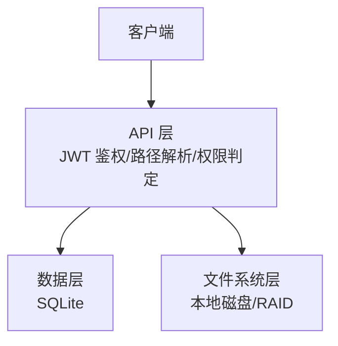
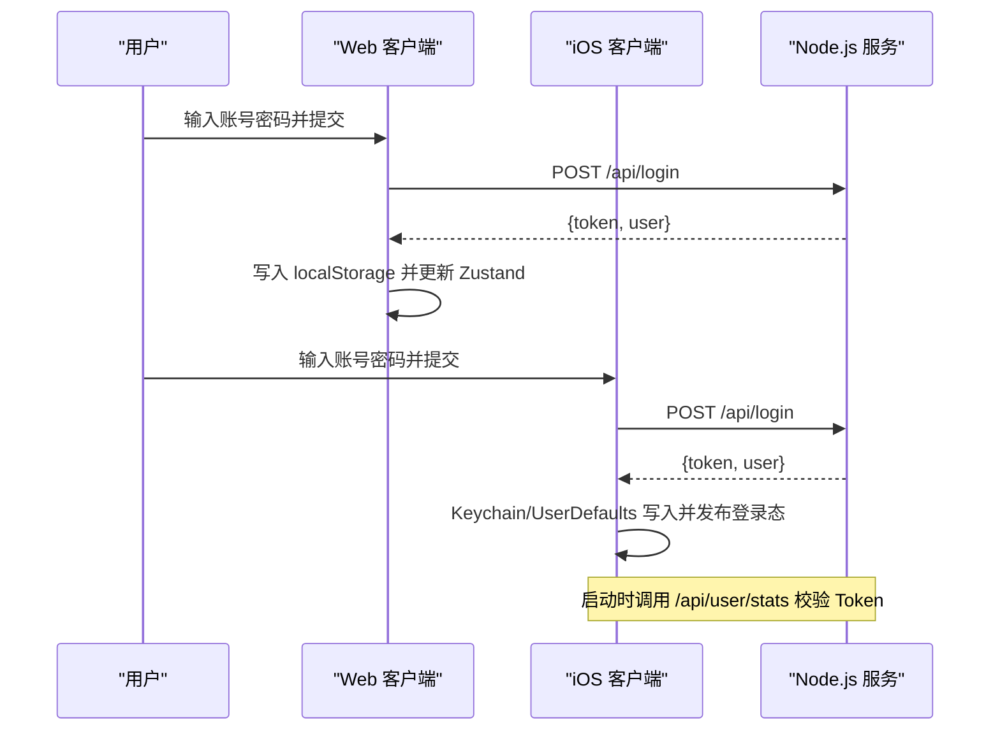
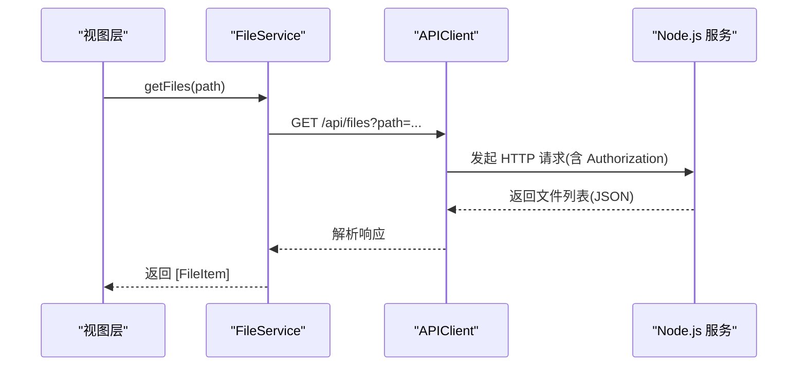
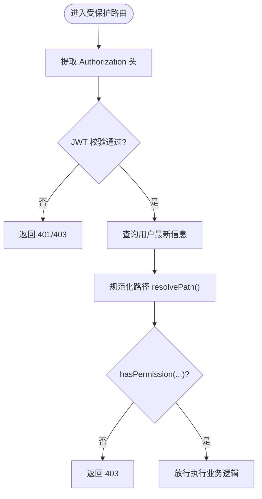
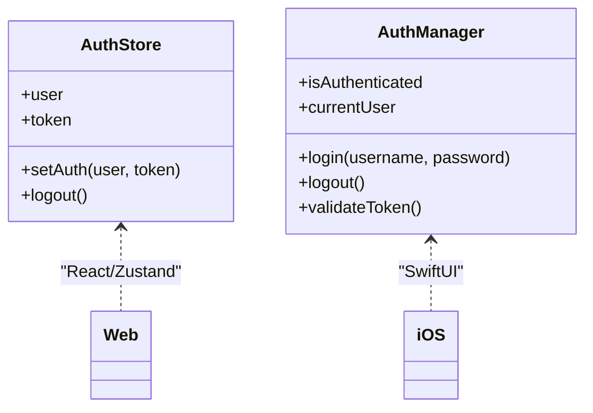
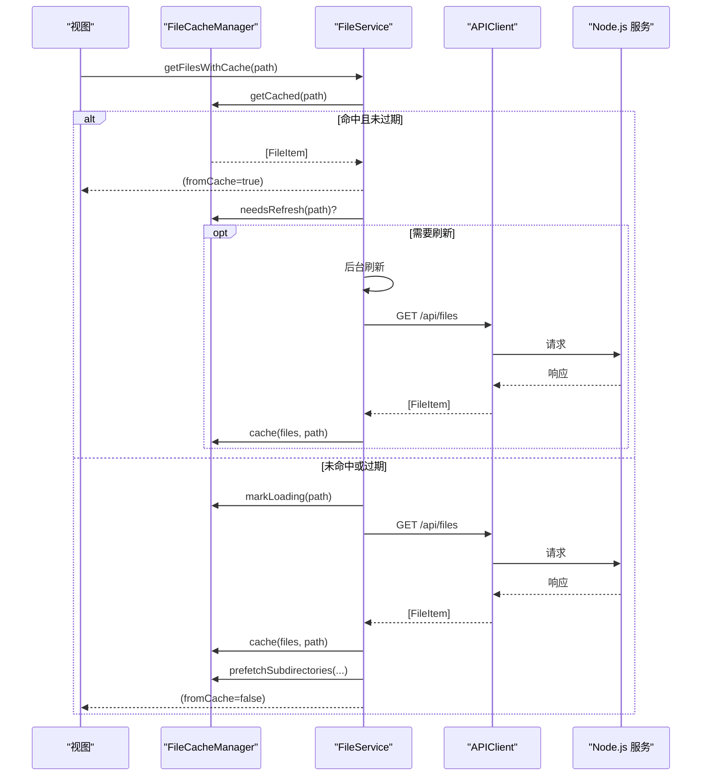
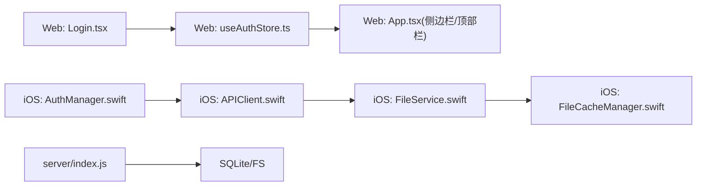

# 数据流设计

<cite>
**本文引用的文件**
- [Longhorn.md](file://Longhorn.md)
- [App.tsx](file://client/src/App.tsx)
- [Login.tsx](file://client/src/components/Login.tsx)
- [useAuthStore.ts](file://client/src/store/useAuthStore.ts)
- [LonghornApp.swift](file://ios/LonghornApp/LonghornApp.swift)
- [AuthManager.swift](file://ios/LonghornApp/Services/AuthManager.swift)
- [APIClient.swift](file://ios/LonghornApp/Services/APIClient.swift)
- [FileService.swift](file://ios/LonghornApp/Services/FileService.swift)
- [FileCacheManager.swift](file://ios/LonghornApp/Services/FileCacheManager.swift)
- [index.js](file://server/index.js)
- [phase2.sql](file://server/migrations/phase2.sql)
- [en.json](file://server/data/vocab/en.json)
</cite>

## 目录
1. [简介](#简介)
2. [项目结构](#项目结构)
3. [核心组件](#核心组件)
4. [架构总览](#架构总览)
5. [详细组件分析](#详细组件分析)
6. [依赖关系分析](#依赖关系分析)
7. [性能考量](#性能考量)
8. [故障排查指南](#故障排查指南)
9. [结论](#结论)
10. [附录](#附录)

## 简介
本文件面向 Longhorn 系统的数据流设计，聚焦以下目标：
- 用户认证数据流：从登录到令牌下发、存储、校验与登出的全链路
- 文件操作数据流：文件浏览、上传、下载、批量操作、回收站与访问统计
- 权限验证数据流：路径解析、角色与部门权限、扩展权限与访问控制
- 前端状态管理：React Zustand 状态与移动端 SwiftUI 状态/缓存协同
- 后端数据处理：SQLite 数据库、JWT 鉴权、缩略图生成与文件 I/O
- 移动端缓存同步：stale-while-revalidate 模式与预取策略
- 数据验证规则、错误传播机制与异常处理策略
- 数据一致性、事务处理与并发控制方案
- 序列化格式、API 响应结构与错误码规范
- 数据迁移策略、备份恢复机制与性能监控指标

## 项目结构
Longhorn 采用“共享后端 + 双前端”架构：Web 客户端（React）与 iOS 客户端（SwiftUI）通过 Node.js + SQLite 后端进行统一数据交互。

```mermaid
graph TB
subgraph "前端"
Web["Web 客户端<br/>React + Zustand"]
iOS["iOS 客户端<br/>SwiftUI + APIClient"]
end
subgraph "后端"
Node["Node.js 服务<br/>Express + better-sqlite3"]
DB["SQLite 数据库"]
FS["本地磁盘/RAID"]
end
Web --> |HTTP/REST| Node
iOS --> |HTTP/REST| Node
iOS --> |WebSocket(概念性)| Node
Node --> DB
Node --> FS
```

图表来源
- [Longhorn.md](file://Longhorn.md#L47-L66)
- [index.js](file://server/index.js#L1-L31)

章节来源
- [Longhorn.md](file://Longhorn.md#L1-L71)

## 核心组件
- 前端认证与状态
  - Web：登录表单提交、Zustand 存储 token 与用户信息
  - iOS：AuthManager 管理登录态、Keychain 存储、Token 校验与登出清理
- 网络层
  - Web：Axios 直接调用 /api/*
  - iOS：APIClient 统一封装 GET/POST/DELETE/上传/下载，自动注入 Authorization
- 业务服务
  - iOS：FileService 将 API 抽象为领域方法（文件列表、搜索、收藏、回收站、分享等）
- 缓存与预取
  - iOS：FileCacheManager 实现 stale-while-revalidate 与子目录预取
- 后端
  - JWT 鉴权中间件、路径解析与权限判定、文件 I/O、缩略图生成、数据库迁移与词库数据

章节来源
- [Login.tsx](file://client/src/components/Login.tsx#L15-L27)
- [useAuthStore.ts](file://client/src/store/useAuthStore.ts#L17-L30)
- [AuthManager.swift](file://ios/LonghornApp/Services/AuthManager.swift#L44-L69)
- [APIClient.swift](file://ios/LonghornApp/Services/APIClient.swift#L69-L108)
- [FileService.swift](file://ios/LonghornApp/Services/FileService.swift#L18-L39)
- [FileCacheManager.swift](file://ios/LonghornApp/Services/FileCacheManager.swift#L29-L133)
- [index.js](file://server/index.js#L268-L295)

## 架构总览
系统采用分层架构：前端负责 UI 与交互，网络层负责协议与错误处理，后端负责业务逻辑与数据持久化。



图表来源
- [index.js](file://server/index.js#L268-L295)
- [index.js](file://server/index.js#L397-L416)

## 详细组件分析

### 用户认证数据流
- Web 端
  - 登录表单提交至 /api/login，成功后将 token 与用户信息写入 localStorage，并更新 Zustand 状态
  - 侧边栏与顶部栏在渲染时携带 Authorization 头发起受保护 API
- iOS 端
  - AuthManager.login 调用 APIClient.post("/api/login")，成功后写入 Keychain 与 UserDefaults，并发布登录态
  - 启动时尝试恢复会话并异步调用 /api/user/stats 进行 Token 校验；失败则自动登出
  - 登出时清理 Keychain、UserDefaults 与各 Store 缓存，并广播登出事件



图表来源
- [Login.tsx](file://client/src/components/Login.tsx#L15-L27)
- [useAuthStore.ts](file://client/src/store/useAuthStore.ts#L17-L30)
- [AuthManager.swift](file://ios/LonghornApp/Services/AuthManager.swift#L44-L69)
- [APIClient.swift](file://ios/LonghornApp/Services/APIClient.swift#L69-L80)

章节来源
- [Login.tsx](file://client/src/components/Login.tsx#L15-L27)
- [useAuthStore.ts](file://client/src/store/useAuthStore.ts#L17-L30)
- [AuthManager.swift](file://ios/LonghornApp/Services/AuthManager.swift#L44-L69)
- [APIClient.swift](file://ios/LonghornApp/Services/APIClient.swift#L69-L80)

### 文件操作数据流
- iOS 文件服务
  - FileService 将 API 抽象为领域方法：获取文件列表、搜索、创建/删除/移动/重命名、复制、收藏/取消收藏、回收站、分享、访问统计、记录访问等
  - APIClient 统一处理请求构建、鉴权头注入、状态码映射与错误抛出
  - FileCacheManager 实现目录列表缓存：stale-while-revalidate、防抖加载、子目录预取
- Web 端
  - 侧边栏与顶部栏在渲染时调用受保护 API（如获取可访问部门、用户统计），并携带 Authorization 头



图表来源
- [FileService.swift](file://ios/LonghornApp/Services/FileService.swift#L18-L39)
- [APIClient.swift](file://ios/LonghornApp/Services/APIClient.swift#L69-L72)
- [index.js](file://server/index.js#L1-L31)

章节来源
- [FileService.swift](file://ios/LonghornApp/Services/FileService.swift#L18-L39)
- [APIClient.swift](file://ios/LonghornApp/Services/APIClient.swift#L69-L72)
- [App.tsx](file://client/src/App.tsx#L134-L150)

### 权限验证数据流
- 路径解析
  - 服务端 resolvePath 将中文部门名映射为大写代码，规范化路径，确保跨平台一致
- 权限判定
  - hasPermission 综合 Admin 角色、个人空间、部门空间、Leader 权限与扩展权限（permissions 表），支持通配匹配与过期判断
- 鉴权中间件
  - authenticate 校验 Authorization 头中的 JWT，失败返回 401/403；成功加载用户最新角色与部门信息



图表来源
- [index.js](file://server/index.js#L268-L295)
- [index.js](file://server/index.js#L233-L259)
- [index.js](file://server/index.js#L300-L353)

章节来源
- [index.js](file://server/index.js#L233-L259)
- [index.js](file://server/index.js#L300-L353)
- [index.js](file://server/index.js#L268-L295)

### 前端状态管理
- Web
  - useAuthStore 使用 localStorage 持久化 token 与用户信息，提供 setAuth 与 logout 方法
- iOS
  - AuthManager 使用 Keychain 持久化 token，UserDefaults 持久化用户信息，发布登录态变化
  - 启动时检查保存会话并异步校验 Token；登出时清理缓存与用户信息



图表来源
- [useAuthStore.ts](file://client/src/store/useAuthStore.ts#L17-L30)
- [AuthManager.swift](file://ios/LonghornApp/Services/AuthManager.swift#L13-L39)

章节来源
- [useAuthStore.ts](file://client/src/store/useAuthStore.ts#L17-L30)
- [AuthManager.swift](file://ios/LonghornApp/Services/AuthManager.swift#L13-L39)

### 移动端缓存同步机制
- stale-while-revalidate
  - FileCacheManager 对目录列表缓存 5 分钟 stale、30 分钟 expired
  - getFilesWithCache 在返回缓存的同时触发后台刷新，避免阻塞 UI
- 预取策略
  - prefetchSubdirectories 预取直接子目录，限制数量以平衡带宽与性能
- 与网络层协同
  - APIClient 统一处理 401 自动登出、4xx/5xx 错误映射与 JSON 解析



图表来源
- [FileCacheManager.swift](file://ios/LonghornApp/Services/FileCacheManager.swift#L137-L184)
- [FileService.swift](file://ios/LonghornApp/Services/FileService.swift#L137-L184)
- [APIClient.swift](file://ios/LonghornApp/Services/APIClient.swift#L69-L72)

章节来源
- [FileCacheManager.swift](file://ios/LonghornApp/Services/FileCacheManager.swift#L29-L133)
- [FileService.swift](file://ios/LonghornApp/Services/FileService.swift#L137-L184)
- [APIClient.swift](file://ios/LonghornApp/Services/APIClient.swift#L69-L72)

### 后端数据处理与并发控制
- 数据库与迁移
  - 初始化 WAL 模式，自动创建核心表与索引；迁移脚本定义星标、分享链接等表结构
- 缩略图生成
  - 采用队列与并发限制（最多 2 个任务）避免 CPU/IO 过载；支持 HEIC/HEIF 与视频帧提取
- 文件 I/O
  - 上传/下载/合并/批量下载等接口，结合路径解析与权限校验
- 并发控制
  - 缩略图生成队列、缓存加载去重（loadingPaths）、文件列表预取去重

章节来源
- [index.js](file://server/index.js#L28-L78)
- [phase2.sql](file://server/migrations/phase2.sql#L1-L32)
- [index.js](file://server/index.js#L482-L679)
- [index.js](file://server/index.js#L792-L867)
- [index.js](file://server/index.js#L1409-L1466)

### 数据验证规则、错误传播与异常处理
- Web
  - 登录失败时捕获响应错误并展示；Zustand 仅在成功后写入
- iOS
  - APIClient.execute 统一处理 401 自动登出、4xx/5xx 映射为 APIError、JSON 解析错误
  - AuthManager.validateToken 在启动时调用 /api/user/stats 校验 Token 有效性
- 错误码规范
  - 401 未授权：登录失败或 Token 失效
  - 403 禁止访问：权限不足
  - 404 未找到：资源不存在
  - 500 服务器错误：内部处理异常

章节来源
- [Login.tsx](file://client/src/components/Login.tsx#L20-L26)
- [APIClient.swift](file://ios/LonghornApp/Services/APIClient.swift#L287-L315)
- [AuthManager.swift](file://ios/LonghornApp/Services/AuthManager.swift#L114-L123)

### 数据一致性、事务处理与并发控制
- 事务
  - 词库批量插入使用 db.transaction 包裹，确保原子性
- 并发
  - 缩略图生成队列限制并发度
  - 缓存加载去重，避免重复请求
- 一致性
  - 路径解析与权限判定在服务端集中实现，保证跨平台一致性

章节来源
- [index.js](file://server/index.js#L89-L101)
- [index.js](file://server/index.js#L556-L577)
- [index.js](file://server/index.js#L233-L259)
- [index.js](file://server/index.js#L300-L353)

### 数据序列化格式、API 响应结构与错误码规范
- 序列化格式
  - JSON；iOS 使用 JSONDecoder/JSONEncoder
- 响应结构
  - 成功：按接口定义返回领域对象（如 FileItem、User、ShareItem 等）
  - 错误：ErrorResponse 结构包含 error 或 message 字段
- 错误码
  - 400：缺少参数或格式错误
  - 401：未授权
  - 403：禁止访问
  - 404：资源不存在
  - 500：服务器内部错误

章节来源
- [APIClient.swift](file://ios/LonghornApp/Services/APIClient.swift#L322-L325)
- [APIClient.swift](file://ios/LonghornApp/Services/APIClient.swift#L287-L315)

### 数据迁移策略、备份恢复机制与性能监控指标
- 迁移策略
  - 迁移脚本定义表结构与索引；初始化阶段自动填充词库数据
- 备份恢复
  - 通过脚本与外部工具（如 rsync、云隧道）实现数据库与文件备份
- 性能监控
  - 健康检查接口 /api/status；缩略图生成日志；请求日志与缓存命中率

章节来源
- [phase2.sql](file://server/migrations/phase2.sql#L1-L32)
- [en.json](file://server/data/vocab/en.json#L1-L227)
- [index.js](file://server/index.js#L477-L480)
- [index.js](file://server/index.js#L482-L679)
- [Longhorn.md](file://Longhorn.md#L42-L44)

## 依赖关系分析



图表来源
- [Login.tsx](file://client/src/components/Login.tsx#L15-L27)
- [useAuthStore.ts](file://client/src/store/useAuthStore.ts#L17-L30)
- [App.tsx](file://client/src/App.tsx#L134-L150)
- [AuthManager.swift](file://ios/LonghornApp/Services/AuthManager.swift#L44-L69)
- [APIClient.swift](file://ios/LonghornApp/Services/APIClient.swift#L69-L72)
- [FileService.swift](file://ios/LonghornApp/Services/FileService.swift#L18-L39)
- [FileCacheManager.swift](file://ios/LonghornApp/Services/FileCacheManager.swift#L29-L51)
- [index.js](file://server/index.js#L1-L31)

章节来源
- [App.tsx](file://client/src/App.tsx#L134-L150)
- [AuthManager.swift](file://ios/LonghornApp/Services/AuthManager.swift#L44-L69)
- [APIClient.swift](file://ios/LonghornApp/Services/APIClient.swift#L69-L72)
- [FileService.swift](file://ios/LonghornApp/Services/FileService.swift#L18-L39)
- [FileCacheManager.swift](file://ios/LonghornApp/Services/FileCacheManager.swift#L29-L51)
- [index.js](file://server/index.js#L1-L31)

## 性能考量
- 压缩与缓存
  - 服务端启用 gzip 压缩；缩略图静态目录开启缓存与范围请求
- 缩略图并发
  - 限制并发生成任务数量，避免资源争用
- 前端缓存
  - 目录列表缓存与预取减少网络请求，提升首屏与切换体验
- 数据库
  - WAL 模式提升并发读写性能；索引优化星标与分享链接查询

章节来源
- [index.js](file://server/index.js#L418-L419)
- [index.js](file://server/index.js#L418-L419)
- [index.js](file://server/index.js#L482-L679)
- [FileCacheManager.swift](file://ios/LonghornApp/Services/FileCacheManager.swift#L101-L132)
- [phase2.sql](file://server/migrations/phase2.sql#L27-L31)

## 故障排查指南
- 登录失败
  - 检查 /api/login 返回的错误信息；确认用户名/密码正确
- Token 失效
  - iOS 启动时会自动校验 Token；若失败将触发登出并清理缓存
- 权限不足
  - 确认用户角色与部门；检查 permissions 表扩展权限是否过期
- 缩略图生成失败
  - 查看 ffmpeg/sips 日志；确认文件格式受支持
- 缓存异常
  - 清理缓存或强制刷新；检查目录列表缓存是否过期

章节来源
- [APIClient.swift](file://ios/LonghornApp/Services/APIClient.swift#L287-L315)
- [AuthManager.swift](file://ios/LonghornApp/Services/AuthManager.swift#L114-L123)
- [index.js](file://server/index.js#L585-L645)
- [FileCacheManager.swift](file://ios/LonghornApp/Services/FileCacheManager.swift#L78-L81)

## 结论
Longhorn 的数据流设计围绕“统一后端 + 双前端”的架构展开：前端负责状态与交互，网络层负责协议与错误处理，后端负责业务与数据持久化。通过集中式的路径解析与权限判定、缓存与预取策略、以及严格的错误传播与异常处理，系统在可用性、性能与一致性之间取得了良好平衡。后续可在 WebSocket 推送、更细粒度的缓存失效策略与监控埋点方面进一步增强。

## 附录
- 关键 API 一览（示例）
  - 登录：POST /api/login
  - 获取可访问部门：GET /api/user/accessible-departments
  - 获取文件列表：GET /api/files
  - 上传文件：POST /api/upload
  - 下载文件：GET /api/files?path=...&download=true
  - 批量下载：POST /api/download-batch
  - 收藏/取消收藏：POST /api/starred, DELETE /api/starred/:id
  - 回收站：GET /api/recycle-bin, POST /api/recycle-bin/restore/:id, DELETE /api/recycle-bin/:id
  - 分享：POST /api/shares, GET /api/shares, PUT /api/shares/:id, DELETE /api/shares/:id
  - 访问统计：GET /api/files/stats
  - 记录访问：POST /api/files/access
  - 健康检查：GET /api/status
  - 缩略图：GET /api/thumbnail?path=...

章节来源
- [index.js](file://server/index.js#L683-L713)
- [index.js](file://server/index.js#L715-L756)
- [index.js](file://server/index.js#L792-L867)
- [index.js](file://server/index.js#L1271-L1276)
- [index.js](file://server/index.js#L477-L480)
- [index.js](file://server/index.js#L482-L679)
- [FileService.swift](file://ios/LonghornApp/Services/FileService.swift#L18-L246)