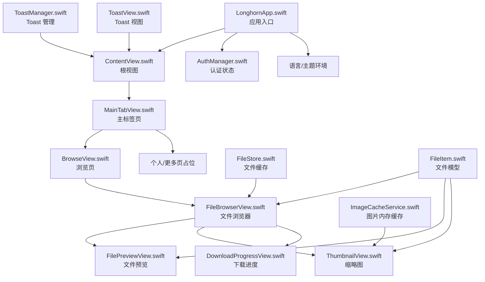
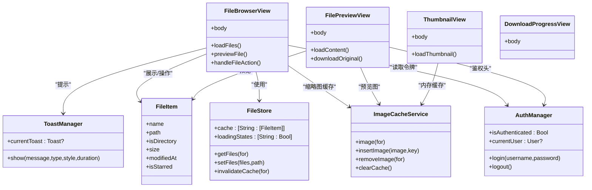
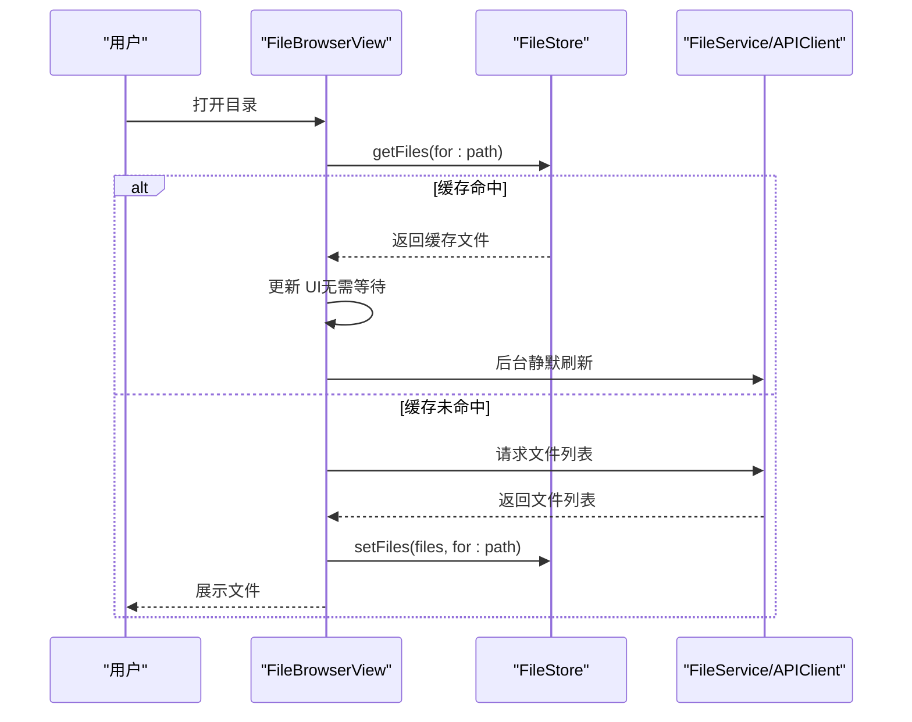
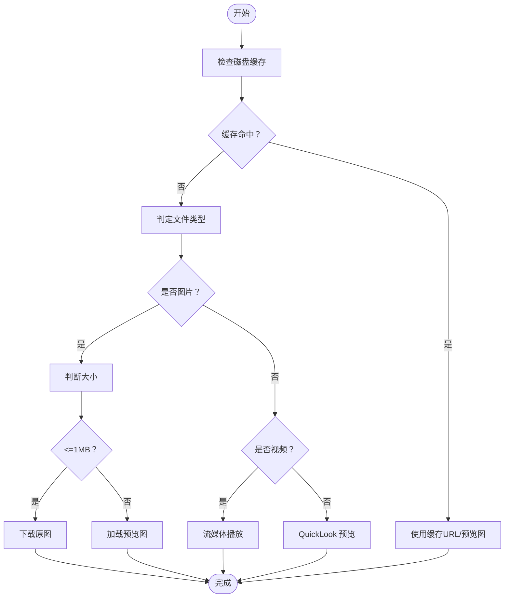
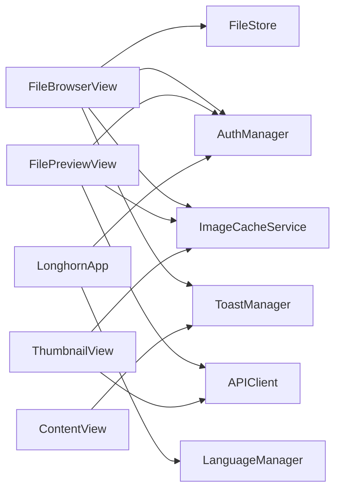

# SwiftUI 组件设计

<cite>
**本文引用的文件**
- [LonghornApp.swift](file://ios/LonghornApp/LonghornApp.swift)
- [ContentView.swift](file://ios/LonghornApp/ContentView.swift)
- [MainTabView.swift](file://ios/LonghornApp/Views/Main/MainTabView.swift)
- [BrowseView.swift](file://ios/LonghornApp/Views/Main/BrowseView.swift)
- [FileBrowserView.swift](file://ios/LonghornApp/Views/Files/FileBrowserView.swift)
- [FilePreviewView.swift](file://ios/LonghornApp/Views/Files/FilePreviewView.swift)
- [ThumbnailView.swift](file://ios/LonghornApp/Views/Components/ThumbnailView.swift)
- [DownloadProgressView.swift](file://ios/LonghornApp/Views/Components/DownloadProgressView.swift)
- [FileStore.swift](file://ios/LonghornApp/Services/FileStore.swift)
- [ImageCacheService.swift](file://ios/LonghornApp/Services/ImageCacheService.swift)
- [AuthManager.swift](file://ios/LonghornApp/Services/AuthManager.swift)
- [ToastManager.swift](file://ios/LonghornApp/Services/ToastManager.swift)
- [ToastView.swift](file://ios/LonghornApp/Views/Components/ToastView.swift)
- [FileItem.swift](file://ios/LonghornApp/Models/FileItem.swift)
</cite>

## 目录
1. [简介](#简介)
2. [项目结构](#项目结构)
3. [核心组件](#核心组件)
4. [架构总览](#架构总览)
5. [组件详解](#组件详解)
6. [依赖关系分析](#依赖关系分析)
7. [性能与内存优化](#性能与内存优化)
8. [故障排查指南](#故障排查指南)
9. [结论](#结论)
10. [附录](#附录)

## 简介
本文件面向 Longhorn iOS 应用的 SwiftUI 组件设计，聚焦以下目标：
- 组件层次结构与职责划分
- 状态管理与响应式数据流
- 主要视图组件（如 MainTabView、FileBrowserView）的实现原理与交互逻辑
- 自定义组件（ThumbnailView、DownloadProgressView）的设计思路与复用策略
- 组件间通信机制、数据绑定模式与生命周期管理
- 性能优化、内存管理与渲染效率提升
- SwiftUI 与 UIKit 的混合使用场景与最佳实践

## 项目结构
Longhorn iOS 采用“按功能域分层”的组织方式，SwiftUI 视图位于 Views 目录，业务服务位于 Services 目录，数据模型位于 Models 目录。应用入口通过 LonghornApp.swift 注入全局状态（认证、语言），根视图 ContentView 根据登录态切换主界面或登录页。

图表来源
- [LonghornApp.swift](file://ios/LonghornApp/LonghornApp.swift#L16-L24)
- [ContentView.swift](file://ios/LonghornApp/ContentView.swift#L16-L37)
- [MainTabView.swift](file://ios/LonghornApp/Views/Main/MainTabView.swift#L23-L77)
- [BrowseView.swift](file://ios/LonghornApp/Views/Main/BrowseView.swift#L41-L142)
- [FileBrowserView.swift](file://ios/LonghornApp/Views/Files/FileBrowserView.swift#L112-L305)
- [FilePreviewView.swift](file://ios/LonghornApp/Views/Files/FilePreviewView.swift#L40-L84)
- [ThumbnailView.swift](file://ios/LonghornApp/Views/Components/ThumbnailView.swift#L25-L62)
- [DownloadProgressView.swift](file://ios/LonghornApp/Views/Components/DownloadProgressView.swift#L30-L62)
- [FileStore.swift](file://ios/LonghornApp/Services/FileStore.swift#L11-L28)
- [ImageCacheService.swift](file://ios/LonghornApp/Services/ImageCacheService.swift#L10-L19)
- [AuthManager.swift](file://ios/LonghornApp/Services/AuthManager.swift#L12-L39)
- [ToastManager.swift](file://ios/LonghornApp/Services/ToastManager.swift#L43-L48)
- [ToastView.swift](file://ios/LonghornApp/Views/Components/ToastView.swift#L7-L28)
- [FileItem.swift](file://ios/LonghornApp/Models/FileItem.swift#L12-L40)

章节来源
- [LonghornApp.swift](file://ios/LonghornApp/LonghornApp.swift#L16-L24)
- [ContentView.swift](file://ios/LonghornApp/ContentView.swift#L16-L37)

## 核心组件
- 应用入口与环境注入：LonghornApp.swift 在 WindowGroup 中注入认证与语言环境，统一深色主题偏好。
- 根视图：ContentView 根据认证状态动态展示 MainTabView 或 LoginView，并叠加 ToastView。
- 主标签页：MainTabView 基于设备尺寸类选择 iPhone 布局（TabView）；iPad 布局可扩展为 SplitView。
- 浏览页：BrowseView 提供部门导航、快捷入口与最近文件展示。
- 文件浏览器：FileBrowserView 实现文件列表、网格、搜索、批量操作、预览、上传、下载、收藏等完整功能。
- 文件预览：FilePreviewView 支持图片、视频、文档三类内容的智能加载与预览。
- 自定义组件：ThumbnailView 提供异步缩略图加载与内存缓存；DownloadProgressView 提供圆形进度与速率显示。
- 状态与缓存：AuthManager 管理认证状态；FileStore 提供文件级缓存与乐观更新；ImageCacheService 提供图片内存缓存；ToastManager/ToastView 管理全局提示。

章节来源
- [MainTabView.swift](file://ios/LonghornApp/Views/Main/MainTabView.swift#L10-L78)
- [BrowseView.swift](file://ios/LonghornApp/Views/Main/BrowseView.swift#L3-L142)
- [FileBrowserView.swift](file://ios/LonghornApp/Views/Files/FileBrowserView.swift#L15-L305)
- [FilePreviewView.swift](file://ios/LonghornApp/Views/Files/FilePreviewView.swift#L13-L84)
- [ThumbnailView.swift](file://ios/LonghornApp/Views/Components/ThumbnailView.swift#L10-L62)
- [DownloadProgressView.swift](file://ios/LonghornApp/Views/Components/DownloadProgressView.swift#L10-L62)
- [FileStore.swift](file://ios/LonghornApp/Services/FileStore.swift#L11-L139)
- [ImageCacheService.swift](file://ios/LonghornApp/Services/ImageCacheService.swift#L10-L36)
- [AuthManager.swift](file://ios/LonghornApp/Services/AuthManager.swift#L12-L89)
- [ToastManager.swift](file://ios/LonghornApp/Services/ToastManager.swift#L43-L76)
- [ToastView.swift](file://ios/LonghornApp/Views/Components/ToastView.swift#L4-L43)

## 架构总览
Longhorn iOS 采用“视图-服务-模型”分层：
- 视图层：SwiftUI 视图负责 UI 呈现与用户交互，使用 @State/@StateObject/@ObservableObject 管理局部与共享状态。
- 服务层：AuthManager、FileStore、ImageCacheService、ToastManager 等提供跨视图的状态与数据服务。
- 模型层：FileItem 等数据模型承载业务数据，支持序列化与 UI 属性映射。

图表来源
- [AuthManager.swift](file://ios/LonghornApp/Services/AuthManager.swift#L12-L89)
- [FileStore.swift](file://ios/LonghornApp/Services/FileStore.swift#L11-L139)
- [ImageCacheService.swift](file://ios/LonghornApp/Services/ImageCacheService.swift#L10-L36)
- [ToastManager.swift](file://ios/LonghornApp/Services/ToastManager.swift#L43-L76)
- [FileBrowserView.swift](file://ios/LonghornApp/Views/Files/FileBrowserView.swift#L15-L305)
- [FilePreviewView.swift](file://ios/LonghornApp/Views/Files/FilePreviewView.swift#L13-L84)
- [ThumbnailView.swift](file://ios/LonghornApp/Views/Components/ThumbnailView.swift#L10-L62)
- [DownloadProgressView.swift](file://ios/LonghornApp/Views/Components/DownloadProgressView.swift#L10-L62)
- [FileItem.swift](file://ios/LonghornApp/Models/FileItem.swift#L12-L40)

## 组件详解

### MainTabView：主标签页与布局适配
- 设备尺寸适配：根据 horizontalSizeClass 切换 iPhone 布局（TabView）；iPad 布局预留为 SplitView 或复用 TabView。
- 标签页管理：使用 AppStorage 保存当前选中标签，结合 NavigationManager 事件驱动切换。
- 视图组合：包含 BrowseView、个人空间根视图、更多菜单根视图；更多菜单进一步聚合分享、回收站、全局搜索与设置入口。

章节来源
- [MainTabView.swift](file://ios/LonghornApp/Views/Main/MainTabView.swift#L10-L78)

### BrowseView：浏览页与导航
- 导航路径：基于 NavigationPath 管理跳转栈，支持从外部事件触发跳转。
- 权限过滤：根据用户角色过滤可访问的部门列表。
- 快捷入口：提供搜索、部门、授权目录、我的分享、收藏、最近文件等入口。
- 数据加载：首次出现时拉取每日单词与授权目录权限。

章节来源
- [BrowseView.swift](file://ios/LonghornApp/Views/Main/BrowseView.swift#L3-L142)

### FileBrowserView：文件浏览器（核心）
- 状态与存储：
  - @State 管理 UI 状态（加载、错误、选择模式、搜索、预览等）
  - @StateObject 使用 FileStore.shared 作为智能缓存存储
  - @AppStorage 管理视图模式（列表/网格）与排序方式
- 搜索与排序：
  - 搜索提示文案随搜索范围变化
  - 支持按名称、日期、大小排序
- 交互与工具栏：
  - 工具栏提供视图模式切换、排序、新建文件夹、上传、批量操作入口
  - 支持长按进入选择模式，批量收藏、移动、分享、下载、删除
- 预览与下载：
  - 预览时优先使用缓存；非媒体文件需下载后预览
  - 支持批量下载与下载进度展示
- 乐观更新与回滚：
  - 收藏/取消收藏、重命名、删除等操作先更新本地状态，后台异步提交，失败时回滚
- 生命周期与刷新：
  - .task 中执行初始加载与轮询刷新（每 5 秒）
  - .refreshable 支持下拉刷新

图表来源
- [FileBrowserView.swift](file://ios/LonghornApp/Views/Files/FileBrowserView.swift#L817-L907)
- [FileStore.swift](file://ios/LonghornApp/Services/FileStore.swift#L32-L85)

章节来源
- [FileBrowserView.swift](file://ios/LonghornApp/Views/Files/FileBrowserView#L15-L305)
- [FileBrowserView.swift](file://ios/LonghornApp/Views/Files/FileBrowserView#L817-L907)
- [FileStore.swift](file://ios/LonghornApp/Services/FileStore.swift#L32-L139)

### FilePreviewView：文件预览
- 类型判定：根据扩展名区分图片、视频、文档。
- 智能加载策略：
  - 大图（>1MB）优先使用服务器生成的预览图（thumbnail），避免大流量
  - 小图或非图片直接下载原图
  - 视频走流媒体播放，不强制下载
- 缓存与分享：下载后写入磁盘缓存；支持下载后分享与收藏。
- 工具栏：收藏、下载原图、分享等操作。

图表来源
- [FilePreviewView.swift](file://ios/LonghornApp/Views/Files/FilePreviewView.swift#L221-L290)

章节来源
- [FilePreviewView.swift](file://ios/LonghornApp/Views/Files/FilePreviewView#L13-L318)

### ThumbnailView：缩略图组件
- 异步加载：构造缩略图 URL，加入认证头，网络请求后写入内存缓存。
- 三态 UI：加载中、加载失败、成功显示；失败时显示默认占位图标。
- 复用策略：通过 ImageCacheService 统一内存缓存，避免重复请求与重复解码。

章节来源
- [ThumbnailView.swift](file://ios/LonghornApp/Views/Components/ThumbnailView.swift#L10-L111)
- [ImageCacheService.swift](file://ios/LonghornApp/Services/ImageCacheService.swift#L10-L36)

### DownloadProgressView：下载进度组件
- 数据绑定：接收已下载字节、总字节、速度，计算百分比与文本。
- 视觉反馈：圆形进度、大小文本、速度文本；进度动画平滑过渡。
- 复用策略：作为 Sheet/FullScreenCover 内容复用，适用于上传与下载场景。

章节来源
- [DownloadProgressView.swift](file://ios/LonghornApp/Views/Components/DownloadProgressView.swift#L10-L76)

### Toast 系列：全局提示
- ToastManager：发布 currentToast，支持自动隐藏与触觉反馈。
- ToastView：根据类型与样式渲染不同外观，支持显著风格与标准风格。
- ContentView 叠加 ToastView，避免层级混乱。

章节来源
- [ToastManager.swift](file://ios/LonghornApp/Services/ToastManager.swift#L43-L76)
- [ToastView.swift](file://ios/LonghornApp/Views/Components/ToastView.swift#L4-L43)
- [ContentView.swift](file://ios/LonghornApp/ContentView.swift#L28-L35)

## 依赖关系分析
- 视图对服务的依赖：
  - FileBrowserView 依赖 FileStore、AuthManager、ImageCacheService、ToastManager
  - FilePreviewView 依赖 AuthManager、ImageCacheService、APIClient
  - ThumbnailView 依赖 APIClient、ImageCacheService
- 模型依赖：FileItem 作为数据载体贯穿浏览与预览流程。
- 环境注入：LonghornApp.swift 注入 AuthManager、LanguageManager，设置 locale 与深色主题。

图表来源
- [FileBrowserView.swift](file://ios/LonghornApp/Views/Files/FileBrowserView.swift#L15-L305)
- [FilePreviewView.swift](file://ios/LonghornApp/Views/Files/FilePreviewView.swift#L13-L84)
- [ThumbnailView.swift](file://ios/LonghornApp/Views/Components/ThumbnailView.swift#L10-L62)
- [LonghornApp.swift](file://ios/LonghornApp/LonghornApp.swift#L16-L24)
- [AuthManager.swift](file://ios/LonghornApp/Services/AuthManager.swift#L12-L89)
- [ToastManager.swift](file://ios/LonghornApp/Services/ToastManager.swift#L43-L76)

章节来源
- [LonghornApp.swift](file://ios/LonghornApp/LonghornApp.swift#L16-L24)
- [FileBrowserView.swift](file://ios/LonghornApp/Views/Files/FileBrowserView.swift#L15-L305)
- [FilePreviewView.swift](file://ios/LonghornApp/Views/Files/FilePreviewView.swift#L13-L84)
- [ThumbnailView.swift](file://ios/LonghornApp/Views/Components/ThumbnailView.swift#L10-L62)

## 性能与内存优化
- 列表渲染优化
  - 使用 LazyVGrid 与 List（plain 样式）减少非必要重绘
  - 对于大列表，优先使用 .task 控制加载时机，避免一次性渲染
- 缓存策略
  - FileStore：路径级缓存，5 分钟有效期，避免重复请求；支持静默刷新与失效
  - ImageCacheService：限制数量与总成本，避免内存峰值
- 预览与下载
  - 大图使用预览图（thumbnail）降低首屏时间与流量
  - 非媒体文件延迟下载，避免阻塞 UI
- 乐观更新与回滚
  - 收藏/重命名/删除等操作先本地更新，后台提交失败回滚，提升交互流畅度
- 网络与安全
  - 统一在请求头加入认证令牌，避免重复鉴权
- 动画与过渡
  - 合理使用 .animation/.transition，避免过度动画造成掉帧

[本节为通用指导，无需列出具体文件来源]

## 故障排查指南
- 登录态异常
  - 现象：无法进入主界面或频繁登出
  - 排查：检查 AuthManager 的 token 与用户信息持久化；验证 token 有效性
- 文件列表空白或加载失败
  - 现象：空状态或错误提示
  - 排查：查看 FileBrowserView 的错误分支与 FileStore 缓存状态；确认网络与权限
- 预览失败
  - 现象：预览加载失败或黑屏
  - 排查：检查 FilePreviewView 的缓存命中、预览图加载与原图下载路径；确认扩展名与类型判定
- 缩略图不显示
  - 现象：缩略图占位或加载失败
  - 排查：确认 ThumbnailView 的 URL 构造与认证头；检查 ImageCacheService 命中情况
- Toast 不显示
  - 现象：操作无提示
  - 排查：确认 ToastManager 的 currentToast 发布与 ContentView 的叠加层级

章节来源
- [AuthManager.swift](file://ios/LonghornApp/Services/AuthManager.swift#L71-L89)
- [FileBrowserView.swift](file://ios/LonghornApp/Views/Files/FileBrowserView.swift#L740-L774)
- [FilePreviewView.swift](file://ios/LonghornApp/Views/Files/FilePreviewView.swift#L221-L318)
- [ThumbnailView.swift](file://ios/LonghornApp/Views/Components/ThumbnailView.swift#L64-L111)
- [ToastManager.swift](file://ios/LonghornApp/Services/ToastManager.swift#L50-L76)

## 结论
Longhorn iOS 的 SwiftUI 组件设计遵循“视图-服务-模型”分层，通过 FileStore 与 ImageCacheService 实现高效缓存，配合 AuthManager 与 ToastManager 提升用户体验。FileBrowserView 作为核心组件，整合了搜索、排序、批量操作、预览与下载等复杂流程，并采用乐观更新与回滚保障一致性。ThumbnailView 与 DownloadProgressView 体现了可复用组件的设计理念。整体架构清晰、职责明确，具备良好的扩展性与维护性。

[本节为总结，无需列出具体文件来源]

## 附录

### 组件间通信与数据绑定模式
- 环境对象：通过 @EnvironmentObject 注入 AuthManager、NavigationManager、LanguageManager 等
- 状态对象：@StateObject 管理视图内私有状态；@State 管理轻量状态；@ObservableObject 管理可观察的共享状态
- 数据流向：从服务层（FileStore、AuthManager）到视图层，视图层通过 .task、onChange、sheet 等触发服务层更新

章节来源
- [ContentView.swift](file://ios/LonghornApp/ContentView.swift#L10-L14)
- [MainTabView.swift](file://ios/LonghornApp/Views/Main/MainTabView.swift#L43-L70)
- [FileBrowserView.swift](file://ios/LonghornApp/Views/Files/FileBrowserView.swift#L15-L305)

### SwiftUI 与 UIKit 混合使用最佳实践
- QuickLook 预览：通过 UIViewControllerRepresentable 包装 QLPreviewController
- 分享面板：通过 UIActivityViewController 包装为 UIViewControllerRepresentable
- 通知与反馈：ToastManager 使用 UINotificationFeedbackGenerator 提供触觉反馈
- 保持主线程更新：网络回调后使用 MainActor.run 切换到主线程更新 UI

章节来源
- [FilePreviewView.swift](file://ios/LonghornApp/Views/Files/FilePreviewView.swift#L321-L363)
- [ToastManager.swift](file://ios/LonghornApp/Services/ToastManager.swift#L50-L76)