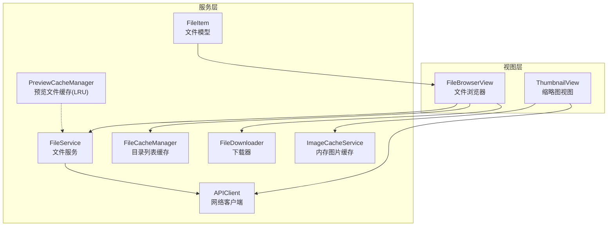
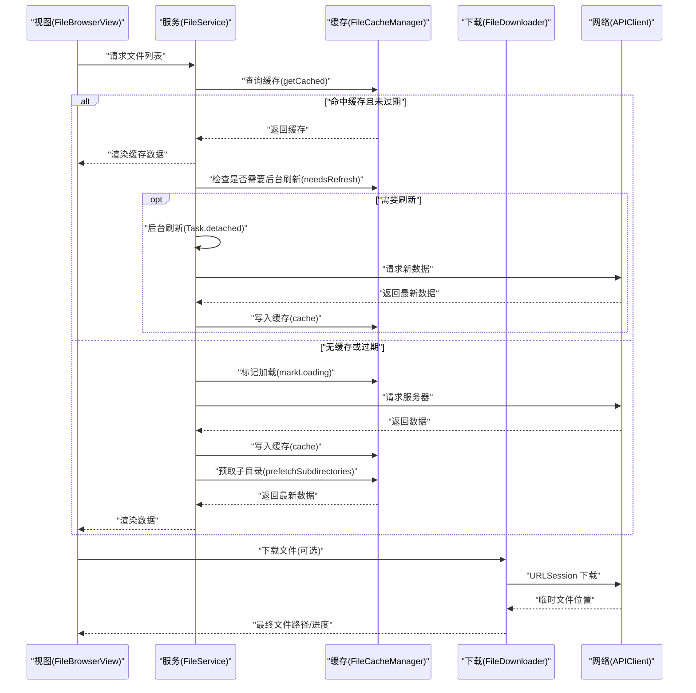
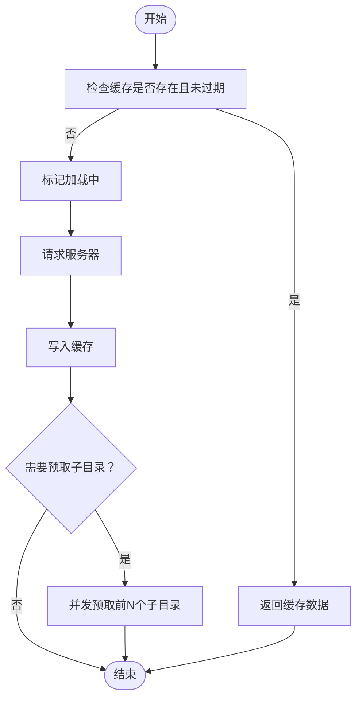
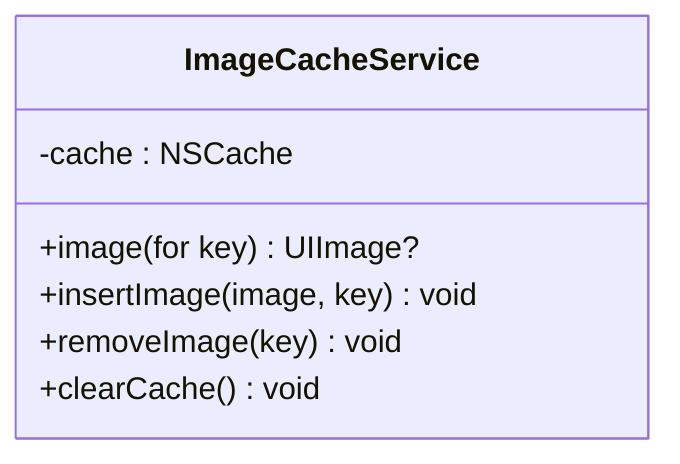
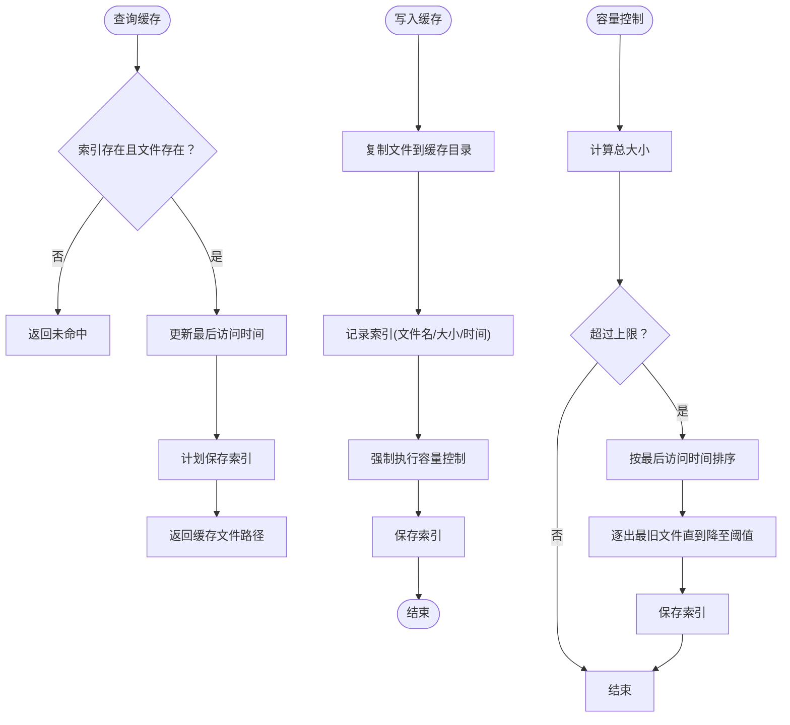
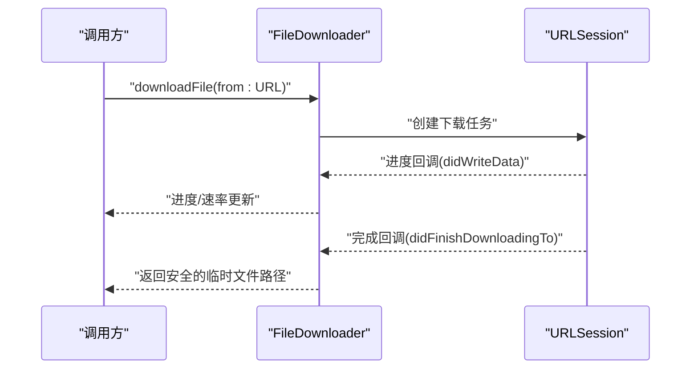
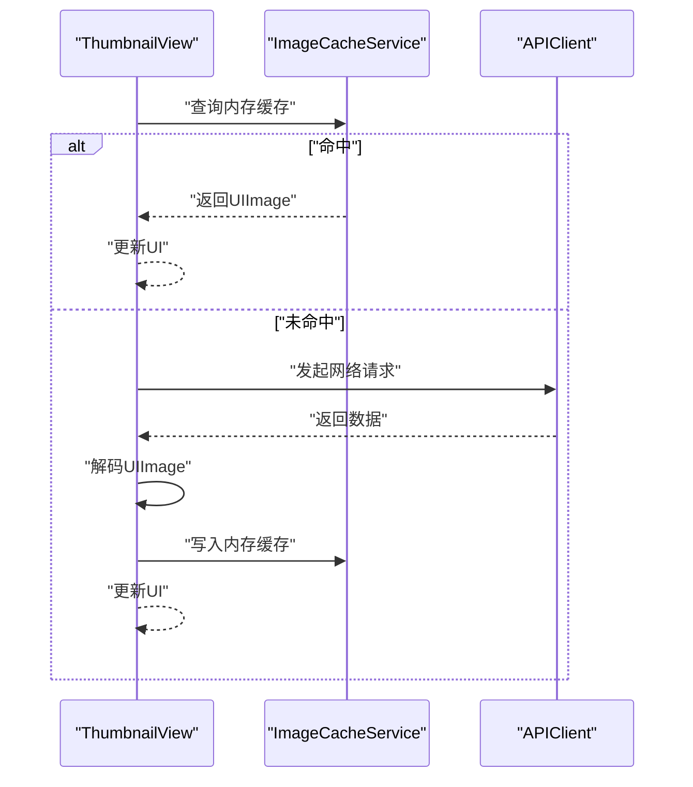
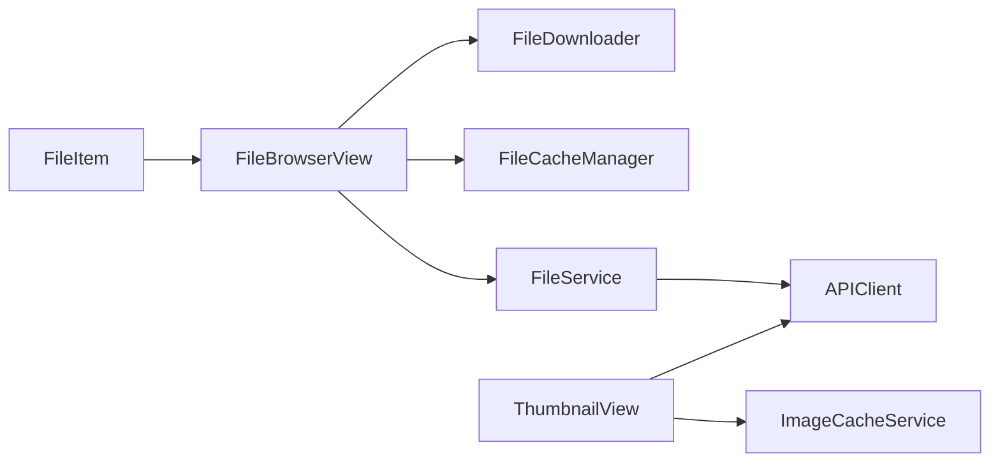

# 性能优化与内存管理

<cite>
**本文引用的文件**
- [FileCacheManager.swift](file://ios/LonghornApp/Services/FileCacheManager.swift)
- [ImageCacheService.swift](file://ios/LonghornApp/Services/ImageCacheService.swift)
- [PreviewCacheManager.swift](file://ios/LonghornApp/Services/PreviewCacheManager.swift)
- [FileDownloader.swift](file://ios/LonghornApp/Services/FileDownloader.swift)
- [FileService.swift](file://ios/LonghornApp/Services/FileService.swift)
- [APIClient.swift](file://ios/LonghornApp/Services/APIClient.swift)
- [FileBrowserView.swift](file://ios/LonghornApp/Views/Files/FileBrowserView.swift)
- [ThumbnailView.swift](file://ios/LonghornApp/Views/Components/ThumbnailView.swift)
- [FileItem.swift](file://ios/LonghornApp/Models/FileItem.swift)
- [RecentFilesManager.swift](file://ios/LonghornApp/Services/RecentFilesManager.swift)
- [diagnose-performance.sh](file://scripts/diagnose-performance.sh)
- [Info.plist](file://ios/LonghornApp/Info.plist)
</cite>

## 目录
1. [简介](#简介)
2. [项目结构](#项目结构)
3. [核心组件](#核心组件)
4. [架构总览](#架构总览)
5. [详细组件分析](#详细组件分析)
6. [依赖关系分析](#依赖关系分析)
7. [性能考量](#性能考量)
8. [故障排查指南](#故障排查指南)
9. [结论](#结论)
10. [附录](#附录)

## 简介
本文件面向 Longhorn iOS 应用的性能优化与内存管理，系统性梳理了以下主题：
- 内存使用监控、泄漏检测与优化策略
- 文件缓存的内存限制、LRU 算法与自动清理机制
- 图片加载的内存优化、异步处理与解码策略
- 视图渲染性能优化、懒加载与滚动列表优化
- Instruments 使用指南、性能分析方法与瓶颈识别技巧
- 后台任务管理、资源释放与生命周期优化
- 电池续航优化、网络请求优化与用户体验提升策略

## 项目结构
iOS 端采用 Swift/SwiftUI 架构，围绕“服务层 + 视图层”的分层设计组织。与性能相关的关键模块包括：
- 服务层：文件缓存、图片缓存、预览缓存、下载器、API 客户端、文件服务等
- 视图层：文件浏览器、缩略图视图等，负责渲染与交互
- 工具与配置：诊断脚本、Info.plist 等

图表来源
- [FileBrowserView.swift](file://ios/LonghornApp/Views/Files/FileBrowserView.swift#L1-L200)
- [ThumbnailView.swift](file://ios/LonghornApp/Views/Components/ThumbnailView.swift#L1-L216)
- [FileCacheManager.swift](file://ios/LonghornApp/Services/FileCacheManager.swift#L1-L185)
- [ImageCacheService.swift](file://ios/LonghornApp/Services/ImageCacheService.swift#L1-L37)
- [PreviewCacheManager.swift](file://ios/LonghornApp/Services/PreviewCacheManager.swift#L1-L219)
- [FileDownloader.swift](file://ios/LonghornApp/Services/FileDownloader.swift#L1-L106)
- [FileService.swift](file://ios/LonghornApp/Services/FileService.swift#L1-L419)
- [APIClient.swift](file://ios/LonghornApp/Services/APIClient.swift#L1-L326)
- [FileItem.swift](file://ios/LonghornApp/Models/FileItem.swift#L1-L288)

章节来源
- [FileBrowserView.swift](file://ios/LonghornApp/Views/Files/FileBrowserView.swift#L1-L200)
- [FileCacheManager.swift](file://ios/LonghornApp/Services/FileCacheManager.swift#L1-L185)
- [ImageCacheService.swift](file://ios/LonghornApp/Services/ImageCacheService.swift#L1-L37)
- [PreviewCacheManager.swift](file://ios/LonghornApp/Services/PreviewCacheManager.swift#L1-L219)
- [FileDownloader.swift](file://ios/LonghornApp/Services/FileDownloader.swift#L1-L106)
- [FileService.swift](file://ios/LonghornApp/Services/FileService.swift#L1-L419)
- [APIClient.swift](file://ios/LonghornApp/Services/APIClient.swift#L1-L326)
- [FileItem.swift](file://ios/LonghornApp/Models/FileItem.swift#L1-L288)

## 核心组件
- 目录列表缓存（SWR 模式）：提供“陈旧即用 + 后台刷新”的缓存策略，避免重复请求，降低网络与 CPU 开销
- 内存图片缓存：基于 NSCache 的 LRU 风格缓存，限制条目数与总内存占用，保障滚动流畅
- 预览文件缓存：基于磁盘的 LRU 缓存，按文件大小上限控制缓存容量，定期清理与索引持久化
- 下载器：基于 URLSession 的下载器，支持进度、速率计算与取消
- API 客户端：统一的网络请求封装，含超时、鉴权、错误处理与响应校验
- 文件浏览器与缩略图视图：异步加载、懒渲染、占位与失败态处理，减少主线程压力

章节来源
- [FileCacheManager.swift](file://ios/LonghornApp/Services/FileCacheManager.swift#L29-L133)
- [ImageCacheService.swift](file://ios/LonghornApp/Services/ImageCacheService.swift#L10-L36)
- [PreviewCacheManager.swift](file://ios/LonghornApp/Services/PreviewCacheManager.swift#L10-L218)
- [FileDownloader.swift](file://ios/LonghornApp/Services/FileDownloader.swift#L3-L42)
- [APIClient.swift](file://ios/LonghornApp/Services/APIClient.swift#L38-L108)
- [ThumbnailView.swift](file://ios/LonghornApp/Views/Components/ThumbnailView.swift#L10-L111)

## 架构总览
下图展示了文件浏览与缓存的关键交互流程，体现“缓存优先、后台刷新、懒加载、异步解码”的整体策略。

图表来源
- [FileService.swift](file://ios/LonghornApp/Services/FileService.swift#L137-L183)
- [FileCacheManager.swift](file://ios/LonghornApp/Services/FileCacheManager.swift#L45-L132)
- [FileDownloader.swift](file://ios/LonghornApp/Services/FileDownloader.swift#L20-L41)
- [APIClient.swift](file://ios/LonghornApp/Services/APIClient.swift#L68-L108)

## 详细组件分析

### 目录列表缓存（SWR 模式）
- 设计要点
  - 缓存结构：以路径为键，存储文件列表、时间戳与路径
  - 过期策略：分为“陈旧（5 分钟）”与“完全过期（30 分钟）”，实现“先用后拉”
  - 防抖与去重：通过加载集合避免重复请求
  - 预取：对即将进入的子目录进行预取，提升后续体验
- 关键行为
  - 读取：优先返回缓存，若接近过期则返回并触发后台刷新
  - 写入：成功请求后写入缓存，清理过期项
  - 预取：并发预取前 N 个子目录
- 性能收益
  - 减少网络请求次数与首屏延迟
  - 降低 UI 卡顿，提升滚动与切换体验

图表来源
- [FileCacheManager.swift](file://ios/LonghornApp/Services/FileCacheManager.swift#L45-L132)

章节来源
- [FileCacheManager.swift](file://ios/LonghornApp/Services/FileCacheManager.swift#L29-L133)
- [FileService.swift](file://ios/LonghornApp/Services/FileService.swift#L137-L183)

### 内存图片缓存（NSCache）
- 设计要点
  - 使用 NSCache，内部实现 LRU 风格淘汰
  - 限制条目数与总内存占用，避免 OOM
  - 提供插入、查询、移除与清空接口
- 适用场景
  - 缩略图、网格列表中的频繁复用
  - 避免重复解码与内存峰值
- 优化建议
  - 根据设备内存动态调整上限
  - 在后台任务中清理缓存，避免主线程卡顿

图表来源
- [ImageCacheService.swift](file://ios/LonghornApp/Services/ImageCacheService.swift#L10-L36)

章节来源
- [ImageCacheService.swift](file://ios/LonghornApp/Services/ImageCacheService.swift#L10-L36)
- [ThumbnailView.swift](file://ios/LonghornApp/Views/Components/ThumbnailView.swift#L64-L110)

### 预览文件缓存（磁盘 LRU）
- 设计要点
  - 基于磁盘的缓存目录与索引文件，持久化缓存元信息
  - 以文件大小上限控制缓存容量，超过阈值按“最久未访问”顺序清理
  - 延迟保存索引，降低频繁磁盘 IO
  - 清理孤儿文件，保持目录整洁
- 关键行为
  - 查询：命中则更新访问时间并返回磁盘路径
  - 写入：复制文件到缓存目录，记录索引并强制执行容量控制
  - 维护：定期清理、索引损坏时重建
- 性能收益
  - 降低内存占用，适合大文件预览
  - 通过容量控制避免磁盘爆满

图表来源
- [PreviewCacheManager.swift](file://ios/LonghornApp/Services/PreviewCacheManager.swift#L84-L166)

章节来源
- [PreviewCacheManager.swift](file://ios/LonghornApp/Services/PreviewCacheManager.swift#L10-L218)

### 下载器（URLSession）
- 设计要点
  - 基于 URLSessionDownloadTask，支持进度回调与速率计算
  - 主线程更新 UI，后台计算速率
  - 提供取消能力与错误处理
- 性能收益
  - 避免主线程阻塞
  - 提升大文件下载体验与可控性

图表来源
- [FileDownloader.swift](file://ios/LonghornApp/Services/FileDownloader.swift#L20-L104)

章节来源
- [FileDownloader.swift](file://ios/LonghornApp/Services/FileDownloader.swift#L3-L106)

### API 客户端（统一网络层）
- 设计要点
  - 统一构建请求、鉴权头、超时配置
  - 统一错误处理与状态码判断
  - 支持 GET/POST/DELETE/PUT 等常用方法
- 性能收益
  - 降低重复代码与错误率
  - 明确的超时与解码策略，提升稳定性

章节来源
- [APIClient.swift](file://ios/LonghornApp/Services/APIClient.swift#L38-L315)

### 文件浏览器与缩略图视图（懒加载与异步）
- 设计要点
  - 缩略图视图在任务中异步加载，先显示占位，失败显示默认图标
  - 优先从内存缓存读取，否则发起网络请求并解码
  - 使用系统图片解码，避免 UI 主线程阻塞
- 性能收益
  - 列表滚动更顺滑
  - 降低重复网络与解码开销

图表来源
- [ThumbnailView.swift](file://ios/LonghornApp/Views/Components/ThumbnailView.swift#L64-L110)
- [ImageCacheService.swift](file://ios/LonghornApp/Services/ImageCacheService.swift#L21-L27)

章节来源
- [ThumbnailView.swift](file://ios/LonghornApp/Views/Components/ThumbnailView.swift#L10-L111)
- [FileItem.swift](file://ios/LonghornApp/Models/FileItem.swift#L115-L128)

### 文件模型与最近打开（辅助优化）
- 文件模型：提供文件类型判断、格式化大小与日期等，便于视图层快速展示
- 最近打开：限制存储条目数，按时间区间过滤，避免无限增长

章节来源
- [FileItem.swift](file://ios/LonghornApp/Models/FileItem.swift#L115-L194)
- [RecentFilesManager.swift](file://ios/LonghornApp/Services/RecentFilesManager.swift#L34-L114)

## 依赖关系分析
- 视图层依赖服务层：FileBrowserView 依赖 FileService 与 FileCacheManager；ThumbnailView 依赖 ImageCacheService 与 APIClient
- 服务层之间耦合较低：缓存、下载、网络相互独立，便于替换与扩展
- 数据模型稳定：FileItem 为纯数据结构，被多个视图共享

图表来源
- [FileBrowserView.swift](file://ios/LonghornApp/Views/Files/FileBrowserView.swift#L15-L20)
- [ThumbnailView.swift](file://ios/LonghornApp/Views/Components/ThumbnailView.swift#L10-L23)
- [FileService.swift](file://ios/LonghornApp/Services/FileService.swift#L11-L14)
- [APIClient.swift](file://ios/LonghornApp/Services/APIClient.swift#L38-L53)
- [FileItem.swift](file://ios/LonghornApp/Models/FileItem.swift#L12-L26)

章节来源
- [FileBrowserView.swift](file://ios/LonghornApp/Views/Files/FileBrowserView.swift#L15-L20)
- [ThumbnailView.swift](file://ios/LonghornApp/Views/Components/ThumbnailView.swift#L10-L23)
- [FileService.swift](file://ios/LonghornApp/Services/FileService.swift#L11-L14)
- [APIClient.swift](file://ios/LonghornApp/Services/APIClient.swift#L38-L53)
- [FileItem.swift](file://ios/LonghornApp/Models/FileItem.swift#L12-L26)

## 性能考量
- 内存优化
  - 使用 NSCache 控制图片缓存条目与内存上限，避免 OOM
  - 预览缓存使用磁盘 LRU，降低内存压力
  - 缩略图解码在后台完成，避免主线程阻塞
- 网络优化
  - SWR 缓存减少重复请求，提升首屏与切换速度
  - 下载器支持速率计算与取消，改善大文件体验
  - 统一超时与错误处理，提升稳定性
- 视图与滚动优化
  - 缩略图懒加载与占位，减少一次性解码
  - 列表刷新最小驻留时间，避免闪烁
- 生命周期与后台任务
  - 后台刷新与预取使用 detached 任务，不影响前台
  - 缓存清理与索引持久化采用延迟保存，平衡性能与一致性

[本节为通用指导，无需列出具体文件来源]

## 故障排查指南
- 使用诊断脚本收集服务器侧信息
  - 包括 PM2 进程状态、本地 API 响应时间、数据库统计、图片文件分布、Cloudflare Tunnel 状态、网络连通性与系统资源使用
- 常见问题定位
  - 网络超时/不稳定：检查 API 客户端超时配置与服务器可达性
  - 内存飙升：检查图片缓存上限与使用情况，必要时降低条目数或总内存
  - 磁盘空间不足：检查预览缓存上限与清理策略
  - 下载卡住：确认下载器任务状态与取消逻辑
- Instruments 使用建议
  - Allocations：观察图片对象与缓存占用变化
  - Time Profiler：定位主线程耗时操作（如解码、布局）
  - Network：跟踪请求耗时与失败率
  - Energy Diagnostics：评估电池消耗热点

章节来源
- [diagnose-performance.sh](file://scripts/diagnose-performance.sh#L1-L122)
- [APIClient.swift](file://ios/LonghornApp/Services/APIClient.swift#L56-L64)
- [ImageCacheService.swift](file://ios/LonghornApp/Services/ImageCacheService.swift#L15-L19)
- [PreviewCacheManager.swift](file://ios/LonghornApp/Services/PreviewCacheManager.swift#L24-L38)
- [FileDownloader.swift](file://ios/LonghornApp/Services/FileDownloader.swift#L78-L96)

## 结论
Longhorn iOS 应用通过“SWR 目录缓存 + 内存图片缓存 + 磁盘 LRU 预览缓存 + 异步解码 + 下载器”的组合，有效提升了文件浏览与预览的性能与稳定性。建议持续关注缓存命中率、内存与磁盘占用、网络质量与用户反馈，结合 Instruments 进行针对性优化，进一步提升电池续航与用户体验。

[本节为总结，无需列出具体文件来源]

## 附录
- 配置与安全
  - ATS 设置：允许任意加载，便于开发调试；生产环境建议收紧
- 常用路径参考
  - 缓存目录：应用缓存目录下的“PreviewCache”
  - 索引文件：缓存目录下的“index.json”

章节来源
- [Info.plist](file://ios/LonghornApp/Info.plist#L5-L9)
- [PreviewCacheManager.swift](file://ios/LonghornApp/Services/PreviewCacheManager.swift#L26-L38)