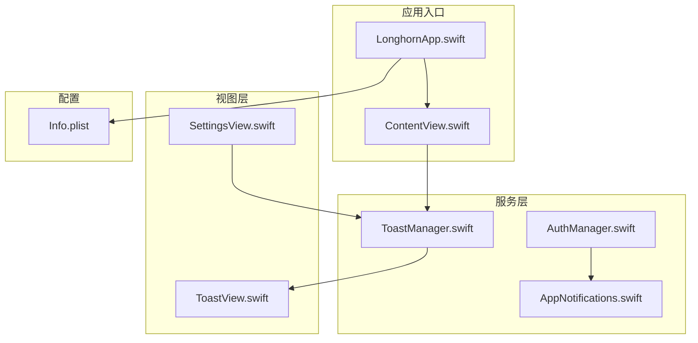
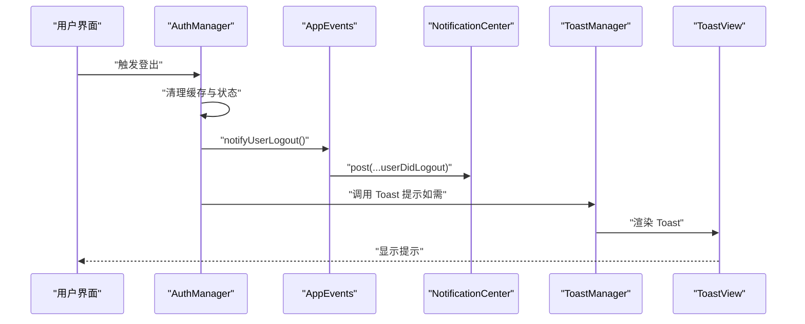
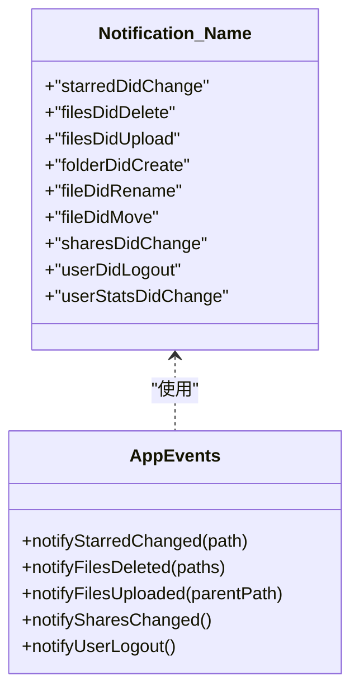
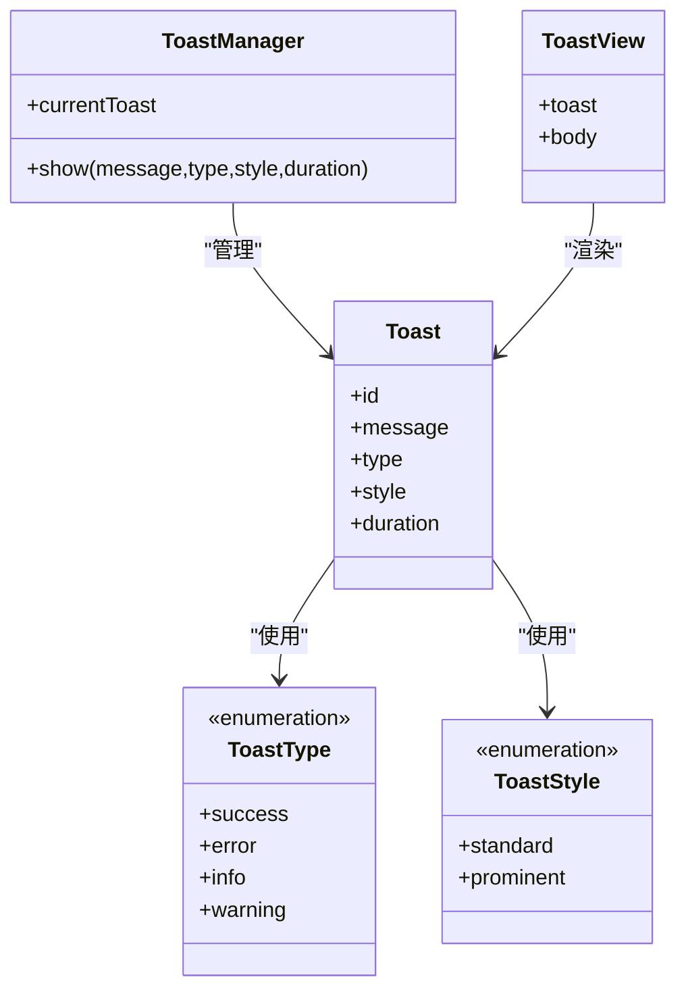
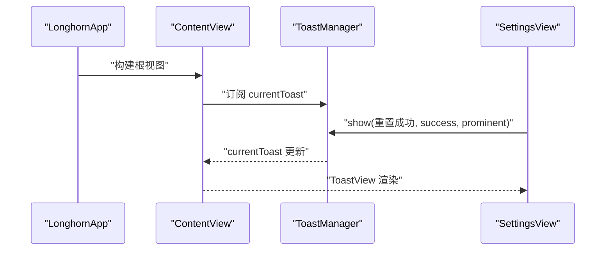
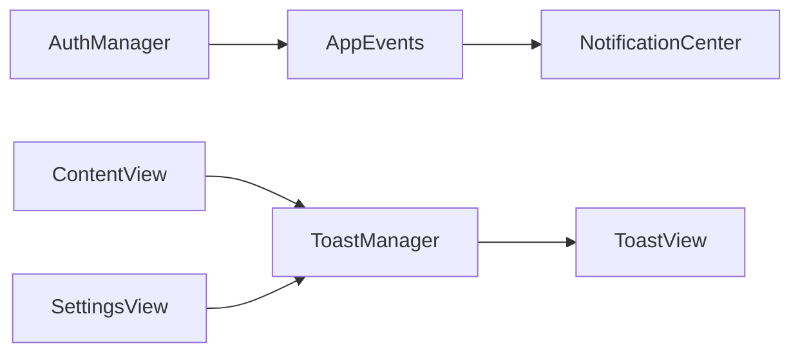

# 推送通知系统

<cite>
**本文引用的文件**
- [AppNotifications.swift](file://ios/LonghornApp/Services/AppNotifications.swift)
- [ToastManager.swift](file://ios/LonghornApp/Services/ToastManager.swift)
- [ToastView.swift](file://ios/LonghornApp/Views/Components/ToastView.swift)
- [ContentView.swift](file://ios/LonghornApp/ContentView.swift)
- [LonghornApp.swift](file://ios/LonghornApp/LonghornApp.swift)
- [AuthManager.swift](file://ios/LonghornApp/Services/AuthManager.swift)
- [Info.plist](file://ios/LonghornApp/Info.plist)
- [SettingsView.swift](file://ios/LonghornApp/Views/Settings/SettingsView.swift)
</cite>

## 目录
1. [简介](#简介)
2. [项目结构](#项目结构)
3. [核心组件](#核心组件)
4. [架构总览](#架构总览)
5. [组件详解](#组件详解)
6. [依赖关系分析](#依赖关系分析)
7. [性能与体验考量](#性能与体验考量)
8. [故障排查指南](#故障排查指南)
9. [结论](#结论)
10. [附录](#附录)

## 简介
本文件面向 Longhorn iOS 应用的推送通知系统，聚焦以下目标：
- 解释应用内通知（基于 NSNotificationCenter）的统一定义与发布机制
- 说明 Toast 提示系统的设计与交互体验
- 明确本地通知、远程推送与横幅通知在当前代码库中的处理边界与建议方案
- 提供通知分类、动作按钮与个性化定制的实现思路
- 覆盖通知权限管理、用户偏好设置与隐私保护要点
- 给出性能优化、电池续航与用户体验的最佳实践

需要特别说明的是：当前仓库中未发现与 Apple Push Notification service（APNs）直接相关的配置或代码实现；因此本文不涉及 APNs 证书设置、远程推送注册与处理的具体实现细节，仅对现有应用内通知与 Toast 系统进行完整梳理，并给出可扩展至远程推送的架构建议。

## 项目结构
围绕推送通知与提示系统，iOS 工程的关键文件分布如下：
- 服务层：应用内通知定义与发布、认证与全局状态
- 视图层：根视图集成 Toast 展示、设置页集成 Toast 使用
- 资源与配置：应用入口、基础样式与网络策略

图表来源
- [LonghornApp.swift](file://ios/LonghornApp/LonghornApp.swift#L11-L25)
- [ContentView.swift](file://ios/LonghornApp/ContentView.swift#L10-L38)
- [AppNotifications.swift](file://ios/LonghornApp/Services/AppNotifications.swift#L10-L85)
- [AuthManager.swift](file://ios/LonghornApp/Services/AuthManager.swift#L13-L89)
- [ToastManager.swift](file://ios/LonghornApp/Services/ToastManager.swift#L43-L77)
- [ToastView.swift](file://ios/LonghornApp/Views/Components/ToastView.swift#L4-L43)
- [SettingsView.swift](file://ios/LonghornApp/Views/Settings/SettingsView.swift#L92-L103)
- [Info.plist](file://ios/LonghornApp/Info.plist#L1-L12)

章节来源
- [LonghornApp.swift](file://ios/LonghornApp/LonghornApp.swift#L11-L25)
- [ContentView.swift](file://ios/LonghornApp/ContentView.swift#L10-L38)
- [AppNotifications.swift](file://ios/LonghornApp/Services/AppNotifications.swift#L10-L85)
- [AuthManager.swift](file://ios/LonghornApp/Services/AuthManager.swift#L13-L89)
- [ToastManager.swift](file://ios/LonghornApp/Services/ToastManager.swift#L43-L77)
- [ToastView.swift](file://ios/LonghornApp/Views/Components/ToastView.swift#L4-L43)
- [SettingsView.swift](file://ios/LonghornApp/Views/Settings/SettingsView.swift#L92-L103)
- [Info.plist](file://ios/LonghornApp/Info.plist#L1-L12)

## 核心组件
- 应用内通知中心：通过扩展 Notification.Name 定义统一的事件名，并提供 AppEvents 发布器，用于在文件、分享、用户等场景下广播事件。
- Toast 管理器：单例管理 Toast 的展示与隐藏，支持类型、风格、时长与触觉反馈。
- 根视图集成：在 ContentView 中订阅 ToastManager 并以叠加层形式呈现 Toast。
- 设置页使用：在设置页重置偏好后通过 Toast 反馈结果。
- 认证联动：登出时通过 AppEvents 发布用户登出事件，便于其他模块响应。

章节来源
- [AppNotifications.swift](file://ios/LonghornApp/Services/AppNotifications.swift#L10-L85)
- [ToastManager.swift](file://ios/LonghornApp/Services/ToastManager.swift#L43-L77)
- [ContentView.swift](file://ios/LonghornApp/ContentView.swift#L14-L35)
- [SettingsView.swift](file://ios/LonghornApp/Views/Settings/SettingsView.swift#L92-L103)
- [AuthManager.swift](file://ios/LonghornApp/Services/AuthManager.swift#L72-L89)

## 架构总览
应用内通知与 Toast 的整体交互流程如下：

图表来源
- [AuthManager.swift](file://ios/LonghornApp/Services/AuthManager.swift#L72-L89)
- [AppNotifications.swift](file://ios/LonghornApp/Services/AppNotifications.swift#L76-L85)
- [ToastManager.swift](file://ios/LonghornApp/Services/ToastManager.swift#L50-L76)
- [ToastView.swift](file://ios/LonghornApp/Views/Components/ToastView.swift#L7-L28)

## 组件详解

### 应用内通知系统（AppNotifications）
- 设计原则
  - 通过扩展 Notification.Name 定义强语义化的事件名，覆盖文件操作、分享变更、用户登出与统计变化等场景。
  - 通过 AppEvents 提供静态方法统一发布事件，便于集中管理与测试。
- 数据结构与复杂度
  - 事件名常量：O(1) 查找与发布
  - 发布器方法：O(1) 常数时间，携带可选 userInfo 字典
- 依赖链
  - AppEvents 依赖 NotificationCenter.default
  - 业务模块（如 AuthManager）在关键节点调用 AppEvents 发布事件
- 错误处理与健壮性
  - 发布时可选择性携带上下文数据（如路径、父目录等），便于监听者按需解析
- 性能影响
  - 基于内存的本地广播，开销极低；避免在高频事件中传递大对象

图表来源
- [AppNotifications.swift](file://ios/LonghornApp/Services/AppNotifications.swift#L10-L85)

章节来源
- [AppNotifications.swift](file://ios/LonghornApp/Services/AppNotifications.swift#L10-L85)

### Toast 提示系统
- 设计与交互
  - 类型：成功、错误、信息、警告
  - 风格：标准（半透明材质风格）、醒目（强调色、加粗、触觉反馈）
  - 动画：弹入弹出动画，自动隐藏
  - 触觉反馈：醒目风格在不同类型下触发相应通知反馈
- 数据模型
  - Toast 结构体包含消息、类型、风格、时长与唯一标识
  - ToastManager 单例持有当前 Toast 并通过 Published 属性驱动视图更新
- 视图层
  - ToastView 根据风格与类型动态决定背景、图标与文字样式
  - 在 ContentView 中以叠加层形式居底显示，避开 TabBar 区域

图表来源
- [ToastManager.swift](file://ios/LonghornApp/Services/ToastManager.swift#L5-L42)
- [ToastView.swift](file://ios/LonghornApp/Views/Components/ToastView.swift#L4-L43)

章节来源
- [ToastManager.swift](file://ios/LonghornApp/Services/ToastManager.swift#L5-L42)
- [ToastManager.swift](file://ios/LonghornApp/Services/ToastManager.swift#L43-L77)
- [ToastView.swift](file://ios/LonghornApp/Views/Components/ToastView.swift#L4-L43)
- [ContentView.swift](file://ios/LonghornApp/ContentView.swift#L14-L35)

### 应用入口与集成
- 应用入口
  - LonghornApp 作为主入口，注入认证与语言管理器环境对象
- 根视图
  - ContentView 根据登录状态切换主界面或登录页，并订阅 ToastManager 实时展示 Toast
- 设置页
  - 在重置偏好后通过 ToastManager.show 提示“重置成功”

图表来源
- [LonghornApp.swift](file://ios/LonghornApp/LonghornApp.swift#L16-L23)
- [ContentView.swift](file://ios/LonghornApp/ContentView.swift#L14-L35)
- [SettingsView.swift](file://ios/LonghornApp/Views/Settings/SettingsView.swift#L92-L103)
- [ToastManager.swift](file://ios/LonghornApp/Services/ToastManager.swift#L50-L76)

章节来源
- [LonghornApp.swift](file://ios/LonghornApp/LonghornApp.swift#L16-L23)
- [ContentView.swift](file://ios/LonghornApp/ContentView.swift#L14-L35)
- [SettingsView.swift](file://ios/LonghornApp/Views/Settings/SettingsView.swift#L92-L103)

### 远程推送与横幅通知（当前实现边界与扩展建议）
- 当前状态
  - 仓库未包含与 APNs 直接相关的配置或代码，因此无法提供具体的证书设置、权限申请与远程推送注册流程
- 扩展建议
  - 权限申请：在应用启动早期请求用户允许通知权限，并在设置页提供入口
  - 注册流程：在应用启动时注册远程推送，生成并上报设备令牌
  - 处理逻辑：在收到远程通知后，根据通知类别与动作按钮执行相应业务逻辑，并通过 Toast 或导航提示用户
  - 横幅通知：在前台时可选择展示横幅或静默处理；后台时由系统负责展示
  - 隐私与偏好：提供通知开关与分类偏好设置，尊重用户选择

[本节为概念性说明，不直接分析具体文件，故无章节来源]

## 依赖关系分析
- 组件耦合
  - AppEvents 与 NotificationCenter：弱耦合，便于替换或测试
  - ToastManager 与 ToastView：通过 Published 属性解耦，便于独立演进
  - ContentView 与 ToastManager：通过单例访问，耦合度低
- 外部依赖
  - Foundation（NotificationCenter、UserDefaults、JSON）
  - SwiftUI（视图与状态绑定）
  - UIKit（触觉反馈 UINotificationFeedbackGenerator）

图表来源
- [AppNotifications.swift](file://ios/LonghornApp/Services/AppNotifications.swift#L47-L85)
- [AuthManager.swift](file://ios/LonghornApp/Services/AuthManager.swift#L72-L89)
- [ToastManager.swift](file://ios/LonghornApp/Services/ToastManager.swift#L43-L77)
- [ToastView.swift](file://ios/LonghornApp/Views/Components/ToastView.swift#L4-L43)
- [ContentView.swift](file://ios/LonghornApp/ContentView.swift#L14-L35)
- [SettingsView.swift](file://ios/LonghornApp/Views/Settings/SettingsView.swift#L92-L103)

章节来源
- [AppNotifications.swift](file://ios/LonghornApp/Services/AppNotifications.swift#L47-L85)
- [AuthManager.swift](file://ios/LonghornApp/Services/AuthManager.swift#L72-L89)
- [ToastManager.swift](file://ios/LonghornApp/Services/ToastManager.swift#L43-L77)
- [ToastView.swift](file://ios/LonghornApp/Views/Components/ToastView.swift#L4-L43)
- [ContentView.swift](file://ios/LonghornApp/ContentView.swift#L14-L35)
- [SettingsView.swift](file://ios/LonghornApp/Views/Settings/SettingsView.swift#L92-L103)

## 性能与体验考量
- 性能特性
  - 应用内通知基于内存广播，发布与接收均为 O(1)，对主线程压力小
  - ToastManager 使用轻量动画与定时器，时长可控，避免阻塞
- 电池续航
  - 避免在高频事件中发送大量通知
  - 对 Toast 时长进行合理控制，减少不必要的触觉反馈
- 用户体验
  - Toast 类型与风格应与业务语义一致；醒目风格用于重要反馈
  - 在设置页提供即时反馈，提升确认感
  - 保持深色主题一致性，确保 Toast 在不同背景下清晰可见

[本节为通用指导，不直接分析具体文件，故无章节来源]

## 故障排查指南
- 通知未触发
  - 检查是否正确调用 AppEvents 的发布方法
  - 确认监听者是否在合适的生命周期注册
- Toast 不显示
  - 确认 ContentView 已订阅 ToastManager
  - 检查是否在主线程更新 currentToast
- 登出后状态异常
  - 确保在登出时调用 AppEvents.notifyUserLogout
  - 检查缓存清理逻辑是否执行

章节来源
- [AppNotifications.swift](file://ios/LonghornApp/Services/AppNotifications.swift#L76-L85)
- [AuthManager.swift](file://ios/LonghornApp/Services/AuthManager.swift#L72-L89)
- [ContentView.swift](file://ios/LonghornApp/ContentView.swift#L14-L35)
- [ToastManager.swift](file://ios/LonghornApp/Services/ToastManager.swift#L50-L76)

## 结论
Longhorn iOS 应用的通知体系以应用内通知与 Toast 提示为核心，具备清晰的事件定义、统一的发布接口与良好的用户体验设计。对于远程推送与横幅通知，当前仓库未包含相关实现，建议在现有架构基础上扩展权限申请、注册流程与处理逻辑，并结合用户偏好与隐私策略完善通知分类与个性化选项。

[本节为总结性内容，不直接分析具体文件，故无章节来源]

## 附录

### 通知权限管理与隐私保护
- 权限申请：在应用启动早期请求通知权限，并在设置页提供入口
- 隐私策略：明确收集与使用范围，提供关闭通知的便捷通道
- 用户偏好：提供通知开关与分类偏好设置，尊重用户选择

[本节为通用指导，不直接分析具体文件，故无章节来源]

### 本地通知、远程推送与横幅通知的处理建议
- 本地通知：适合周期性提醒或离线场景，注意避免过度打扰
- 远程推送：适合实时事件与系统消息，需配合权限与隐私策略
- 横幅通知：前台时可选择展示或静默处理，后台由系统负责展示

[本节为概念性说明，不直接分析具体文件，故无章节来源]

### 通知分类、动作按钮与个性化定制
- 分类：按业务域划分（文件、分享、用户等），便于用户管理
- 动作按钮：针对关键操作提供快速响应（如“撤销”、“查看详情”）
- 个性化：支持用户自定义时长、风格与偏好

[本节为通用指导，不直接分析具体文件，故无章节来源]