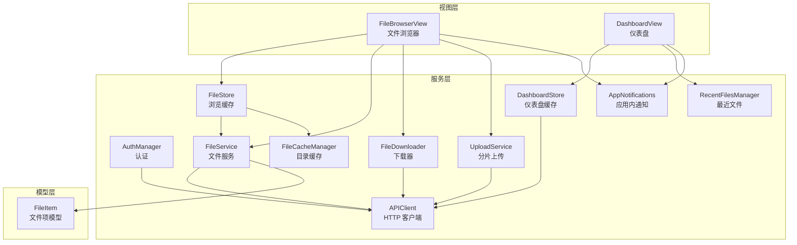
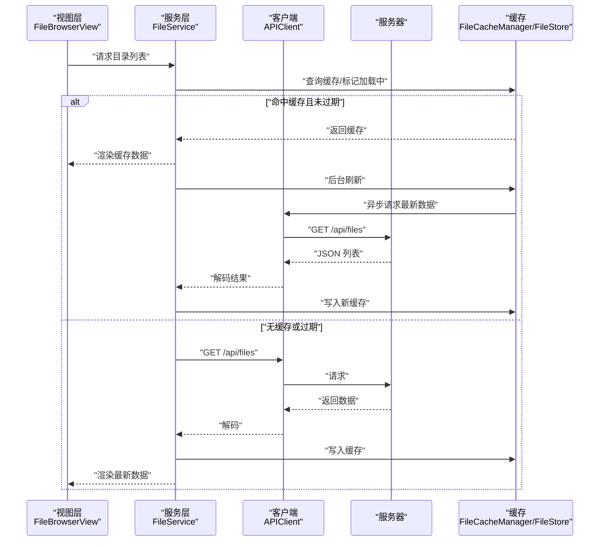
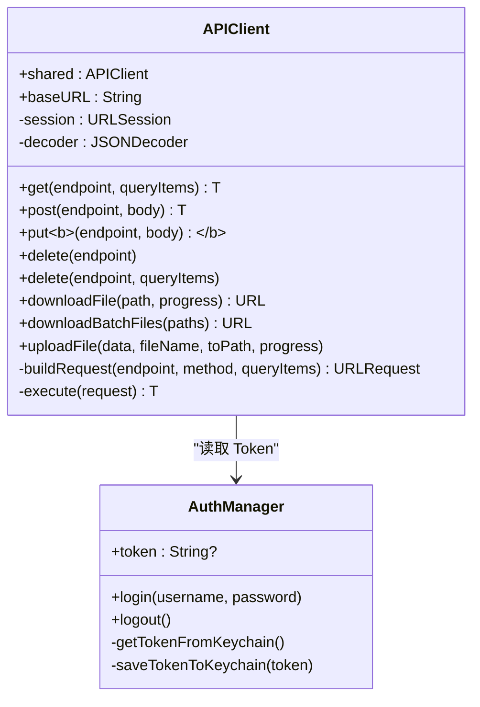
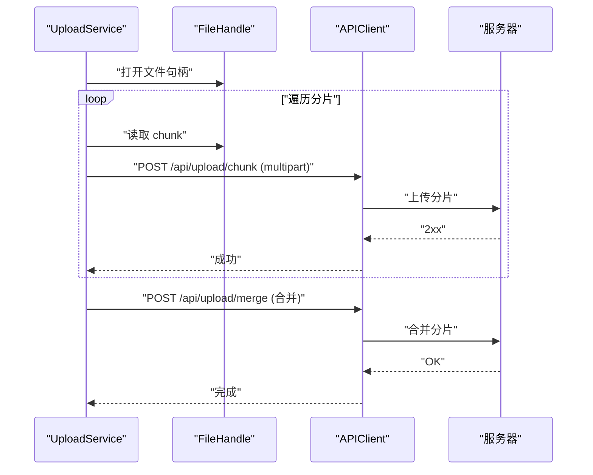
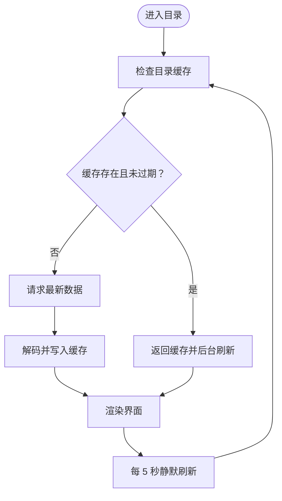
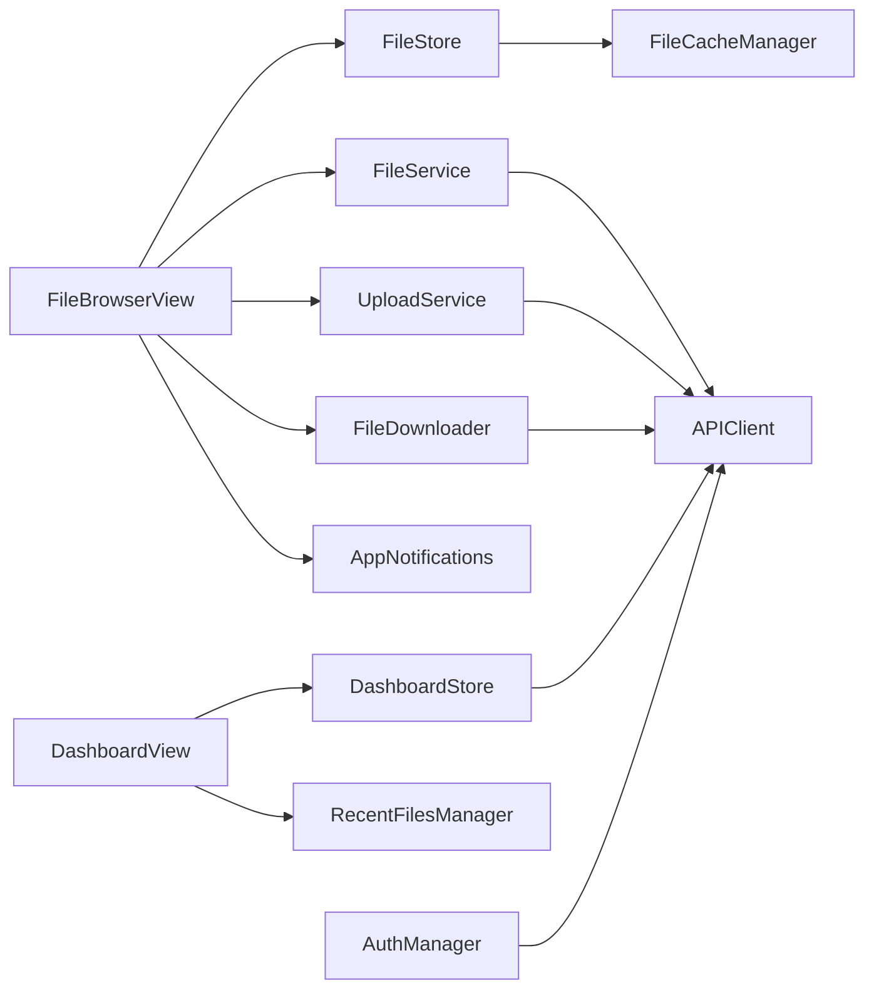

# 数据同步与实时更新

<cite>
**本文引用的文件**
- [APIClient.swift](file://ios/LonghornApp/Services/APIClient.swift)
- [FileService.swift](file://ios/LonghornApp/Services/FileService.swift)
- [UploadService.swift](file://ios/LonghornApp/Services/UploadService.swift)
- [FileDownloader.swift](file://ios/LonghornApp/Services/FileDownloader.swift)
- [FileCacheManager.swift](file://ios/LonghornApp/Services/FileCacheManager.swift)
- [FileStore.swift](file://ios/LonghornApp/Services/FileStore.swift)
- [DashboardStore.swift](file://ios/LonghornApp/Services/DashboardStore.swift)
- [AuthManager.swift](file://ios/LonghornApp/Services/AuthManager.swift)
- [AppNotifications.swift](file://ios/LonghornApp/Services/AppNotifications.swift)
- [FileItem.swift](file://ios/LonghornApp/Models/FileItem.swift)
- [FileBrowserView.swift](file://ios/LonghornApp/Views/Files/FileBrowserView.swift)
- [DashboardView.swift](file://ios/LonghornApp/Views/Main/DashboardView.swift)
- [RecentFilesManager.swift](file://ios/LonghornApp/Services/RecentFilesManager.swift)
</cite>

## 目录
1. [简介](#简介)
2. [项目结构](#项目结构)
3. [核心组件](#核心组件)
4. [架构总览](#架构总览)
5. [详细组件分析](#详细组件分析)
6. [依赖关系分析](#依赖关系分析)
7. [性能考量](#性能考量)
8. [故障排查指南](#故障排查指南)
9. [结论](#结论)
10. [附录](#附录)

## 简介
本文件面向 Longhorn iOS 应用，系统性梳理其数据同步与实时更新机制，覆盖 API 客户端设计、网络请求管理、文件上传下载与断点续传、并发控制、仪表板实时更新、后台同步与轮询、通知与事件驱动、缓存策略、一致性与冲突处理、以及性能优化与用户体验提升建议。目标是帮助开发者与产品人员快速理解系统行为与扩展点。

## 项目结构
iOS 端采用“视图层 + 视图模型/服务层 + 模型层”的清晰分层：
- 视图层：负责 UI 呈现与用户交互（如文件浏览器、仪表盘）。
- 服务层：封装网络请求、文件操作、缓存、认证、通知等横切能力。
- 模型层：定义数据结构（如文件项、统计、分享等）。

图表来源
- [FileBrowserView.swift](file://ios/LonghornApp/Views/Files/FileBrowserView.swift#L112-L144)
- [DashboardView.swift](file://ios/LonghornApp/Views/Main/DashboardView.swift#L15-L71)
- [AuthManager.swift](file://ios/LonghornApp/Services/AuthManager.swift#L13-L39)
- [APIClient.swift](file://ios/LonghornApp/Services/APIClient.swift#L38-L64)
- [FileService.swift](file://ios/LonghornApp/Services/FileService.swift#L10-L14)
- [UploadService.swift](file://ios/LonghornApp/Services/UploadService.swift#L50-L57)
- [FileDownloader.swift](file://ios/LonghornApp/Services/FileDownloader.swift#L4-L18)
- [FileCacheManager.swift](file://ios/LonghornApp/Services/FileCacheManager.swift#L29-L41)
- [FileStore.swift](file://ios/LonghornApp/Services/FileStore.swift#L12-L28)
- [DashboardStore.swift](file://ios/LonghornApp/Services/DashboardStore.swift#L12-L32)
- [AppNotifications.swift](file://ios/LonghornApp/Services/AppNotifications.swift#L10-L43)
- [RecentFilesManager.swift](file://ios/LonghornApp/Services/RecentFilesManager.swift#L34-L57)
- [FileItem.swift](file://ios/LonghornApp/Models/FileItem.swift#L12-L40)

章节来源
- [FileBrowserView.swift](file://ios/LonghornApp/Views/Files/FileBrowserView.swift#L112-L144)
- [DashboardView.swift](file://ios/LonghornApp/Views/Main/DashboardView.swift#L15-L71)
- [AuthManager.swift](file://ios/LonghornApp/Services/AuthManager.swift#L13-L39)

## 核心组件
- API 客户端（APIClient）：统一构建请求、注入认证头、执行网络调用、处理错误与解码。
- 文件服务（FileService）：封装文件/目录/搜索/收藏/回收站/分享等业务 API。
- 上传服务（UploadService）：分片上传、进度、速度、合并、取消与错误处理。
- 下载器（FileDownloader）：基于 URLSession 的下载委托，计算进度与速率。
- 缓存体系：目录缓存（SWR）、浏览缓存（FileStore）、预览缓存（PreviewCacheManager）。
- 仪表盘缓存（DashboardStore）：用户/部门/系统统计的缓存与刷新策略。
- 认证（AuthManager）：Token 管理、Keychain 存取、会话恢复与失效检测。
- 通知（AppNotifications）：跨模块事件广播（收藏、删除、上传、分享、登出、统计）。
- 模型（FileItem）：文件元数据、类型判断、格式化展示。

章节来源
- [APIClient.swift](file://ios/LonghornApp/Services/APIClient.swift#L38-L110)
- [FileService.swift](file://ios/LonghornApp/Services/FileService.swift#L10-L247)
- [UploadService.swift](file://ios/LonghornApp/Services/UploadService.swift#L50-L260)
- [FileDownloader.swift](file://ios/LonghornApp/Services/FileDownloader.swift#L4-L105)
- [FileCacheManager.swift](file://ios/LonghornApp/Services/FileCacheManager.swift#L29-L133)
- [FileStore.swift](file://ios/LonghornApp/Services/FileStore.swift#L12-L139)
- [DashboardStore.swift](file://ios/LonghornApp/Services/DashboardStore.swift#L12-L135)
- [AuthManager.swift](file://ios/LonghornApp/Services/AuthManager.swift#L13-L123)
- [AppNotifications.swift](file://ios/LonghornApp/Services/AppNotifications.swift#L10-L85)
- [FileItem.swift](file://ios/LonghornApp/Models/FileItem.swift#L12-L194)

## 架构总览
Longhorn iOS 的数据流以“视图层触发 → 服务层协调 → API 客户端执行 → 模型层承载 → 缓存/通知回写”为主线，辅以后台轮询与事件驱动实现“准实时”体验。

图表来源
- [FileBrowserView.swift](file://ios/LonghornApp/Views/Files/FileBrowserView.swift#L130-L144)
- [FileService.swift](file://ios/LonghornApp/Services/FileService.swift#L18-L39)
- [FileCacheManager.swift](file://ios/LonghornApp/Services/FileCacheManager.swift#L137-L183)
- [APIClient.swift](file://ios/LonghornApp/Services/APIClient.swift#L68-L110)

## 详细组件分析

### API 客户端设计与网络请求管理
- 统一基座与认证：支持通过 UserDefaults 动态配置 base URL；自动为请求附加 Bearer Token。
- 请求方法：提供通用的 GET/POST/PUT/DELETE 封装，支持泛型响应解码与空响应体场景。
- 文件操作：内置下载（单文件/批量 ZIP）、上传（multipart/form-data），含进度回调与错误处理。
- 错误处理：区分 URL/数据/解码/网络/服务器/未授权等错误类型，统一本地化提示。
- 超时与调试：默认请求/资源超时配置；DEBUG 模式输出请求与响应摘要。

图表来源
- [APIClient.swift](file://ios/LonghornApp/Services/APIClient.swift#L38-L325)
- [AuthManager.swift](file://ios/LonghornApp/Services/AuthManager.swift#L13-L123)

章节来源
- [APIClient.swift](file://ios/LonghornApp/Services/APIClient.swift#L38-L325)
- [AuthManager.swift](file://ios/LonghornApp/Services/AuthManager.swift#L13-L123)

### 文件服务：上传下载、断点续传与并发控制
- 上传（分片）：UploadService 将大文件切分为固定大小分片（默认 5MB），逐片上传并携带 uploadId、索引与总数；完成后调用合并接口。
- 断点续传：当前实现未见服务端断点续传接口；若需支持，可在服务端维护分片索引与校验，客户端据此跳过已成功分片。
- 并发控制：单任务内部串行分片上传；多任务由任务集合管理，UI 层通过状态与进度聚合展示。
- 下载：APIClient 提供单文件/批量下载；FileDownloader 基于 URLSessionDownloadDelegate 提供进度与速率计算。
- 事件通知：上传/删除/收藏等操作通过 AppNotifications 广播，驱动 UI 刷新与缓存失效。

图表来源
- [UploadService.swift](file://ios/LonghornApp/Services/UploadService.swift#L59-L237)
- [APIClient.swift](file://ios/LonghornApp/Services/APIClient.swift#L194-L243)

章节来源
- [UploadService.swift](file://ios/LonghornApp/Services/UploadService.swift#L50-L275)
- [FileDownloader.swift](file://ios/LonghornApp/Services/FileDownloader.swift#L4-L105)
- [AppNotifications.swift](file://ios/LonghornApp/Services/AppNotifications.swift#L47-L85)

### 缓存与实时更新：SWR、浏览缓存与后台轮询
- 目录缓存（SWR）：FileCacheManager 实现 stale-while-revalidate，5 分钟 stale、30 分钟 expired；后台异步刷新，前台优先返回缓存。
- 浏览缓存：FileStore 对目录列表进行主队列缓存，避免重复请求与闪烁；支持乐观更新（新增/删除/重命名）。
- 仪表盘缓存：DashboardStore 对用户/部门/系统统计做 5 分钟缓存，提供懒加载与强制刷新。
- 视图层轮询：FileBrowserView 在可见时启动每 5 秒一次的静默刷新，确保 UI 与服务端状态基本一致。

图表来源
- [FileCacheManager.swift](file://ios/LonghornApp/Services/FileCacheManager.swift#L137-L183)
- [FileStore.swift](file://ios/LonghornApp/Services/FileStore.swift#L46-L85)
- [DashboardStore.swift](file://ios/LonghornApp/Services/DashboardStore.swift#L36-L123)
- [FileBrowserView.swift](file://ios/LonghornApp/Views/Files/FileBrowserView.swift#L137-L143)

章节来源
- [FileCacheManager.swift](file://ios/LonghornApp/Services/FileCacheManager.swift#L29-L133)
- [FileStore.swift](file://ios/LonghornApp/Services/FileStore.swift#L12-L139)
- [DashboardStore.swift](file://ios/LonghornApp/Services/DashboardStore.swift#L12-L135)
- [FileBrowserView.swift](file://ios/LonghornApp/Views/Files/FileBrowserView.swift#L130-L144)

### 仪表板数据的实时更新与状态同步
- DashboardStore 三类统计分别缓存 5 分钟，提供懒加载与强制刷新；异常时保持 UI 可用。
- 与认证联动：AuthManager 在启动时尝试恢复会话并验证 Token，失效则登出并清理缓存。
- 事件驱动：AppNotifications 提供用户统计变化、登出等事件，便于订阅者同步 UI。

章节来源
- [DashboardStore.swift](file://ios/LonghornApp/Services/DashboardStore.swift#L12-L135)
- [AuthManager.swift](file://ios/LonghornApp/Services/AuthManager.swift#L93-L123)
- [AppNotifications.swift](file://ios/LonghornApp/Services/AppNotifications.swift#L47-L85)

### 后台同步任务、网络状态监听与重连机制
- 后台同步：FileCacheManager 的后台刷新与 FileStore 的静默刷新构成“后台同步任务”，减少前台抖动。
- 网络状态监听：代码未显式注册网络可达性监听；建议结合系统 API（如 Network.framework）在 APIClient 层增加重试与退避策略。
- 重连机制：当前未见自动重连实现；可在网络恢复后触发一次静默刷新或主动刷新失败的缓存。

章节来源
- [FileCacheManager.swift](file://ios/LonghornApp/Services/FileCacheManager.swift#L101-L132)
- [FileStore.swift](file://ios/LonghornApp/Services/FileStore.swift#L62-L85)
- [FileBrowserView.swift](file://ios/LonghornApp/Views/Files/FileBrowserView.swift#L137-L143)

### 数据一致性、冲突解决与版本控制
- 乐观更新：FileStore 支持新增/删除/重命名的乐观更新，降低等待时间；建议在服务端引入 ETag/版本号后，客户端在冲突时回滚或合并。
- 冲突解决：当前未见服务端版本控制字段；建议在文件元数据中引入版本号或修改时间戳，冲突时提示用户或自动合并。
- 一致性保障：通过通知（AppNotifications）与缓存失效（invalidate）确保多处 UI 一致；建议在关键操作后统一触发失效与刷新。

章节来源
- [FileStore.swift](file://ios/LonghornApp/Services/FileStore.swift#L103-L139)
- [AppNotifications.swift](file://ios/LonghornApp/Services/AppNotifications.swift#L47-L85)

### WebSocket 连接管理、推送通知与离线数据处理
- WebSocket：当前代码未发现 WebSocket 实现；若需实时推送，建议在服务端建立连接并在 APIClient 层抽象订阅/退订。
- 推送通知：iOS 端可通过 UNUserNotificationCenter 管理远程推送；建议与 AppNotifications 结合，统一事件处理。
- 离线数据：FileStore 在加载失败时不清理旧缓存，保证离线可用；建议在网络恢复后触发一次静默刷新。

章节来源
- [FileStore.swift](file://ios/LonghornApp/Services/FileStore.swift#L79-L84)
- [FileBrowserView.swift](file://ios/LonghornApp/Views/Files/FileBrowserView.swift#L137-L143)

### 性能监控、网络优化与用户体验提升
- 监控指标：UploadService 计算速度字符串；FileDownloader 计算速率与进度；建议在 APIClient 层埋点请求耗时与错误率。
- 网络优化：启用 HTTP/2、连接池复用；对小文件使用并发但受控（避免拥塞）；对大文件使用分片并支持断点续传。
- 用户体验：FileBrowserView 的 5 秒轮询与 SWR 减少卡顿；FileStore 的乐观更新降低等待；建议增加“加载中”占位与骨架屏。

章节来源
- [UploadService.swift](file://ios/LonghornApp/Services/UploadService.swift#L245-L254)
- [FileDownloader.swift](file://ios/LonghornApp/Services/FileDownloader.swift#L78-L96)
- [FileBrowserView.swift](file://ios/LonghornApp/Views/Files/FileBrowserView.swift#L130-L144)

## 依赖关系分析
- 视图层依赖服务层：FileBrowserView 依赖 FileStore/FS/US/FD/NF；DashboardView 依赖 DashboardStore/RecentFilesManager。
- 服务层依赖客户端：FileService/APIClient/UploadService/DownloadService/CacheManager。
- 模块间通过通知解耦：AppNotifications 作为事件总线，避免循环依赖。

图表来源
- [FileBrowserView.swift](file://ios/LonghornApp/Views/Files/FileBrowserView.swift#L15-L71)
- [DashboardView.swift](file://ios/LonghornApp/Views/Main/DashboardView.swift#L15-L71)
- [FileService.swift](file://ios/LonghornApp/Services/FileService.swift#L10-L247)
- [UploadService.swift](file://ios/LonghornApp/Services/UploadService.swift#L50-L275)
- [FileDownloader.swift](file://ios/LonghornApp/Services/FileDownloader.swift#L4-L105)
- [FileCacheManager.swift](file://ios/LonghornApp/Services/FileCacheManager.swift#L29-L133)
- [FileStore.swift](file://ios/LonghornApp/Services/FileStore.swift#L12-L139)
- [DashboardStore.swift](file://ios/LonghornApp/Services/DashboardStore.swift#L12-L135)
- [AuthManager.swift](file://ios/LonghornApp/Services/AuthManager.swift#L13-L123)
- [AppNotifications.swift](file://ios/LonghornApp/Services/AppNotifications.swift#L10-L85)

章节来源
- [FileBrowserView.swift](file://ios/LonghornApp/Views/Files/FileBrowserView.swift#L15-L71)
- [DashboardView.swift](file://ios/LonghornApp/Views/Main/DashboardView.swift#L15-L71)
- [FileService.swift](file://ios/LonghornApp/Services/FileService.swift#L10-L247)
- [UploadService.swift](file://ios/LonghornApp/Services/UploadService.swift#L50-L275)
- [FileDownloader.swift](file://ios/LonghornApp/Services/FileDownloader.swift#L4-L105)
- [FileCacheManager.swift](file://ios/LonghornApp/Services/FileCacheManager.swift#L29-L133)
- [FileStore.swift](file://ios/LonghornApp/Services/FileStore.swift#L12-L139)
- [DashboardStore.swift](file://ios/LonghornApp/Services/DashboardStore.swift#L12-L135)
- [AuthManager.swift](file://ios/LonghornApp/Services/AuthManager.swift#L13-L123)
- [AppNotifications.swift](file://ios/LonghornApp/Services/AppNotifications.swift#L10-L85)

## 性能考量
- 缓存策略：SWR 与主队列缓存结合，减少重复请求与 UI 抖动。
- 并发与限流：分片上传并发可控；建议对小文件批量请求增加节流。
- 网络层：合理设置超时与重试；在 APIClient 层增加埋点与退避。
- UI 体验：骨架屏、占位符、进度条与速率显示提升感知性能。

## 故障排查指南
- 登录失败：检查 AuthManager 的错误消息与 Keychain 存取；确认 APIClient 的 baseURL 与 Token 注入。
- 下载失败：查看 FileDownloader 的 delegate 回调与错误；确认临时目录移动逻辑。
- 上传失败：检查 UploadService 的分片上传与合并阶段；关注 UploadError 类型。
- 缓存异常：核对 FileCacheManager/FileStore 的缓存键与过期策略；必要时调用 invalidate 清理。
- 通知未生效：确认 AppNotifications 的发布与订阅位置；确保在主线程更新 UI。

章节来源
- [AuthManager.swift](file://ios/LonghornApp/Services/AuthManager.swift#L44-L89)
- [FileDownloader.swift](file://ios/LonghornApp/Services/FileDownloader.swift#L99-L105)
- [UploadService.swift](file://ios/LonghornApp/Services/UploadService.swift#L262-L275)
- [FileCacheManager.swift](file://ios/LonghornApp/Services/FileCacheManager.swift#L68-L81)
- [AppNotifications.swift](file://ios/LonghornApp/Services/AppNotifications.swift#L47-L85)

## 结论
Longhorn iOS 的数据同步与实时更新以“缓存优先 + 事件驱动 + 轮询兜底”为核心策略，配合分片上传与下载进度反馈，提供了较好的性能与体验。后续可在服务端引入断点续传与版本控制、在客户端增强网络状态监听与重试、并完善 WebSocket/推送集成，进一步提升一致性与实时性。

## 附录
- 关键模型：FileItem 提供丰富的类型判断与格式化能力，支撑 UI 展示与操作。
- 最近文件：RecentFilesManager 提供时间区间筛选与持久化存储，改善用户召回。

章节来源
- [FileItem.swift](file://ios/LonghornApp/Models/FileItem.swift#L12-L194)
- [RecentFilesManager.swift](file://ios/LonghornApp/Services/RecentFilesManager.swift#L34-L125)