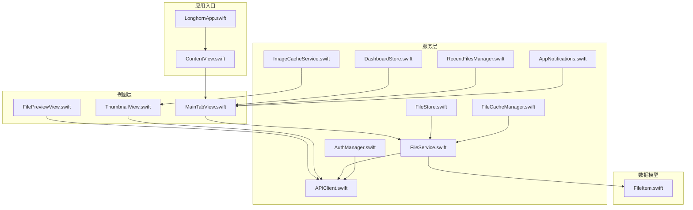
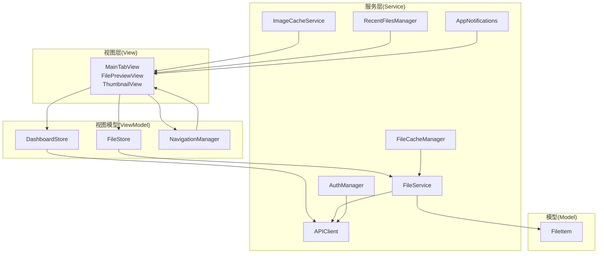
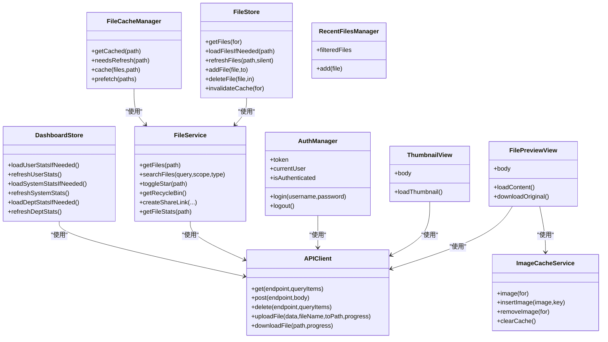
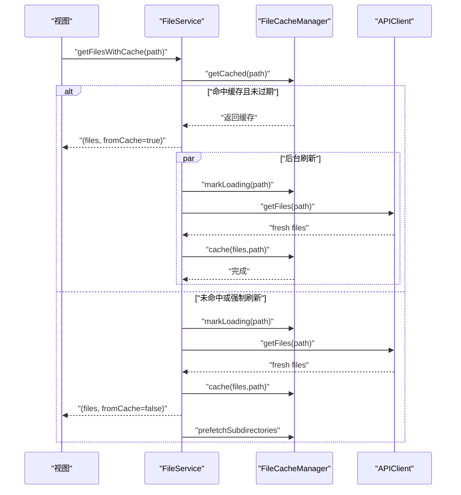
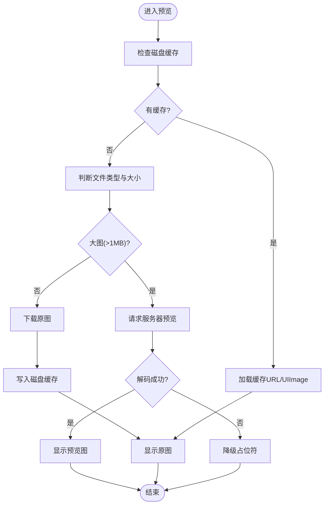
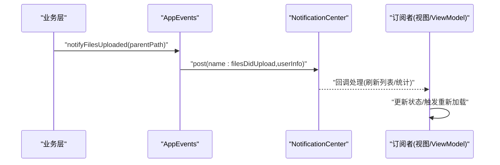
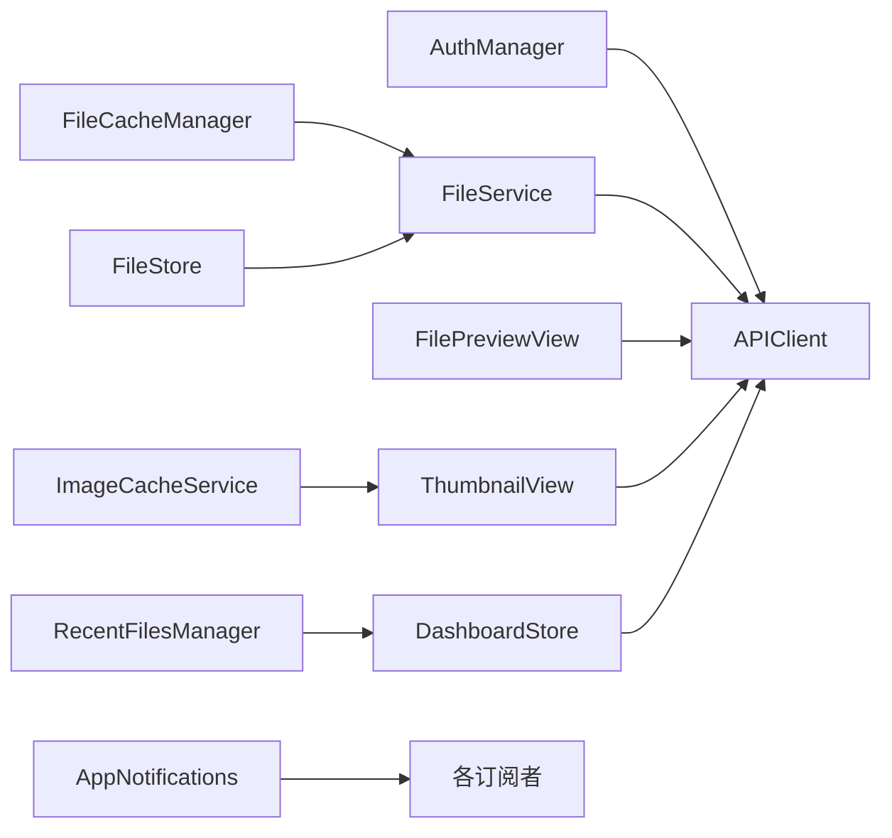

# 移动端架构设计

<cite>
**本文档引用的文件**
- [LonghornApp.swift](file://ios/LonghornApp/LonghornApp.swift)
- [ContentView.swift](file://ios/LonghornApp/ContentView.swift)
- [APIClient.swift](file://ios/LonghornApp/Services/APIClient.swift)
- [AuthManager.swift](file://ios/LonghornApp/Services/AuthManager.swift)
- [FileItem.swift](file://ios/LonghornApp/Models/FileItem.swift)
- [FileService.swift](file://ios/LonghornApp/Services/FileService.swift)
- [FileStore.swift](file://ios/LonghornApp/Services/FileStore.swift)
- [FileCacheManager.swift](file://ios/LonghornApp/Services/FileCacheManager.swift)
- [ImageCacheService.swift](file://ios/LonghornApp/Services/ImageCacheService.swift)
- [MainTabView.swift](file://ios/LonghornApp/Views/Main/MainTabView.swift)
- [AppNotifications.swift](file://ios/LonghornApp/Services/AppNotifications.swift)
- [ThumbnailView.swift](file://ios/LonghornApp/Views/Components/ThumbnailView.swift)
- [FilePreviewView.swift](file://ios/LonghornApp/Views/Files/FilePreviewView.swift)
- [DashboardStore.swift](file://ios/LonghornApp/Services/DashboardStore.swift)
- [RecentFilesManager.swift](file://ios/LonghornApp/Services/RecentFilesManager.swift)
</cite>

## 目录
1. [简介](#简介)
2. [项目结构](#项目结构)
3. [核心组件](#核心组件)
4. [架构总览](#架构总览)
5. [详细组件分析](#详细组件分析)
6. [依赖关系分析](#依赖关系分析)
7. [性能考虑](#性能考虑)
8. [故障排除指南](#故障排除指南)
9. [结论](#结论)
10. [附录](#附录)

## 简介
本文件面向 Longhorn 移动端（iOS）应用，基于 SwiftUI + Swift 的架构设计进行深入技术说明。文档覆盖 MVVM 模式实现、服务层抽象、数据持久化策略、离线缓存机制、实时同步与推送通知系统、文件预览与缩略图生成、内存优化、跨设备兼容性、性能监控与用户体验优化，以及与 Web 端的数据同步机制、冲突解决策略与版本兼容性。同时提供 App Store 发布流程、签名配置与安全最佳实践的指导。

## 项目结构
Longhorn iOS 客户端采用以功能域划分的模块化组织方式，主要分为以下层次：
- 应用入口与根视图：负责应用生命周期与全局环境注入
- 视图层（SwiftUI）：按功能域拆分，如主界面、文件浏览、预览、设置等
- 服务层：网络请求、认证、文件操作、缓存、通知等
- 数据模型：文件、用户、分享、统计等实体
- 资源与本地化：图标、字符串本地化等

图表来源
- [LonghornApp.swift](file://ios/LonghornApp/LonghornApp.swift#L11-L25)
- [ContentView.swift](file://ios/LonghornApp/ContentView.swift#L10-L37)
- [MainTabView.swift](file://ios/LonghornApp/Views/Main/MainTabView.swift#L10-L77)
- [FilePreviewView.swift](file://ios/LonghornApp/Views/Files/FilePreviewView.swift#L13-L84)
- [ThumbnailView.swift](file://ios/LonghornApp/Views/Components/ThumbnailView.swift#L10-L62)
- [APIClient.swift](file://ios/LonghornApp/Services/APIClient.swift#L38-L64)
- [AuthManager.swift](file://ios/LonghornApp/Services/AuthManager.swift#L12-L39)
- [FileService.swift](file://ios/LonghornApp/Services/FileService.swift#L10-L49)
- [FileStore.swift](file://ios/LonghornApp/Services/FileStore.swift#L11-L28)
- [FileCacheManager.swift](file://ios/LonghornApp/Services/FileCacheManager.swift#L28-L41)
- [ImageCacheService.swift](file://ios/LonghornApp/Services/ImageCacheService.swift#L10-L19)
- [DashboardStore.swift](file://ios/LonghornApp/Services/DashboardStore.swift#L11-L32)
- [RecentFilesManager.swift](file://ios/LonghornApp/Services/RecentFilesManager.swift#L34-L57)
- [AppNotifications.swift](file://ios/LonghornApp/Services/AppNotifications.swift#L10-L43)
- [FileItem.swift](file://ios/LonghornApp/Models/FileItem.swift#L11-L40)

章节来源
- [LonghornApp.swift](file://ios/LonghornApp/LonghornApp.swift#L11-L25)
- [ContentView.swift](file://ios/LonghornApp/ContentView.swift#L10-L37)

## 核心组件
本节对关键组件进行深入分析，涵盖职责边界、交互关系与实现要点。

- 应用入口与根视图
  - 应用入口负责注入认证与语言环境，根视图根据登录状态切换登录页或主界面，并统一展示 Toast 提示。
  - 关键点：深色主题默认开启；通过环境对象传递认证与语言状态；Toast 置顶叠加显示。

- 网络层（APIClient）
  - 统一封装 HTTP 请求，支持 GET/POST/PUT/DELETE，内置 JSON 解析与错误处理。
  - 特性：超时配置、动态 BaseURL、自动附加认证头、401 自动登出、调试输出、批量下载与上传支持。

- 认证层（AuthManager）
  - 负责登录、登出、Token 管理与 Keychain 存储、会话恢复与有效性校验。
  - 特性：UserDefaults 存储用户信息；Keychain 保存 Token；登出清理缓存并广播登出事件。

- 文件服务（FileService）
  - 对接后端 API，封装文件列表、搜索、收藏、回收站、分享、统计等业务操作。
  - 特性：请求参数构造、响应模型映射、访问日志记录（fire-and-forget）。

- 缓存层
  - FileStore：基于内存的文件列表缓存，支持过期控制、乐观更新、加载状态管理。
  - FileCacheManager：actor 驱动的目录列表缓存，实现 stale-while-revalidate 模式，支持预取与并发去重。
  - ImageCacheService：内存图片缓存，限制数量与总大小，提升滚动性能。
  - DashboardStore：用户/系统/部门统计缓存，统一过期策略。
  - RecentFilesManager：最近打开文件列表，支持时间区间过滤与持久化。

- 视图组件
  - MainTabView：iPhone 使用 TabView，iPad 保留结构一致性；支持跨设备布局适配。
  - FilePreviewView：智能预览策略（大图走服务器预览，小图直下原图），支持 QuickLook 文档、AVPlayer 视频流。
  - ThumbnailView：异步加载缩略图，结合内存缓存与网络请求，失败回退图标。

- 通知系统（AppNotifications）
  - 统一事件命名与发布，覆盖文件/分享/用户等场景，便于跨视图解耦联动。

章节来源
- [LonghornApp.swift](file://ios/LonghornApp/LonghornApp.swift#L11-L25)
- [ContentView.swift](file://ios/LonghornApp/ContentView.swift#L10-L37)
- [APIClient.swift](file://ios/LonghornApp/Services/APIClient.swift#L38-L110)
- [AuthManager.swift](file://ios/LonghornApp/Services/AuthManager.swift#L12-L89)
- [FileService.swift](file://ios/LonghornApp/Services/FileService.swift#L10-L247)
- [FileStore.swift](file://ios/LonghornApp/Services/FileStore.swift#L11-L139)
- [FileCacheManager.swift](file://ios/LonghornApp/Services/FileCacheManager.swift#L28-L184)
- [ImageCacheService.swift](file://ios/LonghornApp/Services/ImageCacheService.swift#L10-L36)
- [DashboardStore.swift](file://ios/LonghornApp/Services/DashboardStore.swift#L11-L134)
- [RecentFilesManager.swift](file://ios/LonghornApp/Services/RecentFilesManager.swift#L34-L124)
- [MainTabView.swift](file://ios/LonghornApp/Views/Main/MainTabView.swift#L10-L77)
- [FilePreviewView.swift](file://ios/LonghornApp/Views/Files/FilePreviewView.swift#L13-L318)
- [ThumbnailView.swift](file://ios/LonghornApp/Views/Components/ThumbnailView.swift#L10-L111)
- [AppNotifications.swift](file://ios/LonghornApp/Services/AppNotifications.swift#L10-L85)

## 架构总览
整体采用 MVVM 架构，视图层（View）仅负责渲染与交互，业务逻辑由 ViewModel（ObservableObject）承载，数据访问通过 Service 层完成，Model 保持纯数据结构。

图表来源
- [MainTabView.swift](file://ios/LonghornApp/Views/Main/MainTabView.swift#L10-L77)
- [FilePreviewView.swift](file://ios/LonghornApp/Views/Files/FilePreviewView.swift#L13-L84)
- [ThumbnailView.swift](file://ios/LonghornApp/Views/Components/ThumbnailView.swift#L10-L62)
- [FileStore.swift](file://ios/LonghornApp/Services/FileStore.swift#L11-L28)
- [DashboardStore.swift](file://ios/LonghornApp/Services/DashboardStore.swift#L11-L32)
- [APIClient.swift](file://ios/LonghornApp/Services/APIClient.swift#L38-L64)
- [AuthManager.swift](file://ios/LonghornApp/Services/AuthManager.swift#L12-L39)
- [FileService.swift](file://ios/LonghornApp/Services/FileService.swift#L10-L49)
- [FileCacheManager.swift](file://ios/LonghornApp/Services/FileCacheManager.swift#L28-L41)
- [ImageCacheService.swift](file://ios/LonghornApp/Services/ImageCacheService.swift#L10-L19)
- [RecentFilesManager.swift](file://ios/LonghornApp/Services/RecentFilesManager.swift#L34-L57)
- [AppNotifications.swift](file://ios/LonghornApp/Services/AppNotifications.swift#L10-L43)
- [FileItem.swift](file://ios/LonghornApp/Models/FileItem.swift#L11-L40)

## 详细组件分析

### MVVM 模式实现
- 视图（View）：MainTabView、FilePreviewView、ThumbnailView 等，负责 UI 渲染与用户交互。
- 视图模型（ViewModel）：FileStore、DashboardStore、NavigationManager，承担状态管理与业务协调。
- 服务（Service）：APIClient、AuthManager、FileService、FileCacheManager 等，封装数据访问与业务逻辑。
- 模型（Model）：FileItem 等，保持数据结构简洁与可序列化。

图表来源
- [AuthManager.swift](file://ios/LonghornApp/Services/AuthManager.swift#L12-L89)
- [APIClient.swift](file://ios/LonghornApp/Services/APIClient.swift#L38-L110)
- [FileService.swift](file://ios/LonghornApp/Services/FileService.swift#L10-L247)
- [FileStore.swift](file://ios/LonghornApp/Services/FileStore.swift#L11-L139)
- [FileCacheManager.swift](file://ios/LonghornApp/Services/FileCacheManager.swift#L28-L184)
- [ImageCacheService.swift](file://ios/LonghornApp/Services/ImageCacheService.swift#L10-L36)
- [DashboardStore.swift](file://ios/LonghornApp/Services/DashboardStore.swift#L11-L134)
- [RecentFilesManager.swift](file://ios/LonghornApp/Services/RecentFilesManager.swift#L34-L124)
- [FilePreviewView.swift](file://ios/LonghornApp/Views/Files/FilePreviewView.swift#L13-L318)
- [ThumbnailView.swift](file://ios/LonghornApp/Views/Components/ThumbnailView.swift#L10-L111)

章节来源
- [MainTabView.swift](file://ios/LonghornApp/Views/Main/MainTabView.swift#L10-L77)
- [FileStore.swift](file://ios/LonghornApp/Services/FileStore.swift#L11-L139)
- [DashboardStore.swift](file://ios/LonghornApp/Services/DashboardStore.swift#L11-L134)
- [FileCacheManager.swift](file://ios/LonghornApp/Services/FileCacheManager.swift#L28-L184)
- [ImageCacheService.swift](file://ios/LonghornApp/Services/ImageCacheService.swift#L10-L36)
- [RecentFilesManager.swift](file://ios/LonghornApp/Services/RecentFilesManager.swift#L34-L124)
- [FilePreviewView.swift](file://ios/LonghornApp/Views/Files/FilePreviewView.swift#L13-L318)
- [ThumbnailView.swift](file://ios/LonghornApp/Views/Components/ThumbnailView.swift#L10-L111)

### 离线缓存机制与实时同步
- 目录列表缓存（stale-while-revalidate）
  - FileCacheManager 以 actor 保护缓存，支持“过期但可读”与“后台刷新”，避免重复请求与阻塞 UI。
  - FileStore 在此基础上提供更友好的发布订阅与乐观更新能力，确保 UI 与数据一致。
- 文件预取
  - 针对目录中的前若干子目录进行预取，提升后续导航体验。
- 缓存清理
  - 支持按路径失效、全量清理与过期清理，保障存储健康。

图表来源
- [FileCacheManager.swift](file://ios/LonghornApp/Services/FileCacheManager.swift#L137-L184)
- [FileService.swift](file://ios/LonghornApp/Services/FileService.swift#L137-L183)
- [APIClient.swift](file://ios/LonghornApp/Services/APIClient.swift#L68-L110)

章节来源
- [FileCacheManager.swift](file://ios/LonghornApp/Services/FileCacheManager.swift#L28-L184)
- [FileStore.swift](file://ios/LonghornApp/Services/FileStore.swift#L46-L139)
- [FileService.swift](file://ios/LonghornApp/Services/FileService.swift#L137-L183)

### 文件预览与缩略图生成
- 缩略图加载
  - ThumbnailView 优先从内存缓存读取，失败则发起网络请求，成功后写入内存缓存。
- 文件预览
  - FilePreviewView 采用智能策略：大图使用服务器预览接口，小图或非图像直接下载原图；视频通过 AVPlayer 流式播放；文档通过 QuickLook 预览。
- 内存优化
  - ImageCacheService 限制数量与总大小，避免内存峰值；预览完成后及时释放。

图表来源
- [FilePreviewView.swift](file://ios/LonghornApp/Views/Files/FilePreviewView.swift#L221-L290)
- [ThumbnailView.swift](file://ios/LonghornApp/Views/Components/ThumbnailView.swift#L64-L110)
- [ImageCacheService.swift](file://ios/LonghornApp/Services/ImageCacheService.swift#L10-L36)

章节来源
- [ThumbnailView.swift](file://ios/LonghornApp/Views/Components/ThumbnailView.swift#L10-L111)
- [FilePreviewView.swift](file://ios/LonghornApp/Views/Files/FilePreviewView.swift#L13-L318)
- [ImageCacheService.swift](file://ios/LonghornApp/Services/ImageCacheService.swift#L10-L36)

### 推送通知系统
- 事件定义
  - AppNotifications 定义了文件收藏/删除/上传/重命名/移动、分享变更、用户登出、用户统计变化等事件。
- 事件发布
  - AppEvents 提供静态方法发布各类事件，便于业务侧解耦调用。
- 事件监听
  - 各视图/ViewModel 订阅相应通知，实现 UI 自动刷新与状态同步。

图表来源
- [AppNotifications.swift](file://ios/LonghornApp/Services/AppNotifications.swift#L47-L85)

章节来源
- [AppNotifications.swift](file://ios/LonghornApp/Services/AppNotifications.swift#L10-L85)

### 数据持久化策略
- 用户与认证
  - Token 存储于 Keychain，用户信息存储于 UserDefaults，启动时尝试恢复会话并验证有效性。
- 文件与统计
  - FileStore、DashboardStore、RecentFilesManager 使用内存缓存与 UserDefaults 持久化，配合过期策略与手动清理。
- 缩略图与原图
  - 通过 PreviewCacheManager（代码中引用）与磁盘缓存目录存放原图，减少重复下载。

章节来源
- [AuthManager.swift](file://ios/LonghornApp/Services/AuthManager.swift#L132-L180)
- [FileStore.swift](file://ios/LonghornApp/Services/FileStore.swift#L89-L101)
- [DashboardStore.swift](file://ios/LonghornApp/Services/DashboardStore.swift#L125-L134)
- [RecentFilesManager.swift](file://ios/LonghornApp/Services/RecentFilesManager.swift#L83-L114)
- [FilePreviewView.swift](file://ios/LonghornApp/Views/Files/FilePreviewView.swift#L224-L300)

### 与 Web 端的数据同步机制与冲突解决
- 同步机制
  - 通过 APIClient 统一访问后端 REST API，文件列表、搜索、收藏、回收站、分享、统计等均来自服务端。
- 实时性
  - 采用通知系统 AppNotifications 广播事件，订阅者即时响应（如收藏状态变化、文件上传完成）。
- 冲突解决
  - 乐观更新：FileStore 对新增/删除/重命名等操作进行本地乐观更新，随后与服务端结果对齐；若服务端返回不同结果，以服务端为准回滚或合并。
- 版本兼容
  - API 版本通过 BaseURL 配置，支持运行时切换；模型层通过可选字段与容错解析（如日期格式、布尔值兼容）增强兼容性。

章节来源
- [APIClient.swift](file://ios/LonghornApp/Services/APIClient.swift#L42-L51)
- [FileService.swift](file://ios/LonghornApp/Services/FileService.swift#L144-L152)
- [FileStore.swift](file://ios/LonghornApp/Services/FileStore.swift#L103-L138)
- [AppNotifications.swift](file://ios/LonghornApp/Services/AppNotifications.swift#L47-L85)

### 跨设备兼容性处理
- 布局适配
  - MainTabView 根据 horizontalSizeClass 区分 iPhone 与 iPad，保持一致的导航与标签页结构。
- 字体与本地化
  - 通过 LanguageManager 注入 locale，根视图根据语言代码重建视图树，确保文本与排版正确。

章节来源
- [MainTabView.swift](file://ios/LonghornApp/Views/Main/MainTabView.swift#L10-L77)
- [LonghornApp.swift](file://ios/LonghornApp/LonghornApp.swift#L14-L22)

### 性能监控与用户体验优化
- 性能监控
  - APIClient 在 DEBUG 模式输出请求与响应摘要，便于问题定位。
- 用户体验
  - 平滑过渡动画、Toast 提示、加载占位、错误降级、预览优先策略、内存缓存与预取，显著提升流畅度与可用性。

章节来源
- [APIClient.swift](file://ios/LonghornApp/Services/APIClient.swift#L280-L285)
- [ContentView.swift](file://ios/LonghornApp/ContentView.swift#L25-L35)
- [FilePreviewView.swift](file://ios/LonghornApp/Views/Files/FilePreviewView.swift#L120-L131)

### App Store 发布流程、签名配置与安全最佳实践
- 发布流程
  - 配置 Bundle Identifier、版本号与构建号；选择发布目标平台；准备截图与元数据；提交审核。
- 签名配置
  - 使用 Apple Developer 账户创建 App ID 与证书；在 Xcode 中配置 Team 与 Provisioning Profile；启用自动签名或手动管理。
- 安全最佳实践
  - Token 存储于 Keychain；敏感网络请求使用 HTTPS；BaseURL 可配置；最小权限原则；定期轮换密钥与证书；启用 Transport Security 与证书绑定策略。

[本节为通用指导，不直接分析具体文件，故无章节来源]

## 依赖关系分析
组件之间的耦合与协作如下：

图表来源
- [AuthManager.swift](file://ios/LonghornApp/Services/AuthManager.swift#L12-L89)
- [APIClient.swift](file://ios/LonghornApp/Services/APIClient.swift#L38-L110)
- [FileService.swift](file://ios/LonghornApp/Services/FileService.swift#L10-L247)
- [FileCacheManager.swift](file://ios/LonghornApp/Services/FileCacheManager.swift#L28-L184)
- [FileStore.swift](file://ios/LonghornApp/Services/FileStore.swift#L11-L139)
- [FilePreviewView.swift](file://ios/LonghornApp/Views/Files/FilePreviewView.swift#L13-L84)
- [ThumbnailView.swift](file://ios/LonghornApp/Views/Components/ThumbnailView.swift#L10-L62)
- [ImageCacheService.swift](file://ios/LonghornApp/Services/ImageCacheService.swift#L10-L36)
- [DashboardStore.swift](file://ios/LonghornApp/Services/DashboardStore.swift#L11-L134)
- [RecentFilesManager.swift](file://ios/LonghornApp/Services/RecentFilesManager.swift#L34-L124)
- [AppNotifications.swift](file://ios/LonghornApp/Services/AppNotifications.swift#L10-L43)

章节来源
- [AuthManager.swift](file://ios/LonghornApp/Services/AuthManager.swift#L12-L89)
- [APIClient.swift](file://ios/LonghornApp/Services/APIClient.swift#L38-L110)
- [FileService.swift](file://ios/LonghornApp/Services/FileService.swift#L10-L247)
- [FileCacheManager.swift](file://ios/LonghornApp/Services/FileCacheManager.swift#L28-L184)
- [FileStore.swift](file://ios/LonghornApp/Services/FileStore.swift#L11-L139)
- [FilePreviewView.swift](file://ios/LonghornApp/Views/Files/FilePreviewView.swift#L13-L84)
- [ThumbnailView.swift](file://ios/LonghornApp/Views/Components/ThumbnailView.swift#L10-L62)
- [ImageCacheService.swift](file://ios/LonghornApp/Services/ImageCacheService.swift#L10-L36)
- [DashboardStore.swift](file://ios/LonghornApp/Services/DashboardStore.swift#L11-L134)
- [RecentFilesManager.swift](file://ios/LonghornApp/Services/RecentFilesManager.swift#L34-L124)
- [AppNotifications.swift](file://ios/LonghornApp/Services/AppNotifications.swift#L10-L43)

## 性能考虑
- 网络层
  - 合理的超时配置与错误处理，避免长时间阻塞 UI。
  - 批量下载与上传采用 multipart/form-data，减少请求次数。
- 缓存层
  - 目录列表缓存采用 SWR 模式，兼顾实时性与性能；预取子目录降低二次访问延迟。
  - 图片内存缓存限制数量与总大小，防止 OOM。
- 视图层
  - 缩略图优先加载与占位符，减少首屏等待；视频流式播放，文档 QuickLook 预览，避免大内存占用。
- 状态管理
  - 使用 @Published 与 @StateObject 管理状态，避免不必要的重绘；NavigationManager 统一导航请求。

[本节提供通用指导，不直接分析具体文件，故无章节来源]

## 故障排除指南
- 登录失败
  - 检查 BaseURL 配置与网络连通性；查看 APIClient 的错误描述；确认 Keychain 中 Token 是否存在。
- 文件加载缓慢
  - 查看 FileCacheManager 是否命中缓存；确认是否触发后台刷新；检查网络质量。
- 预览失败
  - 大图预览失败时降级为占位符；检查服务器预览接口可用性；确认 Token 有效。
- 缓存异常
  - 使用 FileStore.invalidateCache 或 DashboardStore.clearAll 清理缓存；必要时重启应用。

章节来源
- [APIClient.swift](file://ios/LonghornApp/Services/APIClient.swift#L10-L35)
- [AuthManager.swift](file://ios/LonghornApp/Services/AuthManager.swift#L60-L69)
- [FileCacheManager.swift](file://ios/LonghornApp/Services/FileCacheManager.swift#L68-L81)
- [FilePreviewView.swift](file://ios/LonghornApp/Views/Files/FilePreviewView.swift#L273-L279)
- [FileStore.swift](file://ios/LonghornApp/Services/FileStore.swift#L89-L101)
- [DashboardStore.swift](file://ios/LonghornApp/Services/DashboardStore.swift#L125-L134)

## 结论
Longhorn iOS 客户端通过清晰的 MVVM 分层、完善的缓存与预取策略、健壮的网络与认证体系，以及针对文件预览与缩略图的性能优化，实现了稳定、高效且用户体验良好的企业文件管理应用。配合通知系统与跨设备布局适配，满足多场景使用需求。建议持续关注缓存策略与错误处理细节，确保在复杂网络环境下仍能提供一致的高质量体验。

## 附录
- 术语
  - SWR：Stale-While-Revalidate，过期但可读并在后台刷新的缓存策略。
  - 乐观更新：先在本地反映操作结果，再与服务端对齐的更新策略。
- 参考文件
  - [FileItem.swift](file://ios/LonghornApp/Models/FileItem.swift#L11-L194)
  - [FileService.swift](file://ios/LonghornApp/Services/FileService.swift#L10-L247)
  - [APIClient.swift](file://ios/LonghornApp/Services/APIClient.swift#L38-L326)