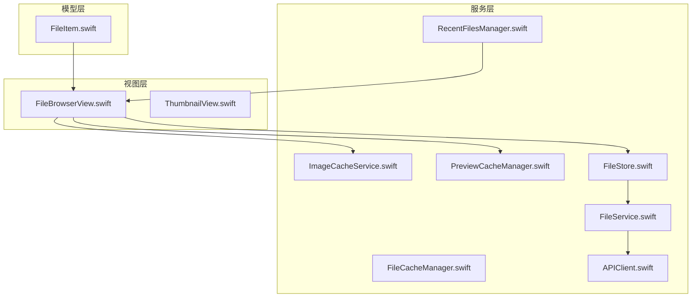
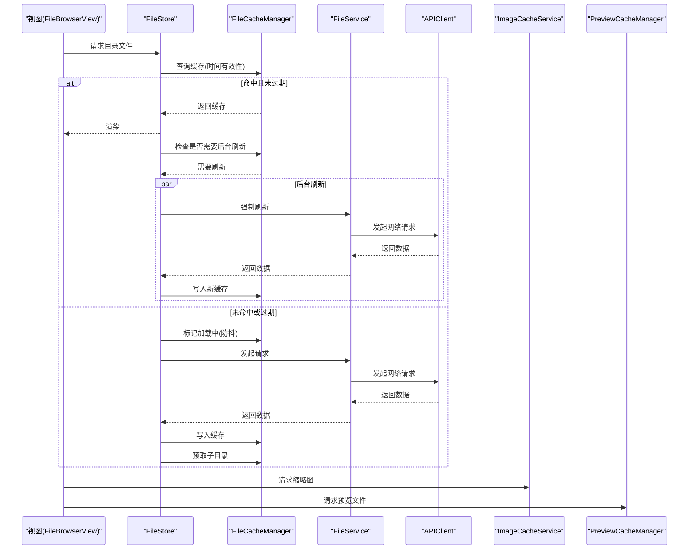
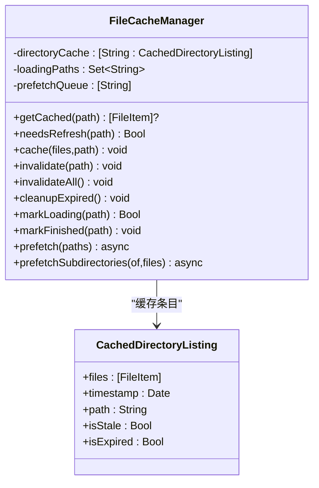
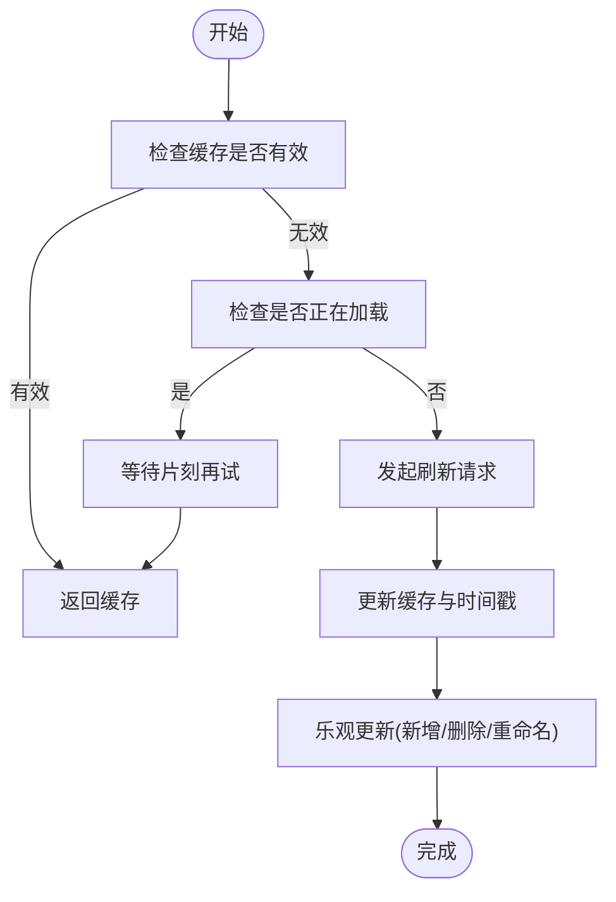
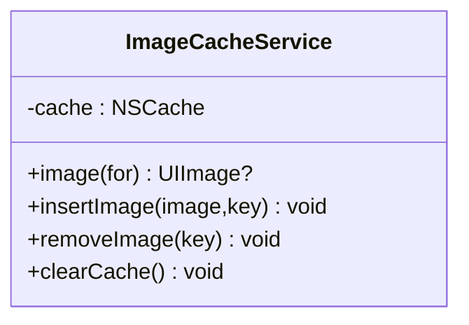
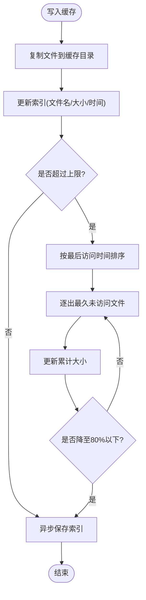
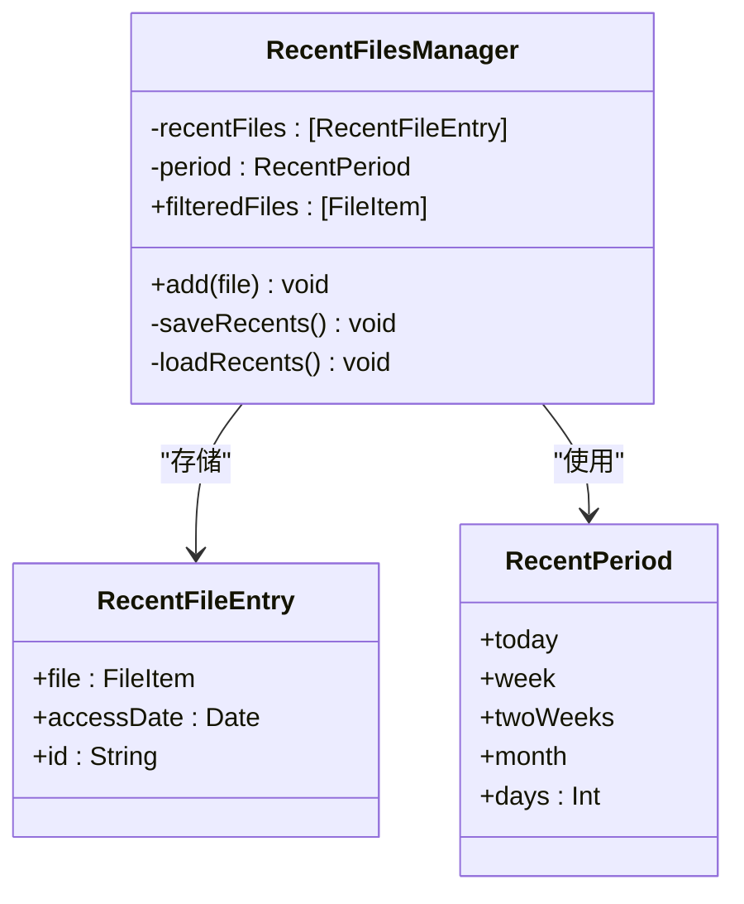
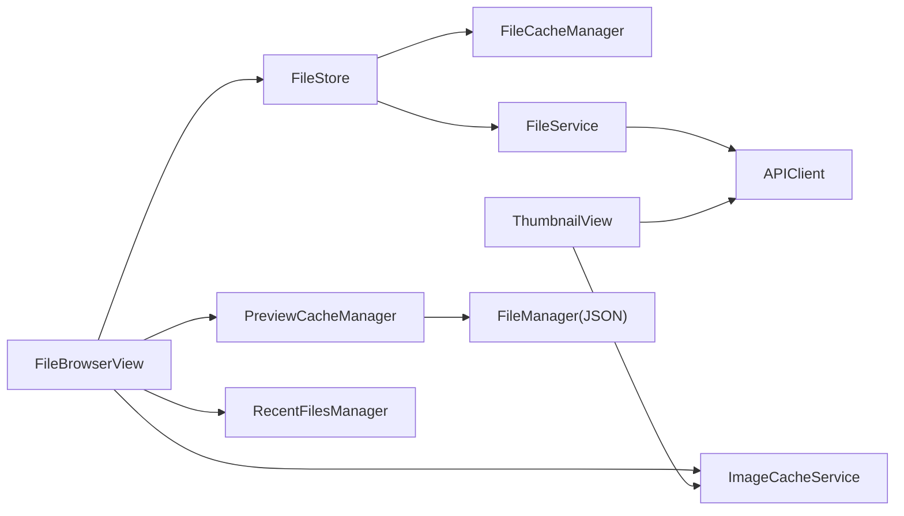

# 缓存策略与数据持久化

<cite>
**本文引用的文件**
- [FileCacheManager.swift](file://ios/LonghornApp/Services/FileCacheManager.swift)
- [ImageCacheService.swift](file://ios/LonghornApp/Services/ImageCacheService.swift)
- [PreviewCacheManager.swift](file://ios/LonghornApp/Services/PreviewCacheManager.swift)
- [RecentFilesManager.swift](file://ios/LonghornApp/Services/RecentFilesManager.swift)
- [FileStore.swift](file://ios/LonghornApp/Services/FileStore.swift)
- [FileService.swift](file://ios/LonghornApp/Services/FileService.swift)
- [APIClient.swift](file://ios/LonghornApp/Services/APIClient.swift)
- [FileItem.swift](file://ios/LonghornApp/Models/FileItem.swift)
- [FileBrowserView.swift](file://ios/LonghornApp/Views/Files/FileBrowserView.swift)
- [ThumbnailView.swift](file://ios/LonghornApp/Views/Components/ThumbnailView.swift)
</cite>

## 目录
1. [简介](#简介)
2. [项目结构](#项目结构)
3. [核心组件](#核心组件)
4. [架构总览](#架构总览)
5. [组件详解](#组件详解)
6. [依赖关系分析](#依赖关系分析)
7. [性能考量](#性能考量)
8. [故障排查指南](#故障排查指南)
9. [结论](#结论)
10. [附录](#附录)

## 简介
本文件系统性梳理 Longhorn iOS 应用的缓存策略与数据持久化方案，覆盖以下方面：
- 文件缓存管理器：基于 stale-while-revalidate（SWR）的目录列表缓存与预取机制
- 图片缓存服务：基于 NSCache 的内存图片缓存与容量控制
- 预览缓存管理器：基于磁盘的 LRU 预览缓存，按大小上限淘汰
- 最近文件管理器：基于 UserDefaults 的本地存储与迁移策略
- 数据流与一致性：离线可用、乐观更新、缓存失效与清理
- 性能监控与优化：内存使用、存储空间管理与 UI 流畅度
- 离线访问与恢复：缓存一致性与异常恢复

## 项目结构
iOS 端缓存与持久化相关代码主要位于 Services 与 Models 目录，配合部分视图层使用。

**图表来源**
- [FileCacheManager.swift](file://ios/LonghornApp/Services/FileCacheManager.swift#L29-L133)
- [ImageCacheService.swift](file://ios/LonghornApp/Services/ImageCacheService.swift#L10-L36)
- [PreviewCacheManager.swift](file://ios/LonghornApp/Services/PreviewCacheManager.swift#L10-L218)
- [RecentFilesManager.swift](file://ios/LonghornApp/Services/RecentFilesManager.swift#L34-L124)
- [FileStore.swift](file://ios/LonghornApp/Services/FileStore.swift#L12-L139)
- [FileService.swift](file://ios/LonghornApp/Services/FileService.swift#L11-L419)
- [APIClient.swift](file://ios/LonghornApp/Services/APIClient.swift#L38-L326)
- [FileItem.swift](file://ios/LonghornApp/Models/FileItem.swift#L12-L194)
- [FileBrowserView.swift](file://ios/LonghornApp/Views/Files/FileBrowserView.swift#L15-L200)
- [ThumbnailView.swift](file://ios/LonghornApp/Views/Components/ThumbnailView.swift#L80-L113)

**章节来源**
- [FileCacheManager.swift](file://ios/LonghornApp/Services/FileCacheManager.swift#L1-L185)
- [ImageCacheService.swift](file://ios/LonghornApp/Services/ImageCacheService.swift#L1-L37)
- [PreviewCacheManager.swift](file://ios/LonghornApp/Services/PreviewCacheManager.swift#L1-L219)
- [RecentFilesManager.swift](file://ios/LonghornApp/Services/RecentFilesManager.swift#L1-L125)
- [FileStore.swift](file://ios/LonghornApp/Services/FileStore.swift#L1-L140)
- [FileService.swift](file://ios/LonghornApp/Services/FileService.swift#L1-L419)
- [APIClient.swift](file://ios/LonghornApp/Services/APIClient.swift#L1-L326)
- [FileItem.swift](file://ios/LonghornApp/Models/FileItem.swift#L1-L288)
- [FileBrowserView.swift](file://ios/LonghornApp/Views/Files/FileBrowserView.swift#L1-L2204)
- [ThumbnailView.swift](file://ios/LonghornApp/Views/Components/ThumbnailView.swift#L1-L113)

## 核心组件
- 文件缓存管理器（SWR）：维护目录列表缓存，支持“过期但可返回”和“完全过期失效”，并提供预取与去重加载
- 文件存储（FileStore）：UI 层缓存，结合时间有效性与加载状态，提供智能加载与乐观更新
- 图片缓存服务（NSCache）：内存级图片缓存，限制数量与总成本，提升滚动流畅度
- 预览缓存管理器（磁盘 LRU）：以大小上限为约束的 LRU 淘汰，索引持久化，支持批量清理
- 最近文件管理器：UserDefaults 本地存储，支持时间区间过滤与版本迁移
- 文件服务与网络客户端：统一的 API 访问与下载路径，支撑缓存命中与回源刷新

**章节来源**
- [FileCacheManager.swift](file://ios/LonghornApp/Services/FileCacheManager.swift#L29-L133)
- [FileStore.swift](file://ios/LonghornApp/Services/FileStore.swift#L12-L139)
- [ImageCacheService.swift](file://ios/LonghornApp/Services/ImageCacheService.swift#L10-L36)
- [PreviewCacheManager.swift](file://ios/LonghornApp/Services/PreviewCacheManager.swift#L10-L218)
- [RecentFilesManager.swift](file://ios/LonghornApp/Services/RecentFilesManager.swift#L34-L124)
- [FileService.swift](file://ios/LonghornApp/Services/FileService.swift#L11-L419)
- [APIClient.swift](file://ios/LonghornApp/Services/APIClient.swift#L38-L326)

## 架构总览
整体流程：视图层通过 FileStore 发起请求；若命中缓存则直接返回；否则由 FileService 调用 APIClient 访问后端；FileCacheManager 提供 SWR 缓存与预取；图片与预览分别走内存与磁盘缓存；最近文件写入 UserDefaults。

**图表来源**
- [FileBrowserView.swift](file://ios/LonghornApp/Views/Files/FileBrowserView.swift#L133-L144)
- [FileStore.swift](file://ios/LonghornApp/Services/FileStore.swift#L47-L85)
- [FileCacheManager.swift](file://ios/LonghornApp/Services/FileCacheManager.swift#L45-L183)
- [FileService.swift](file://ios/LonghornApp/Services/FileService.swift#L18-L39)
- [APIClient.swift](file://ios/LonghornApp/Services/APIClient.swift#L69-L145)
- [ImageCacheService.swift](file://ios/LonghornApp/Services/ImageCacheService.swift#L21-L27)
- [PreviewCacheManager.swift](file://ios/LonghornApp/Services/PreviewCacheManager.swift#L84-L143)

## 组件详解

### 文件缓存管理器（SWR）
- 设计要点
  - 缓存条目包含时间戳与路径，区分“过期（5分钟）”和“完全过期（30分钟）”
  - 防重复加载：通过 Set 记录正在加载的路径
  - 预取策略：对直接子目录进行并发预取，最多 5 个
  - 与 FileService 扩展集成：提供带缓存的获取接口，支持强制刷新
- 关键行为
  - 命中缓存即返回，同时触发后台刷新
  - 若正在加载，等待片刻再尝试读取缓存
  - 预取失败静默处理，不影响主流程
- 时间与清理
  - 过期检测：基于时间差判断
  - 定期清理：移除完全过期项

**图表来源**
- [FileCacheManager.swift](file://ios/LonghornApp/Services/FileCacheManager.swift#L11-L133)

**章节来源**
- [FileCacheManager.swift](file://ios/LonghornApp/Services/FileCacheManager.swift#L11-L183)

### 文件存储（FileStore）
- 设计要点
  - 以路径为键的内存缓存，配合时间有效性与加载状态
  - 首次加载与下拉刷新分离，避免重复请求
  - 乐观更新：新增、删除、重命名等操作即时反映到 UI
  - 加载失败保留旧缓存，保障离线可用
- 关键行为
  - 智能加载：未过期且有数据则直接返回
  - 刷新：支持静默刷新与强制刷新
  - 操作同步：与 FileService 的缓存扩展协同

**图表来源**
- [FileStore.swift](file://ios/LonghornApp/Services/FileStore.swift#L47-L85)

**章节来源**
- [FileStore.swift](file://ios/LonghornApp/Services/FileStore.swift#L12-L139)

### 图片缓存服务（NSCache）
- 设计要点
  - 使用 NSCache 作为内存缓存容器，限制数量与总成本
  - 提供查询、插入、移除与清空接口
  - 视图层在成功加载图片后写入缓存，提升滚动性能
- 配置建议
  - 数量上限与总成本可根据设备内存动态调整
  - 在内存警告时主动清空以释放资源

**图表来源**
- [ImageCacheService.swift](file://ios/LonghornApp/Services/ImageCacheService.swift#L10-L36)

**章节来源**
- [ImageCacheService.swift](file://ios/LonghornApp/Services/ImageCacheService.swift#L10-L36)
- [ThumbnailView.swift](file://ios/LonghornApp/Views/Components/ThumbnailView.swift#L80-L113)

### 预览缓存管理器（磁盘 LRU）
- 设计要点
  - 基于缓存目录与索引文件的持久化缓存
  - 以大小上限（默认 500MB）为约束，采用 LRU 淘汰策略
  - 访问时间仅维护在内存，索引持久化，支持去孤儿文件
  - 提供按路径、路径集合、目录前缀的清理能力
- 关键行为
  - 获取缓存：若文件不存在则清理索引并返回空
  - 写入缓存：复制到缓存目录，生成随机文件名，更新索引
  - 淘汰策略：累计大小超过上限时，按 LRU 顺序删除直至降至 80%
  - 去孤儿：扫描缓存目录，移除不在索引中的文件

**图表来源**
- [PreviewCacheManager.swift](file://ios/LonghornApp/Services/PreviewCacheManager.swift#L115-L166)

**章节来源**
- [PreviewCacheManager.swift](file://ios/LonghornApp/Services/PreviewCacheManager.swift#L10-L218)

### 最近文件管理器（UserDefaults）
- 设计要点
  - 使用 UserDefaults 存储最近打开记录，支持时间区间过滤
  - 支持版本迁移：从旧格式迁移到新格式
  - 限制最大记录数，超出时裁剪
- 关键行为
  - 新增：移除重复项，插入到首位，超限裁剪
  - 过滤：根据时间区间计算截止日期，过滤显示
  - 保存：编码为 JSON 并写入 UserDefaults

**图表来源**
- [RecentFilesManager.swift](file://ios/LonghornApp/Services/RecentFilesManager.swift#L34-L124)

**章节来源**
- [RecentFilesManager.swift](file://ios/LonghornApp/Services/RecentFilesManager.swift#L34-L124)

### 数据模型（FileItem）
- 设计要点
  - 统一的文件/文件夹数据模型，支持多种文件类型识别
  - 提供格式化大小、时间与系统图标映射
  - 支持多种日期格式解析
- 用途
  - 作为缓存与 UI 展示的基础数据结构

**章节来源**
- [FileItem.swift](file://ios/LonghornApp/Models/FileItem.swift#L12-L194)

## 依赖关系分析
- FileStore 依赖 FileService 与 FileCacheManager，负责 UI 缓存与乐观更新
- FileService 依赖 APIClient，封装各类 API 请求
- FileBrowserView 依赖 FileStore、ImageCacheService、PreviewCacheManager 与 RecentFilesManager
- ThumbnailView 依赖 ImageCacheService 与 APIClient
- PreviewCacheManager 依赖 FileManager 与 JSON 编解码

**图表来源**
- [FileBrowserView.swift](file://ios/LonghornApp/Views/Files/FileBrowserView.swift#L15-L200)
- [FileStore.swift](file://ios/LonghornApp/Services/FileStore.swift#L12-L139)
- [FileCacheManager.swift](file://ios/LonghornApp/Services/FileCacheManager.swift#L29-L133)
- [FileService.swift](file://ios/LonghornApp/Services/FileService.swift#L11-L419)
- [APIClient.swift](file://ios/LonghornApp/Services/APIClient.swift#L38-L326)
- [ImageCacheService.swift](file://ios/LonghornApp/Services/ImageCacheService.swift#L10-L36)
- [PreviewCacheManager.swift](file://ios/LonghornApp/Services/PreviewCacheManager.swift#L10-L218)
- [ThumbnailView.swift](file://ios/LonghornApp/Views/Components/ThumbnailView.swift#L80-L113)

**章节来源**
- [FileBrowserView.swift](file://ios/LonghornApp/Views/Files/FileBrowserView.swift#L1-L2204)
- [FileStore.swift](file://ios/LonghornApp/Services/FileStore.swift#L1-L140)
- [FileCacheManager.swift](file://ios/LonghornApp/Services/FileCacheManager.swift#L1-L185)
- [FileService.swift](file://ios/LonghornApp/Services/FileService.swift#L1-L419)
- [APIClient.swift](file://ios/LonghornApp/Services/APIClient.swift#L1-L326)
- [ImageCacheService.swift](file://ios/LonghornApp/Services/ImageCacheService.swift#L1-L37)
- [PreviewCacheManager.swift](file://ios/LonghornApp/Services/PreviewCacheManager.swift#L1-L219)
- [ThumbnailView.swift](file://ios/LonghornApp/Views/Components/ThumbnailView.swift#L1-L113)

## 性能考量
- 内存缓存
  - NSCache 的数量与总成本限制应结合设备内存动态评估
  - 在内存压力事件中主动清空图片缓存，避免系统回收
- 磁盘缓存
  - 预览缓存按大小上限淘汰，建议定期执行清理任务
  - 索引保存采用去抖策略，减少频繁磁盘 IO
- 网络与 UI
  - SWR 模式在弱网环境下提升感知速度，后台刷新确保数据新鲜
  - FileStore 的乐观更新减少 UI 抖动，失败时保留旧缓存
- 预取策略
  - 限制预取子目录数量，避免过度占用网络与存储
- 监控建议
  - 记录缓存命中率、预取成功率、磁盘使用量与内存占用峰值
  - 对异常请求与缓存失效进行埋点统计

[本节为通用指导，无需列出具体文件来源]

## 故障排查指南
- 缓存未生效
  - 检查 FileCacheManager 的过期判定与 needsRefresh 行为
  - 确认 FileStore 的时间有效性与加载状态
- 预览文件缺失
  - 查看预览缓存索引是否存在对应项，文件是否被清理
  - 检查磁盘空间与权限
- 图片不显示
  - 确认图片缓存是否命中，必要时重建缓存
  - 检查网络请求与鉴权头
- 最近文件异常
  - 检查 UserDefaults 的迁移逻辑与编码/解码错误
  - 核对时间区间与过滤逻辑

**章节来源**
- [FileCacheManager.swift](file://ios/LonghornApp/Services/FileCacheManager.swift#L45-L81)
- [FileStore.swift](file://ios/LonghornApp/Services/FileStore.swift#L47-L85)
- [PreviewCacheManager.swift](file://ios/LonghornApp/Services/PreviewCacheManager.swift#L84-L101)
- [ImageCacheService.swift](file://ios/LonghornApp/Services/ImageCacheService.swift#L21-L35)
- [RecentFilesManager.swift](file://ios/LonghornApp/Services/RecentFilesManager.swift#L83-L114)

## 结论
Longhorn iOS 的缓存体系以 SWR 为核心，结合内存与磁盘两级缓存，兼顾性能与一致性。通过 FileStore 的乐观更新与 RecentFilesManager 的本地持久化，系统在弱网与离线场景下仍能保持良好体验。建议持续监控缓存命中率与资源使用，按需调优容量与淘汰策略。

[本节为总结性内容，无需列出具体文件来源]

## 附录

### 缓存策略与配置速查
- 文件缓存（SWR）
  - 过期时间：5 分钟（可返回），30 分钟（完全过期）
  - 预取：最多 5 个直接子目录
  - 防重复：Set 记录加载中路径
- 图片缓存（NSCache）
  - 数量上限：200 张
  - 总成本上限：100MB
- 预览缓存（磁盘 LRU）
  - 大小上限：500MB
  - 淘汰阈值：降至 80%
- 最近文件
  - 存储位置：UserDefaults
  - 最大记录：100 条
  - 时间区间：今天/一周/两周/一月

**章节来源**
- [FileCacheManager.swift](file://ios/LonghornApp/Services/FileCacheManager.swift#L16-L24)
- [ImageCacheService.swift](file://ios/LonghornApp/Services/ImageCacheService.swift#L15-L19)
- [PreviewCacheManager.swift](file://ios/LonghornApp/Services/PreviewCacheManager.swift#L24)
- [RecentFilesManager.swift](file://ios/LonghornApp/Services/RecentFilesManager.swift#L44-L56)