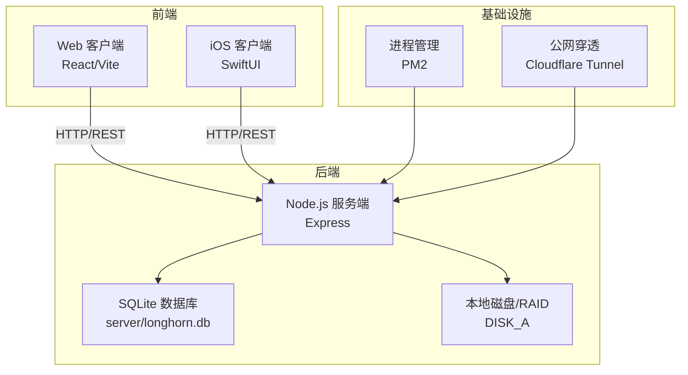
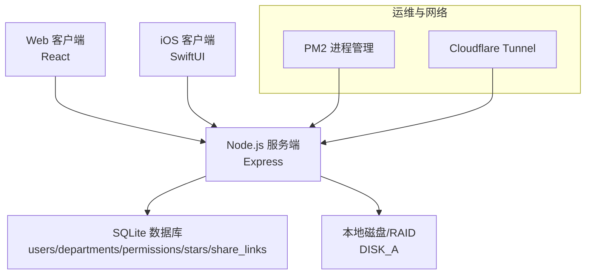
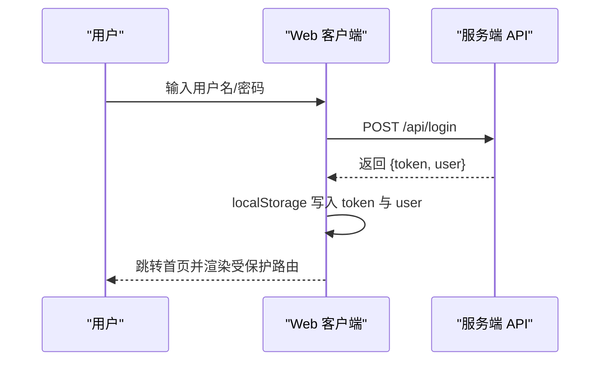
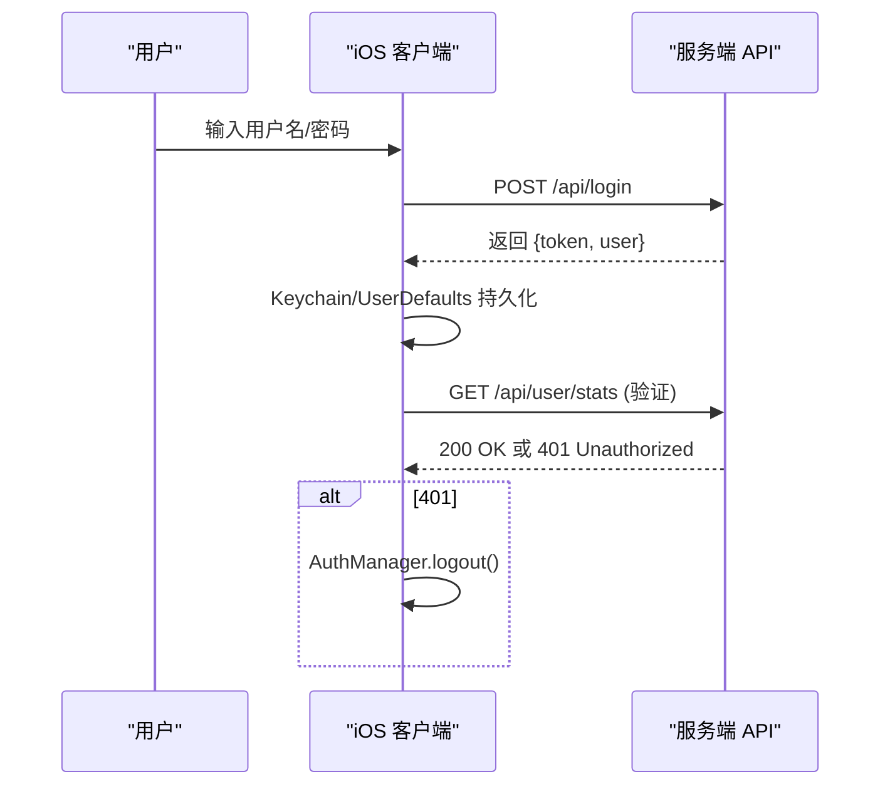
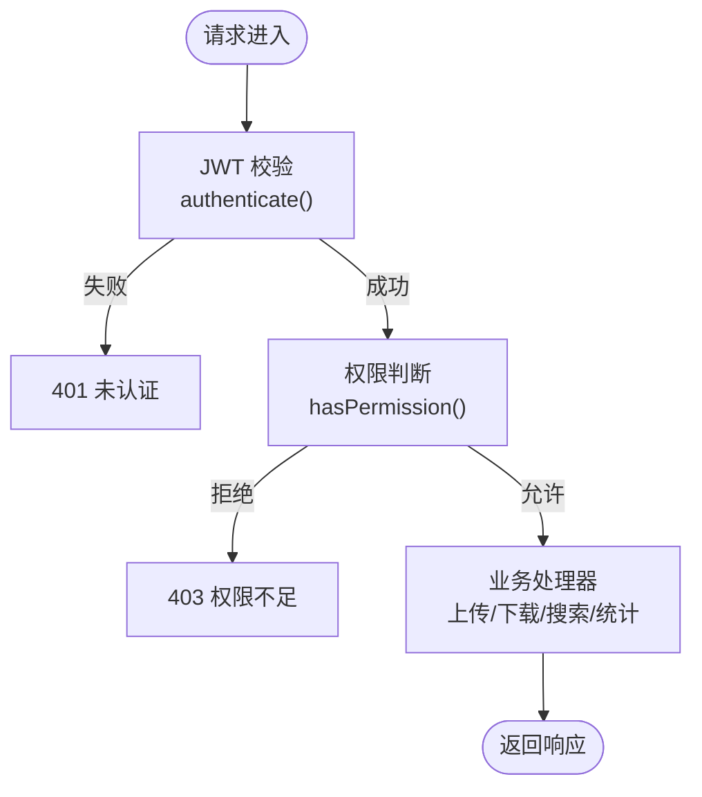
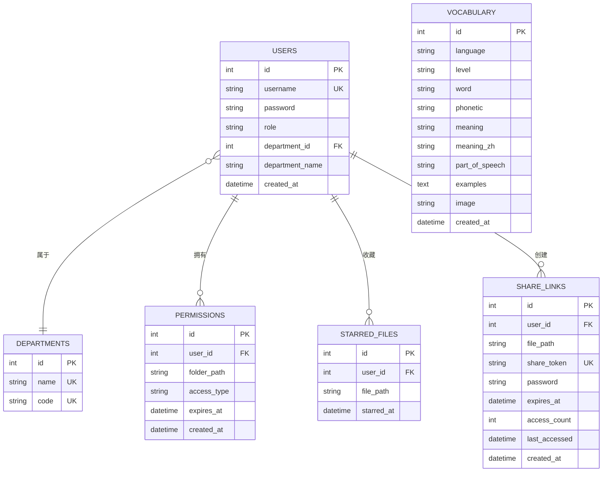
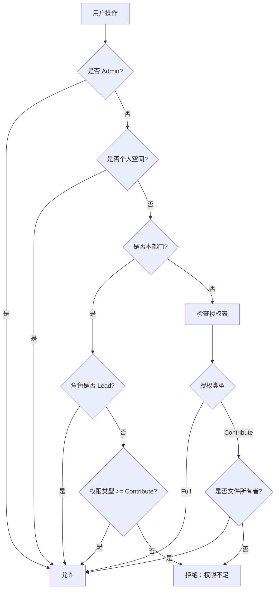
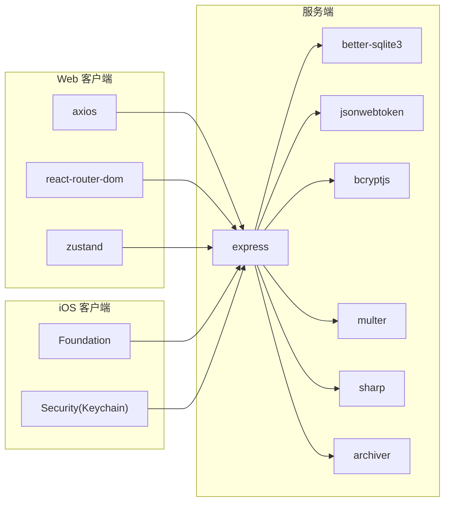

# 系统架构

<cite>
**本文档引用的文件**
- [Longhorn.md](file://Longhorn.md)
- [SYSTEM_CONTEXT.md](file://docs/SYSTEM_CONTEXT.md)
- [OPS.md](file://docs/OPS.md)
- [client/package.json](file://client/package.json)
- [ios/LonghornApp/Info.plist](file://ios/LonghornApp/Info.plist)
- [server/package.json](file://server/package.json)
- [client/src/App.tsx](file://client/src/App.tsx)
- [client/src/store/useAuthStore.ts](file://client/src/store/useAuthStore.ts)
- [client/src/components/Login.tsx](file://client/src/components/Login.tsx)
- [ios/LonghornApp/LonghornApp.swift](file://ios/LonghornApp/LonghornApp.swift)
- [ios/LonghornApp/Services/AuthManager.swift](file://ios/LonghornApp/Services/AuthManager.swift)
- [ios/LonghornApp/Services/APIClient.swift](file://ios/LonghornApp/Services/APIClient.swift)
- [server/index.js](file://server/index.js)
- [server/migrations/phase2.sql](file://server/migrations/phase2.sql)
- [server/migrations/add_share_collections.sql](file://server/migrations/add_share_collections.sql)
- [docs/CONTRIBUTE_PERMISSION_IMPLEMENTATION.md](file://docs/CONTRIBUTE_PERMISSION_IMPLEMENTATION.md)
</cite>

## 目录
1. [简介](#简介)
2. [项目结构](#项目结构)
3. [核心组件](#核心组件)
4. [架构总览](#架构总览)
5. [详细组件分析](#详细组件分析)
6. [依赖关系分析](#依赖关系分析)
7. [性能考量](#性能考量)
8. [故障排查指南](#故障排查指南)
9. [结论](#结论)
10. [附录](#附录)

## 简介
Longhorn 是 Kinefinity 团队的企业级本地数据协作系统，采用三层架构设计：
- Web 客户端层（React/Vite）
- iOS 移动端层（SwiftUI）
- Node.js 服务端层（Express + SQLite）

系统围绕“协同文件系统”的目标，提供安全、高效的局域网/广域网文件访问、多级权限管理及跨部门协作能力。后端以 SQLite 为核心数据存储，结合 JWT 实现认证与授权，并通过 HTTP/REST 与前端交互；同时支持分片上传、缩略图生成等文件处理能力。

## 项目结构
Longhorn 仓库包含三个主要子项目与若干运维/开发文档：
- client：基于 React 的 Web 管理后台与文件浏览器
- ios：基于 SwiftUI 的 iOS 原生应用
- server：基于 Node.js + Express 的后端服务，使用 SQLite 存储元数据
- docs：系统上下文、运维部署、权限实现等文档

图表来源
- [Longhorn.md](file://Longhorn.md#L49-L66)
- [SYSTEM_CONTEXT.md](file://docs/SYSTEM_CONTEXT.md#L7-L21)
- [OPS.md](file://docs/OPS.md#L100-L111)

章节来源
- [Longhorn.md](file://Longhorn.md#L1-L71)
- [SYSTEM_CONTEXT.md](file://docs/SYSTEM_CONTEXT.md#L1-L95)
- [OPS.md](file://docs/OPS.md#L1-L171)

## 核心组件
- Web 客户端（React）
  - 路由与权限控制：基于 React Router 的受保护路由与角色判定
  - 状态管理：Zustand 管理登录态与用户信息
  - 认证流程：登录成功后持久化 token 与用户信息
- iOS 客户端（SwiftUI）
  - 网络层：APIClient 统一封装 HTTP 请求，支持认证头注入
  - 认证管理：AuthManager 使用 Keychain 与 UserDefaults 管理 token 与用户信息
  - 文件操作：支持下载、上传、批量下载等
- Node.js 服务端（Express）
  - 认证中间件：JWT 校验与用户信息注入
  - 权限引擎：基于角色与授权表的细粒度权限判断
  - 文件处理：分片上传、缩略图生成、批量下载
  - 数据存储：SQLite 表结构覆盖用户、部门、权限、星标、分享等

章节来源
- [client/src/App.tsx](file://client/src/App.tsx#L66-L126)
- [client/src/store/useAuthStore.ts](file://client/src/store/useAuthStore.ts#L1-L31)
- [client/src/components/Login.tsx](file://client/src/components/Login.tsx#L1-L161)
- [ios/LonghornApp/LonghornApp.swift](file://ios/LonghornApp/LonghornApp.swift#L1-L26)
- [ios/LonghornApp/Services/AuthManager.swift](file://ios/LonghornApp/Services/AuthManager.swift#L1-L195)
- [ios/LonghornApp/Services/APIClient.swift](file://ios/LonghornApp/Services/APIClient.swift#L1-L326)
- [server/index.js](file://server/index.js#L267-L295)

## 架构总览
Longhorn 采用“前后端分离 + 本地文件系统 + SQLite 元数据”的混合架构。Web 与 iOS 通过 HTTP/REST 与服务端交互，服务端负责认证、权限校验、文件元数据与缩略图生成，并直接读写本地磁盘。

图表来源
- [Longhorn.md](file://Longhorn.md#L49-L66)
- [SYSTEM_CONTEXT.md](file://docs/SYSTEM_CONTEXT.md#L24-L48)
- [server/index.js](file://server/index.js#L16-L31)

章节来源
- [Longhorn.md](file://Longhorn.md#L47-L66)
- [SYSTEM_CONTEXT.md](file://docs/SYSTEM_CONTEXT.md#L22-L48)

## 详细组件分析

### Web 客户端（React）认证与路由
- 登录流程：调用 /api/login 获取 token 与用户信息，使用 Zustand 写入内存与 localStorage
- 路由守卫：未登录或用户信息缺失时重定向至登录页；根据角色渲染侧边栏与页面
- 令牌持久化：登录成功后写入 localStorage，刷新后恢复登录态

图表来源
- [client/src/components/Login.tsx](file://client/src/components/Login.tsx#L15-L27)
- [client/src/store/useAuthStore.ts](file://client/src/store/useAuthStore.ts#L17-L30)
- [client/src/App.tsx](file://client/src/App.tsx#L75-L85)

章节来源
- [client/src/components/Login.tsx](file://client/src/components/Login.tsx#L1-L161)
- [client/src/store/useAuthStore.ts](file://client/src/store/useAuthStore.ts#L1-L31)
- [client/src/App.tsx](file://client/src/App.tsx#L66-L126)

### iOS 客户端（SwiftUI）认证与网络
- 登录流程：AuthManager 调用 APIClient.post("/api/login")，保存 token 到 Keychain，用户信息到 UserDefaults
- Token 校验：启动时尝试调用 /api/user/stats 验证 token 有效性，失败则登出
- 网络封装：APIClient 统一处理超时、认证头、错误码与下载/上传

图表来源
- [ios/LonghornApp/Services/AuthManager.swift](file://ios/LonghornApp/Services/AuthManager.swift#L44-L69)
- [ios/LonghornApp/Services/AuthManager.swift](file://ios/LonghornApp/Services/AuthManager.swift#L114-L123)
- [ios/LonghornApp/Services/APIClient.swift](file://ios/LonghornApp/Services/APIClient.swift#L68-L88)

章节来源
- [ios/LonghornApp/Services/AuthManager.swift](file://ios/LonghornApp/Services/AuthManager.swift#L1-L195)
- [ios/LonghornApp/Services/APIClient.swift](file://ios/LonghornApp/Services/APIClient.swift#L1-L326)

### 服务端（Node.js）认证与权限
- 认证中间件：从 Authorization 头提取 Bearer token，使用 JWT_SECRET 校验并注入用户信息
- 权限引擎：hasPermission 综合角色、个人空间、部门空间、显式授权与过期时间判断
- 文件处理：分片上传、合并、缩略图生成（sharp/ffmpeg）、批量下载（zip）

图表来源
- [server/index.js](file://server/index.js#L267-L295)
- [server/index.js](file://server/index.js#L297-L353)

章节来源
- [server/index.js](file://server/index.js#L267-L295)
- [server/index.js](file://server/index.js#L297-L353)

### 数据模型（SQLite）
- 用户与部门：users、departments
- 权限与星标：permissions、stars
- 分享与收藏：share_links、starred_files
- 词汇表：vocabulary（用于每日单词）

图表来源
- [server/index.js](file://server/index.js#L32-L78)
- [server/migrations/phase2.sql](file://server/migrations/phase2.sql#L3-L31)
- [server/migrations/add_share_collections.sql](file://server/migrations/add_share_collections.sql#L4-L29)

章节来源
- [server/index.js](file://server/index.js#L32-L78)
- [server/migrations/phase2.sql](file://server/migrations/phase2.sql#L1-L32)
- [server/migrations/add_share_collections.sql](file://server/migrations/add_share_collections.sql#L1-L31)

### 权限体系与三级权限
- 三级权限：Read（只读）、Contribute（贡献）、Full（完全）
- 角色默认权限：Admin 全权限；Lead 对本部门 Full；Member 在部门内默认 Contribute
- 细粒度控制：显式授权表 permissions 支持按目录授权，含过期时间
- 删除/移动等 Full 操作需额外校验文件所有者（file_stats.uploader_id）

图表来源
- [docs/CONTRIBUTE_PERMISSION_IMPLEMENTATION.md](file://docs/CONTRIBUTE_PERMISSION_IMPLEMENTATION.md#L92-L133)
- [server/index.js](file://server/index.js#L297-L353)

章节来源
- [docs/CONTRIBUTE_PERMISSION_IMPLEMENTATION.md](file://docs/CONTRIBUTE_PERMISSION_IMPLEMENTATION.md#L1-L261)
- [server/index.js](file://server/index.js#L297-L353)

## 依赖关系分析
- 前端依赖
  - Web 客户端：axios、react-router-dom、zustand、i18n 等
  - iOS 客户端：Foundation、Security（Keychain）
- 后端依赖
  - Express、better-sqlite3、jsonwebtoken、bcryptjs、multer、sharp、archiver
- 运维与网络
  - PM2 进程管理、Cloudflare Tunnel 公网穿透

图表来源
- [client/package.json](file://client/package.json#L12-L28)
- [ios/LonghornApp/Info.plist](file://ios/LonghornApp/Info.plist#L5-L9)
- [server/package.json](file://server/package.json#L15-L28)

章节来源
- [client/package.json](file://client/package.json#L1-L45)
- [ios/LonghornApp/Info.plist](file://ios/LonghornApp/Info.plist#L1-L12)
- [server/package.json](file://server/package.json#L1-L30)

## 性能考量
- 缩略图生成
  - 使用 sharp 处理图片，ffmpeg/sips 处理视频与 HEIC
  - 采用并发队列限制（MAX_CONCURRENT_THUMBS）避免 CPU/IO 过载
- 压缩与缓存
  - 启用 gzip 压缩与静态资源缓存策略
  - 缩略图缓存目录与原子写入，保证一致性
- 文件扫描与统计
  - 部门统计与系统统计采用递归扫描，忽略不可访问项
- 并发与资源
  - M1 并发视频处理需谨慎，建议限制并发与使用队列

章节来源
- [server/index.js](file://server/index.js#L418-L475)
- [server/index.js](file://server/index.js#L555-L679)
- [server/index.js](file://server/index.js#L1171-L1269)

## 故障排查指南
- 登录失败
  - 检查 /api/login 返回的错误信息，确认用户名/密码正确
  - Web：localStorage 是否写入 token；iOS：Keychain 是否保存成功
- 401/403
  - 服务端 JWT 校验失败或权限不足
  - Web：确认路由守卫与 token 注入；iOS：验证 /api/user/stats 调用
- 缩略图生成失败
  - 检查 ffmpeg/sips 是否可用，日志目录是否存在错误文件
- 部署与运维
  - 使用 health-check.sh 检查 PM2、端口与数据库
  - Cloudflare Tunnel 状态与服务自启动配置

章节来源
- [ios/LonghornApp/Services/APIClient.swift](file://ios/LonghornApp/Services/APIClient.swift#L271-L315)
- [ios/LonghornApp/Services/AuthManager.swift](file://ios/LonghornApp/Services/AuthManager.swift#L114-L123)
- [OPS.md](file://docs/OPS.md#L67-L118)

## 结论
Longhorn 通过清晰的三层架构实现了企业级本地数据协作：Web 与 iOS 前端专注用户体验与功能实现，Node.js 服务端提供统一的认证、权限与文件处理能力，SQLite 作为轻量可靠的元数据存储。系统在权限设计上引入三级权限与细粒度授权，结合缩略图与分片上传等性能优化，满足多场景下的高效协作需求。运维方面依托 PM2 与 Cloudflare Tunnel，保障服务稳定与可远程访问。

## 附录
- 部署拓扑
  - 开发机（MBAir） -> GitHub -> 服务器（Mac mini）-> Cloudflare Tunnel -> 公网访问
- 外部依赖
  - Cloudflare Tunnel、PM2、better-sqlite3、sharp、ffmpeg/sips、bcryptjs、jsonwebtoken

章节来源
- [OPS.md](file://docs/OPS.md#L7-L41)
- [SYSTEM_CONTEXT.md](file://docs/SYSTEM_CONTEXT.md#L100-L111)