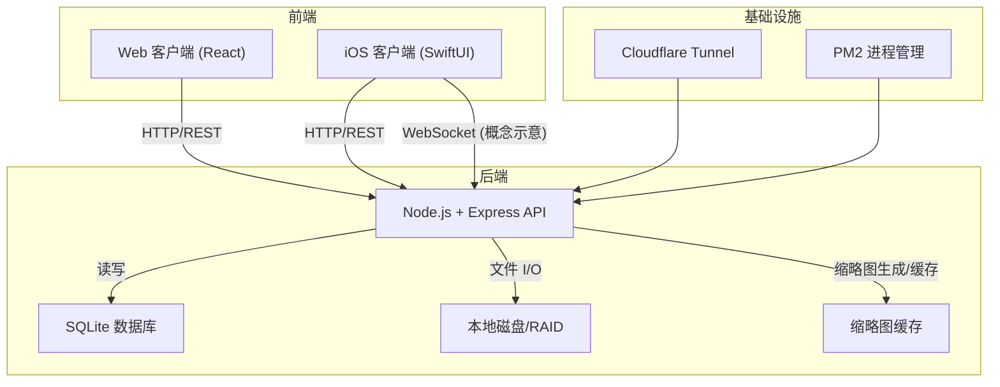
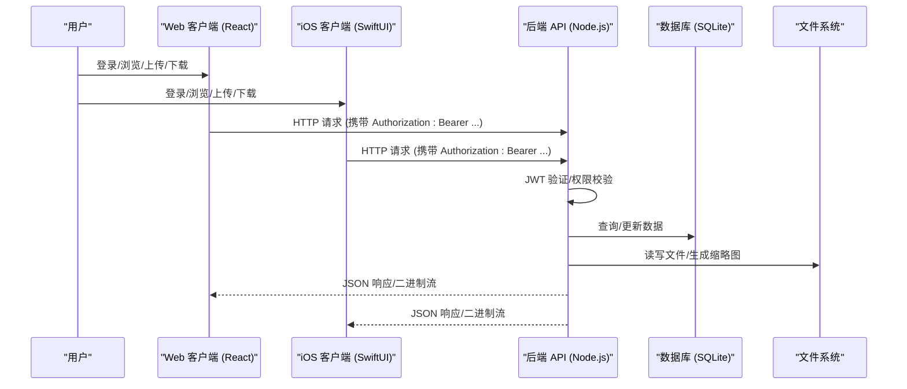
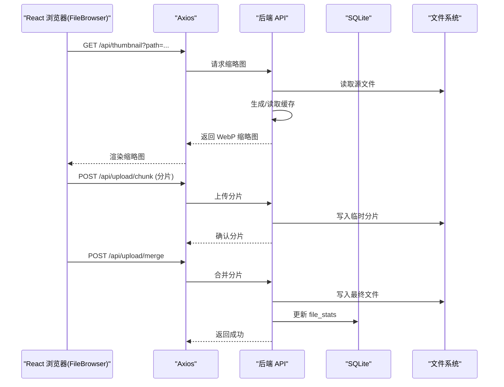
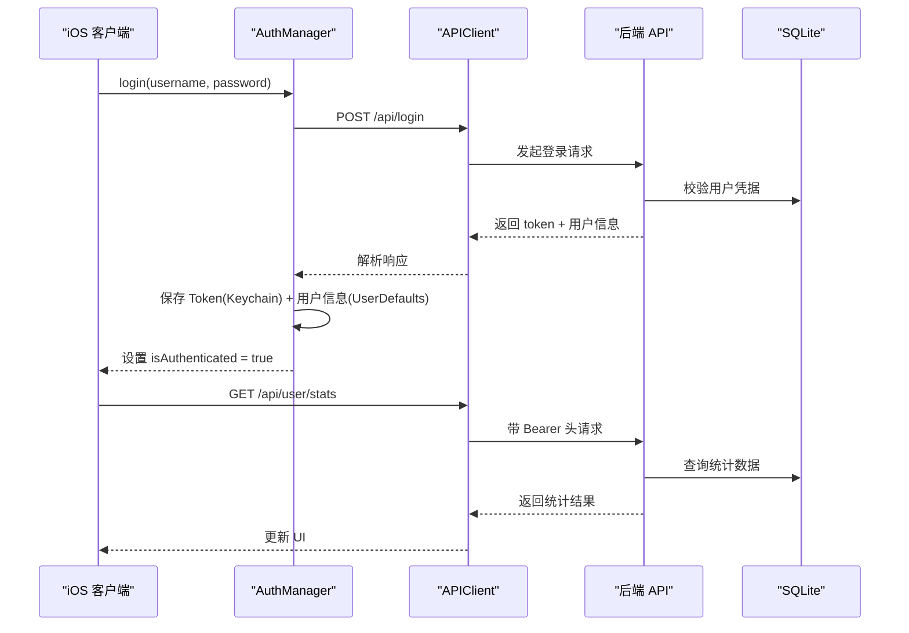
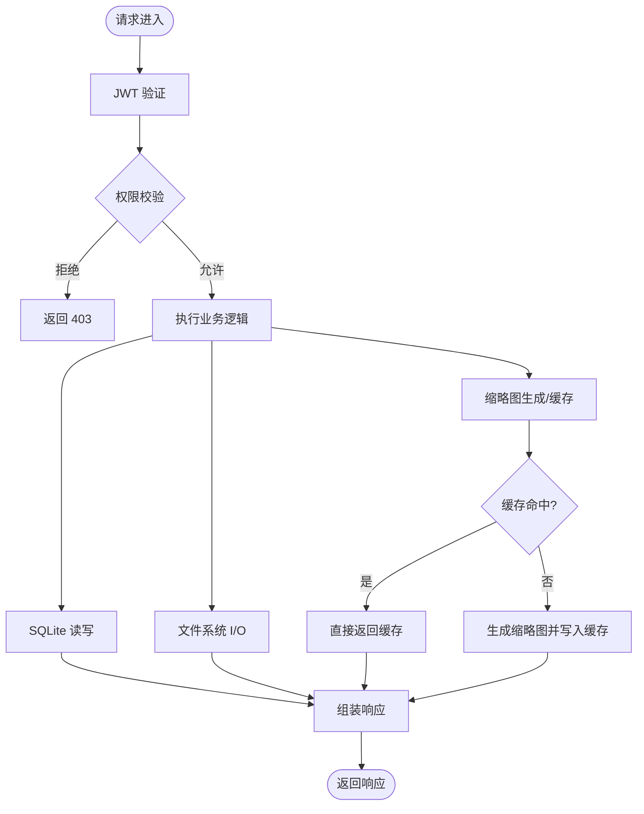
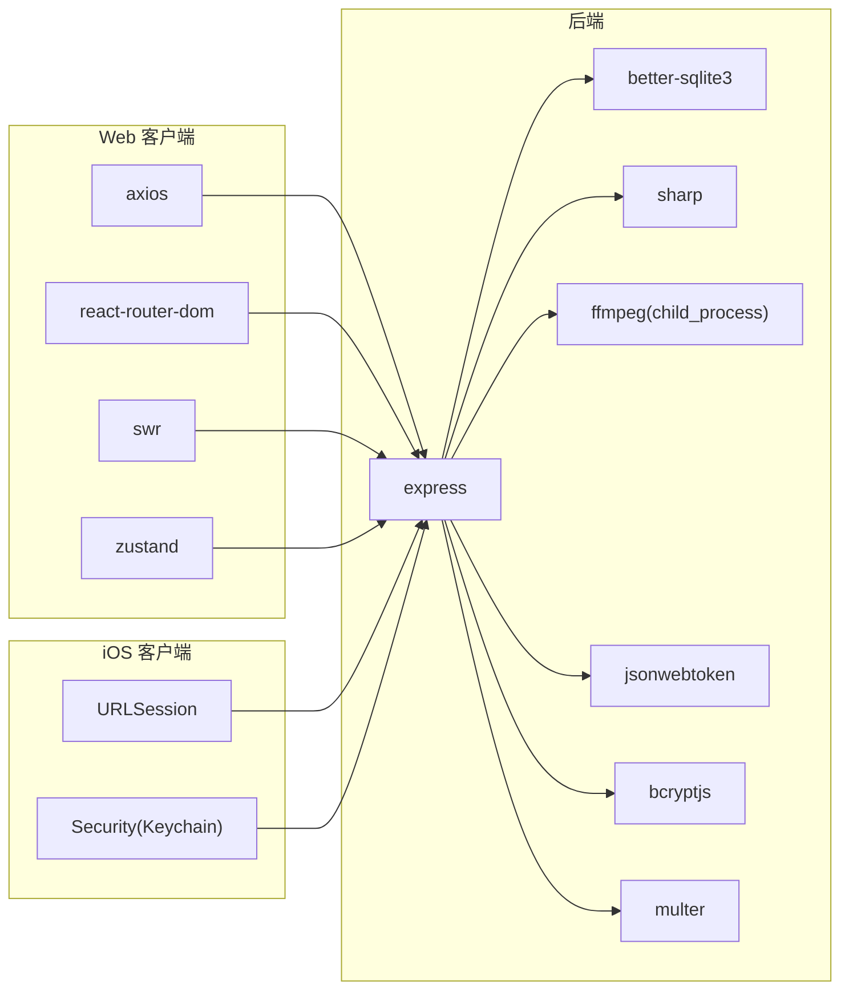

# 组件交互设计

<cite>
**本文引用的文件**
- [Longhorn.md](file://Longhorn.md)
- [SYSTEM_CONTEXT.md](file://docs/SYSTEM_CONTEXT.md)
- [OPS.md](file://docs/OPS.md)
- [server/index.js](file://server/index.js)
- [client/package.json](file://client/package.json)
- [client/src/App.tsx](file://client/src/App.tsx)
- [client/src/store/useAuthStore.ts](file://client/src/store/useAuthStore.ts)
- [client/src/components/FileBrowser.tsx](file://client/src/components/FileBrowser.tsx)
- [ios/LonghornApp/LonghornApp.swift](file://ios/LonghornApp/LonghornApp.swift)
- [ios/LonghornApp/Services/APIClient.swift](file://ios/LonghornApp/Services/APIClient.swift)
- [ios/LonghornApp/Services/AuthManager.swift](file://ios/LonghornApp/Services/AuthManager.swift)
</cite>

## 目录
1. [简介](#简介)
2. [项目结构](#项目结构)
3. [核心组件](#核心组件)
4. [架构总览](#架构总览)
5. [详细组件分析](#详细组件分析)
6. [依赖关系分析](#依赖关系分析)
7. [性能考量](#性能考量)
8. [故障排查指南](#故障排查指南)
9. [结论](#结论)
10. [附录](#附录)

## 简介
本文件面向 Longhorn 系统的前端组件、后端服务与移动端应用之间的交互设计，聚焦于 API 调用流程、事件传递机制、状态同步策略、错误处理与重试、超时控制、组件解耦与模块化设计、扩展性考虑，以及分布式场景下的协调、负载均衡与故障转移机制。Longhorn 由三部分组成：Web 客户端（React）、iOS 客户端（SwiftUI）与 Node.js 后端（Express），通过 HTTP/REST 与可选 WebSocket 进行通信，并以 SQLite 作为数据持久化层。

## 项目结构
Longhorn 采用“前后端分离 + 共享后端”的组织方式：
- Web 客户端：React + Vite，负责桌面端管理后台与文件浏览。
- iOS 客户端：SwiftUI + MVVM，负责移动端文件访问与离线体验。
- 后端服务：Node.js + Express，提供 REST API、JWT 认证、文件 I/O、权限校验、缩略图生成与缓存等。

图表来源
- [Longhorn.md](file://Longhorn.md#L49-L66)
- [SYSTEM_CONTEXT.md](file://docs/SYSTEM_CONTEXT.md#L22-L48)

章节来源
- [Longhorn.md](file://Longhorn.md#L1-L71)
- [SYSTEM_CONTEXT.md](file://docs/SYSTEM_CONTEXT.md#L1-L95)

## 核心组件
- Web 客户端（React）
  - 路由与布局：基于 React Router，提供侧边栏、顶部栏、内容区与全局提示/确认对话框。
  - 状态管理：使用 Zustand 管理认证态与本地存储；Axios 进行 HTTP 请求。
  - 关键页面：文件浏览器、搜索、收藏、最近、回收站、仪表盘、部门管理、管理员面板等。
- iOS 客户端（SwiftUI）
  - 应用入口：LonghornApp，注入认证与语言环境。
  - 网络层：APIClient 封装请求构建、鉴权头、超时、错误处理与下载/上传。
  - 认证：AuthManager 管理 Token 存取（Keychain）、用户信息持久化与会话恢复。
- 后端服务（Node.js + Express）
  - 身份认证：JWT 验证中间件，按用户角色与部门权限动态校验。
  - 文件处理：分片上传、合并、缩略图生成（sharp/ffmpeg）、HEIC 转 JPEG、缓存策略。
  - API 路由：登录、部门/用户管理、权限管理、搜索、收藏、最近、统计、缩略图、上传/下载等。
  - 数据库：SQLite（better-sqlite3），表含 users、departments、permissions、stars、file_stats 等。

章节来源
- [client/src/App.tsx](file://client/src/App.tsx#L1-L635)
- [client/src/store/useAuthStore.ts](file://client/src/store/useAuthStore.ts#L1-L31)
- [client/package.json](file://client/package.json#L1-L45)
- [ios/LonghornApp/LonghornApp.swift](file://ios/LonghornApp/LonghornApp.swift#L1-L26)
- [ios/LonghornApp/Services/APIClient.swift](file://ios/LonghornApp/Services/APIClient.swift#L1-L326)
- [ios/LonghornApp/Services/AuthManager.swift](file://ios/LonghornApp/Services/AuthManager.swift#L1-L195)
- [server/index.js](file://server/index.js#L1-L800)

## 架构总览
Longhorn 的系统交互遵循“前端发起请求 → 后端鉴权与业务处理 → 数据库/文件系统持久化 → 返回响应”的闭环。移动端与 Web 前端共享同一套 API，后端通过 JWT 令牌保障会话一致性。

图表来源
- [server/index.js](file://server/index.js#L267-L295)
- [ios/LonghornApp/Services/APIClient.swift](file://ios/LonghornApp/Services/APIClient.swift#L247-L315)
- [client/src/App.tsx](file://client/src/App.tsx#L135-L150)

## 详细组件分析

### Web 客户端组件交互
- 路由与布局
  - 主布局 MainLayout 包含侧边栏与内容区，根据用户角色显示不同菜单项。
  - 侧边栏通过 /api/user/accessible-departments 获取可访问部门，动态渲染部门导航。
- 状态与认证
  - 使用 Zustand 管理 token 与用户信息，登录成功后写入 localStorage 并更新全局状态。
- 文件浏览与操作
  - FileBrowser 使用 SWR Hook 获取文件列表，支持分页/排序/筛选/批量操作。
  - 上传采用分片上传（/api/upload/chunk + /api/upload/merge），并显示进度与速率。
  - 收藏、分享、最近、统计等均通过 Axios 调用后端 API。
- 预览与缓存
  - 图片缩略图通过 /api/thumbnail 生成并缓存；DOCX/XLSX 通过 /preview 预览。

图表来源
- [client/src/components/FileBrowser.tsx](file://client/src/components/FileBrowser.tsx#L340-L449)
- [server/index.js](file://server/index.js#L843-L932)
- [server/index.js](file://server/index.js#L481-L679)

章节来源
- [client/src/App.tsx](file://client/src/App.tsx#L1-L635)
- [client/src/store/useAuthStore.ts](file://client/src/store/useAuthStore.ts#L1-L31)
- [client/src/components/FileBrowser.tsx](file://client/src/components/FileBrowser.tsx#L1-L800)

### iOS 客户端组件交互
- 应用入口与环境
  - LonghornApp 注入 AuthManager 与语言管理器，设置深色主题偏好。
- 认证与会话
  - AuthManager 负责登录、登出、Token 持久化（Keychain）、会话恢复与 Token 校验。
- 网络层
  - APIClient 统一封装 GET/POST/DELETE/PUT，自动添加 Authorization 头，处理 401 与错误响应。
  - 支持文件下载（单文件/批量 ZIP）、上传（multipart/form-data）与超时控制。
- 业务流程
  - 登录成功后保存 Token 与用户信息；下载/上传/搜索/收藏等均通过 APIClient 调用后端。

图表来源
- [ios/LonghornApp/Services/AuthManager.swift](file://ios/LonghornApp/Services/AuthManager.swift#L44-L69)
- [ios/LonghornApp/Services/APIClient.swift](file://ios/LonghornApp/Services/APIClient.swift#L68-L80)
- [server/index.js](file://server/index.js#L683-L713)

章节来源
- [ios/LonghornApp/LonghornApp.swift](file://ios/LonghornApp/LonghornApp.swift#L1-L26)
- [ios/LonghornApp/Services/AuthManager.swift](file://ios/LonghornApp/Services/AuthManager.swift#L1-L195)
- [ios/LonghornApp/Services/APIClient.swift](file://ios/LonghornApp/Services/APIClient.swift#L1-L326)

### 后端服务与数据库交互
- 身份认证与权限
  - JWT 验证中间件加载用户信息并刷新最新角色/部门；hasPermission 根据角色、部门与扩展权限判断访问范围。
- 文件处理
  - 分片上传：接收分片写入 .chunks 目录，合并时顺序拼接并清理临时目录；更新 file_stats。
  - 缩略图：支持图片 sharp 与视频/HEIC ffmpeg 截帧；并发队列限制 CPU/IO；缓存目录命中优先。
- API 路由
  - 登录、部门/用户管理、权限管理、搜索、收藏、最近、统计、缩略图、上传/下载等。
- 数据库
  - better-sqlite3 WAL 模式；自动初始化表结构与词库种子数据；权限、收藏、文件统计等表支撑业务。

图表来源
- [server/index.js](file://server/index.js#L267-L295)
- [server/index.js](file://server/index.js#L300-L353)
- [server/index.js](file://server/index.js#L481-L679)
- [server/index.js](file://server/index.js#L843-L932)

章节来源
- [server/index.js](file://server/index.js#L1-L1599)

### API 调用流程与事件传递机制
- Web 端
  - 通过 axios 发起请求，自动附加 Authorization 头；对 401 统一触发登出与提示。
  - 文件操作采用分片上传与合并，上传进度通过 onUploadProgress 回调更新。
- iOS 端
  - APIClient 统一封装请求构建、超时、错误映射与 401 自动登出。
  - 下载/上传分别走 URLSession 的 data(for:) 与 download(for:)，支持进度回调与临时文件移动。
- 事件与状态同步
  - Web 端使用 SWR Hook 与本地状态联动，文件列表变更后主动刷新。
  - iOS 端通过 APIClient 的统一错误处理与 AuthManager 的会话恢复，保证状态一致性。

章节来源
- [client/src/components/FileBrowser.tsx](file://client/src/components/FileBrowser.tsx#L340-L449)
- [ios/LonghornApp/Services/APIClient.swift](file://ios/LonghornApp/Services/APIClient.swift#L112-L192)
- [ios/LonghornApp/Services/APIClient.swift](file://ios/LonghornApp/Services/APIClient.swift#L271-L315)

### 错误处理传播、超时控制与重试机制
- Web 端
  - 对 401 统一登出；对收藏/分享/删除等操作捕获错误并弹出 Toast。
  - 上传取消通过 AbortController 控制，避免悬挂请求。
- iOS 端
  - URLSession 超时配置：请求 30s，资源 120s；401 自动登出并清空缓存。
  - APIError 枚举统一错误类型，便于 UI 层展示友好文案。
- 后端
  - 上传/合并/缩略图生成均包含异常捕获与 5xx 错误返回；缩略图队列防止过载。

章节来源
- [client/src/components/FileBrowser.tsx](file://client/src/components/FileBrowser.tsx#L328-L338)
- [ios/LonghornApp/Services/APIClient.swift](file://ios/LonghornApp/Services/APIClient.swift#L56-L64)
- [ios/LonghornApp/Services/APIClient.swift](file://ios/LonghornApp/Services/APIClient.swift#L287-L301)
- [server/index.js](file://server/index.js#L555-L577)

### 组件解耦策略、模块化设计与扩展性
- Web 端
  - 路由与布局解耦：MainLayout 与各页面组件通过 Outlet 组合；权限控制集中在路由层。
  - 状态管理：Zustand 专注认证态，Axios 专注网络层，避免状态与网络耦合。
  - 文件浏览：FileBrowser 通过 Hook 抽象缓存与预取，降低复杂度。
- iOS 端
  - APIClient 与 AuthManager 分离职责；Model/Service 分层清晰。
  - Keychain 存储 Token，UserDefaults 存储用户信息，职责单一。
- 后端
  - 中间件化：JWT 验证、权限校验、静态资源服务、压缩/CORS 等按需组合。
  - 模块化路由：文件、权限、统计、搜索等按功能拆分，易于扩展。

章节来源
- [client/src/App.tsx](file://client/src/App.tsx#L38-L126)
- [client/src/store/useAuthStore.ts](file://client/src/store/useAuthStore.ts#L1-L31)
- [ios/LonghornApp/Services/APIClient.swift](file://ios/LonghornApp/Services/APIClient.swift#L1-L326)
- [ios/LonghornApp/Services/AuthManager.swift](file://ios/LonghornApp/Services/AuthManager.swift#L1-L195)
- [server/index.js](file://server/index.js#L1-L120)

### 分布式系统中的组件协调、负载均衡与故障转移
- 网络穿透与高可用
  - Cloudflare Tunnel 提供公网访问与 TLS 终止，后端通过 PM2 管理进程。
- 服务发现与容错
  - 建议在生产环境引入反向代理/负载均衡器，后端以无状态 API 形式对外暴露。
- 故障转移
  - 通过 PM2 与 Cloudflare Tunnel 的健康检查与自动重启机制，提升可用性。
- 移动端离线与弱网
  - iOS 采用本地缓存（缩略图/预览/下载缓存目录），在网络恢复后同步状态。

章节来源
- [OPS.md](file://docs/OPS.md#L100-L120)
- [OPS.md](file://docs/OPS.md#L122-L158)
- [SYSTEM_CONTEXT.md](file://docs/SYSTEM_CONTEXT.md#L7-L21)

## 依赖关系分析
- 前端依赖
  - Web：React、Axios、React Router、SWR、Zustand、TailwindCSS 等。
  - iOS：Foundation、URLSession、JSON 解析、Keychain（Security）。
- 后端依赖
  - Express、better-sqlite3、multer、sharp、fluent-ffmpeg（通过 child_process 调用）、bcryptjs、jsonwebtoken、compression、cors 等。

图表来源
- [client/package.json](file://client/package.json#L12-L29)
- [ios/LonghornApp/Services/APIClient.swift](file://ios/LonghornApp/Services/APIClient.swift#L56-L64)
- [server/index.js](file://server/index.js#L1-L14)

章节来源
- [client/package.json](file://client/package.json#L1-L45)
- [server/index.js](file://server/index.js#L1-L30)

## 性能考量
- 缩略图生成与缓存
  - 采用 WebP 缓存与并发队列限制，避免 CPU/IO 过载；支持预览模式与尺寸参数。
- 上传优化
  - 分片上传 + 合并，支持断点续传与进度反馈；服务端对缓存文件进行有效性校验与清理。
- 前端缓存与预取
  - FileBrowser 对可见子目录进行预取，提升导航体验；SWR 提供缓存与再验证。
- 移动端缓存
  - 下载文件移动到缓存目录，减少临时文件影响；缩略图与预览缓存复用。

章节来源
- [server/index.js](file://server/index.js#L481-L679)
- [client/src/components/FileBrowser.tsx](file://client/src/components/FileBrowser.tsx#L184-L190)
- [ios/LonghornApp/Services/APIClient.swift](file://ios/LonghornApp/Services/APIClient.swift#L112-L192)

## 故障排查指南
- 常见问题
  - 侧边栏部门重复：数据库脏数据导致，需清理旧中文名部门记录。
  - iOS 预览黑屏：确保使用 item: $binding 触发 fullScreenCover。
  - M1 GPU 限制：ffmpeg 主要依赖 CPU，大量并发视频处理可能导致卡顿。
- 运维命令
  - 查看日志：pm2 logs longhorn / pm2 logs longhorn-watcher
  - 健康检查：./health-check.sh
  - 数据库备份：cp server/longhorn.db server/longhorn_backup.db

章节来源
- [SYSTEM_CONTEXT.md](file://docs/SYSTEM_CONTEXT.md#L74-L78)
- [OPS.md](file://docs/OPS.md#L89-L96)

## 结论
Longhorn 通过清晰的前后端分层与共享后端，实现了 Web 与 iOS 的一致体验。后端以 JWT 与细粒度权限为核心，结合分片上传、缩略图缓存与 SQLite 数据持久化，满足企业级本地数据协作需求。建议在生产环境中引入负载均衡与健康检查，进一步增强可用性与扩展性。

## 附录
- 快速开始
  - Web：cd client && npm run dev（端口 3001）
  - 后端：cd server && npm run dev（端口 4000）
- 系统全景图与技术栈说明参见 SYSTEM_CONTEXT.md
- 运维与部署手册参见 OPS.md

章节来源
- [Longhorn.md](file://Longhorn.md#L20-L37)
- [SYSTEM_CONTEXT.md](file://docs/SYSTEM_CONTEXT.md#L22-L48)
- [OPS.md](file://docs/OPS.md#L7-L41)