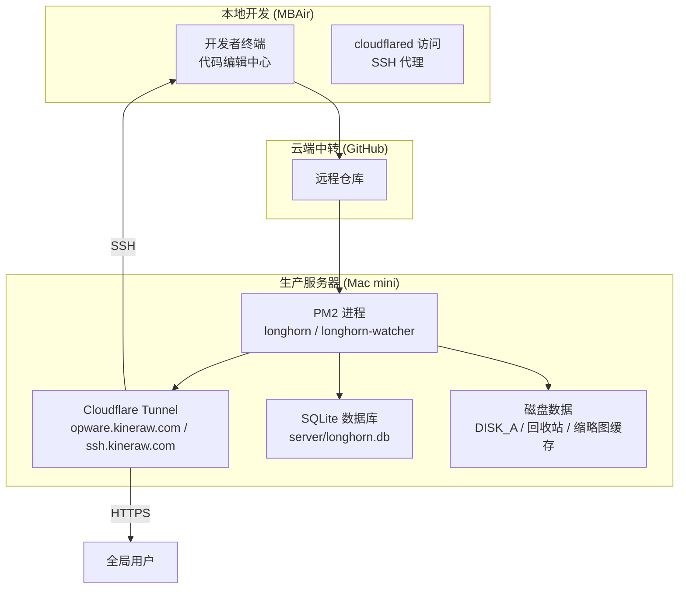
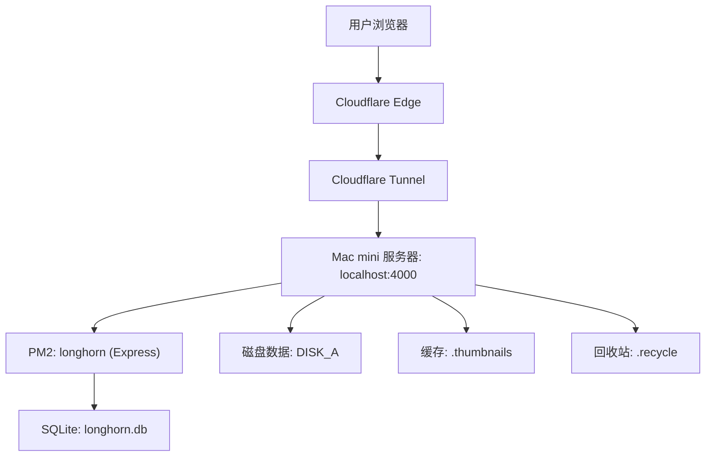
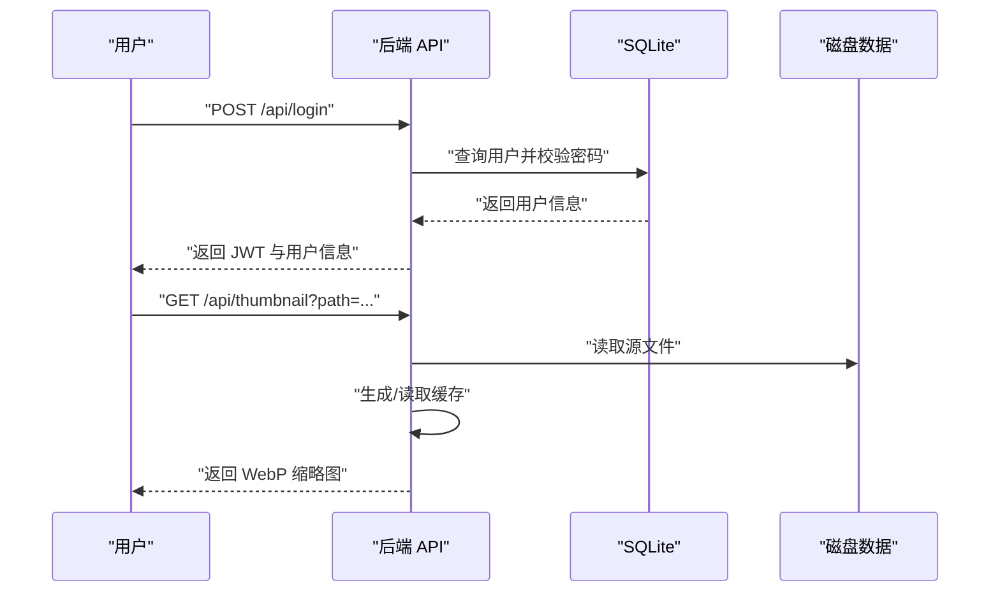
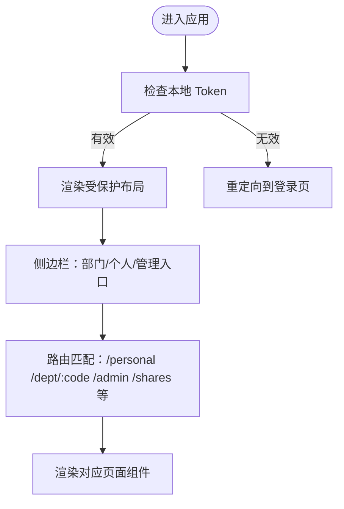
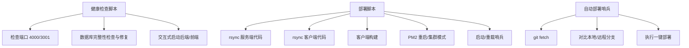
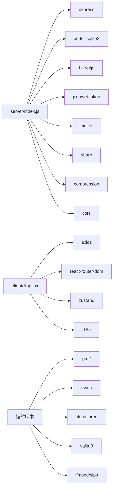
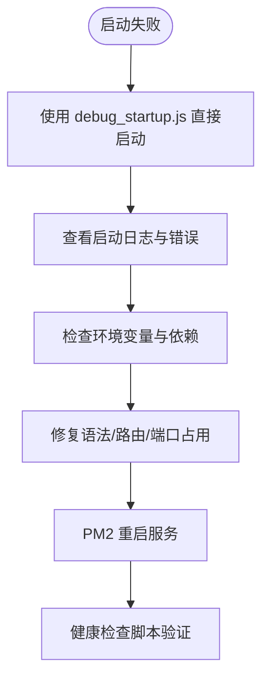

# 故障排除与恢复

<cite>
**本文引用的文件**
- [OPS.md](file://docs/OPS.md)
- [FULL_DEPLOYMENT_RECAP.md](file://docs/FULL_DEPLOYMENT_RECAP.md)
- [health-check.sh](file://scripts/health-check.sh)
- [diagnose-performance.sh](file://scripts/diagnose-performance.sh)
- [db-validate.sh](file://scripts/db-validate.sh)
- [deploy.sh](file://scripts/deploy.sh)
- [deploy-watch.sh](file://scripts/deploy-watch.sh)
- [index.js](file://server/index.js)
- [package.json](file://server/package.json)
- [debug_startup.js](file://server/debug_startup.js)
- [fix_remote_db.js](file://server/fix_remote_db.js)
- [App.tsx](file://client/src/App.tsx)
- [package.json](file://client/package.json)
</cite>

## 目录
1. [简介](#简介)
2. [项目结构](#项目结构)
3. [核心组件](#核心组件)
4. [架构总览](#架构总览)
5. [详细组件分析](#详细组件分析)
6. [依赖关系分析](#依赖关系分析)
7. [性能考量](#性能考量)
8. [故障排除指南](#故障排除指南)
9. [结论](#结论)
10. [附录](#附录)

## 简介
本指南面向 Longhorn 项目的运维与开发人员，聚焦于系统启动失败、连接超时、权限错误等常见问题的诊断与修复；同时覆盖数据恢复、系统回滚与灾难恢复策略，提供日志分析技巧、性能瓶颈识别与资源泄漏检测方法，并给出应急响应流程、问题升级机制与事后总结报告模板。

## 项目结构
Longhorn 采用前后端分离架构：前端基于 React/Vite，后端基于 Node.js/Express，数据存储为 SQLite（better-sqlite3）。部署通过 PM2 管理，Cloudflare Tunnel 提供公网访问与 SSH 管理通道；Mac mini 作为生产服务器，MBAir 为唯一代码源，配合自动化哨兵脚本实现无人值守更新。

**图表来源**
- [FULL_DEPLOYMENT_RECAP.md](file://docs/FULL_DEPLOYMENT_RECAP.md#L4-L36)
- [OPS.md](file://docs/OPS.md#L100-L111)

**章节来源**
- [FULL_DEPLOYMENT_RECAP.md](file://docs/FULL_DEPLOYMENT_RECAP.md#L1-L144)
- [OPS.md](file://docs/OPS.md#L1-L171)

## 核心组件
- 后端服务（Node.js/Express）：提供 API、鉴权、缩略图生成、权限校验、回收站、数据库初始化与自动播种。
- 前端应用（React/Vite）：路由、侧边栏、登录态、国际化、用户统计与分享集合页。
- 运维脚本：健康检查、性能诊断、数据库验证、部署与自动部署哨兵。
- 部署与自启动：PM2 进程管理、Cloudflare Tunnel、开机自启动配置。

**章节来源**
- [index.js](file://server/index.js#L1-L120)
- [App.tsx](file://client/src/App.tsx#L1-L126)
- [health-check.sh](file://scripts/health-check.sh#L1-L115)
- [diagnose-performance.sh](file://scripts/diagnose-performance.sh#L1-L122)
- [deploy-watch.sh](file://scripts/deploy-watch.sh#L1-L34)

## 架构总览
系统通过 Cloudflare Tunnel 将本地 4000 端口映射为 HTTPS 服务，SSH 通道用于远程运维。PM2 管理主服务与自动部署哨兵，确保 7×24 小时不掉线。数据库为本地 SQLite 文件，缩略图缓存与回收站目录位于服务工作目录。

**图表来源**
- [OPS.md](file://docs/OPS.md#L100-L111)
- [index.js](file://server/index.js#L16-L22)

**章节来源**
- [OPS.md](file://docs/OPS.md#L100-L158)

## 详细组件分析

### 后端服务（Node.js/Express）
- 配置与初始化：端口、数据库路径、磁盘根目录、JWT 密钥、压缩与 CORS 中间件、全局日志中间件。
- 路由与接口：
  - 健康检查与状态接口
  - 登录鉴权与权限校验
  - 缩略图生成与缓存（含队列与并发控制）
  - 回收站移动与清理
  - 词汇批量接口（优化更新）
- 数据库：自动播种、表结构校验与修复、WAL 模式。
- 调试与启动：直接启动脚本捕获 stdout/stderr，便于定位启动错误。

**图表来源**
- [index.js](file://server/index.js#L684-L713)
- [index.js](file://server/index.js#L483-L679)

**章节来源**
- [index.js](file://server/index.js#L16-L120)
- [index.js](file://server/index.js#L483-L679)
- [index.js](file://server/index.js#L684-L713)
- [index.js](file://server/index.js#L758-L790)
- [debug_startup.js](file://server/debug_startup.js#L1-L35)

### 前端应用（React/Vite）
- 路由与布局：登录保护、侧边栏、个人空间、部门空间、管理员与部门管理入口。
- 鉴权与国际化：Bearer Token 注入、多语言切换、部门列表动态获取。
- 组件职责：文件浏览、搜索、收藏、回收站、分享集合页、顶部统计卡片。

**图表来源**
- [App.tsx](file://client/src/App.tsx#L66-L126)

**章节来源**
- [App.tsx](file://client/src/App.tsx#L1-L126)

### 运维脚本与自动化
- 健康检查：检查后端/前端端口、数据库完整性、必要列缺失自动修复、失败时可交互启动。
- 性能诊断：PM2 列表、本地 API 响应时间、数据库统计、图片大小分布、Cloudflare Tunnel 状态、网络连通性、系统资源、Node/npm 版本。
- 数据库验证：按表逐列核对并自动补齐缺失列。
- 部署与自动部署：rsync 同步、客户端构建、服务重启/集群模式、PM2 保存、哨兵监控远程仓库差异并自动触发部署。

**图表来源**
- [health-check.sh](file://scripts/health-check.sh#L82-L115)
- [diagnose-performance.sh](file://scripts/diagnose-performance.sh#L16-L115)
- [db-validate.sh](file://scripts/db-validate.sh#L16-L47)
- [deploy.sh](file://scripts/deploy.sh#L12-L68)
- [deploy-watch.sh](file://scripts/deploy-watch.sh#L8-L33)

**章节来源**
- [health-check.sh](file://scripts/health-check.sh#L1-L115)
- [diagnose-performance.sh](file://scripts/diagnose-performance.sh#L1-L122)
- [db-validate.sh](file://scripts/db-validate.sh#L1-L52)
- [deploy.sh](file://scripts/deploy.sh#L1-L68)
- [deploy-watch.sh](file://scripts/deploy-watch.sh#L1-L34)

## 依赖关系分析
- 后端依赖：Express、better-sqlite3、bcryptjs、jsonwebtoken、multer、sharp、compression、cors、fs-extra、archiver。
- 前端依赖：React、react-router-dom、axios、i18n、zustand、lucide-react 等。
- 运维依赖：PM2、rsync、curl、sqlite3、ffmpeg/sips（缩略图）、cloudflared。

**图表来源**
- [package.json](file://server/package.json#L15-L28)
- [package.json](file://client/package.json#L12-L29)

**章节来源**
- [package.json](file://server/package.json#L1-L30)
- [package.json](file://client/package.json#L1-L45)

## 性能考量
- 缩略图生成与缓存：支持并发队列限制、缓存命中、原子写入与过期控制，减少 CPU/IO 压力。
- 压缩与 CORS：启用 gzip 压缩与跨域支持，提升传输效率与兼容性。
- 数据库：WAL 模式、索引与查询优化、批量接口降低往返。
- 系统资源：通过性能诊断脚本收集内存、磁盘、网络与 Node 版本信息，辅助定位瓶颈。

**章节来源**
- [index.js](file://server/index.js#L418-L427)
- [index.js](file://server/index.js#L555-L577)
- [index.js](file://server/index.js#L517-L551)
- [diagnose-performance.sh](file://scripts/diagnose-performance.sh#L92-L107)

## 故障排除指南

### 一、启动失败
- 现象：服务启动后立即退出或端口未监听。
- 诊断步骤：
  - 使用直接启动脚本捕获 stdout/stderr，定位崩溃位置与错误堆栈。
  - 检查环境变量（如 DISK_A、JWT_SECRET）是否正确。
  - 使用健康检查脚本确认端口占用与数据库可用性。
- 修复建议：
  - 修复语法错误与路由遮蔽问题（如缺失闭合括号、端口被僵尸进程占用）。
  - 确认数据库文件存在且可读写，必要时重建或迁移。
  - 使用 PM2 以集群模式启动，确保零停机与自动重启。

**图表来源**
- [debug_startup.js](file://server/debug_startup.js#L1-L35)
- [health-check.sh](file://scripts/health-check.sh#L13-L22)
- [OPS.md](file://docs/OPS.md#L122-L158)

**章节来源**
- [debug_startup.js](file://server/debug_startup.js#L1-L35)
- [health-check.sh](file://scripts/health-check.sh#L1-L115)
- [OPS.md](file://docs/OPS.md#L122-L158)

### 二、连接超时与网络异常
- 现象：公网无法访问、SSH 无法连接、API 响应慢。
- 诊断步骤：
  - 检查 Cloudflare Tunnel 服务状态与 DNS 记录冲突。
  - 使用性能诊断脚本测试本地 API 响应时间与网络连通性。
  - 验证 PM2 进程状态与端口占用。
- 修复建议：
  - 清理冲突 DNS 记录，重新添加隧道主机名。
  - 优化防火墙与网络策略，确保 4000/22 端口可达。
  - 使用哨兵脚本确保自动部署与服务自愈。

**章节来源**
- [OPS.md](file://docs/OPS.md#L112-L118)
- [diagnose-performance.sh](file://scripts/diagnose-performance.sh#L84-L89)
- [deploy-watch.sh](file://scripts/deploy-watch.sh#L8-L33)

### 三、权限错误与路径解析问题
- 现象：用户无法访问特定目录、中文路径显示异常、权限判定失败。
- 诊断步骤：
  - 使用调试接口获取当前用户、部门与权限判定结果。
  - 检查路径规范化与部门代码映射（中文名到代码）。
  - 核对权限表与扩展权限记录的有效期与范围。
- 修复建议：
  - 修正部门代码映射与路径解析逻辑，确保 NFC 正规化。
  - 清理过期权限记录，补充缺失列（如 last_login）。
  - 为用户初始化个人空间目录。

**章节来源**
- [index.js](file://server/index.js#L267-L295)
- [index.js](file://server/index.js#L300-L353)
- [index.js](file://server/index.js#L758-L790)
- [db-validate.sh](file://scripts/db-validate.sh#L16-L47)

### 四、缩略图生成失败与缓存异常
- 现象：缩略图 404、生成耗时长、缓存损坏。
- 诊断步骤：
  - 检查源文件是否存在与可读。
  - 查看缩略图缓存目录与临时文件，确认缓存键与过期策略。
  - 检查 ffmpeg/sips 是否可用，日志文件是否记录错误。
- 修复建议：
  - 清理空缓存文件，重建缓存。
  - 调整并发队列上限，增加超时与重试。
  - 优先使用系统自带工具（如 sips）处理 HEIC，回退到 ffmpeg。

**章节来源**
- [index.js](file://server/index.js#L555-L577)
- [index.js](file://server/index.js#L585-L626)
- [index.js](file://server/index.js#L517-L551)

### 五、数据库异常与结构不一致
- 现象：字段缺失、表结构不一致、种子数据未填充。
- 诊断步骤：
  - 使用数据库验证脚本逐表核对列。
  - 检查自动播种逻辑与种子文件是否存在。
  - 通过修复脚本清理冗余部门记录并修正名称。
- 修复建议：
  - 自动补齐缺失列并初始化默认值。
  - 手动执行修复脚本清理脏数据，确认部门 ID 与名称一致性。
  - 定期备份数据库文件，保留时间戳版本。

**章节来源**
- [db-validate.sh](file://scripts/db-validate.sh#L16-L47)
- [index.js](file://server/index.js#L80-L111)
- [fix_remote_db.js](file://server/fix_remote_db.js#L1-L38)

### 六、性能瓶颈与资源泄漏
- 现象：CPU 占用高、内存增长、缩略图生成卡顿。
- 诊断步骤：
  - 使用性能诊断脚本收集 PM2、内存、磁盘、网络与 Node 版本。
  - 分析图片文件大小分布，定位大文件影响。
  - 检查缩略图队列与缓存策略。
- 修复建议：
  - 限制并发生成数量，启用缓存与过期控制。
  - 优化查询与索引，避免全表扫描。
  - 定期清理缓存与临时文件，监控磁盘空间。

**章节来源**
- [diagnose-performance.sh](file://scripts/diagnose-performance.sh#L16-L115)
- [index.js](file://server/index.js#L555-L577)

### 七、数据恢复与系统回滚
- 数据恢复：
  - 优先使用备份文件进行恢复，确认时间戳与完整性。
  - 若数据库损坏，尝试使用 WAL/SHM 文件清理后重建。
- 系统回滚：
  - 通过 Git 远程仓库回退到稳定版本，哨兵脚本自动部署。
  - 使用 PM2 保存的任务列表快速恢复进程。
- 灾难恢复：
  - 重新安装 Cloudflare Tunnel 服务，清理残留配置。
  - 重新配置开机自启动与 PM2 启动项，验证服务自启。

**章节来源**
- [OPS.md](file://docs/OPS.md#L122-L158)
- [deploy-watch.sh](file://scripts/deploy-watch.sh#L16-L29)
- [FULL_DEPLOYMENT_RECAP.md](file://docs/FULL_DEPLOYMENT_RECAP.md#L125-L134)

### 八、应急响应流程
- 第一响应人：
  - 立即使用健康检查脚本与性能诊断脚本收集现场信息。
  - 通过 PM2 日志与启动日志定位问题根因。
- 升级机制：
  - 若涉及网络/隧道问题，通知平台团队核查 Cloudflare 状态。
  - 若涉及数据库/权限问题，通知数据管理员与开发人员协同处理。
- 事后总结：
  - 填写事后总结报告模板，记录问题根因、处置过程、改进措施与预防策略。

**章节来源**
- [health-check.sh](file://scripts/health-check.sh#L82-L115)
- [diagnose-performance.sh](file://scripts/diagnose-performance.sh#L16-L115)
- [OPS.md](file://docs/OPS.md#L112-L118)

### 九、事后总结报告模板
- 事件概要：时间、地点、影响范围、受影响用户数。
- 根因分析：技术根因、环境因素、人为因素。
- 处置过程：发现、评估、处置、验证、恢复。
- 影响评估：业务中断时长、数据损失、用户体验影响。
- 改进措施：短期修复、长期优化、流程改进、培训计划。
- 预防策略：监控告警、演练计划、文档完善、自动化加固。

[本节为模板说明，不直接分析具体文件]

## 结论
Longhorn 通过清晰的前后端分离、完善的运维脚本与自动化部署机制，提供了可靠的线上服务能力。针对启动失败、连接超时、权限错误、性能瓶颈与数据库异常等常见问题，建议以健康检查与性能诊断为起点，结合日志与脚本工具快速定位并修复；同时完善备份与回滚策略，确保在突发情况下能够迅速恢复服务。

## 附录
- 常用命令速查：
  - 服务状态：pm2 list、pm2 logs longhorn、pm2 logs longhorn-watcher
  - 健康检查：./health-check.sh
  - 性能诊断：./diagnose-performance.sh
  - 数据库验证：./db-validate.sh
  - 部署：npm run deploy（在服务器项目根目录）
  - 自动部署：./scripts/deploy-watch.sh（后台守护）

**章节来源**
- [OPS.md](file://docs/OPS.md#L67-L96)
- [deploy.sh](file://scripts/deploy.sh#L37-L68)