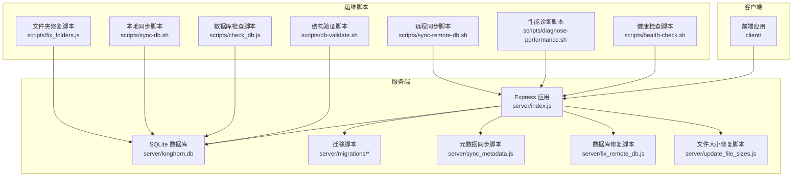
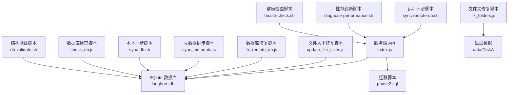
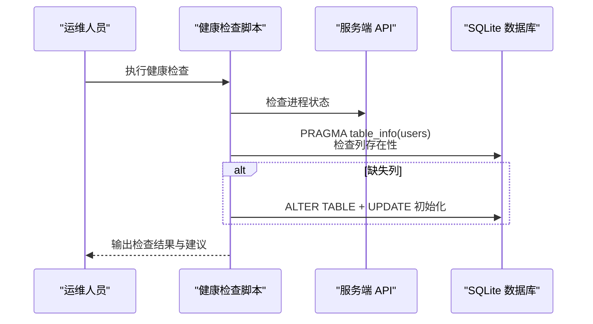
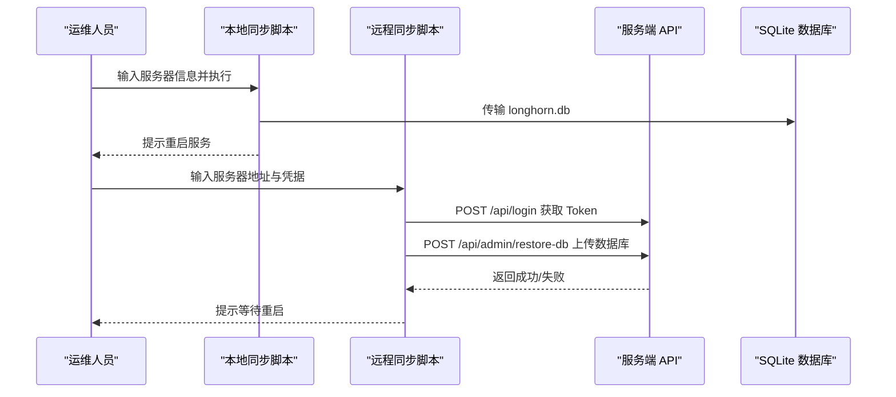
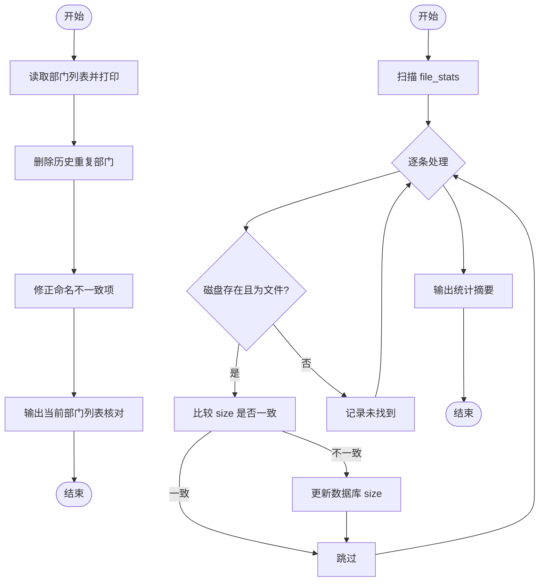
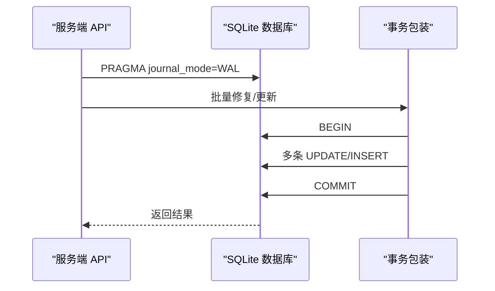
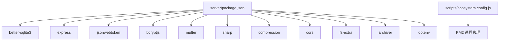

# 数据库维护

<cite>
**本文引用的文件**
- [scripts/check_db.js](file://scripts/check_db.js)
- [scripts/db-validate.sh](file://scripts/db-validate.sh)
- [scripts/health-check.sh](file://scripts/health-check.sh)
- [scripts/diagnose-performance.sh](file://scripts/diagnose-performance.sh)
- [scripts/sync-db.sh](file://scripts/sync-db.sh)
- [scripts/sync-remote-db.sh](file://scripts/sync-remote-db.sh)
- [scripts/fix_folders.js](file://scripts/fix_folders.js)
- [server/fix_remote_db.js](file://server/fix_remote_db.js)
- [server/update_file_sizes.js](file://server/update_file_sizes.js)
- [server/sync_metadata.js](file://server/sync_metadata.js)
- [server/index.js](file://server/index.js)
- [server/package.json](file://server/package.json)
- [scripts/ecosystem.config.js](file://scripts/ecosystem.config.js)
- [server/migrations/phase2.sql](file://server/migrations/phase2.sql)
</cite>

## 目录
1. [简介](#简介)
2. [项目结构](#项目结构)
3. [核心组件](#核心组件)
4. [架构总览](#架构总览)
5. [详细组件分析](#详细组件分析)
6. [依赖关系分析](#依赖关系分析)
7. [性能考量](#性能考量)
8. [故障排查指南](#故障排查指南)
9. [结论](#结论)
10. [附录](#附录)

## 简介
本操作手册面向 Longhorn 数据库维护与运维工程师，系统化阐述数据库健康检查、完整性验证、性能诊断、数据同步与恢复、并发控制与锁定、索引与存储优化、监控与预防性维护等内容。文档结合仓库中现有的脚本与服务端实现，提供可落地的操作步骤与可视化图示，帮助快速定位问题并执行修复。

## 项目结构
Longhorn 采用前后端分离架构，数据库位于服务端目录，通过 Node.js + better-sqlite3 访问 SQLite 文件；同时提供多类运维脚本用于健康检查、性能诊断、数据库同步与修复。

图表来源
- [server/index.js](file://server/index.js#L1-L120)
- [scripts/health-check.sh](file://scripts/health-check.sh#L1-L115)
- [scripts/db-validate.sh](file://scripts/db-validate.sh#L1-L52)
- [scripts/check_db.js](file://scripts/check_db.js#L1-L20)
- [scripts/diagnose-performance.sh](file://scripts/diagnose-performance.sh#L1-L122)
- [scripts/sync-db.sh](file://scripts/sync-db.sh#L1-L28)
- [scripts/sync-remote-db.sh](file://scripts/sync-remote-db.sh#L1-L54)
- [server/sync_metadata.js](file://server/sync_metadata.js#L1-L85)
- [server/fix_remote_db.js](file://server/fix_remote_db.js#L1-L39)
- [server/update_file_sizes.js](file://server/update_file_sizes.js#L1-L51)

章节来源
- [server/index.js](file://server/index.js#L1-L120)
- [scripts/health-check.sh](file://scripts/health-check.sh#L1-L115)
- [scripts/db-validate.sh](file://scripts/db-validate.sh#L1-L52)
- [scripts/check_db.js](file://scripts/check_db.js#L1-L20)
- [scripts/diagnose-performance.sh](file://scripts/diagnose-performance.sh#L1-L122)
- [scripts/sync-db.sh](file://scripts/sync-db.sh#L1-L28)
- [scripts/sync-remote-db.sh](file://scripts/sync-remote-db.sh#L1-L54)
- [server/sync_metadata.js](file://server/sync_metadata.js#L1-L85)
- [server/fix_remote_db.js](file://server/fix_remote_db.js#L1-L39)
- [server/update_file_sizes.js](file://server/update_file_sizes.js#L1-L51)

## 核心组件
- 数据库与表结构：服务端初始化时创建部门、用户、权限、星标、分享链接等表，并启用 WAL 模式提升并发读写能力。
- 迁移与索引：迁移脚本定义了星标与分享链接表及常用索引，便于查询加速。
- 元数据同步：提供从磁盘扫描到数据库的 Upsert 流程，清洗路径并回填上传者与访问计数。
- 修复脚本：针对部门名称与重复项进行清理与修正，保证组织结构一致性。
- 文件大小修复：遍历 file_stats 并与磁盘实际文件大小比对，更新不一致项。
- 运维脚本：健康检查、结构验证、性能诊断、本地/远程数据库同步、文件夹修复等。

章节来源
- [server/index.js](file://server/index.js#L28-L78)
- [server/migrations/phase2.sql](file://server/migrations/phase2.sql#L1-L32)
- [server/sync_metadata.js](file://server/sync_metadata.js#L1-L85)
- [server/fix_remote_db.js](file://server/fix_remote_db.js#L1-L39)
- [server/update_file_sizes.js](file://server/update_file_sizes.js#L1-L51)
- [scripts/health-check.sh](file://scripts/health-check.sh#L1-L115)
- [scripts/db-validate.sh](file://scripts/db-validate.sh#L1-L52)
- [scripts/diagnose-performance.sh](file://scripts/diagnose-performance.sh#L1-L122)
- [scripts/sync-db.sh](file://scripts/sync-db.sh#L1-L28)
- [scripts/sync-remote-db.sh](file://scripts/sync-remote-db.sh#L1-L54)
- [scripts/fix_folders.js](file://scripts/fix_folders.js#L1-L62)

## 架构总览
下图展示数据库维护相关组件之间的交互关系与调用链路。

图表来源
- [scripts/health-check.sh](file://scripts/health-check.sh#L1-L115)
- [scripts/db-validate.sh](file://scripts/db-validate.sh#L1-L52)
- [scripts/check_db.js](file://scripts/check_db.js#L1-L20)
- [scripts/diagnose-performance.sh](file://scripts/diagnose-performance.sh#L1-L122)
- [scripts/sync-db.sh](file://scripts/sync-db.sh#L1-L28)
- [scripts/sync-remote-db.sh](file://scripts/sync-remote-db.sh#L1-L54)
- [server/sync_metadata.js](file://server/sync_metadata.js#L1-L85)
- [server/fix_remote_db.js](file://server/fix_remote_db.js#L1-L39)
- [server/update_file_sizes.js](file://server/update_file_sizes.js#L1-L51)
- [server/index.js](file://server/index.js#L1-L120)
- [server/migrations/phase2.sql](file://server/migrations/phase2.sql#L1-L32)

## 详细组件分析

### 数据库健康检查与完整性验证
- 健康检查脚本会检测后端/前端进程、数据库列是否存在并自动修复缺失列，必要时启动服务。
- 结构验证脚本对指定表进行列存在性检查，缺失列按预设规则自动添加与初始化。
- 数据库检查脚本直接打开数据库并读取关键表，辅助人工核验。

图表来源
- [scripts/health-check.sh](file://scripts/health-check.sh#L1-L115)
- [scripts/db-validate.sh](file://scripts/db-validate.sh#L1-L52)
- [scripts/check_db.js](file://scripts/check_db.js#L1-L20)

章节来源
- [scripts/health-check.sh](file://scripts/health-check.sh#L1-L115)
- [scripts/db-validate.sh](file://scripts/db-validate.sh#L1-L52)
- [scripts/check_db.js](file://scripts/check_db.js#L1-L20)

### 数据同步策略与备份恢复流程
- 本地同步：通过 scp 将本地修复后的数据库文件覆盖到远端服务器，随后重启服务使变更生效。
- 远程同步（隧道）：通过 HTTP 接口进行认证后上传数据库文件，服务端接收并触发重启。
- 元数据同步：从磁盘扫描文件，清洗路径，回填上传者与访问计数，避免路径漂移与统计偏差。

图表来源
- [scripts/sync-db.sh](file://scripts/sync-db.sh#L1-L28)
- [scripts/sync-remote-db.sh](file://scripts/sync-remote-db.sh#L1-L54)
- [server/index.js](file://server/index.js#L1-L120)

章节来源
- [scripts/sync-db.sh](file://scripts/sync-db.sh#L1-L28)
- [scripts/sync-remote-db.sh](file://scripts/sync-remote-db.sh#L1-L54)
- [server/index.js](file://server/index.js#L1-L120)

### 数据修复与一致性维护
- 部门修复：删除历史重复部门条目，修正命名不一致项，最终输出当前部门列表供核对。
- 文件大小修复：遍历 file_stats，对比磁盘实际大小，更新不一致项并统计汇总。
- 路径修复：统一 NFC 规范、去除多余前缀、规范化斜杠与结尾，避免路径差异导致的数据不一致。

图表来源
- [server/fix_remote_db.js](file://server/fix_remote_db.js#L1-L39)
- [server/update_file_sizes.js](file://server/update_file_sizes.js#L1-L51)
- [server/sync_metadata.js](file://server/sync_metadata.js#L1-L85)

章节来源
- [server/fix_remote_db.js](file://server/fix_remote_db.js#L1-L39)
- [server/update_file_sizes.js](file://server/update_file_sizes.js#L1-L51)
- [server/sync_metadata.js](file://server/sync_metadata.js#L1-L85)

### 并发控制与锁定机制
- WAL 模式：服务端初始化时设置 journal_mode=WAL，提升并发读取与写入吞吐，降低锁竞争。
- 事务封装：元数据同步脚本对批量更新使用事务包裹，确保一致性与原子性。
- 读写分离：WAL 模式允许读写并发，但需注意长事务可能导致 WAL 文件增长，应定期执行 VACUUM 或在维护窗口执行。

图表来源
- [server/index.js](file://server/index.js#L28-L31)
- [server/sync_metadata.js](file://server/sync_metadata.js#L18-L22)

章节来源
- [server/index.js](file://server/index.js#L28-L31)
- [server/sync_metadata.js](file://server/sync_metadata.js#L18-L22)

### 索引优化与存储空间管理
- 索引：迁移脚本为星标与分享链接表建立常用查询索引，提升检索效率。
- 存储：性能诊断脚本输出数据库文件大小、表记录数与磁盘使用情况，辅助容量规划。
- 清理：回收站与访问日志在删除路径时同步清理，减少冗余数据膨胀。

章节来源
- [server/migrations/phase2.sql](file://server/migrations/phase2.sql#L27-L32)
- [scripts/diagnose-performance.sh](file://scripts/diagnose-performance.sh#L33-L61)
- [server/index.js](file://server/index.js#L369-L389)

### 监控指标与预防性维护
- 进程与服务：PM2 进程状态、端口监听状态、本地 API 响应时间。
- 数据库规模：表记录数、数据库文件大小、图片文件 Top 分布。
- 网络与系统：Cloudflare Tunnel 状态、ping 通断、内存与磁盘使用。
- 预防性维护：定期执行健康检查与结构验证、WAL 增长监控、索引与统计信息维护。

章节来源
- [scripts/diagnose-performance.sh](file://scripts/diagnose-performance.sh#L1-L122)
- [scripts/health-check.sh](file://scripts/health-check.sh#L1-L115)
- [scripts/ecosystem.config.js](file://scripts/ecosystem.config.js#L1-L41)

## 依赖关系分析
- 服务端依赖 better-sqlite3 访问 SQLite，配合 WAL 模式与事务提升并发与一致性。
- 运维脚本依赖 shell 与 sqlite3 命令行工具，部分脚本通过 curl 与 Node 能力实现远程同步与修复。
- 生态系统配置使用 PM2 管理进程，具备自动重启与日志聚合能力。

图表来源
- [server/package.json](file://server/package.json#L15-L28)
- [scripts/ecosystem.config.js](file://scripts/ecosystem.config.js#L1-L41)

章节来源
- [server/package.json](file://server/package.json#L15-L28)
- [scripts/ecosystem.config.js](file://scripts/ecosystem.config.js#L1-L41)

## 性能考量
- 使用 WAL 模式提升并发读写，避免独占锁阻塞。
- 对热点查询建立索引（如星标、分享链接），并定期评估查询计划。
- 控制缩略图并发生成数量，避免 CPU/IO 过载。
- 在维护窗口执行大规模修复与同步，减少对在线业务的影响。
- 关注数据库文件大小与 WAL 文件增长，必要时进行 VACUUM 或归档。

## 故障排查指南
- 健康检查失败：确认后端/前端进程状态，若缺失则按提示启动；检查数据库列是否存在，必要时运行结构验证脚本。
- 性能异常：运行性能诊断脚本收集 PM2、API 响应、数据库规模、磁盘与内存信息，定位瓶颈。
- 数据不同步：优先执行元数据同步脚本，确保路径清洗与上传者回填；如仍异常，使用本地或远程同步脚本覆盖数据库。
- 权限与路径问题：使用调试接口输出当前用户、部门与权限校验结果，核对路径解析逻辑。
- 文件大小不一致：运行文件大小修复脚本，核对统计摘要并确认修复结果。

章节来源
- [scripts/health-check.sh](file://scripts/health-check.sh#L1-L115)
- [scripts/diagnose-performance.sh](file://scripts/diagnose-performance.sh#L1-L122)
- [server/index.js](file://server/index.js#L758-L790)
- [server/sync_metadata.js](file://server/sync_metadata.js#L1-L85)
- [server/update_file_sizes.js](file://server/update_file_sizes.js#L1-L51)

## 结论
通过健康检查、结构验证、性能诊断与同步修复脚本的协同，Longhorn 的数据库维护工作可以标准化、自动化地执行。结合 WAL 模式、事务封装与索引优化，可在保障一致性的同时提升并发性能。建议将上述流程纳入日常巡检与变更流程，形成可追溯的预防性维护体系。

## 附录
- 常用命令与入口
  - 启动服务：PM2 管理的应用名为 longhorn，工作目录为 server。
  - 数据库路径：server/longhorn.db。
  - 迁移脚本：server/migrations/phase2.sql。
  - 运维脚本：scripts/health-check.sh、scripts/db-validate.sh、scripts/diagnose-performance.sh、scripts/sync-db.sh、scripts/sync-remote-db.sh、scripts/check_db.js、scripts/fix_folders.js。
  - 修复脚本：server/fix_remote_db.js、server/update_file_sizes.js、server/sync_metadata.js。
- 最佳实践
  - 变更前先备份数据库文件。
  - 在维护窗口执行大规模修复与同步。
  - 定期监控 WAL 文件大小与数据库文件大小，防止异常增长。
  - 对高频查询建立并维护索引，定期评估查询计划。