# 数据迁移脚本

<cite>
**本文档引用的文件**
- [scripts/migrate_dealers.js](file://scripts/migrate_dealers.js)
- [scripts/migrate_dealers_v2.js](file://scripts/migrate_dealers_v2.js)
- [migrate.js](file://migrate.js)
- [server/scripts/migrate_ticket_product_family.js](file://server/scripts/migrate_ticket_product_family.js)
- [server/scripts/migrate_ai.js](file://server/scripts/migrate_ai.js)
- [server/migrations/015_extend_products_installed_base.js](file://server/migrations/015_extend_products_installed_base.js)
- [server/migrations/016_add_product_models.sql](file://server/migrations/016_add_product_models.sql)
- [server/migrations/017_add_product_status.sql](file://server/migrations/017_add_product_status.sql)
- [server/migrations/018_add_op_repair_report_type.sql](file://server/migrations/018_add_op_repair_report_type.sql)
- [server/migrations/015_extend_products_installed_base.sql](file://server/migrations/015_extend_products_installed_base.sql)
- [server/migrations/migrate_to_accounts.sql](file://server/migrations/migrate_to_accounts.sql)
- [server/migrations/upgrade_parts_pricing.js](file://server/migrations/upgrade_parts_pricing.js)
- [server/migrations/remove_parts_prices.js](file://server/migrations/remove_parts_prices.js)
</cite>

## 目录
1. [简介](#简介)
2. [项目结构](#项目结构)
3. [核心组件](#核心组件)
4. [架构概览](#架构概览)
5. [详细组件分析](#详细组件分析)
6. [依赖关系分析](#依赖关系分析)
7. [性能考虑](#性能考虑)
8. [故障排除指南](#故障排除指南)
9. [结论](#结论)

## 简介

Longhorn项目包含一个完整的数据迁移脚本系统，专门用于处理数据库结构升级、数据转换和架构演进。该系统涵盖了从经销商数据迁移、产品模型管理到配件定价系统的全面数据迁移解决方案。

这些迁移脚本采用多种策略来确保数据完整性、向后兼容性和操作安全性，包括事务处理、外键约束管理、视图重建和索引维护等高级技术。

## 项目结构

Longhorn项目的数据迁移脚本分布在两个主要目录中：

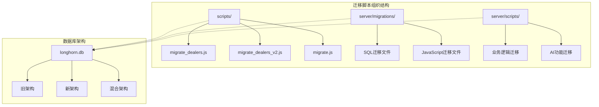

**图表来源**
- [scripts/migrate_dealers.js:1-88](file://scripts/migrate_dealers.js#L1-L88)
- [scripts/migrate_dealers_v2.js:1-235](file://scripts/migrate_dealers_v2.js#L1-L235)

**章节来源**
- [scripts/migrate_dealers.js:1-88](file://scripts/migrate_dealers.js#L1-L88)
- [scripts/migrate_dealers_v2.js:1-235](file://scripts/migrate_dealers_v2.js#L1-L235)
- [migrate.js:1-26](file://migrate.js#L1-L26)

## 核心组件

### 经销商数据迁移系统

Longhorn项目实现了两代经销商数据迁移系统，从简单的数据复制到复杂的架构重构：

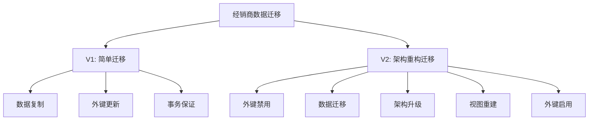

**图表来源**
- [scripts/migrate_dealers.js:7-85](file://scripts/migrate_dealers.js#L7-L85)
- [scripts/migrate_dealers_v2.js:7-232](file://scripts/migrate_dealers_v2.js#L7-L232)

### 产品管理系统迁移

产品管理系统的迁移涵盖了多个层面的数据结构升级：

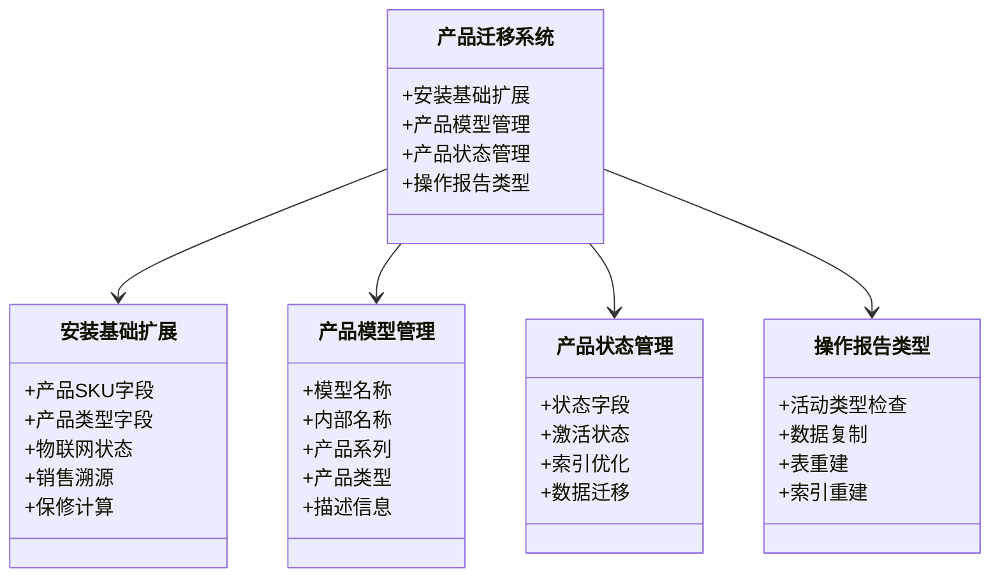

**图表来源**
- [server/migrations/015_extend_products_installed_base.js:18-193](file://server/migrations/015_extend_products_installed_base.js#L18-L193)
- [server/migrations/016_add_product_models.sql:1-31](file://server/migrations/016_add_product_models.sql#L1-L31)
- [server/migrations/017_add_product_status.sql:1-17](file://server/migrations/017_add_product_status.sql#L1-L17)
- [server/migrations/018_add_op_repair_report_type.sql:1-56](file://server/migrations/018_add_op_repair_report_type.sql#L1-L56)

**章节来源**
- [server/migrations/015_extend_products_installed_base.js:18-193](file://server/migrations/015_extend_products_installed_base.js#L18-L193)
- [server/migrations/016_add_product_models.sql:1-31](file://server/migrations/016_add_product_models.sql#L1-L31)
- [server/migrations/017_add_product_status.sql:1-17](file://server/migrations/017_add_product_status.sql#L1-L17)
- [server/migrations/018_add_op_repair_report_type.sql:1-56](file://server/migrations/018_add_op_repair_report_type.sql#L1-L56)

## 架构概览

### 迁移系统整体架构

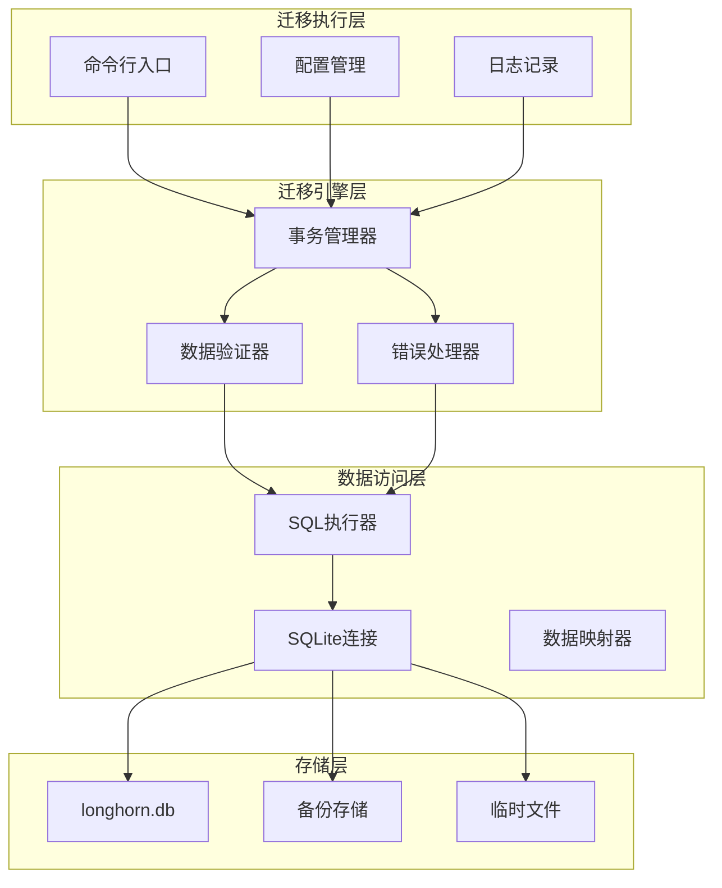

**图表来源**
- [scripts/migrate_dealers.js:1-88](file://scripts/migrate_dealers.js#L1-L88)
- [server/migrations/015_extend_products_installed_base.js:18-193](file://server/migrations/015_extend_products_installed_base.js#L18-L193)

### 数据迁移流程

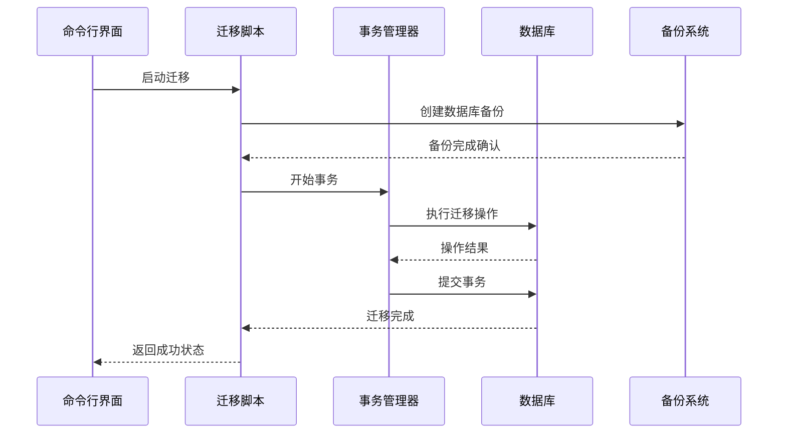

**图表来源**
- [scripts/migrate_dealers_v2.js:32-223](file://scripts/migrate_dealers_v2.js#L32-L223)
- [server/migrations/015_extend_products_installed_base.js:24-192](file://server/migrations/015_extend_products_installed_base.js#L24-L192)

## 详细组件分析

### 经销商迁移组件

#### V1版本迁移流程

V1版本的经销商迁移采用了直接的数据复制方式，确保数据完整性和操作简单性：

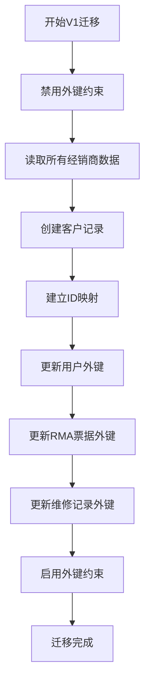

**图表来源**
- [scripts/migrate_dealers.js:7-85](file://scripts/migrate_dealers.js#L7-L85)

#### V2版本架构迁移

V2版本实现了完全的架构重构，包括表结构变更和外键关系调整：

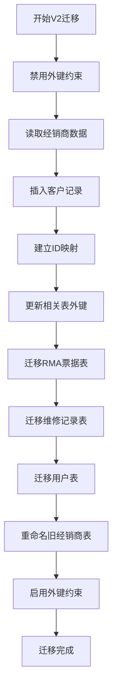

**图表来源**
- [scripts/migrate_dealers_v2.js:7-232](file://scripts/migrate_dealers_v2.js#L7-L232)

**章节来源**
- [scripts/migrate_dealers.js:7-85](file://scripts/migrate_dealers.js#L7-L85)
- [scripts/migrate_dealers_v2.js:7-232](file://scripts/migrate_dealers_v2.js#L7-L232)

### 产品数据迁移组件

#### 安装基础扩展迁移

安装基础扩展迁移是产品管理系统的核心升级，涉及多个数据字段的添加和计算：

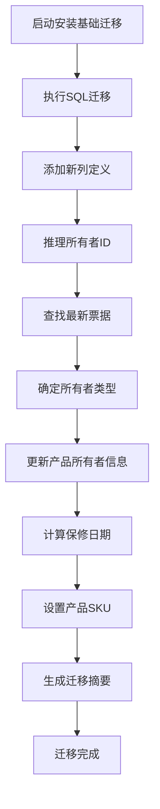

**图表来源**
- [server/migrations/015_extend_products_installed_base.js:18-193](file://server/migrations/015_extend_products_installed_base.js#L18-L193)

#### 产品模型管理迁移

产品模型管理迁移建立了新的产品分类体系：

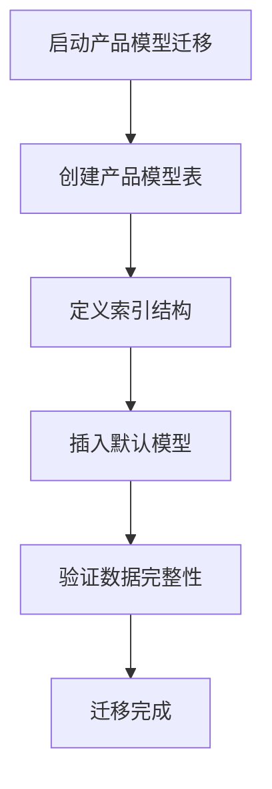

**图表来源**
- [server/migrations/016_add_product_models.sql:1-31](file://server/migrations/016_add_product_models.sql#L1-L31)

**章节来源**
- [server/migrations/015_extend_products_installed_base.js:18-193](file://server/migrations/015_extend_products_installed_base.js#L18-L193)
- [server/migrations/016_add_product_models.sql:1-31](file://server/migrations/016_add_product_models.sql#L1-L31)

### 配件系统迁移组件

#### 配件定价系统升级

配件定价系统的升级实现了价格数据的分离和标准化：

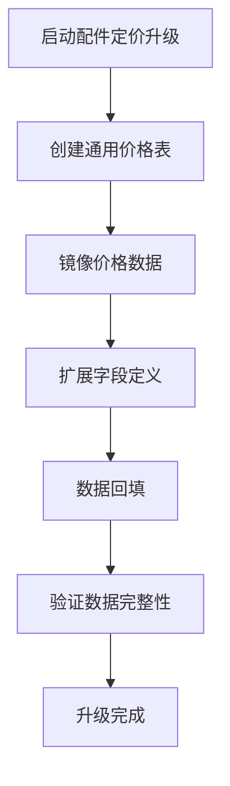

**图表来源**
- [server/migrations/upgrade_parts_pricing.js:15-84](file://server/migrations/upgrade_parts_pricing.js#L15-L84)

#### 破坏性价格字段移除

破坏性迁移展示了如何安全地移除不再需要的数据库字段：

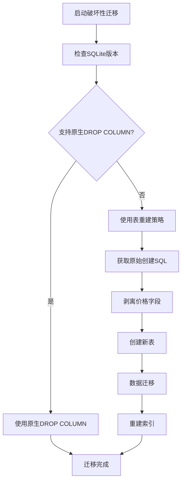

**图表来源**
- [server/migrations/remove_parts_prices.js:14-82](file://server/migrations/remove_parts_prices.js#L14-L82)

**章节来源**
- [server/migrations/upgrade_parts_pricing.js:15-84](file://server/migrations/upgrade_parts_pricing.js#L15-L84)
- [server/migrations/remove_parts_prices.js:14-82](file://server/migrations/remove_parts_prices.js#L14-L82)

### AI功能迁移组件

AI功能迁移脚本负责创建AI使用日志表，支持AI功能的监控和分析：

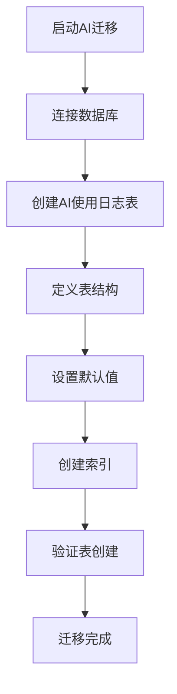

**图表来源**
- [server/scripts/migrate_ai.js:7-19](file://server/scripts/migrate_ai.js#L7-L19)

**章节来源**
- [server/scripts/migrate_ai.js:7-19](file://server/scripts/migrate_ai.js#L7-L19)

## 依赖关系分析

### 迁移脚本依赖图

```mermaid
graph TB
subgraph "外部依赖"
A superior-sqlite3
B path模块
C fs模块
D better-sqlite3
end
subgraph "内部组件"
E 迁移引擎
F 数据验证器
G 错误处理器
H 日志系统
I 配置管理
end
subgraph "数据库对象"
J 事务管理
K 表结构
L 视图定义
M 索引管理
end
A --> E
B --> E
C --> E
D --> E
E --> F
E --> G
E --> H
E --> I
F --> J
G --> J
H --> J
I --> J
J --> K
J --> L
J --> M
```

**图表来源**
- [scripts/migrate_dealers.js:1-5](file://scripts/migrate_dealers.js#L1-L5)
- [server/migrations/015_extend_products_installed_base.js:11-16](file://server/migrations/015_extend_products_installed_base.js#L11-L16)

### 数据流依赖关系

```mermaid
flowchart LR
subgraph "数据源"
A 原始经销商数据
B 原始产品数据
C 原始配件数据
end
subgraph "迁移管道"
D 数据提取
E 数据转换
F 数据加载
end
subgraph "目标存储"
G 新客户数据
H 升级产品数据
I 标准化配件数据
end
A --> D
B --> D
C --> D
D --> E
E --> F
F --> G
F --> H
F --> I
```

**图表来源**
- [scripts/migrate_dealers.js:10-55](file://scripts/migrate_dealers.js#L10-L55)
- [server/migrations/015_extend_products_installed_base.js:43-176](file://server/migrations/015_extend_products_installed_base.js#L43-L176)

**章节来源**
- [scripts/migrate_dealers.js:1-88](file://scripts/migrate_dealers.js#L1-L88)
- [server/migrations/015_extend_products_installed_base.js:18-193](file://server/migrations/015_extend_products_installed_base.js#L18-L193)

## 性能考虑

### 迁移性能优化策略

Longhorn项目的迁移脚本采用了多种性能优化策略：

1. **批量操作**: 使用事务包装所有迁移操作，减少数据库往返次数
2. **索引优化**: 在迁移前禁用索引，在迁移后重建，提高批量插入性能
3. **内存管理**: 对于大数据集，采用分批处理策略避免内存溢出
4. **并发控制**: 通过外键约束管理和表锁定策略确保数据一致性

### 内存使用模式

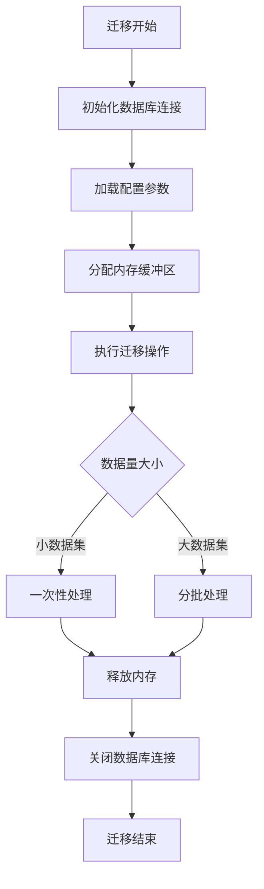

## 故障排除指南

### 常见迁移问题及解决方案

#### 外键约束冲突

当遇到外键约束冲突时，可以按照以下步骤解决：

1. **检查当前状态**: 查看哪些外键约束导致了冲突
2. **临时禁用约束**: 在迁移过程中暂时禁用外键检查
3. **数据验证**: 确保所有相关表的数据完整性
4. **重新启用约束**: 迁移完成后重新启用外键约束

#### 数据类型不匹配

当出现数据类型不匹配错误时：

1. **检查字段定义**: 确认源表和目标表的字段定义
2. **数据转换**: 实现必要的数据类型转换逻辑
3. **默认值设置**: 为缺失的数据提供合理的默认值

#### 内存不足问题

对于大型数据集迁移：

1. **分批处理**: 将大数据集分割成更小的批次
2. **内存监控**: 实时监控内存使用情况
3. **垃圾回收**: 手动触发垃圾回收机制

**章节来源**
- [scripts/migrate_dealers_v2.js:10-12](file://scripts/migrate_dealers_v2.js#L10-L12)
- [server/migrations/remove_parts_prices.js:21-32](file://server/migrations/remove_parts_prices.js#L21-L32)

## 结论

Longhorn项目的数据迁移脚本系统展现了现代数据库迁移的最佳实践，具有以下特点：

1. **完整性保证**: 所有迁移操作都在事务中执行，确保数据一致性
2. **向后兼容**: 迁移策略设计考虑了向后兼容性，支持渐进式升级
3. **安全性**: 实现了多重安全措施，包括数据备份、验证和回滚机制
4. **可维护性**: 清晰的代码结构和详细的日志记录，便于维护和调试

这些迁移脚本不仅解决了当前的数据迁移需求，还为未来的系统演进奠定了坚实的基础。通过模块化的架构设计和完善的错误处理机制，确保了数据迁移过程的可靠性和可预测性。