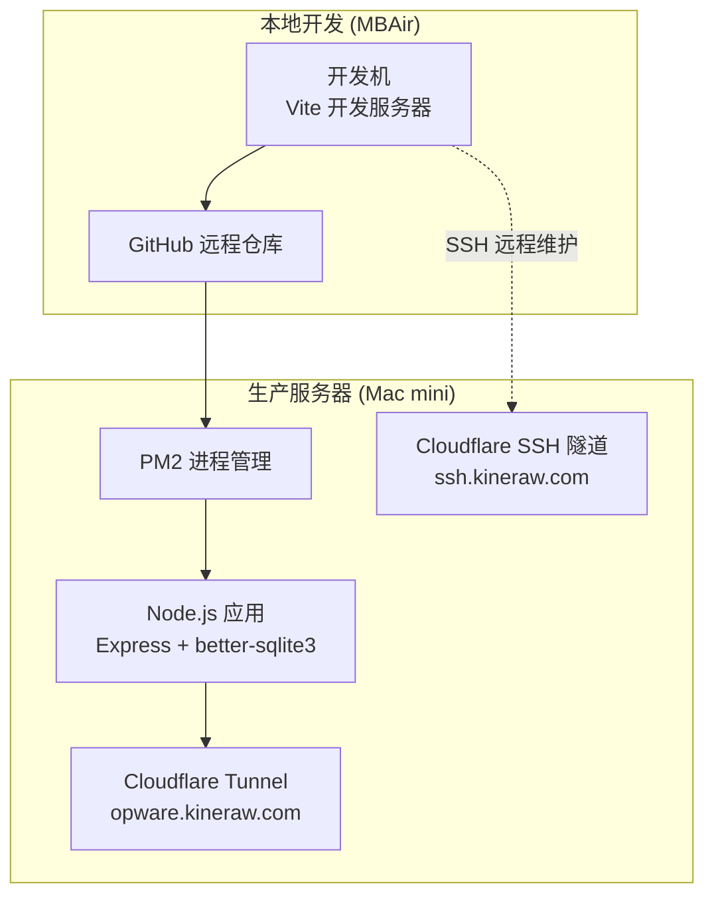
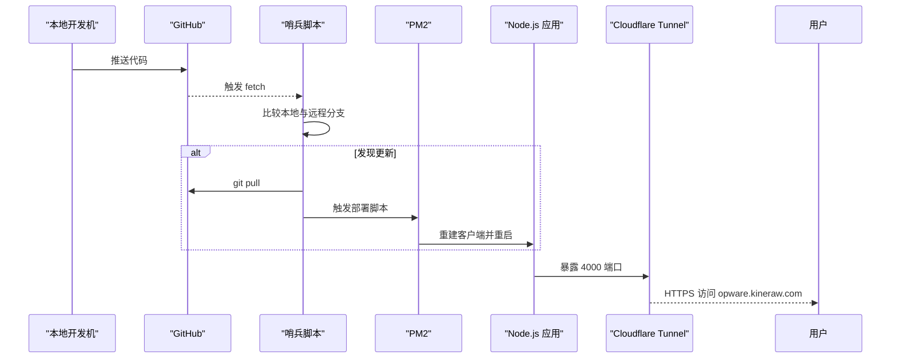
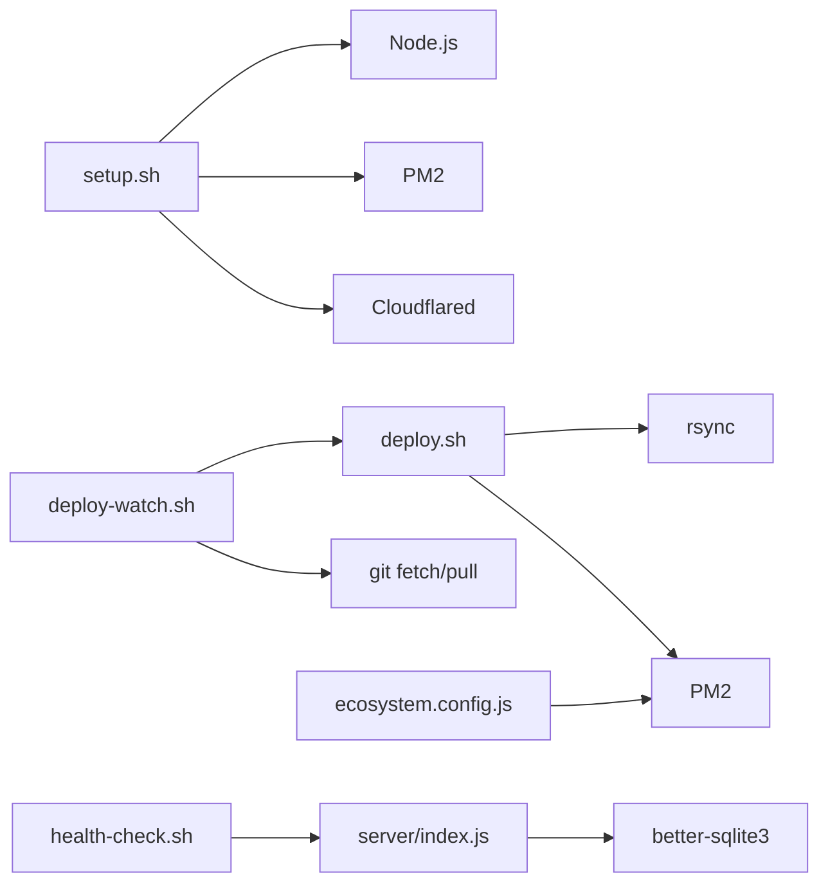

# 环境搭建

<cite>
**本文引用的文件**
- [scripts/setup.sh](file://scripts/setup.sh)
- [scripts/deploy.sh](file://scripts/deploy.sh)
- [scripts/deploy-watch.sh](file://scripts/deploy-watch.sh)
- [scripts/update.sh](file://scripts/update.sh)
- [scripts/health-check.sh](file://scripts/health-check.sh)
- [scripts/ssh-mini.sh](file://scripts/ssh-mini.sh)
- [scripts/ecosystem.config.js](file://scripts/ecosystem.config.js)
- [server/package.json](file://server/package.json)
- [client/package.json](file://client/package.json)
- [server/index.js](file://server/index.js)
- [docs/QUICK_DEPLOY.md](file://docs/QUICK_DEPLOY.md)
- [docs/FULL_DEPLOYMENT_RECAP.md](file://docs/FULL_DEPLOYMENT_RECAP.md)
- [docs/OPS.md](file://docs/OPS.md)
- [client/.env.production](file://client/.env.production)
</cite>

## 目录
1. [简介](#简介)
2. [项目结构](#项目结构)
3. [核心组件](#核心组件)
4. [架构总览](#架构总览)
5. [详细组件分析](#详细组件分析)
6. [依赖关系分析](#依赖关系分析)
7. [性能考虑](#性能考虑)
8. [故障排除指南](#故障排除指南)
9. [结论](#结论)
10. [附录](#附录)

## 简介
本指南面向开发与生产环境，提供 Longhorn 的系统要求、依赖安装与配置步骤，涵盖 Node.js、PM2、SQLite 等核心依赖；详述 SSH 连接与远程服务器配置、网络环境准备；给出环境变量与目录权限建议、安全加固要点；并提供不同操作系统下的安装脚本使用方法与常见问题解决方案。

## 项目结构
Longhorn 采用前后端分离架构：
- 前端：Vite + React，构建产物由后端 Express 提供静态资源。
- 后端：Node.js + Express，使用 better-sqlite3 作为内置数据库，配合 PM2 进程管理。
- 部署与运维：通过 rsync 同步代码，PM2 管理进程，Cloudflare Tunnel 提供公网访问与 SSH 代理。

图表来源
- [docs/FULL_DEPLOYMENT_RECAP.md](file://docs/FULL_DEPLOYMENT_RECAP.md#L4-L36)
- [docs/OPS.md](file://docs/OPS.md#L100-L120)

章节来源
- [docs/FULL_DEPLOYMENT_RECAP.md](file://docs/FULL_DEPLOYMENT_RECAP.md#L1-L144)
- [docs/OPS.md](file://docs/OPS.md#L1-L171)

## 核心组件
- Node.js 与包管理：后端使用 Node.js，PM2 用于进程守护与零停机更新；客户端使用 Vite 构建。
- better-sqlite3：内置数据库，持久化用户、权限、词汇表等数据。
- PM2 配置：集群模式、优雅重启、日志合并、自动重启策略。
- Cloudflare Tunnel：提供 HTTPS 与 SSH 隧道，无需公网 IP。
- 自动化部署：哨兵脚本定时检测远程仓库变化并触发部署。

章节来源
- [server/package.json](file://server/package.json#L15-L28)
- [client/package.json](file://client/package.json#L6-L11)
- [scripts/ecosystem.config.js](file://scripts/ecosystem.config.js#L1-L41)
- [server/index.js](file://server/index.js#L1-L120)
- [docs/OPS.md](file://docs/OPS.md#L100-L120)

## 架构总览
系统采用“本地开发 → GitHub 中转 → 服务器自动部署”的流水线，结合 Cloudflare Tunnel 提供公网访问与 SSH 代理，形成安全、稳定的远程运维与访问能力。

图表来源
- [scripts/deploy-watch.sh](file://scripts/deploy-watch.sh#L8-L33)
- [scripts/deploy.sh](file://scripts/deploy.sh#L37-L67)
- [docs/OPS.md](file://docs/OPS.md#L100-L120)

章节来源
- [docs/OPS.md](file://docs/OPS.md#L1-L171)
- [scripts/deploy-watch.sh](file://scripts/deploy-watch.sh#L1-L34)
- [scripts/deploy.sh](file://scripts/deploy.sh#L1-L68)

## 详细组件分析

### Node.js 与 PM2 安装与配置
- 安装 Node.js：脚本优先通过 Homebrew 安装预编译包，失败则使用官方安装包。
- 安装 PM2：全局安装并配置开机自启动与任务持久化。
- 集群模式与零停机：PM2 使用 cluster 模式与优雅 reload，实现零停机更新。
- 日志与监控：统一日期格式、合并日志文件、限制内存重启阈值。

章节来源
- [scripts/setup.sh](file://scripts/setup.sh#L37-L65)
- [scripts/ecosystem.config.js](file://scripts/ecosystem.config.js#L1-L41)
- [scripts/deploy.sh](file://scripts/deploy.sh#L56-L61)

### SQLite 数据库与初始化
- 数据库引擎：better-sqlite3，WAL 模式提升并发读写。
- 表结构：部门、用户、权限、星标、词汇表等。
- 自动播种：若词汇表为空，自动加载种子数据。
- 健康检查：自动校验数据库列是否存在，缺失则补充。

章节来源
- [server/index.js](file://server/index.js#L28-L111)
- [scripts/health-check.sh](file://scripts/health-check.sh#L35-L52)

### 前端构建与静态资源
- 构建工具：Vite + TypeScript + React。
- 生产环境变量：上传基础 URL 可单独配置以规避大文件上传超时。
- 静态资源：由后端 Express 提供。

章节来源
- [client/package.json](file://client/package.json#L6-L11)
- [client/.env.production](file://client/.env.production#L1-L8)

### SSH 连接与远程服务器配置
- 本地 SSH：通过 Cloudflare Access 代理，实现跨公网的 SSH 访问。
- 快速登录：提供脚本一键登录服务器并切换到项目目录。
- 网络隧道：Cloudflare Tunnel 将 ssh.kineraw.com 映射到服务器 SSH 服务。

章节来源
- [docs/OPS.md](file://docs/OPS.md#L44-L63)
- [scripts/ssh-mini.sh](file://scripts/ssh-mini.sh#L1-L6)

### 自动化部署与零停机更新
- 哨兵脚本：每 60 秒检查远程仓库，发现差异则拉取并执行部署。
- 部署脚本：rsync 同步前后端代码，远程构建并以 cluster 模式重启。
- 零停机：PM2 reload 支持在集群模式下实现无感更新。

章节来源
- [scripts/deploy-watch.sh](file://scripts/deploy-watch.sh#L1-L34)
- [scripts/deploy.sh](file://scripts/deploy.sh#L1-L68)

### 环境变量与目录权限
- 环境变量：后端通过 dotenv 读取，示例包括端口、磁盘路径、JWT 密钥等。
- 目录权限：确保 Node.js 进程对数据目录、缓存目录、上传目录具有读写权限。
- 安全加固：限制数据库文件与日志文件的访问权限，避免敏感信息泄露。

章节来源
- [server/index.js](file://server/index.js#L14-L25)
- [scripts/ecosystem.config.js](file://scripts/ecosystem.config.js#L24-L38)

### 网络环境准备与 Cloudflare 隧道
- HTTPS 隧道：将 opware.kineraw.com 映射到本地 4000 端口。
- SSH 隧道：将 ssh.kineraw.com 映射到本地 SSH 服务。
- DNS 配置：将域名 NS 记录迁移至 Cloudflare，并清理冲突记录。

章节来源
- [docs/QUICK_DEPLOY.md](file://docs/QUICK_DEPLOY.md#L47-L82)
- [docs/OPS.md](file://docs/OPS.md#L100-L120)

## 依赖关系分析

图表来源
- [scripts/setup.sh](file://scripts/setup.sh#L37-L79)
- [scripts/deploy.sh](file://scripts/deploy.sh#L12-L67)
- [scripts/deploy-watch.sh](file://scripts/deploy-watch.sh#L8-L29)
- [scripts/ecosystem.config.js](file://scripts/ecosystem.config.js#L1-L41)
- [server/index.js](file://server/index.js#L1-L14)

章节来源
- [scripts/setup.sh](file://scripts/setup.sh#L1-L112)
- [scripts/deploy.sh](file://scripts/deploy.sh#L1-L68)
- [scripts/deploy-watch.sh](file://scripts/deploy-watch.sh#L1-L34)
- [scripts/ecosystem.config.js](file://scripts/ecosystem.config.js#L1-L41)
- [server/package.json](file://server/package.json#L15-L28)

## 性能考虑
- 集群模式：PM2 使用 max 实例数充分利用多核 CPU。
- 优雅重启：listen_timeout 与 kill_timeout 避免请求中断。
- 内存限制：设置 max_memory_restart 防止内存泄漏导致崩溃。
- 图像处理：sharp 依赖二进制库，必要时在服务器上重建以适配架构。

章节来源
- [scripts/ecosystem.config.js](file://scripts/ecosystem.config.js#L7-L22)
- [scripts/deploy.sh](file://scripts/deploy.sh#L52-L54)

## 故障排除指南
- Homebrew 缓存异常：脚本内置强制清理与重置缓存逻辑。
- jws.json 错误：可通过环境变量绕过 API 直接安装。
- 服务未运行：使用健康检查脚本定位后端/前端端口占用与数据库状态。
- 隧道无法访问：检查 Cloudflare Tunnel 服务状态与 DNS 记录冲突。
- SSH 连接失败：确认本地 cloudflared 安装与 SSH 配置，使用脚本快速登录。

章节来源
- [scripts/setup.sh](file://scripts/setup.sh#L22-L35)
- [scripts/health-check.sh](file://scripts/health-check.sh#L13-L33)
- [docs/OPS.md](file://docs/OPS.md#L112-L120)
- [scripts/ssh-mini.sh](file://scripts/ssh-mini.sh#L1-L6)

## 结论
通过本指南，可在 macOS 环境下完成 Longhorn 的开发与生产部署，借助 PM2 实现高可用，借助 Cloudflare Tunnel 实现安全的公网访问与 SSH 远程维护，并通过自动化脚本实现零停机更新与健康监控。建议严格遵循环境变量与目录权限配置，定期备份数据库，持续完善日志体系。

## 附录

### 开发环境系统要求
- 操作系统：macOS（M1/M2 推荐，Intel 可用但需注意二进制兼容）。
- Node.js：22+（脚本优先安装预编译包，失败使用官方安装包）。
- Git：用于版本控制与自动化部署。
- PM2：全局安装，配置开机自启动与任务持久化。

章节来源
- [scripts/setup.sh](file://scripts/setup.sh#L37-L65)
- [docs/OPS.md](file://docs/OPS.md#L122-L146)

### 生产环境系统要求
- 服务器：Mac mini（M1/M2），确保断电自动开机。
- 网络：具备公网访问能力，配置 Cloudflare Tunnel。
- 数据库：SQLite（better-sqlite3），定期备份。
- 进程管理：PM2 集群模式，零停机更新。

章节来源
- [docs/OPS.md](file://docs/OPS.md#L122-L158)
- [server/package.json](file://server/package.json#L15-L28)

### 安装脚本使用方法
- 一键安装与构建：在服务器上执行安装脚本，自动安装依赖并构建前端。
- 自动部署：在本地推送代码后，哨兵脚本检测更新并触发部署。
- 手动更新：在服务器上执行更新脚本，重新安装依赖并以 PM2 启动。

章节来源
- [docs/QUICK_DEPLOY.md](file://docs/QUICK_DEPLOY.md#L18-L44)
- [scripts/deploy-watch.sh](file://scripts/deploy-watch.sh#L1-L34)
- [scripts/update.sh](file://scripts/update.sh#L1-L33)

### 环境变量与目录权限建议
- 环境变量：后端通过 dotenv 读取，建议设置端口、磁盘路径、JWT 密钥等。
- 目录权限：确保 Node.js 进程对数据、缓存、上传目录具有读写权限。
- 安全加固：限制数据库与日志文件访问权限，启用 HTTPS 与 SSH 隧道。

章节来源
- [server/index.js](file://server/index.js#L14-L25)
- [docs/OPS.md](file://docs/OPS.md#L122-L158)