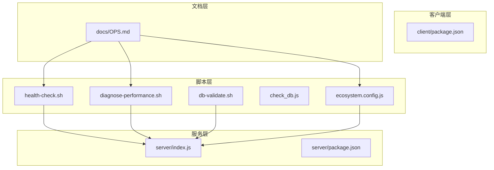
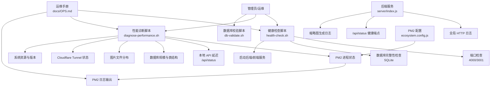
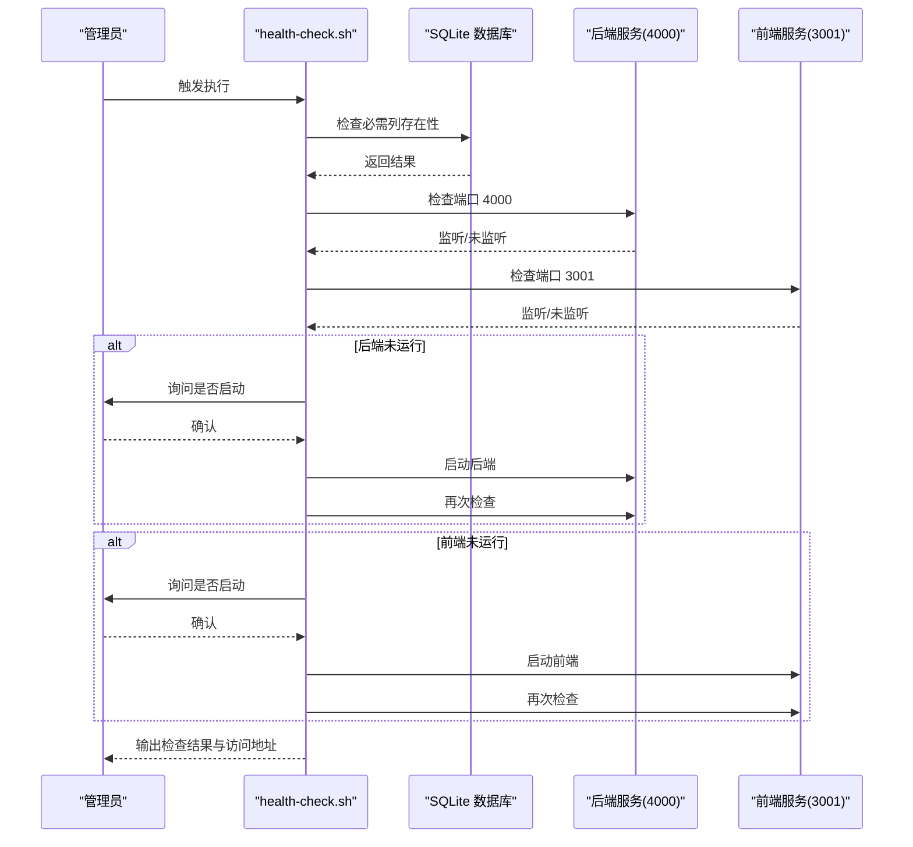
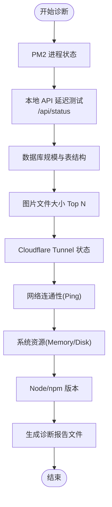
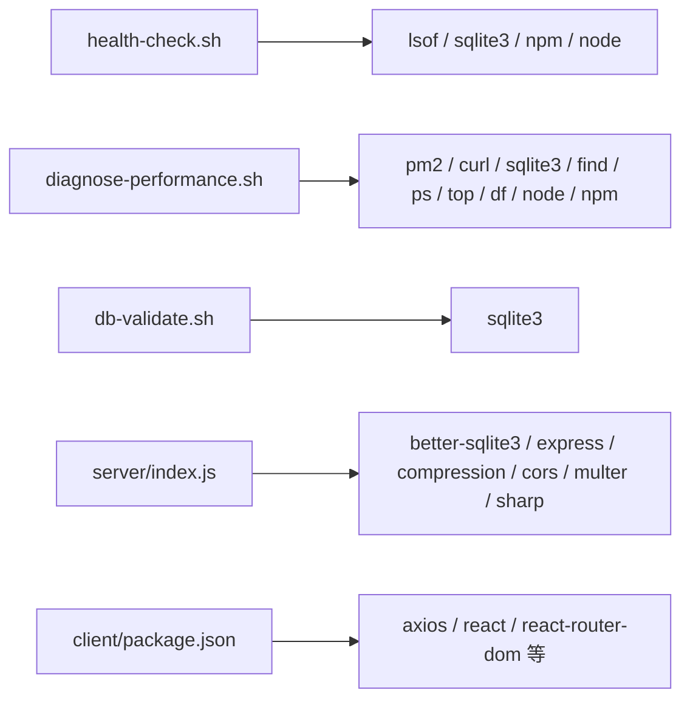

# 监控告警

<cite>
**本文引用的文件**
- [scripts/health-check.sh](file://scripts/health-check.sh)
- [scripts/diagnose-performance.sh](file://scripts/diagnose-performance.sh)
- [scripts/db-validate.sh](file://scripts/db-validate.sh)
- [scripts/check_db.js](file://scripts/check_db.js)
- [scripts/ecosystem.config.js](file://scripts/ecosystem.config.js)
- [server/index.js](file://server/index.js)
- [server/package.json](file://server/package.json)
- [client/package.json](file://client/package.json)
- [docs/OPS.md](file://docs/OPS.md)
- [server/migrations/add_share_collections.sql](file://server/migrations/add_share_collections.sql)
</cite>

## 目录
1. [简介](#简介)
2. [项目结构](#项目结构)
3. [核心组件](#核心组件)
4. [架构总览](#架构总览)
5. [详细组件分析](#详细组件分析)
6. [依赖关系分析](#依赖关系分析)
7. [性能考量](#性能考量)
8. [故障排查指南](#故障排查指南)
9. [结论](#结论)
10. [附录](#附录)

## 简介
本指南面向 Longhorn 监控与告警体系的落地实施，覆盖健康检查脚本的配置与执行频率、性能监控指标与资源使用跟踪、异常检测机制、日志收集与存储策略、告警规则与通知渠道、响应流程，以及监控仪表板搭建与容量规划建议。Longhorn 当前以 Bash 脚本与 PM2 进程管理为基础，结合后端服务的日志与健康接口，形成基础的可观测性能力。

## 项目结构
Longhorn 由前后端分离的仓库构成，监控与运维相关的关键位置如下：
- 脚本层：位于 scripts/，包含健康检查、性能诊断、数据库校验与 PM2 配置等
- 服务层：server/ 为 Node.js 后端，提供 API、日志与健康检查端点
- 客户端层：client/ 为前端应用，负责用户界面与部分统计展示
- 文档层：docs/ 提供运维手册与网络架构说明

图表来源
- [scripts/health-check.sh](file://scripts/health-check.sh#L1-L115)
- [scripts/diagnose-performance.sh](file://scripts/diagnose-performance.sh#L1-L122)
- [scripts/db-validate.sh](file://scripts/db-validate.sh#L1-L52)
- [scripts/check_db.js](file://scripts/check_db.js#L1-L20)
- [scripts/ecosystem.config.js](file://scripts/ecosystem.config.js#L1-L41)
- [server/index.js](file://server/index.js#L477-L479)
- [server/package.json](file://server/package.json#L1-L30)
- [client/package.json](file://client/package.json#L1-L45)
- [docs/OPS.md](file://docs/OPS.md#L1-L171)

章节来源
- [scripts/health-check.sh](file://scripts/health-check.sh#L1-L115)
- [scripts/diagnose-performance.sh](file://scripts/diagnose-performance.sh#L1-L122)
- [scripts/db-validate.sh](file://scripts/db-validate.sh#L1-L52)
- [scripts/check_db.js](file://scripts/check_db.js#L1-L20)
- [scripts/ecosystem.config.js](file://scripts/ecosystem.config.js#L1-L41)
- [server/index.js](file://server/index.js#L477-L479)
- [server/package.json](file://server/package.json#L1-L30)
- [client/package.json](file://client/package.json#L1-L45)
- [docs/OPS.md](file://docs/OPS.md#L1-L171)

## 核心组件
- 健康检查脚本：检查后端/前端端口、数据库完整性，并可交互式启动服务
- 性能诊断脚本：采集 PM2 状态、本地 API 延迟、数据库规模、图片文件分布、Cloudflare Tunnel 状态、系统资源与版本信息
- 数据库校验脚本：验证表结构并自动修复缺失列
- PM2 配置：进程数量、内存限制、日志格式与合并、自动重启策略
- 后端健康端点：提供 /api/status 健康状态
- 日志与审计：全局 HTTP 请求日志、缩略图生成错误日志、PM2 统一日志输出

章节来源
- [scripts/health-check.sh](file://scripts/health-check.sh#L13-L33)
- [scripts/diagnose-performance.sh](file://scripts/diagnose-performance.sh#L16-L115)
- [scripts/db-validate.sh](file://scripts/db-validate.sh#L16-L41)
- [scripts/ecosystem.config.js](file://scripts/ecosystem.config.js#L1-L41)
- [server/index.js](file://server/index.js#L477-L479)
- [server/index.js](file://server/index.js#L422-L427)

## 架构总览
下图展示了监控与运维相关组件的交互关系，包括健康检查、性能诊断、日志聚合与通知渠道的潜在接入点。

图表来源
- [scripts/health-check.sh](file://scripts/health-check.sh#L13-L33)
- [scripts/diagnose-performance.sh](file://scripts/diagnose-performance.sh#L16-L115)
- [scripts/db-validate.sh](file://scripts/db-validate.sh#L16-L41)
- [scripts/ecosystem.config.js](file://scripts/ecosystem.config.js#L1-L41)
- [server/index.js](file://server/index.js#L477-L479)
- [server/index.js](file://server/index.js#L422-L427)
- [docs/OPS.md](file://docs/OPS.md#L67-L96)

## 详细组件分析

### 健康检查脚本（health-check.sh）
- 功能要点
  - 检查后端服务端口 4000 与前端服务端口 3001 是否监听
  - 检查 SQLite 数据库列是否存在，缺失则自动添加并初始化
  - 可交互式启动后端与前端服务
- 执行频率建议
  - 建议通过系统计划任务（如 cron）每 5–10 分钟执行一次，以便快速发现服务异常
  - 结合 PM2 自动重启策略，形成“检查—恢复—守护”的闭环
- 关键行为序列

图表来源
- [scripts/health-check.sh](file://scripts/health-check.sh#L13-L33)
- [scripts/health-check.sh](file://scripts/health-check.sh#L82-L112)

章节来源
- [scripts/health-check.sh](file://scripts/health-check.sh#L1-L115)

### 性能诊断脚本（diagnose-performance.sh）
- 功能要点
  - 收集 PM2 进程列表与详细信息
  - 测试本地 API 响应延迟（/api/status）
  - 查询数据库规模（file_stats、users、share_links 等）
  - 统计图片文件大小分布（Top N）
  - 检查 Cloudflare Tunnel 进程与日志
  - 网络连通性与系统资源（内存、磁盘、Node/npm 版本）
- 使用场景
  - 问题定位、容量评估、网络链路诊断
- 输出
  - 将诊断结果写入带时间戳的文本文件，便于归档与回溯

图表来源
- [scripts/diagnose-performance.sh](file://scripts/diagnose-performance.sh#L16-L115)

章节来源
- [scripts/diagnose-performance.sh](file://scripts/diagnose-performance.sh#L1-L122)

### 数据库校验脚本（db-validate.sh）
- 功能要点
  - 验证表结构完整性，对缺失列进行自动修复（如 last_login）
  - 适用于生产环境的数据库维护与自愈
- 建议执行频率
  - 建议每日定时执行，或在健康检查失败时触发

章节来源
- [scripts/db-validate.sh](file://scripts/db-validate.sh#L1-L52)

### 数据库调试工具（check_db.js）
- 功能要点
  - 读取数据库路径并打印部门与管理员用户信息，辅助快速核验数据一致性
- 使用场景
  - 登录态异常、权限问题、用户信息不一致时的快速诊断

章节来源
- [scripts/check_db.js](file://scripts/check_db.js#L1-L20)

### PM2 进程管理（ecosystem.config.js）
- 关键配置
  - 实例数：集群模式，使用全部 CPU 核心
  - 自动重启：崩溃后自动重启，设置最大重启次数与延迟
  - 内存限制：超限时重启，避免内存泄漏导致服务不可用
  - 日志：统一日期格式、错误/标准输出文件、合并日志
  - 监听超时与优雅退出：提升稳定性
- 建议
  - 与健康检查脚本联动，异常时触发重启或报警

章节来源
- [scripts/ecosystem.config.js](file://scripts/ecosystem.config.js#L1-L41)

### 后端健康端点（/api/status）
- 作用
  - 提供轻量级健康检查接口，便于外部探针或自动化工具调用
- 建议
  - 与负载均衡器/反向代理配合，作为存活探针与就绪探针的基础

章节来源
- [server/index.js](file://server/index.js#L477-L479)

### 日志与审计
- 全局 HTTP 日志：每次请求都会记录方法、URL 与客户端 IP
- 缩略图生成错误日志：记录 ffmpeg/sips 处理失败原因
- PM2 日志：统一输出与合并，便于集中检索

章节来源
- [server/index.js](file://server/index.js#L422-L427)
- [server/index.js](file://server/index.js#L617-L620)
- [scripts/ecosystem.config.js](file://scripts/ecosystem.config.js#L30-L38)

## 依赖关系分析
- 脚本依赖
  - health-check.sh 依赖 lsof、sqlite3、npm、node 等系统工具
  - diagnose-performance.sh 依赖 pm2、curl、sqlite3、find、ps、top、df、node、npm 等
  - db-validate.sh 依赖 sqlite3
- 服务依赖
  - server/index.js 依赖 better-sqlite3、express、compression、cors、multer、sharp 等
  - client/package.json 依赖 axios、react、react-router-dom 等

图表来源
- [scripts/health-check.sh](file://scripts/health-check.sh#L1-L115)
- [scripts/diagnose-performance.sh](file://scripts/diagnose-performance.sh#L1-L122)
- [scripts/db-validate.sh](file://scripts/db-validate.sh#L1-L52)
- [server/package.json](file://server/package.json#L15-L28)
- [client/package.json](file://client/package.json#L12-L29)

章节来源
- [server/package.json](file://server/package.json#L15-L28)
- [client/package.json](file://client/package.json#L12-L29)

## 性能考量
- 缩略图生成队列与并发控制：通过队列与最大并发限制，避免 CPU/IO 过载
- 压缩与缓存：启用 gzip 压缩与缩略图缓存，降低带宽与计算压力
- 数据库模式：WAL 模式提升并发读写性能
- 进程模型：PM2 集群模式充分利用多核，结合内存上限与自动重启保障稳定性

章节来源
- [server/index.js](file://server/index.js#L555-L577)
- [server/index.js](file://server/index.js#L418-L419)
- [server/index.js](file://server/index.js#L29-L30)
- [scripts/ecosystem.config.js](file://scripts/ecosystem.config.js#L7-L22)

## 故障排查指南
- 健康检查失败
  - 使用 health-check.sh 检查端口与数据库；必要时交互式启动服务
  - 参考 docs/OPS.md 中的服务状态检查与日志查看指引
- 性能异常
  - 运行 diagnose-performance.sh 获取系统、数据库与网络信息
  - 关注 PM2 日志与后端 HTTP 日志，定位热点接口与错误
- 数据库问题
  - 使用 db-validate.sh 校验表结构；必要时使用 check_db.js 快速核验关键数据
- 网络与隧道
  - 检查 Cloudflare Tunnel 进程与日志；确认公网路由状态

章节来源
- [scripts/health-check.sh](file://scripts/health-check.sh#L82-L112)
- [scripts/diagnose-performance.sh](file://scripts/diagnose-performance.sh#L16-L115)
- [scripts/db-validate.sh](file://scripts/db-validate.sh#L16-L41)
- [scripts/check_db.js](file://scripts/check_db.js#L1-L20)
- [docs/OPS.md](file://docs/OPS.md#L67-L96)

## 结论
Longhorn 当前以 Bash 脚本与 PM2 为核心，实现了基础的健康检查、性能诊断与数据库维护能力。建议在此基础上引入更完善的监控与告警体系：将健康检查与性能诊断纳入统一调度平台，建立基于日志与指标的告警规则，完善通知渠道与响应流程，并持续优化仪表板与容量规划策略。

## 附录

### 健康检查与执行频率建议
- 健康检查脚本：每 5–10 分钟一次
- 性能诊断脚本：按需执行或每日定时执行
- 数据库校验脚本：每日定时执行
- PM2 自动重启：结合内存上限与重启策略，减少人工干预

章节来源
- [scripts/health-check.sh](file://scripts/health-check.sh#L82-L112)
- [scripts/diagnose-performance.sh](file://scripts/diagnose-performance.sh#L8-L14)
- [scripts/db-validate.sh](file://scripts/db-validate.sh#L1-L52)
- [scripts/ecosystem.config.js](file://scripts/ecosystem.config.js#L16-L22)

### 告警规则与通知渠道（建议）
- 健康类
  - /api/status 连续失败阈值（例如 3 次）
  - 端口 4000/3001 长时间不可用
- 性能类
  - /api/status 响应时间 P95 超过阈值
  - 缩略图生成失败率上升
- 资源类
  - PM2 进程内存使用超过阈值
  - 磁盘使用率超过阈值
- 通知渠道
  - 邮件、IM 机器人、电话（分级）
- 响应流程
  - 自动恢复（重启/拉起）→ 告警 → 人工介入 → 复盘与优化

（本节为概念性建议，不直接对应具体源码）

### 监控仪表板与关键指标
- 关键指标
  - 服务可用性（端口/健康接口）
  - API 延迟与吞吐
  - 缩略图生成成功率与耗时
  - 数据库规模与增长趋势
  - 系统资源（CPU/内存/磁盘）
- 仪表板建议
  - 服务健康看板（端口/进程/日志）
  - 性能看板（延迟、错误率、吞吐）
  - 存储看板（总量、使用率、Top N 文件）
  - 网络看板（Cloudflare Tunnel 状态、连通性）

（本节为概念性建议，不直接对应具体源码）

### 容量规划建议
- 基于 diagnose-performance.sh 的数据库规模与图片分布统计，评估存储扩容节奏
- 结合 PM2 实例数与内存上限，评估 CPU/内存扩容需求
- 对缩略图生成队列并发进行压测，确定最优并发度

章节来源
- [scripts/diagnose-performance.sh](file://scripts/diagnose-performance.sh#L38-L71)
- [scripts/ecosystem.config.js](file://scripts/ecosystem.config.js#L7-L22)
- [server/index.js](file://server/index.js#L555-L577)