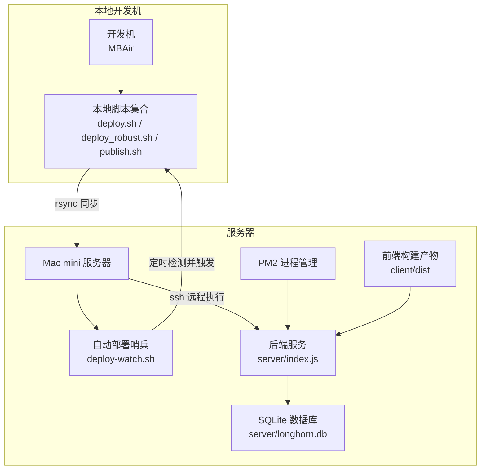
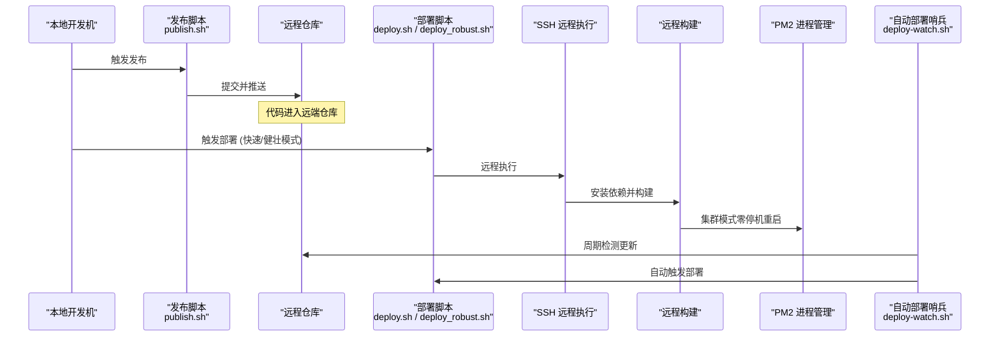
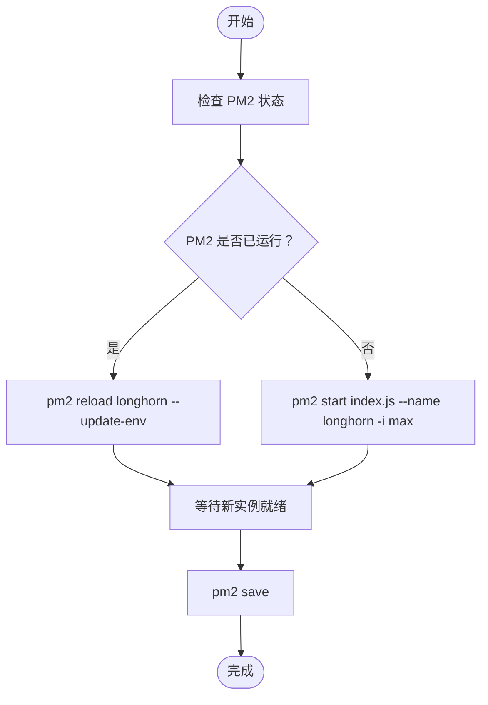
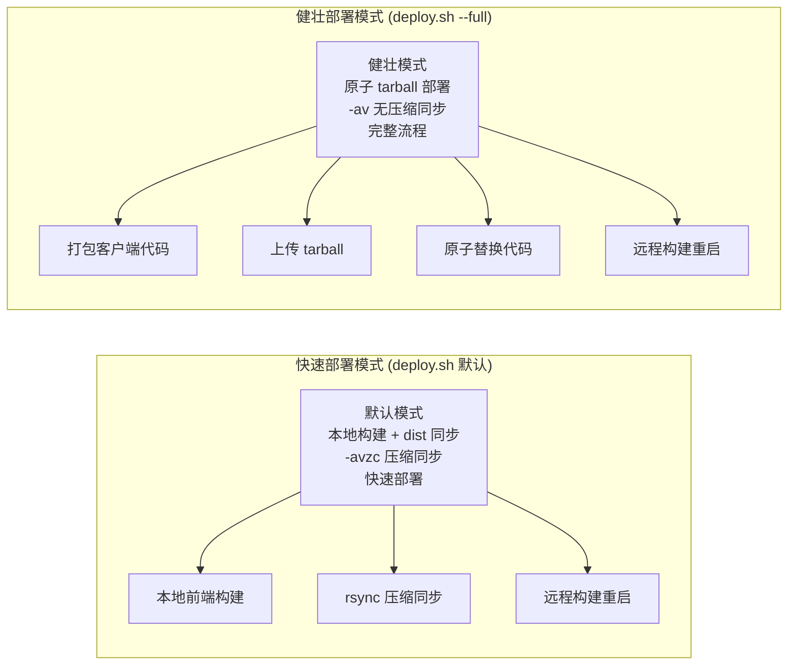
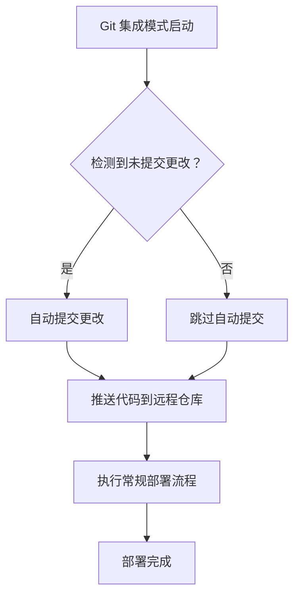
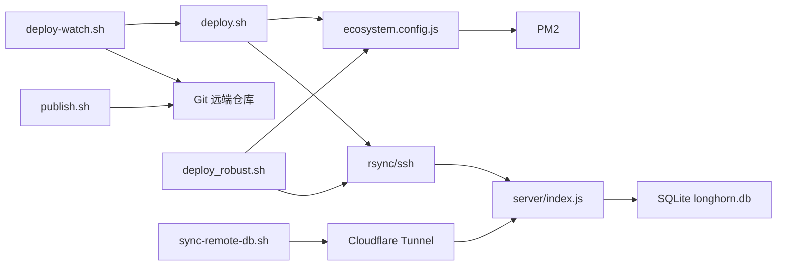

# 自动化部署

<cite>
**本文引用的文件**
- [scripts/deploy.sh](file://scripts/deploy.sh)
- [scripts/deploy_robust.sh](file://scripts/deploy_robust.sh)
- [scripts/publish.sh](file://scripts/publish.sh)
- [scripts/update.sh](file://scripts/update.sh)
- [scripts/ecosystem.config.js](file://scripts/ecosystem.config.js)
- [scripts/setup.sh](file://scripts/setup.sh)
- [scripts/deploy-watch.sh](file://scripts/deploy-watch.sh)
- [scripts/sync-remote-db.sh](file://scripts/sync-remote-db.sh)
- [scripts/db-validate.sh](file://scripts/db-validate.sh)
- [scripts/health-check.sh](file://scripts/health-check.sh)
- [scripts/ssh-mini.sh](file://scripts/ssh-mini.sh)
- [server/package.json](file://server/package.json)
- [server/index.js](file://server/index.js)
- [docs/deployment.md](file://docs/deployment.md)
- [docs/OPS.md](file://docs/OPS.md)
- [docs/QUICK_DEPLOY.md](file://docs/QUICK_DEPLOY.md)
- [package.json](file://package.json)
</cite>

## 更新摘要
**所做更改**
- 新增双模式部署功能：快速模式（默认）和健壮模式（--full 参数）
- 增强 deploy.sh 的 Git 集成模式，支持 --git 参数进行自动提交和推送
- 更新部署流程章节，详细说明两种部署模式的区别和适用场景
- 新增多阶段部署架构图，展示健壮模式的完整执行流程
- 完善部署前检查清单，增加健壮模式的特殊要求

## 目录
1. [简介](#简介)
2. [项目结构](#项目结构)
3. [核心组件](#核心组件)
4. [架构总览](#架构总览)
5. [详细组件分析](#详细组件分析)
6. [双模式部署流程](#双模式部署流程)
7. [依赖关系分析](#依赖关系分析)
8. [性能考量](#性能考量)
9. [故障排查指南](#故障排查指南)
10. [结论](#结论)
11. [附录](#附录)

## 简介
本文件面向 Longhorn 自动化部署系统，系统性阐述部署脚本的工作原理、执行流程与参数配置，深入说明 rsync 同步机制、远程构建过程与零停机更新策略，阐明 PM2 进程管理、集群模式配置与自动重启机制，并覆盖发布流程、版本控制与回滚策略。系统现已支持两种部署模式：快速部署模式和健壮部署模式，满足不同场景下的部署需求。同时提供部署前检查清单、部署后验证步骤以及部署失败处理方案，帮助运维人员与开发者高效、安全地交付与维护系统。

## 项目结构
Longhorn 采用"前端客户端 + 后端服务 + 部署脚本 + 文档"的分层组织方式。部署自动化围绕 scripts 目录中的脚本展开，配合 server 与 client 的构建与运行，形成从本地开发到服务器自动部署的闭环。

**图表来源**
- [scripts/deploy.sh](file://scripts/deploy.sh#L1-L167)
- [scripts/deploy_robust.sh](file://scripts/deploy_robust.sh#L1-L68)
- [scripts/deploy-watch.sh](file://scripts/deploy-watch.sh#L1-L34)
- [scripts/ecosystem.config.js](file://scripts/ecosystem.config.js#L1-L41)
- [server/index.js](file://server/index.js#L1-L200)

**章节来源**
- [scripts/deploy.sh](file://scripts/deploy.sh#L1-L167)
- [scripts/deploy_robust.sh](file://scripts/deploy_robust.sh#L1-L68)
- [scripts/deploy-watch.sh](file://scripts/deploy-watch.sh#L1-L34)
- [scripts/ecosystem.config.js](file://scripts/ecosystem.config.js#L1-L41)
- [server/index.js](file://server/index.js#L1-L200)

## 核心组件
- **发布与同步脚本**
  - publish.sh：封装提交、打标、推送的发布流程，便于一键发布。
  - deploy.sh：本地触发 rsync 同步与远程构建重启，支持 Git 集成模式和双模式部署。
  - deploy_robust.sh：健壮部署脚本，提供无压缩、带暂停的多阶段部署流程。
  - deploy-watch.sh：服务器侧自动部署哨兵，周期检测远端更新并自动拉取部署。
- **进程与环境管理**
  - ecosystem.config.js：PM2 集群模式、优雅重启、日志与自动重启策略。
  - setup.sh：生产环境初始化，安装依赖、构建与引导。
  - update.sh：服务器本地更新脚本，用于紧急或手动更新。
- **数据与健康**
  - sync-remote-db.sh：通过 Cloudflare 隧道进行数据库上传与恢复。
  - db-validate.sh：数据库结构校验与自动修复。
  - health-check.sh：服务健康检查与自动恢复。
- **连接与便捷**
  - ssh-mini.sh：一键 SSH 登录并进入项目目录。

**章节来源**
- [scripts/publish.sh](file://scripts/publish.sh#L1-L60)
- [scripts/deploy.sh](file://scripts/deploy.sh#L1-L167)
- [scripts/deploy_robust.sh](file://scripts/deploy_robust.sh#L1-L68)
- [scripts/deploy-watch.sh](file://scripts/deploy-watch.sh#L1-L34)
- [scripts/ecosystem.config.js](file://scripts/ecosystem.config.js#L1-L41)
- [scripts/setup.sh](file://scripts/setup.sh#L1-L112)
- [scripts/update.sh](file://scripts/update.sh#L1-L33)
- [scripts/sync-remote-db.sh](file://scripts/sync-remote-db.sh#L1-L54)
- [scripts/db-validate.sh](file://scripts/db-validate.sh#L1-L52)
- [scripts/health-check.sh](file://scripts/health-check.sh#L1-L115)
- [scripts/ssh-mini.sh](file://scripts/ssh-mini.sh#L1-L6)

## 架构总览
自动化部署体系由"本地发布 → 远程同步 → 远程构建 → 零停机重启 → 哨兵监控"构成，结合 PM2 集群模式与 Cloudflare 隧道，实现高可用与低风险的线上交付。系统现支持两种部署模式：快速部署模式（默认）和健壮部署模式，满足不同场景下的部署需求。

**图表来源**
- [scripts/publish.sh](file://scripts/publish.sh#L1-L60)
- [scripts/deploy.sh](file://scripts/deploy.sh#L1-L167)
- [scripts/deploy_robust.sh](file://scripts/deploy_robust.sh#L1-L68)
- [scripts/deploy-watch.sh](file://scripts/deploy-watch.sh#L1-L34)
- [scripts/ecosystem.config.js](file://scripts/ecosystem.config.js#L1-L41)

## 详细组件分析

### 发布与同步组件
- **发布脚本 publish.sh**
  - 功能：封装 Git 提交、打标签、推送的发布流程，支持交互式输入提交信息。
  - 关键点：校验 Git 目录、暂存、提交、获取短哈希、推送远端；推送成功后提示自动部署生效。
- **部署脚本 deploy.sh**
  - 功能：本地触发 rsync 同步与远程构建重启，支持 Git 集成模式和双模式部署。
  - **双模式部署**：
    - 快速模式（默认）：本地构建前端，直接同步 dist 目录，部署速度最快。
    - 健壮模式（--full）：使用原子 tarball 部署，确保部署过程的原子性和可回滚性。
  - **Git 集成模式**：通过 --git 参数启用，自动处理未提交更改、提交和推送。
  - rsync 同步策略：
    - server 同步：排除 node_modules、.env、数据库文件、日志、缓存、上传目录等，避免污染生产数据。
    - client 同步：排除 node_modules、dist、日志等，确保构建产物在服务器侧生成。
  - 远程构建与重启：
    - 进入项目目录，分别在 client 与 server 执行依赖安装与构建。
    - 使用 PM2 在集群模式下执行"reload"，实现零停机更新；若未运行则启动。
    - 启动或重载"longhorn-watcher"哨兵任务，确保后续自动更新。
    - 保存 PM2 状态，确保系统重启后自动恢复。
- **健壮部署脚本 deploy_robust.sh**
  - 功能：提供无压缩、带暂停的多阶段部署流程，增强部署稳定性。
  - **无压缩模式**：使用 -av 参数而非 -avzc，避免压缩带来的 CPU 开销。
  - **阶段化暂停**：在每个同步阶段后添加 2 秒暂停，确保系统稳定。
  - **完整同步流程**：包含服务器代码同步、客户端代码同步和远程构建重启三个阶段。
- **自动部署哨兵 deploy-watch.sh**
  - 功能：每 60 秒执行一次 git fetch，对比本地与上游分支，若不一致则执行 hard reset、清理临时文件、拉取并触发部署。
  - 适用场景：无需手动登录服务器即可自动完成拉取、构建与重启。

**章节来源**
- [scripts/publish.sh](file://scripts/publish.sh#L1-L60)
- [scripts/deploy.sh](file://scripts/deploy.sh#L1-L167)
- [scripts/deploy_robust.sh](file://scripts/deploy_robust.sh#L1-L68)
- [scripts/deploy-watch.sh](file://scripts/deploy-watch.sh#L1-L34)

### 进程与环境管理组件
- **ecosystem.config.js（PM2 配置）**
  - 集群模式：instances 设置为 max，充分利用多核资源。
  - 优雅重启：wait_ready、listen_timeout、kill_timeout 控制重启窗口。
  - 自动重启：autorestart、max_restarts、restart_delay 防止崩溃循环。
  - 内存限制：max_memory_restart 限制内存超限时自动重启。
  - 日志：统一日期格式、错误与标准输出日志文件、合并日志。
  - 监视：watch=false（生产禁用），ignore_watch 排除无关目录。
- **setup.sh（环境初始化）**
  - Homebrew 安装与缓存清理，解决 jws.json 等异常。
  - Node.js 安装（优先二进制包，失败则使用官方 pkg）。
  - Git、PM2、Cloudflared 安装。
  - 项目完整性检查与依赖安装、前端构建。
- **update.sh（服务器本地更新）**
  - 服务器侧一键更新：git pull、client 构建、server 依赖安装、PM2 重启（基于 ecosystem.config.js）。

**章节来源**
- [scripts/ecosystem.config.js](file://scripts/ecosystem.config.js#L1-L41)
- [scripts/setup.sh](file://scripts/setup.sh#L1-L112)
- [scripts/update.sh](file://scripts/update.sh#L1-L33)

### 数据与健康组件
- **sync-remote-db.sh（远程数据库同步）**
  - 通过 Cloudflare 隧道访问服务器 API，使用管理员凭据登录获取 Token，随后上传本地数据库文件，触发服务器端恢复并重启。
  - 适用场景：无法直连 IP 的情况下，通过公网隧道进行数据库恢复。
- **db-validate.sh（数据库结构验证）**
  - 校验 users 表必需列是否存在，缺失则自动添加并初始化默认值，保障数据库结构一致性。
- **health-check.sh（健康检查与自动恢复）**
  - 检查后端（端口 4000）、前端（端口 3001）与数据库列完整性，必要时自动启动对应服务或修复列结构。

**章节来源**
- [scripts/sync-remote-db.sh](file://scripts/sync-remote-db.sh#L1-L54)
- [scripts/db-validate.sh](file://scripts/db-validate.sh#L1-L52)
- [scripts/health-check.sh](file://scripts/health-check.sh#L1-L115)

### 连接与便捷组件
- **ssh-mini.sh（一键登录）**
  - 通过 SSH 登录服务器并自动切换到项目目录，提升运维效率。

**章节来源**
- [scripts/ssh-mini.sh](file://scripts/ssh-mini.sh#L1-L6)

### 零停机更新策略与流程图
零停机更新的关键在于 PM2 集群模式与优雅重启参数，配合部署脚本的"reload"策略，确保在新实例就绪后再切换流量。

**图表来源**
- [scripts/deploy.sh](file://scripts/deploy.sh#L83-L91)
- [scripts/ecosystem.config.js](file://scripts/ecosystem.config.js#L11-L14)

## 双模式部署流程

### 部署模式对比
Longhorn 现提供两种部署模式，满足不同场景下的部署需求：

**图表来源**
- [scripts/deploy.sh](file://scripts/deploy.sh#L70-L92)
- [scripts/deploy.sh](file://scripts/deploy.sh#L93-L161)
- [scripts/deploy_robust.sh](file://scripts/deploy_robust.sh#L1-L68)

### 快速部署流程详解
快速部署模式是默认部署方式，适合日常开发和快速迭代：

1. **本地前端构建阶段**
   - 在本地执行 `npm run build` 生成生产环境构建产物
   - 构建完成后生成 dist 目录，包含优化后的静态资源

2. **服务器代码同步阶段**
   - 使用压缩 rsync 同步服务器端代码
   - 排除 node_modules、.env、数据库文件等无关文件
   - 确保生产环境不受本地开发文件影响

3. **远程构建与重启阶段**
   - 在服务器上安装后端依赖并启动服务
   - 使用 PM2 集群模式执行优雅重启
   - 保存 PM2 状态确保系统重启后自动恢复

### 健壮部署流程详解
健壮部署模式提供更稳定的部署体验，特别适合对部署稳定性要求较高的场景：

1. **服务器代码同步阶段**
   - 使用无压缩 rsync 同步服务器代码
   - 排除 node_modules、.env、数据库文件等无关文件
   - 同步完成后暂停 2 秒确保系统稳定

2. **客户端代码同步阶段**
   - 使用无压缩 rsync 同步客户端代码
   - 排除 node_modules、dist 等构建产物
   - 同步完成后暂停 2 秒确保系统稳定

3. **远程构建与重启阶段**
   - 进入项目目录执行构建
   - 清理构建缓存和临时文件
   - 安装依赖并执行构建命令
   - 使用 PM2 集群模式重启服务

### Git 集成部署流程
deploy.sh 现支持 Git 集成模式，通过 --git 参数启用：

**图表来源**
- [scripts/deploy.sh](file://scripts/deploy.sh#L39-L47)

**章节来源**
- [scripts/deploy.sh](file://scripts/deploy.sh#L1-L167)
- [scripts/deploy_robust.sh](file://scripts/deploy_robust.sh#L1-L68)

## 依赖关系分析
- **脚本间耦合**
  - publish.sh 与 deploy.sh：前者负责提交与推送，后者负责同步与远程构建重启。
  - deploy-watch.sh 与 deploy.sh：哨兵脚本在检测到更新后调用部署流程。
  - ecosystem.config.js 与 deploy.sh/update.sh：统一由 PM2 管理，确保集群模式与自动重启。
  - deploy_robust.sh 与 deploy.sh：健壮模式是对快速模式的补充，提供更稳定的部署选项。
- **外部依赖**
  - Git：版本控制与发布流程。
  - rsync/ssh：本地到服务器的增量同步与远程执行。
  - PM2：进程管理、集群模式与自动重启。
  - Cloudflare Tunnel：公网访问与数据库恢复隧道。
  - Better-SQLite3：数据库访问与 WAL 模式。

**图表来源**
- [scripts/publish.sh](file://scripts/publish.sh#L1-L60)
- [scripts/deploy.sh](file://scripts/deploy.sh#L1-L167)
- [scripts/deploy_robust.sh](file://scripts/deploy_robust.sh#L1-L68)
- [scripts/deploy-watch.sh](file://scripts/deploy-watch.sh#L1-L34)
- [scripts/ecosystem.config.js](file://scripts/ecosystem.config.js#L1-L41)
- [scripts/sync-remote-db.sh](file://scripts/sync-remote-db.sh#L1-L54)
- [server/index.js](file://server/index.js#L1-L200)

**章节来源**
- [scripts/publish.sh](file://scripts/publish.sh#L1-L60)
- [scripts/deploy.sh](file://scripts/deploy.sh#L1-L167)
- [scripts/deploy_robust.sh](file://scripts/deploy_robust.sh#L1-L68)
- [scripts/deploy-watch.sh](file://scripts/deploy-watch.sh#L1-L34)
- [scripts/ecosystem.config.js](file://scripts/ecosystem.config.js#L1-L41)
- [scripts/sync-remote-db.sh](file://scripts/sync-remote-db.sh#L1-L54)
- [server/index.js](file://server/index.js#L1-L200)

## 性能考量
- **集群模式与资源利用**
  - ecosystem.config.js 将 instances 设为 max，充分利用多核 CPU，提升并发处理能力。
- **优雅重启与延迟**
  - wait_ready、listen_timeout、kill_timeout 配置确保新实例在监听就绪后再接管请求，降低重启抖动。
- **日志与可观测性**
  - 统一日志格式与输出文件，便于定位问题；建议结合 PM2 日志轮转策略。
- **网络与带宽**
  - rsync 同步排除大量缓存与日志目录，减少传输量；健壮模式使用无压缩同步，避免压缩 CPU 开销。
- **部署模式选择**
  - 快速模式适合日常开发，使用压缩同步提高传输效率。
  - 健壮模式适合生产环境，使用无压缩同步确保部署稳定性。

## 故障排查指南
- **发布失败**
  - 现象：推送失败或无自动部署。
  - 排查：确认 Git 目录、提交信息非空；检查网络与远端仓库可达性；查看发布脚本输出。
- **部署失败**
  - 现象：同步成功但远程构建或重启失败。
  - 排查：检查 ssh 可达性与远程环境；查看远程构建日志；确认 PM2 状态与日志文件。
  - **健壮模式特有问题**：检查同步阶段间的暂停是否正常执行，确认无压缩同步的 CPU 使用情况。
- **零停机更新异常**
  - 现象：reload 后服务不可用或响应缓慢。
  - 排查：检查 wait_ready 与 listen_timeout 配置；查看新实例日志；必要时回退到旧版本。
- **数据库问题**
  - 现象：列缺失或结构不一致。
  - 排查：运行 db-validate.sh 自动修复；必要时使用 sync-remote-db.sh 通过隧道恢复数据库。
- **健康检查失败**
  - 现象：端口未监听或服务未启动。
  - 排查：使用 health-check.sh 检查端口与数据库；按提示自动启动后端/前端服务。

**章节来源**
- [scripts/publish.sh](file://scripts/publish.sh#L1-L60)
- [scripts/deploy.sh](file://scripts/deploy.sh#L1-L167)
- [scripts/deploy_robust.sh](file://scripts/deploy_robust.sh#L1-L68)
- [scripts/db-validate.sh](file://scripts/db-validate.sh#L1-L52)
- [scripts/sync-remote-db.sh](file://scripts/sync-remote-db.sh#L1-L54)
- [scripts/health-check.sh](file://scripts/health-check.sh#L1-L115)

## 结论
Longhorn 自动化部署体系通过"发布脚本 + rsync 同步 + 远程构建 + PM2 集群模式 + 自动部署哨兵"的组合，实现了从本地到生产的无缝衔接与低风险交付。系统现已支持两种部署模式：快速部署模式和健壮部署模式，满足不同场景下的部署需求。配合数据库验证与远程恢复工具，系统具备良好的稳定性与可维护性。建议在生产环境中严格遵循发布流程、定期备份数据库，并持续优化日志与监控策略。

## 附录

### 部署前检查清单
- **本地开发机**
  - 确认代码已提交并通过测试。
  - 确认 publish.sh 可正常执行，网络与远端仓库可达。
  - **健壮模式特殊要求**：确认系统 CPU 资源充足，能够承受无压缩同步的 CPU 开销。
- **服务器**
  - 确认 PM2、Node.js、Git、Cloudflared 已安装。
  - 确认 ssh-mini.sh 可正常登录并进入项目目录。
  - 确认 deploy-watch.sh 已由 PM2 启动并处于运行状态。
  - **健壮模式特殊要求**：确认系统有足够的磁盘空间，无压缩同步会产生更大的传输量。

**章节来源**
- [scripts/ssh-mini.sh](file://scripts/ssh-mini.sh#L1-L6)
- [scripts/deploy-watch.sh](file://scripts/deploy-watch.sh#L1-L34)
- [scripts/setup.sh](file://scripts/setup.sh#L1-L112)
- [scripts/deploy_robust.sh](file://scripts/deploy_robust.sh#L1-L68)

### 部署后验证步骤
- **端口与服务**
  - 检查后端（端口 4000）与前端（端口 3001）是否正常监听。
- **数据库**
  - 运行 db-validate.sh 验证表结构；必要时执行数据库备份。
- **进程状态**
  - 使用 PM2 查看 longhorn 与 longhorn-watcher 状态与日志。
- **公网访问**
  - 通过 Cloudflare 隧道访问服务，确认功能正常。
- **健壮模式验证**
  - 确认部署过程中各阶段的暂停是否正常执行。
  - 检查无压缩同步的日志，确认无额外的 CPU 压力。

**章节来源**
- [scripts/health-check.sh](file://scripts/health-check.sh#L1-L115)
- [scripts/db-validate.sh](file://scripts/db-validate.sh#L1-L52)
- [docs/OPS.md](file://docs/OPS.md#L100-L171)

### 发布流程与版本控制
- **发布流程**
  - 本地：执行 publish.sh，提交并推送代码。
  - 服务器：自动部署哨兵检测到更新后执行部署；或手动执行 deploy.sh。
  - **Git 集成模式**：使用 --git 参数启用自动提交和推送功能。
- **版本控制**
  - 使用 Git 提交信息与短哈希标识版本；建议配合语义化版本与标签策略。
  - 健壮模式下，部署过程更加稳定，适合生产环境的版本发布。
- **回滚策略**
  - 若部署失败，可使用 git reset --hard 回退到上一个稳定版本；或通过 sync-remote-db.sh 恢复数据库备份。
  - 健壮模式的部署过程更容易追踪和回滚，因为每个阶段都有明确的执行痕迹。

**章节来源**
- [scripts/publish.sh](file://scripts/publish.sh#L1-L60)
- [scripts/deploy-watch.sh](file://scripts/deploy-watch.sh#L1-L34)
- [scripts/sync-remote-db.sh](file://scripts/sync-remote-db.sh#L1-L54)
- [docs/OPS.md](file://docs/OPS.md#L1-L198)

### 部署模式选择指南
- **快速部署模式 (deploy.sh 默认)**
  - 适用场景：日常开发、频繁迭代、快速验证。
  - 优势：部署速度快，传输效率高，适合开发环境。
  - 注意事项：压缩同步可能影响大文件传输的稳定性。
- **健壮部署模式 (deploy.sh --full)**
  - 适用场景：生产环境、对稳定性要求高的部署。
  - 优势：无压缩同步更稳定，阶段化暂停确保系统稳定。
  - 注意事项：部署时间较长，CPU 开销较大。
- **Git 集成模式**
  - 适用场景：团队协作、版本控制严格的项目。
  - 优势：自动处理未提交更改，确保代码质量。
  - 注意事项：需要配置好 Git 用户信息和远程仓库权限。

**章节来源**
- [scripts/deploy.sh](file://scripts/deploy.sh#L1-L167)
- [scripts/deploy_robust.sh](file://scripts/deploy_robust.sh#L1-L68)
- [package.json](file://package.json#L4-L13)