# 部署与运维

<cite>
**本文引用的文件**
- [Dockerfile](file://Dockerfile)
- [docker-compose.yml](file://docker-compose.yml)
- [.github/workflows/deploy.yml](file://.github/workflows/deploy.yml)
- [nginx/nginx.conf](file://nginx/nginx.conf)
- [DEPLOYMENT.md](file://DEPLOYMENT.md)
- [scripts/deploy.sh](file://scripts/deploy.sh)
- [scripts/deploy-watch.sh](file://scripts/deploy-watch.sh)
- [scripts/update.sh](file://scripts/update.sh)
- [scripts/health-check.sh](file://scripts/health-check.sh)
- [scripts/db-validate.sh](file://scripts/db-validate.sh)
- [scripts/setup.sh](file://scripts/setup.sh)
- [scripts/setup-server.sh](file://scripts/setup-server.sh)
- [scripts/sync-db.sh](file://scripts/sync-db.sh)
- [scripts/deploy_complete.sh](file://scripts/deploy_complete.sh)
- [scripts/deploy_robust.sh](file://scripts/deploy_robust.sh)
- [scripts/ecosystem.config.js](file://scripts/ecosystem.config.js)
- [scripts/check_db.js](file://scripts/check_db.js)
- [scripts/fix_folders.js](file://scripts/fix_folders.js)
- [client/package.json](file://client/package.json)
- [server/package.json](file://server/package.json)
- [server/index.js](file://server/index.js)
</cite>

## 更新摘要
**变更内容**
- 新增容器化部署支持，包含 Dockerfile 多阶段构建和 docker-compose 编排
- 新增 GitHub Actions 自动化部署工作流，支持 CI/CD 流水线
- 新增 Nginx 反向代理配置，支持 HTTPS 和负载均衡
- 新增完整的部署指南文档，涵盖多种部署方式
- 增强服务器环境搭建脚本，支持一键初始化
- 新增健壮性部署脚本，提供更稳定的部署流程

## 目录
1. [简介](#简介)
2. [项目结构](#项目结构)
3. [核心组件](#核心组件)
4. [架构总览](#架构总览)
5. [详细组件分析](#详细组件分析)
6. [依赖关系分析](#依赖关系分析)
7. [性能考量](#性能考量)
8. [故障排除指南](#故障排除指南)
9. [结论](#结论)
10. [附录](#附录)

## 简介
本指南面向生产环境的 Longhorn 协同文件系统部署与运维，涵盖从环境准备、标准化远程部署、健康检查、数据库维护、日志与监控、到紧急恢复与版本升级的全流程。Longhorn 由三部分组成：Web 客户端、iOS 客户端与 Node.js + SQLite 后端服务。生产环境采用 Mac mini（M1）作为服务器，结合 PM2 进程管理、Cloudflare Tunnel 提供公网访问与安全防护，并通过标准化的自动化脚本实现无人值守更新。现已支持容器化部署，提供 Docker 和 docker-compose 方案，以及 GitHub Actions 自动化部署。

## 项目结构
Longhorn 仓库包含三个主要部分：
- Web 客户端（React/Vite）：提供管理后台与文件浏览功能。
- iOS 客户端（SwiftUI）：提供移动端文件查阅与个人空间管理。
- 服务端（Node.js + better-sqlite3）：提供 REST API、文件 I/O、权限与鉴权（JWT）、数据库管理与缩略图处理等。

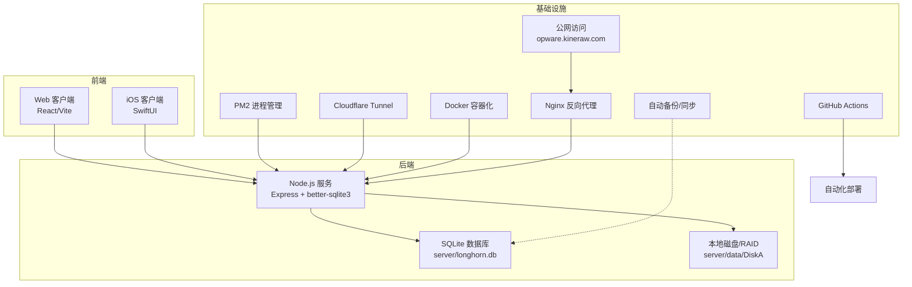

**图表来源**
- [server/index.js](file://server/index.js#L1-L200)

## 核心组件
- 服务端入口与配置
  - 入口文件：server/index.js，负责初始化 Express、数据库、Multer、JWT、鉴权与路由等。
  - 环境变量：PORT、DISK_A、JWT_SECRET 等通过 .env 注入。
  - 数据库：server/longhorn.db，WAL 模式提升并发读写性能。
- 前端构建与运行
  - 客户端：client/，使用 Vite 构建，开发时通过 npm run dev，生产构建通过 npm run build。
  - 依赖：client/package.json。
- 进程管理与集群
  - PM2 配置：scripts/ecosystem.config.js，启用 cluster 模式、优雅重启、内存限制与日志合并。
- 标准化自动化部署与更新
  - 一键部署：scripts/deploy.sh，支持快速部署模式和原子部署模式，通过 rsync 同步代码并在服务器侧执行构建与 PM2 重启。
  - 自动哨兵：scripts/deploy-watch.sh，定时检测远程仓库差异并触发部署。
  - 本地更新：scripts/update.sh，服务器侧一键更新与 PM2 重启。
  - 完整部署：scripts/deploy_complete.sh，提供完整的部署流程，包括数据库迁移和批量索引。
  - 健壮性部署：scripts/deploy_robust.sh，提供更稳定的部署流程，包含压缩禁用和延迟机制。
- 健康检查与数据库校验
  - 健康检查：scripts/health-check.sh，检查端口、数据库列完整性并可自动启动服务。
  - 数据库校验：scripts/db-validate.sh，自动修复缺失列并初始化默认值。
- 数据库修复与迁移
  - 结构修复：scripts/check_db.js，打印部门与管理员信息辅助诊断。
  - 目录迁移：scripts/fix_folders.js，合并/重命名历史目录。
- 环境初始化
  - 一键安装：scripts/setup.sh，安装 Homebrew、Node.js、Git、PM2、Cloudflared，并执行安装与构建。
  - 服务器搭建：scripts/setup-server.sh，专门用于远程服务器的一次性环境搭建。
- 容器化部署
  - Dockerfile：多阶段构建，包含客户端构建和服务器设置。
  - docker-compose：容器编排配置，支持 Nginx 反向代理。
  - Nginx 配置：提供 HTTPS、负载均衡和静态文件服务。
- 自动化部署工作流
  - GitHub Actions：CI/CD 流水线，支持自动化构建、测试和部署。
- 网络与公网访问
  - Cloudflare Tunnel：通过 cloudflared 建立 opware.kineraw.com（HTTPS）与 ssh.kineraw.com（SSH）隧道。
- 备份与同步
  - 数据库备份：cp server/longhorn.db server/longhorn_backup_$(date +%Y%m%d).db。
  - 本地修复后同步：scripts/sync-db.sh，将本地修复后的数据库覆盖到服务器。

**章节来源**
- [server/index.js](file://server/index.js#L1-L200)
- [server/package.json](file://server/package.json#L1-L40)
- [client/package.json](file://client/package.json#L1-L66)
- [scripts/ecosystem.config.js](file://scripts/ecosystem.config.js#L1-L41)
- [scripts/deploy.sh](file://scripts/deploy.sh#L1-L224)
- [scripts/deploy-watch.sh](file://scripts/deploy-watch.sh#L1-L34)
- [scripts/update.sh](file://scripts/update.sh#L1-L33)
- [scripts/health-check.sh](file://scripts/health-check.sh#L1-L115)
- [scripts/db-validate.sh](file://scripts/db-validate.sh#L1-L52)
- [scripts/check_db.js](file://scripts/check_db.js#L1-L20)
- [scripts/fix_folders.js](file://scripts/fix_folders.js#L1-L62)
- [scripts/setup.sh](file://scripts/setup.sh#L1-L112)
- [scripts/sync-db.sh](file://scripts/sync-db.sh#L1-L28)
- [scripts/deploy_complete.sh](file://scripts/deploy_complete.sh#L1-L61)
- [scripts/deploy_robust.sh](file://scripts/deploy_robust.sh#L1-L68)
- [scripts/setup-server.sh](file://scripts/setup-server.sh#L1-L58)

## 架构总览
Longhorn 的生产架构围绕"开发机 -> 云端中转 -> 服务器"的流水线展开，配合 PM2 与 Cloudflare Tunnel 实现高可用与安全访问。现已支持容器化部署，提供 Docker 和 docker-compose 方案，以及 GitHub Actions 自动化部署。

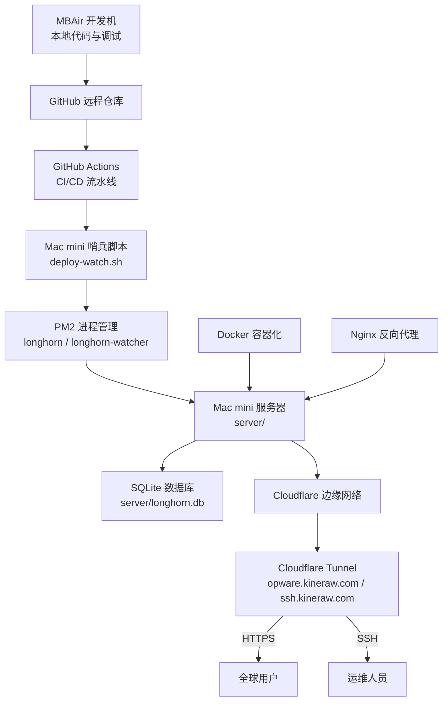

## 详细组件分析

### 容器化部署方案
新的容器化部署方案提供了现代化的部署方式，支持 Docker 多阶段构建和 docker-compose 编排。

#### Docker 多阶段构建
Dockerfile 实现了两阶段构建，优化镜像大小和构建效率：

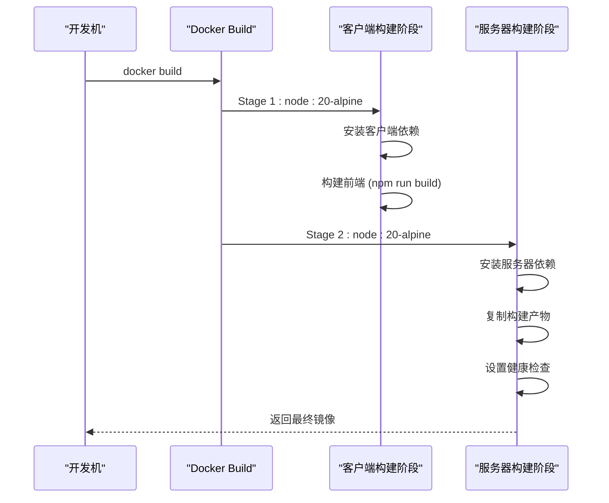

**图表来源**
- [Dockerfile](file://Dockerfile#L1-L48)

#### docker-compose 编排配置
docker-compose.yml 提供了完整的容器编排配置，支持可选的 Nginx 反向代理：

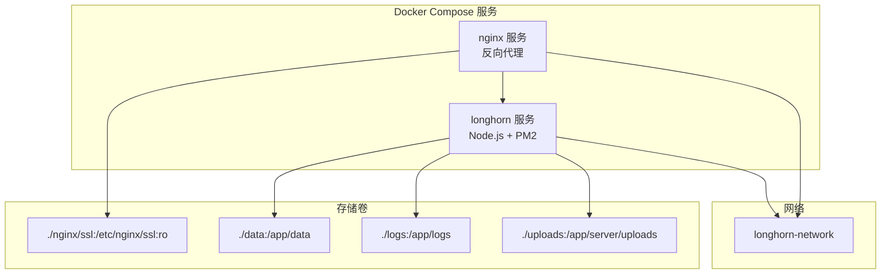

**图表来源**
- [docker-compose.yml](file://docker-compose.yml#L1-L52)

#### Nginx 反向代理配置
Nginx 配置提供了完整的反向代理功能，支持 HTTPS、负载均衡和静态文件服务：

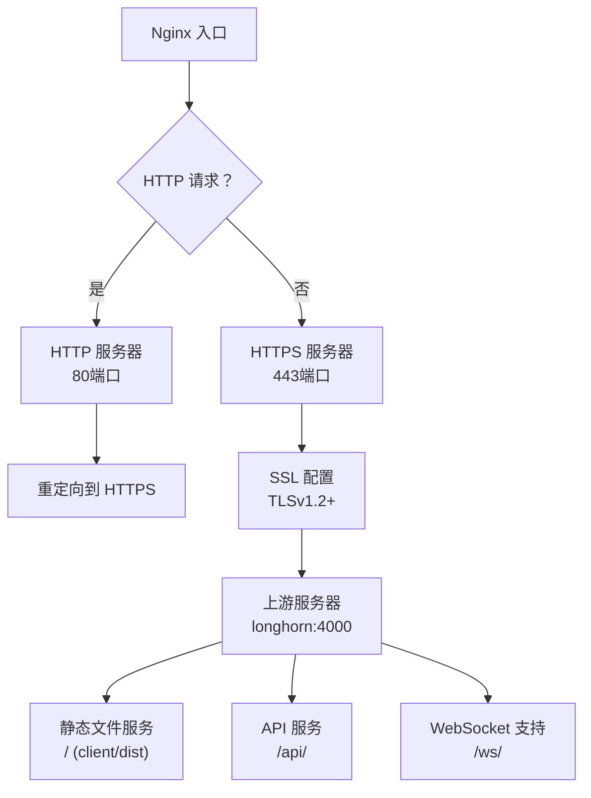

**图表来源**
- [nginx/nginx.conf](file://nginx/nginx.conf#L1-L96)

#### GitHub Actions 自动化部署
GitHub Actions 工作流提供了完整的 CI/CD 流水线，支持自动化构建、测试和部署：

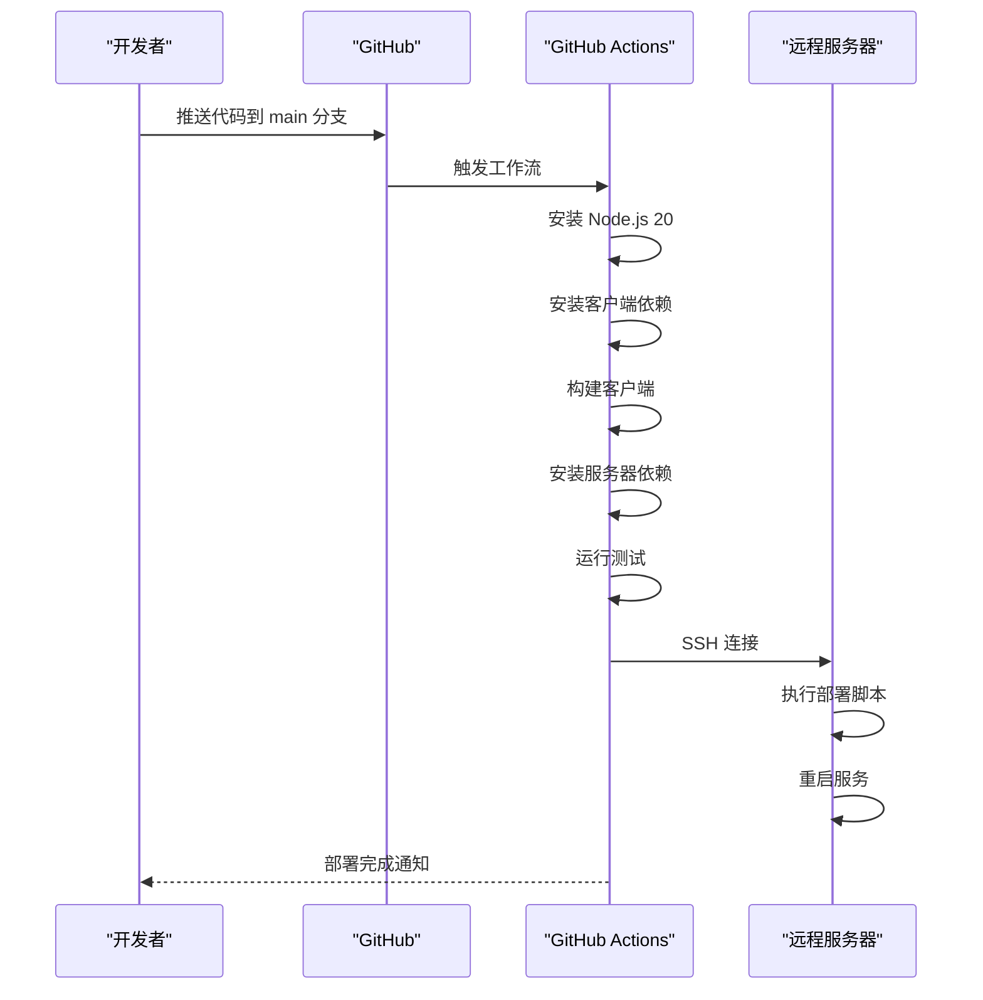

**图表来源**
- [.github/workflows/deploy.yml](file://.github/workflows/deploy.yml#L1-L72)

**章节来源**
- [Dockerfile](file://Dockerfile#L1-L48)
- [docker-compose.yml](file://docker-compose.yml#L1-L52)
- [nginx/nginx.conf](file://nginx/nginx.conf#L1-L96)
- [.github/workflows/deploy.yml](file://.github/workflows/deploy.yml#L1-L72)

### 标准化远程部署程序
自动化部署由"本地推送 -> 云端检测 -> 服务器构建与重启"构成，确保零停机与一致性。新的部署脚本支持三种部署模式：

#### 快速部署模式（默认）
快速部署模式适用于日常开发和小规模更新，通过本地构建和增量同步实现快速部署：

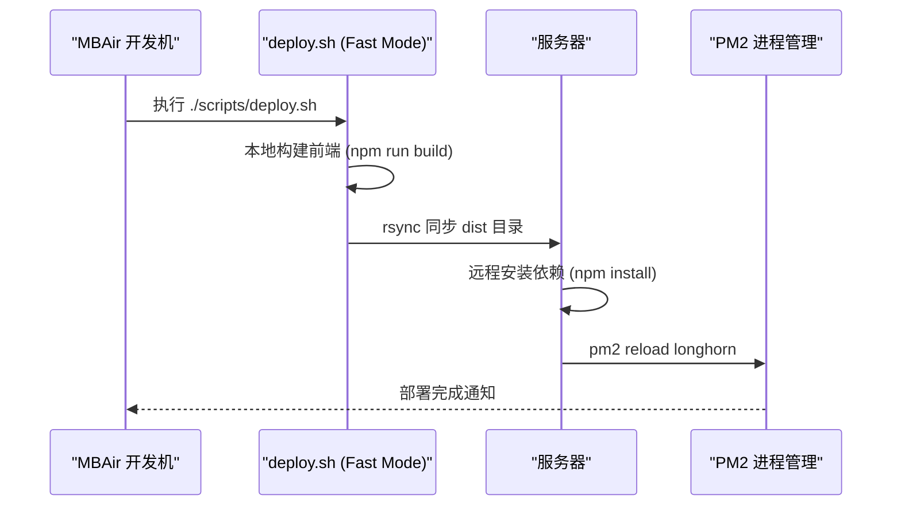

**图表来源**
- [scripts/deploy.sh](file://scripts/deploy.sh#L91-L140)

#### 原子部署模式
原子部署模式适用于生产环境的重大更新，通过打包和原子替换确保部署的一致性：

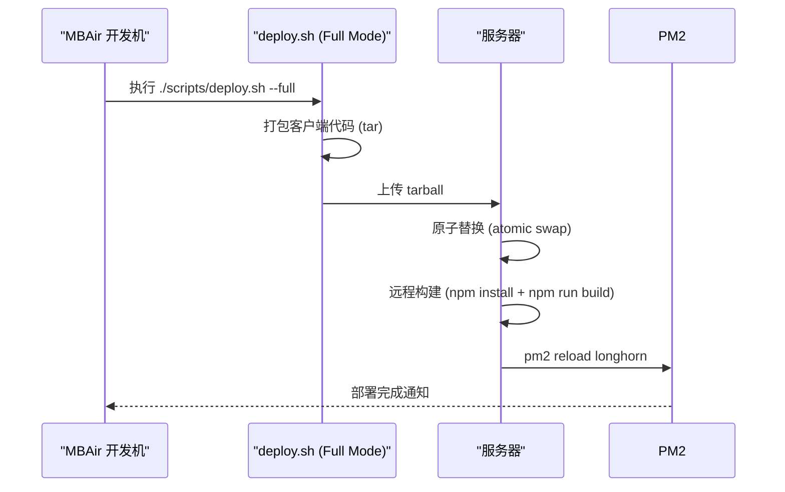

**图表来源**
- [scripts/deploy.sh](file://scripts/deploy.sh#L141-L209)

#### 智能变更检测与缓存优化
新的部署脚本引入了智能变更检测和构建缓存机制：

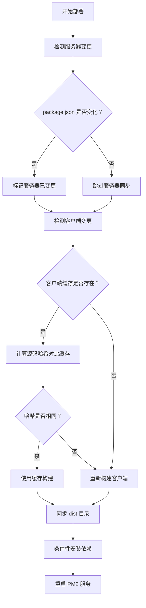

**图表来源**
- [scripts/deploy.sh](file://scripts/deploy.sh#L95-L139)

#### 命令行参数支持
新的部署脚本支持以下命令行参数：

- `--full`：启用原子部署模式（默认为快速部署模式）
- `--git`：启用 Git 同步模式，自动提交和推送代码
- `--force-server`：强制服务器同步，忽略变更检测

**章节来源**
- [scripts/deploy.sh](file://scripts/deploy.sh#L24-L36)
- [scripts/deploy.sh](file://scripts/deploy.sh#L56-L86)
- [scripts/deploy.sh](file://scripts/deploy.sh#L95-L115)

### 完整部署与健壮性部署
新的部署脚本提供了更完整的部署流程和健壮性部署选项：

#### 完整部署脚本
deploy_complete.sh 提供了完整的部署流程，包括数据库迁移和批量索引：

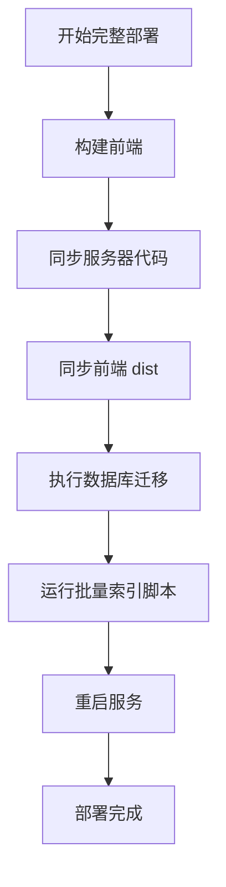

**图表来源**
- [scripts/deploy_complete.sh](file://scripts/deploy_complete.sh#L1-L61)

#### 健壮性部署脚本
deploy_robust.sh 提供了更稳定的部署流程，包含压缩禁用和延迟机制：

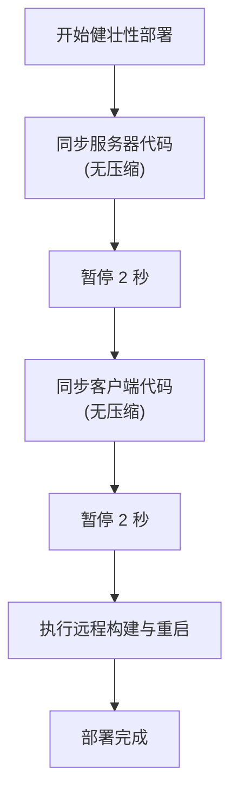

**图表来源**
- [scripts/deploy_robust.sh](file://scripts/deploy_robust.sh#L1-L68)

**章节来源**
- [scripts/deploy_complete.sh](file://scripts/deploy_complete.sh#L1-L61)
- [scripts/deploy_robust.sh](file://scripts/deploy_robust.sh#L1-L68)

### 构建完整性验证流程
新的部署脚本建立了更严格的构建完整性验证流程，确保生产环境运行的是期望的代码：

#### 四项验证要求
1. **物理清理**：执行 `npm run build` 前，必须物理删除旧的 `dist` 目录
2. **报错拦截**：严禁忽略构建报错。若 TypeScript 报错或打包中止，严禁同步至服务器
3. **产物存在性校验**：部署前验证 `ls -la dist/index.html`
4. **混淆包内容校验**：部署后必须使用 `grep` 验证关键代码已进入混淆后的 JS 包

#### 智能缓存机制
部署脚本引入了智能缓存机制来优化构建性能：

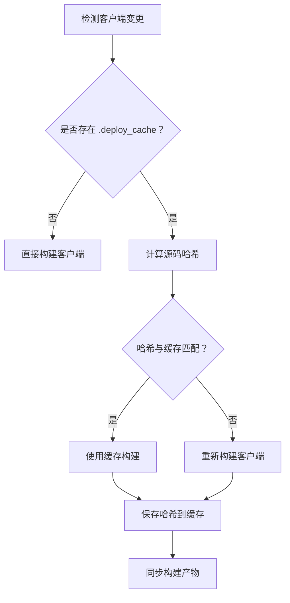

**图表来源**
- [scripts/deploy.sh](file://scripts/deploy.sh#L95-L115)

**章节来源**
- [scripts/deploy.sh](file://scripts/deploy.sh#L112-L115)

### 版本管理规范
新的版本管理规范明确了软件版本号管理和自动递增机制：

#### 版本号格式
- **软件版本**：在 `package.json` 中维护，格式 `X.Y.Z`
- **自动递增**：每次修改代码后自动递增 Z 位
- **版本记录**：通过 Git 标签和提交历史追踪版本变更

#### 当前版本信息
- **客户端版本**：12.3.131（从 12.3.107 升级而来）
- **服务器版本**：1.8.3（从 1.7.88 升级而来）

#### 版本发布流程
1. 代码变更完成后自动递增版本号
2. 创建 Git 标签标记版本
3. 推送标签到远程仓库
4. 自动触发 CI/CD 流水线进行部署

**章节来源**
- [client/package.json](file://client/package.json#L4)
- [server/package.json](file://server/package.json#L3)

### 健康检查与自动恢复
健康检查脚本对端口、数据库结构与服务状态进行评估，并在必要时自动启动服务。

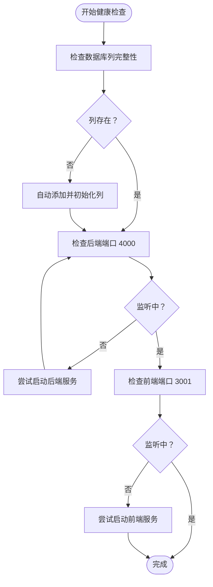

**图表来源**
- [scripts/health-check.sh](file://scripts/health-check.sh#L1-L115)
- [scripts/db-validate.sh](file://scripts/db-validate.sh#L1-L52)

**章节来源**
- [scripts/health-check.sh](file://scripts/health-check.sh#L1-L115)
- [scripts/db-validate.sh](file://scripts/db-validate.sh#L1-L52)

### 数据库维护与修复
数据库维护包括结构校验、列修复与数据修复脚本，以及服务器端迁移脚本。

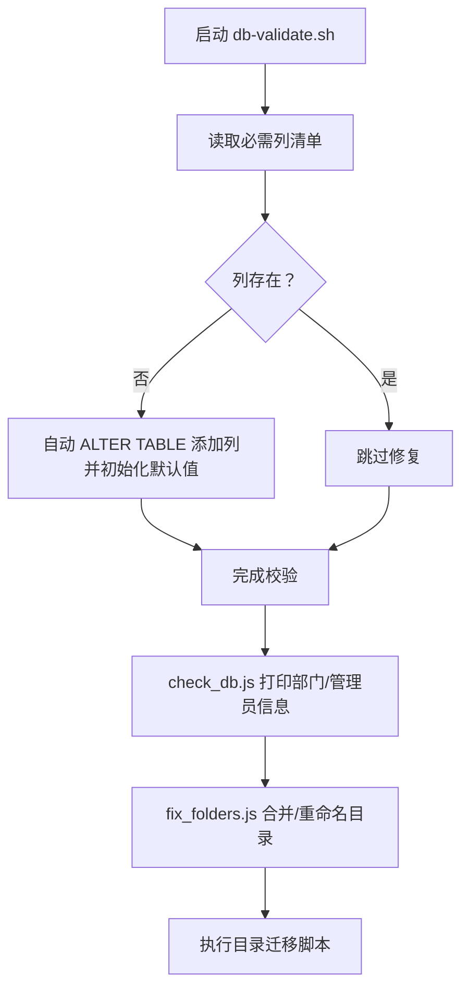

**章节来源**
- [scripts/db-validate.sh](file://scripts/db-validate.sh#L1-L52)
- [scripts/check_db.js](file://scripts/check_db.js#L1-L20)
- [scripts/fix_folders.js](file://scripts/fix_folders.js#L1-L62)

### 环境初始化与依赖安装
一键初始化脚本负责 Homebrew、Node.js、Git、PM2、Cloudflared 的安装与项目依赖构建。

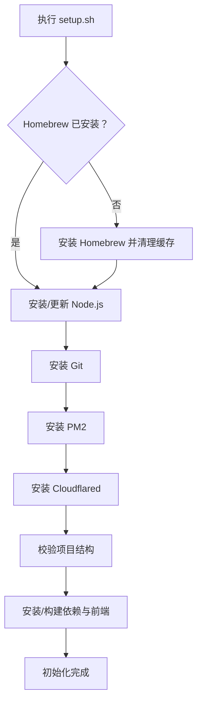

**图表来源**
- [scripts/setup.sh](file://scripts/setup.sh#L1-L112)

#### 服务器环境搭建
setup-server.sh 专门用于远程服务器的一次性环境搭建：

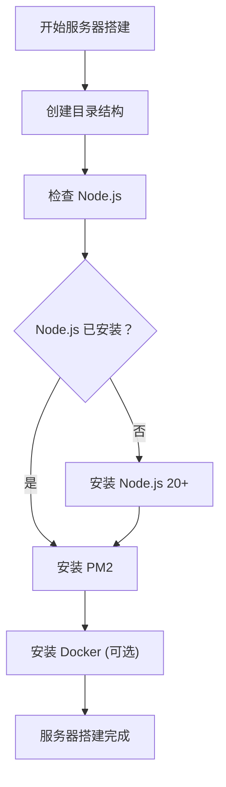

**图表来源**
- [scripts/setup-server.sh](file://scripts/setup-server.sh#L1-L58)

**章节来源**
- [scripts/setup.sh](file://scripts/setup.sh#L1-L112)
- [scripts/setup-server.sh](file://scripts/setup-server.sh#L1-L58)

### 网络与公网访问（Cloudflare Tunnel）
公网访问通过 Cloudflare Tunnel 将本地服务映射到 HTTPS/SSH，无需公网 IP 与复杂防火墙配置。

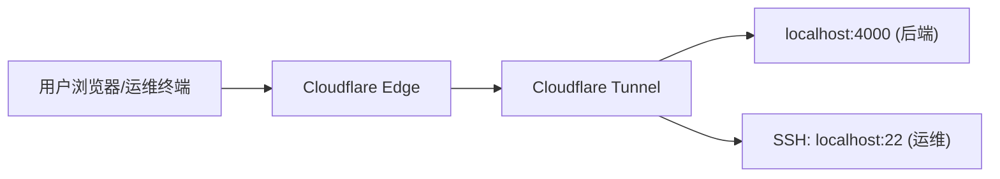

**章节来源**
- [scripts/deploy-watch.sh](file://scripts/deploy-watch.sh#L1-L34)

### 日志管理与监控策略
- PM2 日志：通过 ecosystem.config.js 配置日志文件与合并策略，便于集中查看。
- 实时日志：运维可通过 pm2 logs longhorn 与 pm2 logs longhorn-watcher 查看运行日志。
- 健康检查：定期执行 health-check.sh，结合数据库校验脚本，提前发现潜在问题。
- Docker 日志：使用 docker-compose logs -f longhorn 查看容器日志。

**章节来源**
- [scripts/ecosystem.config.js](file://scripts/ecosystem.config.js#L30-L38)
- [scripts/health-check.sh](file://scripts/health-check.sh#L1-L115)

### 数据库备份与恢复
- 备份：cp server/longhorn.db server/longhorn_backup_$(date +%Y%m%d).db。
- 修复后同步：使用 sync-db.sh 将本地修复后的数据库覆盖到服务器，随后重启 PM2。
- 迁移：如涉及结构变更，执行目录迁移脚本并确认数据库校验通过。

**章节来源**
- [scripts/sync-db.sh](file://scripts/sync-db.sh#L1-L28)

### 版本升级与紧急恢复
- 标准升级：在本地完成代码提交与推送，哨兵脚本检测到差异后自动执行部署与 PM2 重启。
- 紧急恢复：若自动更新失效，可在服务器执行 npm run deploy 或 ./update.sh，或手动运行 deploy-watch.sh。
- 一键回滚：PM2 支持 graceful reload 与重启策略，必要时可 pm2 stop / pm2 delete 并重新启动。
- 容器化恢复：使用 docker-compose down && docker-compose up -d 恢复容器服务。

**章节来源**
- [scripts/deploy.sh](file://scripts/deploy.sh#L1-L224)
- [scripts/update.sh](file://scripts/update.sh#L1-L33)
- [scripts/deploy-watch.sh](file://scripts/deploy-watch.sh#L1-L34)

## 依赖关系分析
- 组件耦合
  - server/index.js 依赖 better-sqlite3、express、cors、compression、multer、sharp 等模块。
  - scripts/* 脚本与 server/index.js、PM2 配置强相关，共同决定部署与运行行为。
  - Dockerfile 依赖 Node.js 20 Alpine 基础镜像。
  - docker-compose.yml 依赖 Dockerfile 和 Nginx 镜像。
- 外部依赖
  - Cloudflare Tunnel 提供公网访问与安全防护。
  - Homebrew、Node.js、PM2、Git 等系统工具支撑自动化部署与运行。
  - Docker 和 Docker Compose 提供容器化部署支持。
  - GitHub Actions 提供 CI/CD 自动化部署。
- 潜在风险
  - 不同架构（Intel vs M1）导致 node_modules 不兼容，应避免将 node_modules 提交或拷贝到服务器。
  - 数据库文件 longhorn.db 被 .gitignore 排除，生产数据不会被代码同步覆盖，需通过 API 或脚本进行备份与同步。
  - 容器网络配置可能影响服务间通信。

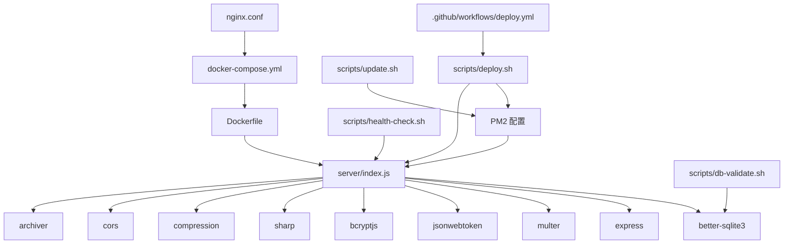

**图表来源**
- [server/index.js](file://server/index.js#L1-L200)
- [server/package.json](file://server/package.json#L15-L39)
- [scripts/deploy.sh](file://scripts/deploy.sh#L1-L224)
- [scripts/update.sh](file://scripts/update.sh#L1-L33)
- [scripts/health-check.sh](file://scripts/health-check.sh#L1-L115)
- [scripts/db-validate.sh](file://scripts/db-validate.sh#L1-L52)
- [scripts/ecosystem.config.js](file://scripts/ecosystem.config.js#L1-L41)
- [Dockerfile](file://Dockerfile#L1-L48)
- [docker-compose.yml](file://docker-compose.yml#L1-L52)
- [.github/workflows/deploy.yml](file://.github/workflows/deploy.yml#L1-L72)

**章节来源**
- [server/package.json](file://server/package.json#L1-L40)
- [server/index.js](file://server/index.js#L1-L200)
- [scripts/deploy.sh](file://scripts/deploy.sh#L1-L224)
- [scripts/update.sh](file://scripts/update.sh#L1-L33)
- [scripts/health-check.sh](file://scripts/health-check.sh#L1-L115)
- [scripts/db-validate.sh](file://scripts/db-validate.sh#L1-L52)
- [scripts/ecosystem.config.js](file://scripts/ecosystem.config.js#L1-L41)
- [Dockerfile](file://Dockerfile#L1-L48)
- [docker-compose.yml](file://docker-compose.yml#L1-L52)
- [.github/workflows/deploy.yml](file://.github/workflows/deploy.yml#L1-L72)

## 性能考量
- 集群模式：PM2 使用 cluster 模式，实例数为 max（M1 8 核），充分利用 CPU 资源。
- 优雅重启：wait_ready、listen_timeout、kill_timeout 避免部署过程中的请求中断。
- 内存限制：max_memory_restart 500M，防止内存泄漏导致服务不稳定。
- 数据库 WAL：WAL 模式提升并发读写性能，减少锁竞争。
- 压缩与跨域：启用 compression 与 cors，降低带宽消耗并支持跨域访问。
- 图片处理：sharp 用于缩略图生成，建议在服务器侧预热并合理配置缓存目录。
- 构建缓存：智能缓存机制减少重复构建时间，提升部署效率。
- 容器化优势：Docker 多阶段构建减少镜像大小，优化启动时间。
- Nginx 优化：启用 keepalive 连接池，支持 HTTP/2，提升并发性能。
- GitHub Actions：并行执行构建和测试，缩短 CI/CD 周期。

**章节来源**
- [scripts/ecosystem.config.js](file://scripts/ecosystem.config.js#L7-L22)
- [scripts/deploy.sh](file://scripts/deploy.sh#L95-L115)
- [server/index.js](file://server/index.js#L28-L31)
- [Dockerfile](file://Dockerfile#L43-L44)
- [nginx/nginx.conf](file://nginx/nginx.conf#L24-L27)

## 故障排除指南
- 服务未运行
  - 使用 health-check.sh 检查端口与服务状态，必要时自动启动。
  - 若端口占用或进程异常，使用 pm2 list / pm2 logs longhorn 查看详细日志。
  - 对于容器化部署，使用 docker-compose logs longhorn 查看容器日志。
- 数据库问题
  - 使用 db-validate.sh 修复缺失列；使用 check_db.js 打印部门与管理员信息辅助诊断。
  - 如需修复目录结构，执行 fix_folders.js 或服务器迁移脚本。
- 网络访问异常
  - 检查 cloudflared 是否运行；确认 Cloudflare Dashboard 的 Tunnel 状态为 Active。
  - 若 DNS 冲突，清理 Cloudflare DNS 记录后重新添加。
  - 对于 Nginx 问题，检查 nginx.conf 配置和证书文件。
- 自动部署失败
  - 手动执行 npm run deploy 或 ./update.sh；检查 deploy-watch.sh 是否被阻塞。
  - 对于 GitHub Actions 失败，检查工作流日志和 SSH 密钥配置。
- SSH 访问失败
  - 确保 MBAir 安装并配置 cloudflared；在 ~/.ssh/config 中正确配置 ProxyCommand。
- 构建验证失败
  - 检查 dist 目录是否正确清理；验证构建报错并修复后再部署。
  - 使用 grep 验证混淆包内容是否包含预期代码。
- 部署缓存问题
  - 删除 .deploy_cache 目录清空构建缓存。
  - 使用 --force-server 参数强制服务器同步。
- 容器化问题
  - 使用 docker-compose ps 检查容器状态。
  - 使用 docker-compose down && docker-compose up -d 重启服务。
  - 检查卷挂载路径和权限设置。
- Nginx 问题
  - 检查 SSL 证书路径和权限。
  - 验证 upstream 配置指向正确的服务。
  - 检查防火墙和端口开放情况。

**章节来源**
- [scripts/health-check.sh](file://scripts/health-check.sh#L1-L115)
- [scripts/db-validate.sh](file://scripts/db-validate.sh#L1-L52)
- [scripts/check_db.js](file://scripts/check_db.js#L1-L20)
- [scripts/fix_folders.js](file://scripts/fix_folders.js#L1-L62)
- [scripts/deploy.sh](file://scripts/deploy.sh#L216-L224)
- [docker-compose.yml](file://docker-compose.yml#L1-L52)
- [nginx/nginx.conf](file://nginx/nginx.conf#L1-L96)

## 结论
Longhorn 的生产部署以标准化为核心，结合 PM2 与 Cloudflare Tunnel 实现高可用与安全访问。通过完善的健康检查、数据库校验、构建完整性验证与一键部署脚本，系统能够在最小停机时间内完成版本升级与故障恢复。新的容器化部署方案提供了现代化的部署方式，支持 Docker 多阶段构建、docker-compose 编排和 Nginx 反向代理。GitHub Actions 自动化部署工作流实现了完整的 CI/CD 流水线。增强的部署脚本提供了快速部署模式、原子部署模式、完整部署模式和健壮性部署模式，满足不同场景下的部署需求。新的部署脚本提供了快速部署模式、原子部署模式和智能缓存优化，满足不同场景下的部署需求。增强的变更检测机制和错误处理能力进一步提升了部署的稳定性和可靠性。建议持续完善日志与监控策略，定期进行数据库备份与目录结构审查，确保长期稳定运行。

## 附录
- 快速开始（本地开发）
  - cd client && npm run dev（端口 3001）
  - cd server && npm run dev（端口 4000）
- 容器化部署
  - docker-compose up -d（基础部署）
  - docker-compose --profile with-nginx up -d（带 Nginx）
  - docker-compose logs -f longhorn（查看日志）
- 公网访问
  - HTTPS：opware.kineraw.com -> localhost:4000
  - SSH：ssh.kineraw.com -> localhost:22
- 常用运维命令
  - pm2 logs longhorn / pm2 logs longhorn-watcher
  - ./health-check.sh
  - ./db-validate.sh
  - cp server/longhorn.db server/longhorn_backup_$(date +%Y%m%d).db
  - docker-compose down && docker-compose up -d
- 部署模式选择
  - 快速部署：./scripts/deploy.sh（默认，适合日常开发）
  - 原子部署：./scripts/deploy.sh --full（适合生产发布）
  - Git 同步：./scripts/deploy.sh --git（自动提交和推送）
  - 强制同步：./scripts/deploy.sh --force-server（强制服务器同步）
  - 完整部署：./scripts/deploy_complete.sh（包含数据库迁移）
  - 健壮性部署：./scripts/deploy_robust.sh（无压缩，带延迟）
- 构建缓存管理
  - 清空缓存：删除 .deploy_cache 目录
  - 查看缓存状态：检查 .deploy_cache/client_hash 文件
- 标准化远程操作
  - SSH 连接：ssh mini
  - 远程命令格式：ssh mini "/bin/zsh -l -c 'cd /Users/admin/Documents/server/Longhorn/server && <命令>'"
  - 数据库调试：ssh mini "/bin/zsh -l -c 'sqlite3 ~/Documents/server/Longhorn/server/longhorn.db \"SELECT ...\"'"
- 构建验证流程
  - 物理清理：rm -rf client/dist
  - 产物校验：ls -la client/dist/index.html
  - 内容验证：grep -q "expected_code" client/dist/build.js
- GitHub Actions 配置
  - 在 GitHub 仓库中配置 SSH 私钥、主机和用户名密钥
  - 推送到 main 分支自动触发部署
  - 支持分支保护和状态检查
- Nginx 配置要点
  - SSL 证书路径：./nginx/ssl/cert.pem 和 key.pem
  - 客户端最大上传大小：50MB
  - 启用 HTTP/2 和 keepalive 连接池
  - 支持 WebSocket 升级