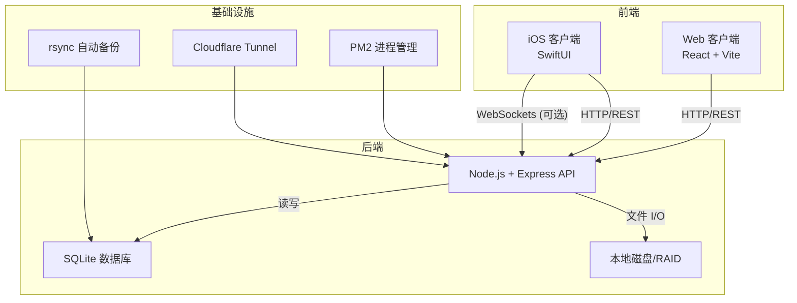
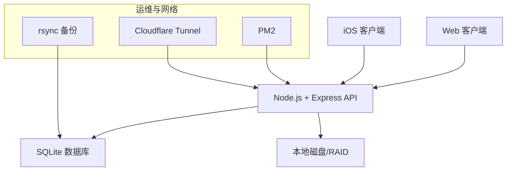
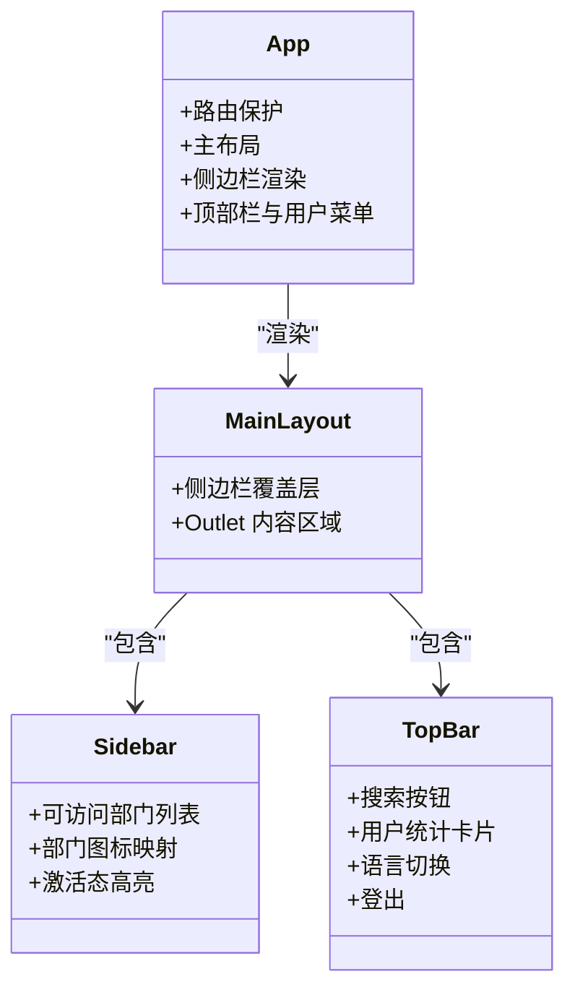
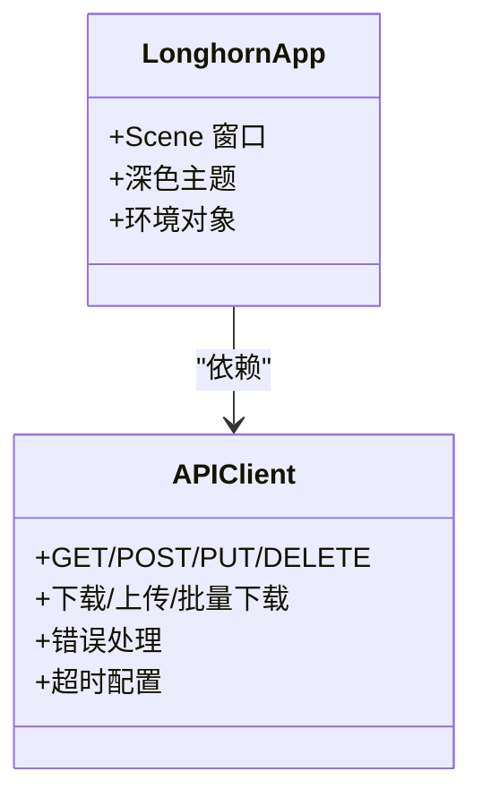
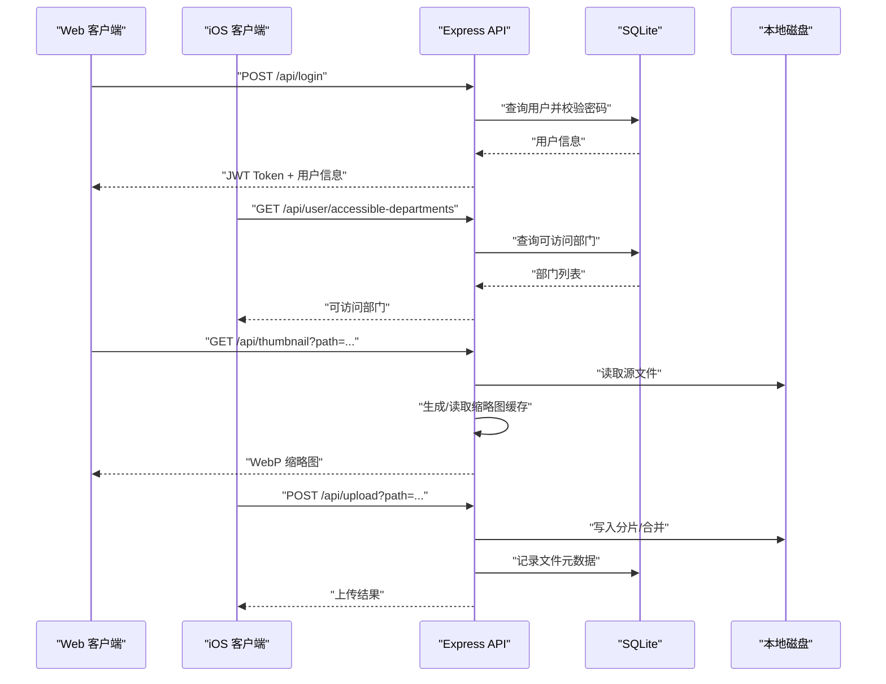
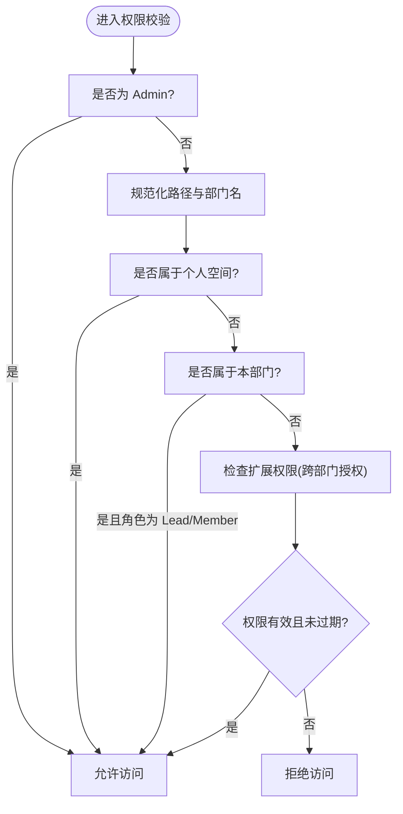
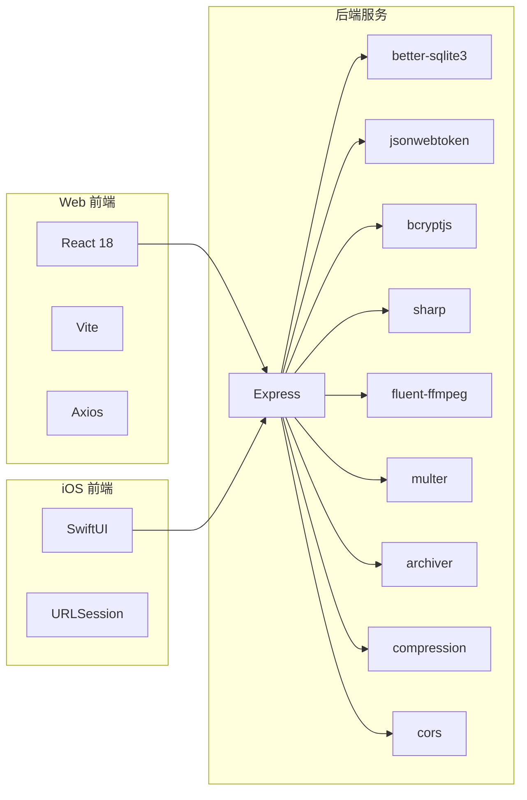

# 项目概述

<cite>
**本文引用的文件**   
- [Longhorn.md](file://Longhorn.md)
- [SYSTEM_CONTEXT.md](file://docs/SYSTEM_CONTEXT.md)
- [3_PRD.md](file://docs/3_PRD.md)
- [server/README.md](file://server/README.md)
- [client/README.md](file://client/README.md)
- [ios/README.md](file://ios/README.md)
- [server/index.js](file://server/index.js)
- [client/src/App.tsx](file://client/src/App.tsx)
- [ios/LonghornApp/LonghornApp.swift](file://ios/LonghornApp/LonghornApp.swift)
- [ios/LonghornApp/Services/APIClient.swift](file://ios/LonghornApp/Services/APIClient.swift)
- [server/migrations/phase2.sql](file://server/migrations/phase2.sql)
- [package.json](file://package.json)
- [client/vite.config.ts](file://client/vite.config.ts)
</cite>

## 目录
1. [简介](#简介)
2. [项目结构](#项目结构)
3. [核心组件](#核心组件)
4. [架构总览](#架构总览)
5. [详细组件分析](#详细组件分析)
6. [依赖分析](#依赖分析)
7. [性能考虑](#性能考虑)
8. [故障排查指南](#故障排查指南)
9. [结论](#结论)
10. [附录](#附录)

## 简介
Longhorn 是 Kinefinity 团队打造的企业级本地数据协作系统，定位为“三端合一”的协同文件平台，覆盖 Web、iOS 与 Server 后端。其核心目标是提供安全、高效的局域网/广域网文件访问能力，结合多级权限管理与跨部门协作，支撑团队在不同场景下的数据共享与管理需求。

- 产品定位：企业内部轻量级文件管理与协作系统，强调部门隔离与精细授权。
- 核心价值：部门隔离与协作、灵活权限体系、现代化体验（深色模式、毛玻璃 UI）、零成本部署（Node.js + SQLite + Cloudflare Tunnel）。
- 三端协同：Web 管理后台与文件浏览器、iOS 原生应用、Node.js + SQLite 服务端统一 API。

章节来源
- file://Longhorn.md#L1-L71
- file://docs/3_PRD.md#L10-L20

## 项目结构
Longhorn 仓库包含三个主要子项目与若干文档、脚本与迁移文件：
- client：基于 React/Vite 的 Web 前端，提供文件浏览、搜索、权限管理、分享等能力。
- ios：基于 SwiftUI 的 iOS 原生应用，提供移动端文件查阅、个人空间管理与缓存预览。
- server：基于 Node.js + Express + SQLite 的后端服务，提供认证、文件 I/O、权限校验、缩略图生成、分片上传等核心能力。
- docs：系统上下文、PRD、运维与部署手册等文档。
- scripts：部署、健康检查、数据库同步与备份等自动化脚本。
- server/migrations：数据库迁移脚本（如星标、分享链接等）。

图表来源
- [Longhorn.md](file://Longhorn.md#L47-L66)
- [SYSTEM_CONTEXT.md](file://docs/SYSTEM_CONTEXT.md#L7-L21)
- [server/README.md](file://server/README.md#L1-L32)

章节来源
- file://Longhorn.md#L11-L44
- file://client/README.md#L1-L35
- file://ios/README.md#L1-L27
- file://server/README.md#L1-L32

## 核心组件
- Web 客户端（React/Vite）
  - 路由与布局：基于 React Router 的主布局与侧边栏，支持个人空间、部门空间、快捷入口、回收站、仪表盘等页面。
  - 权限与认证：通过 JWT 认证，侧边栏动态加载可访问部门列表；路由层保护敏感页面。
  - 文件能力：文件浏览、搜索、收藏、分享、最近文件、回收站等。
  - 版本注入：构建时注入版本、提交时间、构建时间等信息，便于追踪与排障。
- iOS 客户端（SwiftUI）
  - 应用入口：统一的 App 场景与深色主题偏好。
  - 网络层：APIClient 封装 GET/POST/DELETE/PUT，支持文件下载、批量下载、上传与错误处理。
  - 缓存与预览：FileCacheManager/PreviewCacheManager 实现后台刷新与本地预览缓存，提升加载性能。
  - 体验：自定义预览 Sheet、手势交互（下拉关闭、上拉详情）与响应式布局。
- 服务端（Node.js + Express + SQLite）
  - 认证中间件：JWT 校验，拉取最新用户角色与部门信息。
  - 权限校验：三级权限（只读/贡献/完全），支持个人空间、部门空间与扩展授权。
  - 文件处理：分片上传、缩略图生成（sharp/ffmpeg）、HEIC 转 JPEG、缓存策略与范围请求支持。
  - 数据模型：用户、部门、权限、星标、分享链接等，配合索引优化查询。
  - 健康检查与调试：/api/status、/api/debug/info 等端点辅助诊断。

章节来源
- file://client/src/App.tsx#L66-L126
- file://client/vite.config.ts#L58-L81
- file://ios/LonghornApp/LonghornApp.swift#L12-L25
- file://ios/LonghornApp/Services/APIClient.swift#L38-L110
- file://server/index.js#L267-L353
- file://server/index.js#L481-L679
- file://server/migrations/phase2.sql#L1-L32

## 架构总览
Longhorn 采用“三端合一”的分层架构：
- 前端层：Web 与 iOS 通过 HTTP/REST 与可选 WebSocket 与后端通信。
- 服务层：Node.js + Express 提供统一 API，负责认证、权限、文件 I/O、缩略图与缓存。
- 数据层：SQLite 存储用户、部门、权限、星标、分享链接等元数据；本地磁盘/RAID 存储实际文件。
- 基础设施：PM2 进程管理、Cloudflare Tunnel 提供公网访问、rsync 自动备份保障数据安全。

图表来源
- [Longhorn.md](file://Longhorn.md#L47-L66)
- [SYSTEM_CONTEXT.md](file://docs/SYSTEM_CONTEXT.md#L7-L21)
- [server/README.md](file://server/README.md#L1-L32)

## 详细组件分析

### Web 客户端（React/Vite）组件关系
Web 客户端以 App 为核心，通过路由组织页面与权限控制，侧边栏根据用户角色与可访问部门动态渲染。

图表来源
- [client/src/App.tsx](file://client/src/App.tsx#L38-L126)

章节来源
- file://client/src/App.tsx#L66-L126

### iOS 客户端（SwiftUI）组件关系
iOS 客户端以 App 为入口，通过 APIClient 统一发起网络请求，结合缓存与预览组件提升性能与体验。

图表来源
- [ios/LonghornApp/LonghornApp.swift](file://ios/LonghornApp/LonghornApp.swift#L12-L25)
- [ios/LonghornApp/Services/APIClient.swift](file://ios/LonghornApp/Services/APIClient.swift#L38-L110)

章节来源
- file://ios/LonghornApp/LonghornApp.swift#L12-L25
- file://ios/LonghornApp/Services/APIClient.swift#L38-L110

### 服务端（Node.js + Express + SQLite）处理流程
服务端围绕认证、权限与文件处理展开，关键流程如下：

图表来源
- [server/index.js](file://server/index.js#L683-L713)
- [server/index.js](file://server/index.js#L715-L756)
- [server/index.js](file://server/index.js#L481-L679)
- [server/index.js](file://server/index.js#L792-L840)

章节来源
- file://server/index.js#L267-L353
- file://server/index.js#L481-L679
- file://server/index.js#L683-L713
- file://server/index.js#L715-L756
- file://server/index.js#L792-L840

### 权限与路径解析算法
权限判定与路径解析是系统的关键逻辑，确保部门隔离与跨部门授权的正确性。

图表来源
- [server/index.js](file://server/index.js#L300-L353)

章节来源
- file://server/index.js#L300-L353

## 依赖分析
- 前端依赖
  - Web：React 18、Vite、Lucide React、TailwindCSS、Axios、Zustand 等。
  - iOS：SwiftUI、Foundation、URLSession、UserDefaults。
- 后端依赖
  - Express、better-sqlite3、bcryptjs、jsonwebtoken、sharp、fluent-ffmpeg、multer、archiver、compression、cors。
- 构建与运维
  - 根 package.json 提供统一安装与部署脚本；Vite 注入版本信息；PM2 管理进程；Cloudflare Tunnel 提供公网访问；rsync 自动备份。

图表来源
- [client/README.md](file://client/README.md#L5-L10)
- [ios/README.md](file://ios/README.md#L5-L9)
- [server/README.md](file://server/README.md#L5-L10)
- [SYSTEM_CONTEXT.md](file://docs/SYSTEM_CONTEXT.md#L24-L48)

章节来源
- file://client/README.md#L5-L10
- file://ios/README.md#L5-L9
- file://server/README.md#L5-L10
- file://SYSTEM_CONTEXT.md#L24-L48
- file://package.json#L4-L13

## 性能考虑
- 缩略图生成与缓存
  - 使用 sharp 处理图片，ffmpeg/sips 处理视频与 HEIC；采用队列与并发限制避免 CPU/IO 过载；缓存策略基于文件修改时间与原子写入，减少重复生成。
- 文件上传
  - 分片上传与断点续传，降低网络波动影响；服务端合并与校验，保证数据一致性。
- 前端性能
  - Web 侧启用压缩与范围请求；iOS 侧缓存预览图与后台刷新；构建时注入版本信息，便于灰度与回滚。
- 数据库与索引
  - 星标与分享链接建立索引，加速查询；WAL 模式提升并发读写性能。
- 基础设施
  - PM2 进程守护与自动部署；Cloudflare Tunnel 提供稳定外网访问；定期备份保障数据安全。

章节来源
- file://server/index.js#L481-L679
- file://server/migrations/phase2.sql#L27-L32
- file://SYSTEM_CONTEXT.md#L67-L88

## 故障排查指南
- 常见问题
  - 侧边栏部门重复：数据库脏数据导致，需清理旧中文名部门记录。
  - 未知上传者：历史文件路径格式差异导致，已通过匹配修复。
  - iOS 预览黑屏：确保使用绑定触发 fullScreenCover，而非布尔开关。
  - M1 GPU 限制：ffmpeg 主要依赖 CPU，大量并发视频处理可能导致服务卡顿。
- 运维命令
  - 查看日志：pm2 logs longhorn
  - 健康检查：./health-check.sh
  - 数据库备份：cp server/longhorn.db server/longhorn_backup.db
- 调试端点
  - /api/status：健康状态
  - /api/debug/info：用户、部门、路径解析与权限检查信息

章节来源
- file://SYSTEM_CONTEXT.md#L72-L88
- file://server/index.js#L477-L480
- file://server/index.js#L758-L790

## 结论
Longhorn 通过“三端合一”的架构设计，在企业内部实现了安全、高效的文件协作与管理。Web 与 iOS 提供一致的用户体验，服务端以 Node.js + SQLite 为基础，结合严格的权限体系与缓存策略，兼顾易用性与性能。随着持续的功能迭代与运维完善，Longhorn 能够满足从个人空间到跨部门协作的多样化需求。

## 附录
- 快速开始
  - Web：cd client && npm run dev（端口 3001）
  - Server：cd server && npm run dev（端口 4000）
  - iOS：打开 Xcode 工程 LonghornApp.xcodeproj，Target: LonghornApp（iPhone/iPad）
- 文档索引
  - PRD、开发日志、运维与部署手册、iOS 开发指南等

章节来源
- file://Longhorn.md#L20-L37
- file://client/README.md#L18-L31
- file://server/README.md#L21-L31
- file://ios/README.md#L20-L23