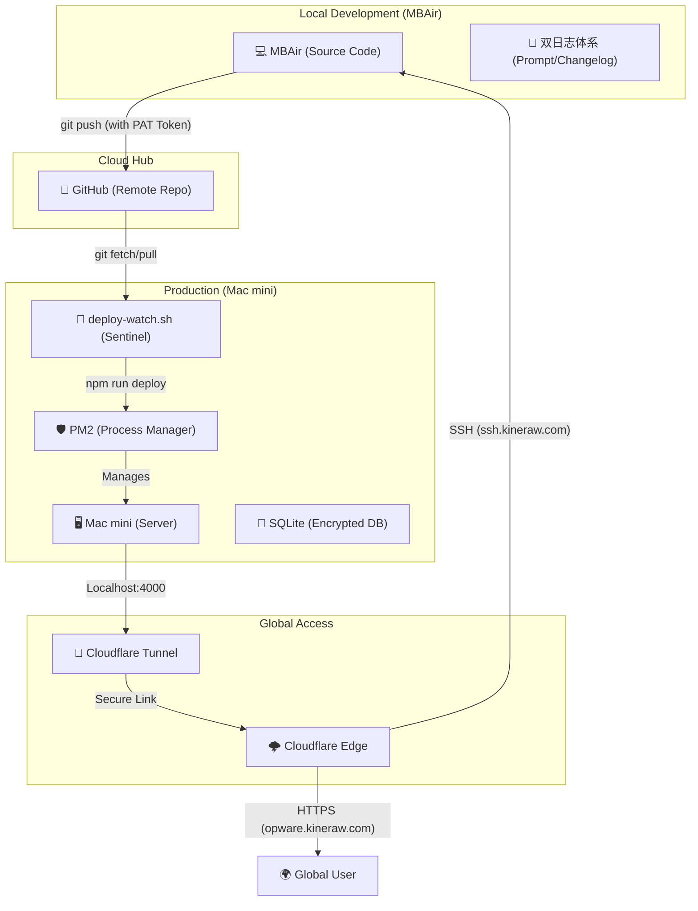

---
## 🗺️ 系统全景架构图

### 各级角色定义：

1.  **MBAir (开发者终端)**：唯一的代码编辑中心。通过 AI 指令一键同步变更，并携带认证令牌。
2.  **GitHub (代码中转站)**：系统的“中央大脑”。存储代码版本，并作为本地与远端同步的安全桥梁。
3.  **Mac mini (生产服务器)**：执行环境核心。
    -   **PM2**：保证服务 7x24 小时不掉线。
    -   **哨兵脚本**：每 60 秒自动对齐云端，实现无人值守更新。
4.  **Cloudflare (全球网关)**：系统的“防火墙”与“内网穿透器”。
    -   **Tunnel**：无需公网 IP，直接建立加密加密信道连接服务器。
    -   **Edge**：负责 SSL 加密、DDoS 防护及域名路由映射。

---

## �️ 服务运行清单 (Service Runtime List)

为了确保系统稳定，我们在两台机器上部署了以下关键服务：

### 1. Mac mini (Server 端) - 生产执行层
| 服务名称 | 运行方式 | 核心用途 |
| :--- | :--- | :--- |
| **`longhorn`** | PM2 进程 | **主程序**。提供前端静态页面及后端所有增删改查 API 接口。 |
| **`longhorn-watcher`** | PM2 进程 | **自动化哨兵**。即 `deploy-watch.sh`，负责感应 GitHub 变化并自动重启服务。 |
| **`cloudflared`** | 系统服务 | **内网穿透**。在不暴露 IP 的前提下，提供 `opware` (HTTPS) 和 `ssh` (SSH) 访问。 |
| **`sqlite3`** | 内嵌引擎 | **数据存储**。位于 `server/longhorn.db`，保存所有用户数据与文件元数据。 |

### 2. MBAir (Dev 端) - 开发调试层
| 服务名称 | 运行方式 | 核心用途 |
| :--- | :--- | :--- |
| **`vite dev server`** | `npm run dev` | **本地调试**。提供热更新的预览环境，让您在正式发布前测试 UI。 |
| **`cloudflared access`** | SSH 代理插件 | **安全握手**。作为 SSH 的 ProxyCommand 插件，实现跨外网的 22 端口建立连接。 |
| **`Git (Local)`** | 命令行工具 | **版本管理**。负责本地代码提交 (Commit) 与推送 (Push)。 |

---

## �🕒 时间线与核心动作

### 15:00 - 16:30 | 基础设施：Cloudflare Tunnel 攻坚
**目标**：将内网 Mac mini 通过隧道安全映射至 `opware.kineraw.com`。

-   **关键动作**：
    -   使用 `cloudflared` 建立名为 `longhorn-proxy` 的隧道。
    -   **重大阻碍**：安装服务时报错 `service is already installed`，但提示 `no such file or directory`。
    -   **解决方案**：手动执行“外科手术式”清理：`sudo rm /Library/LaunchDaemons/com.cloudflare.cloudflared.plist`，解除残留系统级配置。
    -   **成果**：成功安装服务并打通隧道，实现 HTTP (4000) 映射。

### 16:30 - 18:00 | DNS 迁移与路由冲突排查
**目标**：解决 GoDaddy 域名解析带来的路由报错。

-   **关键动作**：
    -   指导用户将 `kineraw.com` 的 NS 修改为 Cloudflare。
    -   **重大陷阱**：在 Cloudflare 仪表盘添加 Public Hostname 时报错 `Record already exists`。这是因为 Cloudflare 自动扫描时生成了旧的 A 记录。
    -   **解决方案**：手动在 Cloudflare DNS Records 页面删除冲突的 `opware` 和 `ssh` 记录后再重新添加隧道路由。

### 18:00 - 20:30 | 全球安全 SSH (MBAir -> Mac mini)
**目标**：实现无论身处何地，只要有网就能通过 SSH 控制服务器。

-   **关键动作**：
    -   开启 `ssh.kineraw.com` 隧道路由，协议设为 `SSH://localhost:22`。
    -   **MBAir 配置优化**：将原本复杂的 `--proxy-command` 命令简化为 `~/.ssh/config` 中的快捷别名。
    -   **坑点**：macOS 默认 SSH 不支持 `--proxy-command` 语法，必须使用标准 `-o ProxyCommand="..."` 格式。

### 20:30 - 22:30 | “回收站”功能实战与 Git 闭环
**目标**：实现首个核心业务功能，并验证远程发布链路。

-   **关键动作**：
    -   **后端**：实现软删除机制，将物理删除改为“瞬移”至 `.recycle` 并记录 SQL 元数据。
    -   **前端**：构建 `RecycleBin.tsx` 管理界面。
    -   **代码同步**：在 MBAir 初始化独立 Git 仓库。
    -   **重大坑点**：GitHub 不再支持密码登录，导致 `git push` 反复挂起。
    -   **解决方案**：生成 **Personal Access Token (PAT)** 并使用 `git remote set-url origin https://TOKEN@github...` 持久化令牌。

### 22:30 - 23:00 | 自动化发布 (哨兵机制)
**目标**：让 Mac mini 实现真正的“无人值守”自我更新。

-   **关键动作**：
    -   编写并分发 `deploy-watch.sh` 哨兵脚本。
    -   使用 **PM2** 守护哨兵（`longhorn-watcher`）和应用（`longhorn`）。
    -   **SOP 沉淀**：建立 `CHANGELOG.md` 与 `PROMPT_LOG.md` 的双日志体系。

---

## 🛠️ 深度复盘：踩过的“坑”与避雷指南

| 场景 | 遇到的问题 | 根本原因 | 避雷方案 |
| :--- | :--- | :--- | :--- |
| **服务安装** | `Service already installed` 但无法运行 | 之前安装失败留下了无效的 `.plist` 占位文件 | **物理删除** `/Library/LaunchDaemons/` 下的相关文件 |
| **隧道访问** | 公网地址 404 或解析失败 | Cloudflare 的 DNS 记录中有重复的 CNAME 或 A 记录 | **先清理 DNS 记录**，再在 Tunnel 界面添加 Hostname |
| **Git 推送** | `Invalid username or token` | GitHub 身份认证策略变更，不支持密码 | **使用 PAT Token** 并在 remote 路径中直接带上 Token |
| **远程 SSH** | `ssh mini` 连不上或权限拒绝 | Cloudflare 隧道未在本地 MBAir 侧做 Client 转发 | 确保 MBAir 装有 `cloudflared` 并在 config 中配置 ProxyCommand |
| **服务重启** | 关掉终端应用就挂了 | 使用了 `node index.js` 前端运行模式 | **必须用 PM2**：`pm2 start index.js --name longhorn` |

---

## 📜 最佳实践建议

1.  **关于发布**：以后请遵循 **“MBAir 推送 -> 自动感应”** 的模式。避免手动去 Mac mini 上拷文件，因为架构（M1 vs Intel）和 node_modules 会产生不可预知的冲突。
2.  **关于数据库**：由于 `longhorn.db` 已在 `.gitignore` 中，代码同步**不会**覆盖生产数据。请务必定期通过 `/api/admin/backup` 触发物理备份。
3.  **关于日志**：请保持 `PROMPT_LOG.md` 的更新习惯。它是您面对 AI 开发时的“黑匣子”，能确保在任何毁灭性错误发生后，一秒钟定位到正常版本的 Git 哈希值。

**这份总结将作为 Longhorn 项目的“航海日志”，保存在您的根目录下，供后续查阅。** 输出保持专业、纯净。
