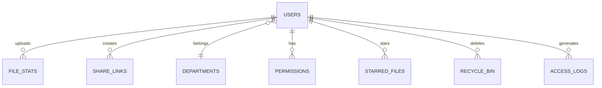

# Longhorn 企业文件管理系统 - 产品需求文档 (PRD)

**版本：** 11.2.0  
**最后更新：** 2026-01-04  
**产品负责人：** [待填写]  
**技术负责人：** [待填写]

---

## 1. 产品概述

### 1.1 产品定位
Longhorn 是一款面向企业内部的**轻量级文件管理与协作系统**，专为 Kinefinity 团队设计，旨在替代传统的共享文件夹方案，提供更安全、更高效的文件存储、分享和权限管理能力。

### 1.2 核心价值
- **部门隔离**：按组织架构划分存储空间，确保信息安全
- **灵活权限**：Admin / Lead / Member 三级角色体系，支持跨部门授权
- **现代体验**：iOS 风格毛玻璃 UI，流畅的交互反馈
- **可追溯性**：完整的操作日志和回收站机制（30天软删除）
- **零成本部署**：基于 Node.js + SQLite，单机即可运行，无需复杂基础设施

### 1.3 目标用户
- **系统管理员 (Admin)**：负责用户管理、部门配置、全局权限控制
- **部门主管 (Lead)**：管理本部门文件，查看成员活动，分配协作权限
- **普通成员 (Member)**：上传/下载文件，管理个人空间，参与跨部门协作

---

## 2. 系统架构

### 2.1 技术栈
| 层级 | 技术选型 | 说明 |
|:---|:---|:---|
| **前端** | React 18 + TypeScript | 组件化开发，类型安全 |
| **路由** | React Router DOM v6 | 单页应用路由管理 |
| **状态管理** | Zustand | 轻量级全局状态（用户认证） |
| **UI 风格** | CSS Variables + Lucide Icons | 自定义毛玻璃主题 |
| **后端** | Node.js + Express | RESTful API 服务 |
| **数据库** | SQLite 3 | 嵌入式关系型数据库 |
| **认证** | JWT (JSON Web Token) | 无状态会话管理 |
| **文件存储** | File System (DiskA/DiskB) | 物理磁盘分区映射 |

### 2.2 部署架构
```
Mac mini (生产服务器)
├── PM2 进程管理 (longhorn)
├── Cloudflare Tunnel (公网访问)
└── 自动部署守护进程 (deploy-watch.sh)

MBAir (开发环境)
├── VSCode + Git
└── 一键发布脚本 (publish.sh)
```

### 2.3 数据模型关系


---

## 3. 核心功能模块

### 3.1 用户认证与授权

#### 3.1.1 登录/登出
- **功能描述**：基于用户名/密码的表单认证，支持"记住我"功能
- **安全机制**：
  - 密码使用 bcrypt 加密存储（成本因子：10）
  - JWT Token 有效期：24小时
  - 前端自动刷新 Token 机制
- **交互流程**：
  1. 用户输入凭证 → 后端验证
  2. 验证成功返回 JWT + 用户信息
  3. 前端存储 Token 至 Zustand Store
  4. 自动跳转至角色对应的首页

#### 3.1.2 角色权限体系
| 角色 | 英文代码 | 权限范围 |
|:---|:---|:---|
| **系统管理员** | `Admin` | 全系统访问权限，用户/部门管理，Root 目录查看 |
| **部门主管** | `Lead` | **个人空间**：Full 权限 / **本部门**：Full 权限 / **被授权目录**：根据授权类型（Read / Contribute / Full） |
| **普通成员** | `Member` | **个人空间**：Full 权限 / **本部门**：Contribute 权限（可创建文件夹、上传文件，但只能修改/删除自己创建的内容） / **被授权目录**：根据授权类型（Read / Contribute / Full） |

#### 3.1.3 三级权限类型
| 权限类型 | 英文代码 | 能力范围 |
|:---|:---|:---|
| **只读** | `Read` | 只能查看和下载文件，不能做任何修改 |
| **贡献** | `Contribute` | 可以创建文件夹、上传文件，但只能修改/删除**自己创建**的内容 |
| **完全** | `Full` | 可以修改/删除任何内容，包括他人的文件 |

### 3.2 文件浏览与管理

#### 3.2.1 多视图模式
- **缩略图视图 (Grid)**：适合图片/视频资产预览，9列自适应布局
- **列表视图 (List)**：显示详细元数据（上传者、日期、大小），支持快速排序

#### 3.2.2 核心操作
| 操作 | 快捷入口 | 功能说明 |
|:---|:---|:---|
| **上传** | 顶部"上传"按钮 | 支持多文件选择，自动添加 `yyyymmdd_` 时间戳前缀 |
| **下载** | 右键菜单 / 详情面板 | 单文件直接下载，批量下载需压缩（暂未实现） |
| **重命名** | 右键菜单 | 仅修改文件名，保留时间戳前缀 |
| **移动** | 右键菜单 | 弹窗选择目标文件夹，支持跨部门（需权限） |
| **删除** | 右键菜单 / 批量操作栏 | 软删除至回收站，保留30天 |
| **新建文件夹** | 顶部"新建文件夹"按钮 | 即时创建子目录 |
| **收藏/取消收藏** | 右键菜单 / 详情星标按钮 | 快速标记常用文件 |
| **创建分享链接** | 右键菜单 | 支持密码保护和过期时间设置 |

#### 3.2.3 批量操作
- **选择机制**：列表视图头部全选框 + 单行 Checkbox
- **批量操作栏**：当选中文件数 ≥ 1 时，底部浮现毛玻璃操作栏
- **支持操作**：批量删除（暂未实现批量下载/移动）

### 3.3 空间组织架构

#### 3.3.1 部门空间 (Department Space)
- **路径格式**：`/dept/{部门代码}`（如 `/dept/RD` → 研发部）
- **结构示例**：
  ```
  研发部 (RD)/
  ├── 项目A/
  ├── 项目B/
  └── 共享资源/
  ```
- **访问规则**：
  - Admin：所有部门可见
  - Lead/Member：仅本部门 + 被授权部门

#### 3.3.2 个人空间 (Personal Space)
- **路径格式**：`/dept/members/{username}`
- **存储位置**：物理路径 `DiskA/Members/{username}`
- **特性**：
  - 每个用户独享的私密空间
  - 可通过侧边栏"个人空间"快速访问
  - 支持文件收藏、分享等全部功能

#### 3.3.3 根目录 (Root Directory)
- **访问权限**：仅 Admin 可见
- **用途**：查看所有部门 + 成员空间的总览入口
- **路径**：`/root`

### 3.4 高级功能

#### 3.4.1 文件收藏 (Starred Files)
- **入口**：侧边栏"星标文件"
- **功能**：快速访问跨部门/跨目录的常用文件
- **实现**：`starred_files` 表记录 `user_id` + `path` 映射

#### 3.4.2 文件分享 (Share Links)
- **分享设置**：
  - 密码保护（可选）
  - 过期时间（可选，最长 30 天）
- **分享链接格式**：`/share/{linkId}`
- **访问统计**：记录访问次数和最后访问时间
- **管理入口**：侧边栏"我的分享"

#### 3.4.3 回收站 (Recycle Bin)
- **保留期**：30 天自动物理删除
- **可恢复操作**：还原至原路径
- **永久删除**：手动触发或定时任务清理
- **物理位置**：`data/.recycle/`

#### 3.4.4 全局搜索
- **搜索范围**：文件名 + 路径（暂不支持内容搜索）
- **权限过滤**：仅返回用户有权访问的文件
- **实时反馈**：输入即搜索（去抖 300ms）

### 3.5 管理员功能

#### 3.5.1 用户管理
- **功能列表**：
  - 创建用户（用户名、密码、角色、部门）
  - 编辑用户（角色、部门变更）
  - 查看用户空间（个人空间文件数/容量）
- **界面**：表格视图，支持按用户名/部门/角色筛选

#### 3.5.2 部门管理
- **当前部门**：
  - 市场部 (MS)
  - 运营部 (OP)
  - 研发部 (RD)
  - 通用台面 (GE)
- **操作**：新增部门（暂无删除功能）

#### 3.5.3 权限管理
- **授权场景**：为某用户开放特定目录的访问权限
- **示例**：A部门成员需要访问B部门的"共享项目"文件夹
- **权限类型**：
  - `read-write`：读写权限
  - `read-only`：只读权限（暂未实现）

#### 3.5.4 系统概览 (System Dashboard)
- **核心指标**：
  - 总注册用户数 / 24h 活跃用户数
  - 系统总存储占用 / 部门存储分布
  - 系统总文件数 / 今日新增文件
  - 活跃贡献者排行（上传量 Top 5）
- **数据来源**：实时查询 SQLite 数据库

### 3.6 个人中心 (Personal Dashboard)
- **入口**：顶部栏点击用户名/头像
- **展示内容**：
  - 上传文件数 / 个人空间占用
  - 星标文件数 / 分享链接数
  - 最后登录时间 / 账户创建时间
- **快速操作**：前往个人空间 / 查看星标文件 / 搜索文件

---

## 4. 用户体验设计

### 4.1 UI 设计原则
- **毛玻璃美学**：深色主题 + backdrop-filter 磨砂效果
- **黄色品牌色**：主要操作按钮和图标使用 `#FFD200`（Kinefinity 品牌色）
- **微动效**：hover 状态 0.2s 过渡，按钮轻微缩放反馈
- **信息层级**：高对比度标题 + 低对比度辅助文本

### 4.2 交互反馈
| 场景 | 反馈方式 |
|:---|:---|
| 文件上传中 | 顶部进度条（蓝色加载条） |
| 操作成功 | 右下角 Toast 提示（绿色背景） |
| 操作失败 | 右下角 Toast 提示（红色背景，显示错误信息） |
| 删除确认 | 弹窗二次确认（防误触） |
| 文件预览 | 全屏 Lightbox 浏览器（支持图片/视频） |

### 4.3 响应式设计
- **桌面端优先**：主要使用场景为办公电脑
- **移动端适配**：
  - 隐藏部分列（如上传者、日期）
  - 汉堡菜单折叠侧边栏
  - 触摸友好的点击区域

---

## 5. 非功能需求

### 5.1 性能指标
- **页面加载时间**：首屏 < 2s（生产环境）
- **文件上传速度**：取决于网络，无客户端限制
- **并发用户数**：设计支持 50+ 同时在线（实际取决于服务器配置）

### 5.2 安全性
- **传输加密**：Cloudflare Tunnel HTTPS（端到端加密）
- **密码存储**：bcrypt 哈希（成本因子 10）
- **会话管理**：JWT Token（24h 有效期）
- **SQL 注入防护**：使用参数化查询（prepared statements）
- **XSS 防护**：React 自动转义 + CSP 头部（未配置）

### 5.3 可维护性
- **代码规范**：TypeScript 强类型检查
- **日志系统**：
  - `PROMPT_LOG.md`：开发变更记录
  - `CHANGELOG.md`：版本发布说明
  - 操作日志写入 `access_logs` 表
- **自动化部署**：Git Push → 守护进程自动拉取 → PM2 重启

---

## 6. 数据字典

### 6.1 核心表结构

#### `users` - 用户表
| 字段 | 类型 | 说明 |
|:---|:---|:---|
| id | INTEGER PK | 自增主键 |
| username | TEXT UNIQUE | 用户名（登录凭证） |
| password | TEXT | bcrypt 哈希密码 |
| role | TEXT | 角色：Admin / Lead / Member |
| department_id | INTEGER FK | 关联部门 ID |
| created_at | TEXT | 账户创建时间 |

#### `departments` - 部门表
| 字段 | 类型 | 说明 |
|:---|:---|:---|
| id | INTEGER PK | 自增主键 |
| name | TEXT UNIQUE | 部门名称（如"研发部 (RD)"） |

#### `file_stats` - 文件元数据表
| 字段 | 类型 | 说明 |
|:---|:---|:---|
| id | INTEGER PK | 自增主键 |
| path | TEXT UNIQUE | 文件相对路径（相对于 DiskA） |
| uploader_id | INTEGER FK | 上传者用户 ID |

#### `starred_files` - 收藏文件表
| 字段 | 类型 | 说明 |
|:---|:---|:---|
| id | INTEGER PK | 自增主键 |
| user_id | INTEGER FK | 用户 ID |
| path | TEXT | 文件路径 |
| created_at | TEXT | 收藏时间 |

#### `share_links` - 分享链接表
| 字段 | 类型 | 说明 |
|:---|:---|:---|
| id | INTEGER PK | 自增主键 |
| link_id | TEXT UNIQUE | 短链接 ID |
| user_id | INTEGER FK | 创建者 ID |
| path | TEXT | 文件路径 |
| password | TEXT | 访问密码（可选） |
| expires_at | TEXT | 过期时间（可选） |
| created_at | TEXT | 创建时间 |
| access_count | INTEGER | 访问次数 |
| last_accessed | TEXT | 最后访问时间 |

#### `recycle_bin` - 回收站表
| 字段 | 类型 | 说明 |
|:---|:---|:---|
| id | INTEGER PK | 自增主键 |
| original_path | TEXT | 原始路径 |
| deleted_path | TEXT | 回收站路径 |
| deleted_by | INTEGER FK | 删除者 ID |
| deleted_at | TEXT | 删除时间 |

#### `permissions` - 权限表
| 字段 | 类型 | 说明 |
|:---|:---|:---|
| id | INTEGER PK | 自增主键 |
| user_id | INTEGER FK | 被授权用户 ID |
| folder_path | TEXT | 授权目录路径 |
| permission_type | TEXT | 权限类型（read-write / read-only） |
| granted_by | INTEGER FK | 授权者 ID |
| granted_at | TEXT | 授权时间 |

#### `access_logs` - 访问日志表
| 字段 | 类型 | 说明 |
|:---|:---|:---|
| id | INTEGER PK | 自增主键 |
| user_id | INTEGER FK | 用户 ID |
| path | TEXT | 访问路径 |
| action | TEXT | 操作类型（view / download / upload） |
| timestamp | TEXT | 时间戳 |

---

## 7. 已知问题与待优化

### 7.1 当前限制
- [ ] 批量下载需要压缩功能（未实现）
- [ ] 批量移动功能（未实现）
- [ ] 文件版本历史（未实现）
- [ ] 在线预览 Office 文档（未实现）
- [ ] WebDAV 协议支持（未实现）
- [ ] 移动端 App（未实现）

### 7.2 性能优化方向
- [ ] 文件列表虚拟滚动（大目录性能优化）
- [ ] 缩略图懒加载
- [ ] CDN 加速静态资源
- [ ] 数据库索引优化

### 7.3 安全加固
- [ ] CSP (Content Security Policy) 配置
- [ ] 登录频率限制（防暴力破解）
- [ ] 文件类型白名单（防恶意上传）
- [ ] 审计日志完整性校验

---

## 8. 版本规划

### 当前版本：11.2.0 (2026-01-04)
- ✅ 修复 Dashboard 卡片布局 3+1 问题
- ✅ 优化 TopBar 用户信息布局
- ✅ 实现 Admin Panel 标签持久化
- ✅ 创建 SystemDashboard 组件
- ✅ 重命名部门名称并同步全系统

### 下一版本计划：12.0.0
- **批量操作增强**：批量移动、批量下载（ZIP 压缩）
- **文件预览升级**：支持 PDF / Office 文档在线预览
- **通知系统**：文件分享提醒、回收站清理提醒
- **移动端优化**：PWA 支持、离线缓存

---

## 9. 附录

### 9.1 相关文档
- [技术架构复盘](FULL_DEPLOYMENT_RECAP.md)
- [变更日志](CHANGELOG.md)
- [开发日志](PROMPT_LOG.md)
- [快速部署指南](QUICK_DEPLOY.md)

### 9.2 联系方式
- **技术支持**：[待填写]
- **产品反馈**：[待填写]
- **GitHub 仓库**：[待填写]

---

**文档结束**

> 本文档由 AI 助手根据当前代码库自动生成，最后人工审核时间：2026-01-04
