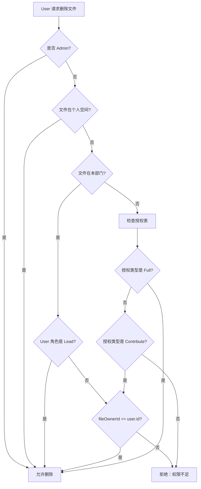
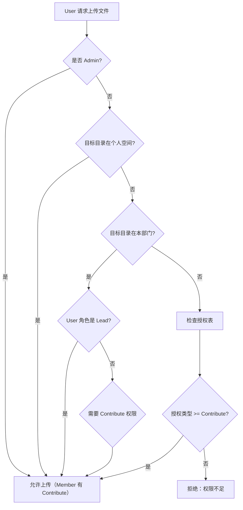

# Contribute 权限系统实施总结

**实施时间：** 2026-01-04 12:48  
**版本：** 11.2.0  
**实施人员：** AI Assistant

---

## 1. 实施概述

成功引入**三级权限体系**，取代原有的二级权限（Read/Full），新增 **Contribute（贡献）** 权限类型。

### 权限类型定义

| 权限类型 | 英文代码 | 能力范围 |
|:---|:---|:---|
| **只读** | `Read` | 只能查看和下载文件，不能做任何修改 |
| **贡献** | `Contribute` | 可以创建文件夹、上传文件，但**只能修改/删除自己创建的内容** |
| **完全** | `Full` | 可以修改/删除任何内容，包括他人的文件 |

### 角色默认权限

| 角色 | 个人空间 | 本部门 | 被授权目录 |
|:---|:---|:---|:---|
| **Admin** | Full | Full（所有部门） | - |
| **Lead** | Full | Full | 根据授权类型 |
| **Member** | Full | **Contribute**（新增） | 根据授权类型 |

---

## 2. 核心修改文件列表

### 后端修改（5处）

#### 2.1 权限引擎核心 - `server/index.js`

1. **`hasPermission` 函数升级**（255-322行）
   - 新增 `fileOwnerId` 参数用于所有权检查
   - Member 在部门内的权限逻辑：
     - `Read`：✅ 允许
     - `Contribute`：✅ 允许
     - `Full`：✅ 仅当 `fileOwnerId === user.id`
   - 被授权目录权限逻辑：
     - `Contribute` 授权：允许 Read/Contribute，Full 操作需要所有权检查

2. **上传文件 API**（431-460行）
   - 权限检查从 `Full` 改为 `Contribute`

3. **删除文件 API**（1430-1449行）
   - 新增文件所有者查询：`SELECT uploader_id FROM file_stats`
   - 传递 `fileOwnerId` 至 `hasPermission` 检查

4. **批量删除 API**（1451-1468行）
   - 循环中为每个文件查询所有者
   - 传递所有权信息至权限检查

5. **批量移动 API**（1471-1504行）
   - 目标目录权限：从 `Full` 改为 `Contribute`
   - 源文件权限：保持 `Full`，但增加所有权检查

6. **文件列表 API**（1276-1278行）
   - `canWrite` 标记：从 `Full` 改为 `Contribute`

7. **文件夹树构建**（1389-1392行）
   - 文件夹包含条件：从 `Full` 改为 `Contribute`

### 前端修改（1处）

#### 2.2 权限选择器 - `client/src/components/DepartmentManagement.tsx`

- **文件夹授权表单**（116-123行）
  - 权限下拉框新增选项：
    ```tsx
    <option value="Read">只读</option>
    <option value="Contribute">贡献（可创建，仅修改自己的文件）</option>
    <option value="Full">完全读写</option>
    ```

### 文档修改（2处）

#### 2.3 产品需求文档 - `PRD.md`

- **3.1.2 角色权限体系** 表格更新
- **3.1.3 三级权限类型** 新增章节

#### 2.4 变更日志 - `CHANGELOG.md`

- 新增 `### Added` 章节记录 Contribute 权限特性

---

## 3. 权限判断逻辑流程

### 3.1 Member 在部门内删除文件



### 3.2 Member 在部门内上传文件



---

## 4. 数据库依赖

### 关键查询

所有涉及 Full 权限的操作（删除、移动）都需要查询文件所有者：

```sql
SELECT uploader_id FROM file_stats WHERE path = ?
```

**注意事项：**
- 如果 `file_stats` 表中没有该文件记录，`fileOwnerId` 将为 `null`
- `null` 所有者的文件（如手动创建的文件夹）：
  - Admin 和 Lead：可删除
  - Member：无法删除（`null !== user.id`）

---

## 5. 边界情况处理

### 5.1 新创建的文件夹

**问题**：用户通过前端"新建文件夹"功能创建的目录，如果后端未记录到 `file_stats`，则 `uploader_id` 为空。

**当前行为**：
- Member 无法删除这种文件夹（所有权检查失败）
- Lead 和 Admin 可以删除

**建议后续优化**：
- 在新建文件夹时，记录到 `file_stats` 表

### 5.2 历史文件

**问题**：系统升级前已存在的文件，`file_stats` 表中可能没有 `uploader_id`。

**当前行为**：
- 这些文件的 `uploader_id` 为 `null`
- Member 无法操作
- Lead 和 Admin 可以操作

**建议**：
- 运行一次性脚本，为历史文件补全 `uploader_id`（可设置为创建者或默认 Admin）

### 5.3 跨部门授权

**场景**：A 部门 Member 被授予 B 部门某文件夹的 `Contribute` 权限。

**行为**：
- 可以在 B 部门文件夹中上传文件
- 只能删除自己上传的文件
- 无法删除 B 部门其他成员的文件

✅ **符合设计预期**

---

## 6. 测试建议

### 6.1 功能测试矩阵

| 测试场景 | 角色 | 操作 | 预期结果 |
|:---|:---|:---|:---|
| 本部门上传文件 | Member | 上传至部门根目录 | ✅ 成功 |
| 本部门删除他人文件 | Member | 删除 Lead 上传的文件 | ❌ 拒绝："权限不足：您只能删除自己上传的文件" |
| 本部门删除自己文件 | Member | 删除自己上传的文件 | ✅ 成功 |
| 本部门创建文件夹 | Member | 新建文件夹 | ✅ 成功 |
| 被授权 Contribute 删除他人文件 | Member | 删除授权目录中他人文件 | ❌ 拒绝 |
| 被授权 Contribute 删除自己文件 | Member | 删除授权目录中自己文件 | ✅ 成功 |
| 本部门删除任意文件 | Lead | 删除 Member 上传的文件 | ✅ 成功 |

### 6.2 回归测试

- [ ] Admin 的全局权限未受影响
- [ ] Lead 的部门 Full 权限未受影响
- [ ] 个人空间权限未受影响
- [ ] 只读授权仍然有效
- [ ] 完全授权仍然有效

---

## 7. 用户体验优化

### 7.1 错误提示改进

原有错误提示：
```
"No permission to delete this item"
```

新错误提示（中文）：
```
"权限不足：您只能删除自己上传的文件"
```

### 7.2 前端 UI 增强建议（未实施）

**可选优化**：
- 在文件列表中，为"非自己上传的文件"添加视觉提示（如禁用删除按钮）
- 右键菜单中，动态禁用"删除"选项（当用户无权限时）
- 显示文件上传者信息（已有，但可优化显示）

---

## 8. 已知限制

1. **文件夹所有权**：当前文件夹创建可能未记录 `uploader_id`，导致 Member 无法删除自己创建的空文件夹
2. **批量操作反馈**：批量删除时，部分文件因权限不足而跳过，但不会明确告知用户哪些文件被跳过
3. **性能考虑**：每次删除/移动操作都需要查询数据库获取 `uploader_id`，大批量操作时可能有性能影响

---

## 9. 下一步工作建议

- [ ] **测试验证**：在开发环境进行完整测试
- [ ] **数据迁移**：为历史文件补全 `uploader_id`
- [ ] **文件夹创建记录**：确保新建文件夹操作记录到 `file_stats`
- [ ] **前端 UI 优化**：根据权限动态显示/隐藏操作按钮
- [ ] **批量操作优化**：提供更详细的操作结果反馈

---

**文档结束**

> 本文档记录了 Contribute 权限系统的完整实施过程，供后续维护和审计使用。
