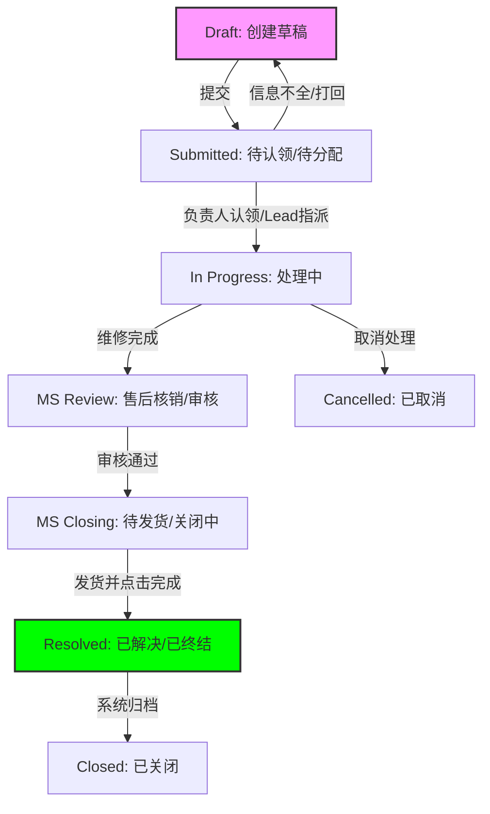

## RMA 全流程节点示意图

---

## 角色准备：

*   **市场部 (MS)**：Effy（客服）
*   **运营部 (OP)**：小王（物流/库管）、大李（技术专家）
*   **财务部 (GE)**：Cathy

---

## 第一步：创建与收件 (Node: op_receiving)

*   **起始点**：Effy 在收到客户邮件后，创建了一张 RMA 工单。
*   **球的位置**：工单提交后，`current_node` 变为 `op_receiving`（待收货）。
*   **责任人 (assignee_id)**：此时为 **NULL**。
*   **为什么？** 因为球现在掉进了 OP 部门的公共池 (Team Queue)。
*   **如何流转**：
    *   仓库的小王在 Team Queue 看到红点，点击 **[ 认领 / Claim ]**。
    *   此时 `assignee_id` 变为 **小王**，工单进入他的 My Tasks。
*   **节点结束**：小王收到快递，检查外观并录入系统，点击 **[ 确认入库 ]** 按钮。
*   **下一节点**：系统自动将 `current_node` 设为 `op_diagnosing`（诊断中），并将 `assignee_id` 设回 NULL（退回 OP 技术池）。

---

## 第二步：技术诊断 (Node: op_diagnosing)

*   **球的位置**：球在 OP 技术部的公共池里。
*   **责任人**：技术专家大李看到是 8K 高级机型，点击 **[ 认领 ]**。
*   **操作**：大李拆机检测，发现传感器需要更换，录入诊断报告和预估配件单。
*   **节点结束**：大李点击 **[ 提交诊断 ]**。
*   **下一节点**：系统自动将 `current_node` 设为 `ms_review`（商务审核），并将 `assignee_id` 设回给最初的客服 **Effy**。

> **注**：系统会自动记录创建者，方便球精准传回。

---

## 第三步：商务确认 (Node: ms_review)

*   **球的位置**：球回到了 MS 市场部的 **Effy** 手里（出现在她的 My Tasks）。
*   **操作**：Effy 查看大李的报告，生成报价单发给客户。
*   **场景**：客户嫌贵，Effy 在时间轴 @大李 问是否能只修不换。大李在 Mentioned 列表看到并回复，但**球权始终在 Effy 手里**。
*   **节点结束**：客户最终确认报价并同意维修，Effy 点击 **[ 批准维修 ]**。
*   **下一节点**：系统自动将 `current_node` 设为 `op_repairing`（维修中），并将 `assignee_id` 指派给上次处理该单的技术员 **大李**（系统自动记忆）。

---

## 第四步：物理维修 (Node: op_repairing)

*   **球的位置**：大李的 My Tasks。
*   **操作**：大李更换零件、进行老化测试。
*   **节点结束**：大李点击 **[ 维修完成 ]**。
*   **下一节点**：
    *   **逻辑分支**：如果是保修单，系统跳过财务，直接进入 `ms_closing`。
    *   **本例（付费单）**：系统进入 `ge_review`（财务核销），`assignee_id` 设为 NULL（掉入财务池）。

---

## 第五步：结算与终审 (Node: ge_review → ms_closing)

这个阶段就是进度条上的 **Step 5 结算审核**，它内部有两次传球：

### 财务核销 (ge_review)：

*   **球的位置**：GE 财务池。
*   **责任人**：Cathy 看到银行流水，认领工单，核对金额。
*   **节点结束**：Cathy 点击 **[ 确认收款 ]**。
*   **传球**：节点变为 `ms_closing`，球传给客服 **Effy**。

### 商务终审 (ms_closing)：

*   **球的位置**：Effy 的 My Tasks。
*   **操作**：Effy 做最后的"守门"，核对回寄地址、确认配件扣减记录。
*   **节点结束**：Effy 点击 **[ 释放发货 ]**。
*   **下一节点**：`current_node` 变为 `shipped`（待发货），球传给仓库 **小王**。

---

## 第六步：结案发货 (Node: shipped)

*   **球的位置**：小王 的 My Tasks。
*   **操作**：小王打印面单，顺丰收件，录入单号。
*   **全流程终结**：小王点击 **[ 完成发货 ]**。
*   **状态变更**：`current_node` 变为 `resolved` (已完成)，`status` 变为 `closed`。
*   **结果**：工单从所有人的"待办"中消失，进入 **Archives (档案库)**。

---

### 💡 核心总结：

1.  **节点 (Current Node)**：是系统的物理位置，决定了当前球在哪个部门。
2.  **状态 (Status)**：是给外部或管理者看的业务样貌（如：Progressing, Waiting）。
3.  **责任人 (Assignee)**：
    *   如果是 **具体个人**：球在他的"个人工位" (My Tasks)。
    *   如果是 **NULL**：球在该部门的"公共区域" (Team Queue)，等待有人认领。
4.  **传球触发器**：就是 UI 界面右下角那个最醒目的动作按钮。点了它，球就会根据后端逻辑自动飞向下一个人的工位。
